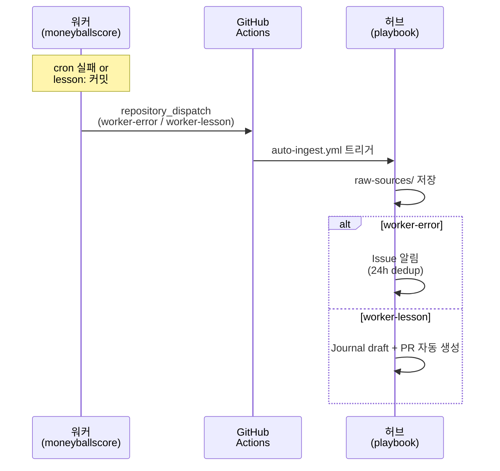
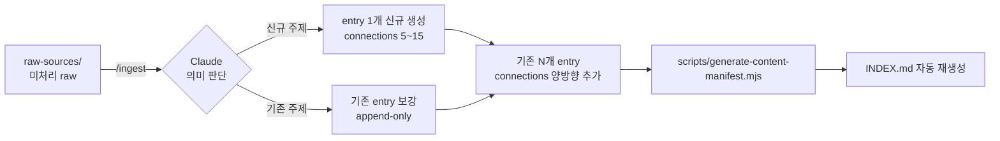
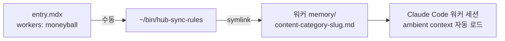
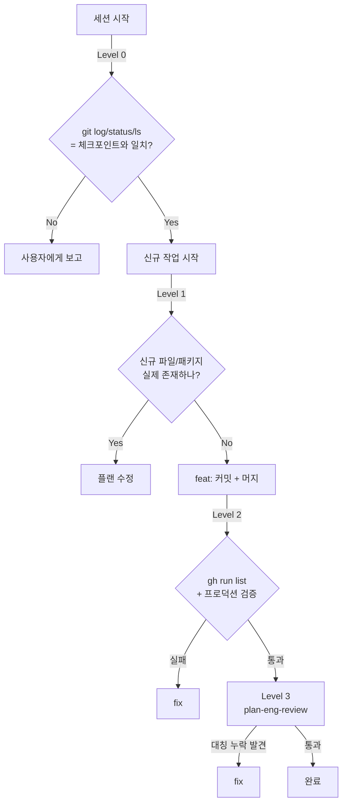

# Architecture — Playbook Hub

개인 지식 허브 + 프로젝트 관제탑. 핵심 구조: **허브 ↔ 워커 양방향 복리 엔진** + **3-Layer 위키** + **HMAC 인증**.

---

## 1. 워커 → 허브 (수집 축)

워커 프로젝트가 발견한 에러/교훈이 자동으로 허브에 흘러 들어오는 dispatch 체인.



**허브 쪽 분기 근거**: 모든 dispatch 를 draft PR 생성하면 ai-study 처럼 "draft PR 무덤" 발생. `lesson:` 접두사 opt-in 만 wiki 화 → 노이즈 차단.

**Dedup 로직**: 최근 24h 내 동일 title 의 inbound Issue 있으면 새 Issue 대신 기존 Issue 에 재발 코멘트.

---

## 2. 허브 내부 — /ingest cross-update

사용자 수동 트리거. LLM 판단 영역이라 자동화 안 함 (ai-study 가 막힌 지점).



**핵심 KPI**: `/ingest` 1회 = 1 신규 + N 보강 (N=5~15 목표). wiki 가 작을수록 N 감소, 커질수록 자연 회복.

**Journal append-only 원칙**: 본문 수정 금지, frontmatter `connections` 만 갱신 허용.

---

## 3. 허브 → 워커 (배포 축 — Ambient Injection)



**왜 수동**: cron 자동화하면 워커 memory 가 수시로 변해 불안정. 의식적 한 번 실행이 깔끔.

**워커 이름 검증**: `workers.config.json` (레포 진실 소스) 에 등록된 이름만 허용. `generate-content-manifest.mjs` 가 manifest 생성 시 하드 fail. 머신 로컬 `~/.config/claude-hub/projects.conf` 는 fallback.

상세: `content/context-engineering/ambient-knowledge-injection.mdx`

---

## 4. 3-Layer 위키 구조

```
┌─────────────────────────────────────────────┐
│  raw-sources/     — 원천 자료 (불변)         │
├─────────────────────────────────────────────┤
│  content/         — wiki 엔트리 (MDX)        │
│    ├ harness-engineering/                   │
│    ├ context-engineering/                   │
│    ├ journal/ (series: playbook-journal)    │
│    └ ...                                    │
├─────────────────────────────────────────────┤
│  CLAUDE.md + INDEX.md — 스키마 + 인덱스      │
└─────────────────────────────────────────────┘
```

- `raw-sources/`: 한번 저장 후 수정 금지
- `content/`: LLM 이 생성/관리 (Karpathy LLM Wiki 패턴)
- `CLAUDE.md` + `INDEX.md` (자동 생성): 위키 운영 메타

상세: `content/harness-engineering/hub-worker-compounding-pattern.mdx`

---

## 5. 보안 레이어

```mermaid
flowchart TB
    U[사용자] -->|POST /api/auth/login| L[login route]
    L -->|verify ADMIN_PASSWORD| A{일치?}
    A -->|Yes| T[HMAC token cookie<br/>admin-token, 7일]
    A -->|No| R[401 + rate limit]
    T -->|쿠키 포함 요청| PX[src/proxy.ts<br/>Next.js 16 middleware]
    PX -->|verify| PROT[/admin + /api/admin/:path*]
    PX -->|인증 실패| RED[→ /admin/login]
```

- **`src/proxy.ts`** (Next.js 16 proxy convention, 구 middleware.ts 대체): matcher `/admin/:path*` + `/api/admin/:path*`
- **HMAC-SHA256**: Web Crypto API (Edge Runtime 호환)
- **Token 만료**: 7일
- **Rate limit**: 5회 / 15분 / IP (in-memory — Vercel serverless bypass 주의, Vercel KV 이전 TODO)

---

## 6. 자동화 인프라 — GitHub Actions

`.github/workflows/` 15개 workflow. cron 은 GH Actions 가 silent drop 자주 → **Cloudflare Worker (`cloudflare-worker/`) 가 외부 트리거 (`workflow_dispatch`)** 로 이관 (T9, 2026-04-28).

| Workflow | 트리거 | 용도 |
|---|---|---|
| `ci.yml` | push / pull_request | test + build |
| `ai-review.yml` | push (main 머지 후 auto-merge gate) | name: `🚀 Auto Merge to main` — PR 트리거 X (push 만), daily-ingest PR 등 PR-only 변경은 수동 머지 |
| `auto-ingest.yml` | repository_dispatch / workflow_dispatch | 워커 dispatch 수신 (worker-error / worker-incident / worker-lesson) + 분기 처리 |
| `auto-cross-update-shadow.yml` | pull_request / workflow_dispatch | A2 Shadow — LLM Cross-Update observe-only (shadow 채널) |
| `daily-ingest-geeknews.yml` | workflow_dispatch (CF cron 매일 06:00 KST) | GeekNews 자동 ingest |
| `incident-followup.yml` | workflow_dispatch (CF cron 매일 06:00 KST) | Phase 4a D5 — 미해결 incident → lesson reminder |
| `weekly-triage.yml` | workflow_dispatch (CF cron 매주 월 06:00 KST) | 미처리 raw 리마인더 Issue |
| `weekly-report.yml` | workflow_dispatch (CF cron 매주 일 18:00 KST) | 주간 통계 리포트 |
| `promotion-scan.yml` | push / workflow_dispatch (CF cron 매주 월 06:00 KST) | docs/solutions/ 승격 후보 감지 |
| `category-rebalance.yml` | workflow_dispatch (CF cron 매월 1일 06:00 KST) | 카테고리 재분류 후보 감지 |
| `embed-on-push.yml` | push / workflow_dispatch (CF cron 매일 23:00 KST) | content/ embedding index 갱신 |
| `gemini-key-health.yml` | workflow_dispatch (CF cron 매일 08:00 KST) | Gemini API key 1차 health probe |
| `smoke-test-gemini-keys.yml` | workflow_dispatch | Gemini key 포괄 smoke (1차에서 의심 시 호출) |
| `pat-expiry-check.yml` | workflow_dispatch (CF cron 매주 금 06:00 KST) | GH PAT 만료 예고 (T5, fine-grained) |
| `vercel-retry.yml` | workflow_dispatch | Vercel 배포 실패 시 수동 재시도 |

**SHA 핀**: `pnpm/action-setup@fc06bc1...` (v4.4.0) — 8개 workflow (`ai-review`, `auto-cross-update-shadow`, `auto-ingest`, `category-rebalance`, `ci`, `daily-ingest-geeknews`, `embed-on-push`, `weekly-report`) (moving tag hijack 방어).

**Drift note (2026-04-29)**: 이전 표가 `daily-lesson.yml` / `generate-on-pick.yml` 박제했으나 **둘 다 미존재**. Gemini 주제 제안 → 사용자 1/2/3 pick → 자동 생성 메커니즘은 폐기 (codex finding #6).

---

## 7. Hub 스크립트 (`~/bin/`)

| 스크립트 | 역할 |
|---|---|
| `hub-start` | iTerm2 런처 + 시스템 상태 스냅샷 (raw 미처리 / 7일 신규 entry / 워커별 symlink 수) |
| `hub-sync-rules` | `shared-rules/common/*.md` + `content/**/*.mdx` (workers 태그 매칭) → 워커 memory symlink |
| `hub-scan-promotions` | 2+ 워커 공통 feedback 파일 → common/ 승격 후보 감지 |
| `hub-promote` | 승격 실행 (승격 + sync-rules 자동 호출) |

상세: `docs/hub-scripts.md`

**중요**: 이 스크립트들은 `~/bin/` 에 거주 (git 추적 X). 재구축 가능성은 `docs/hub-scripts.md` 가 진실 소스.

---

## 8. 드리프트 방어 (Level 0~3)

CLAUDE.md 에 "드리프트 감지 프로토콜" 로 박제. 4종:



1. **메모리 드리프트** (#1): 메모리 ↔ 실 리포 괴리 → `/handoff load` fingerprint 자동 비교
2. **존재 드리프트** (#2): "이거 새로 만들어야" → 이미 있었음 → 만들기 전 `ls` / `find` / `grep package.json`
3. **작동 드리프트** (#3): feat 머지 완료 → silent cron 실패 → `gh run list` + 프로덕션 검증 (오늘 `js-yaml` 사례)
4. **완전성 드리프트** (#4): 구현 완료 → 한쪽만 처리 → `/plan-eng-review` 코드 독해 (home/away 대칭 등)

상세: `content/harness-engineering/drift-detection-methodology.mdx`

---

## 9. 외부 의존성

| 서비스 | 용도 | 대체 가능성 |
|---|---|---|
| Vercel | 호스팅 + Edge + Analytics + Speed Insights | Netlify / self-host (비자명) |
| GitHub | repo + Actions + PAT dispatch 축 | 대체 불가 (dispatch 의존) |
| Gemini API | daily-lesson 주제 생성 | Claude API / OpenAI (API key 교체 + 프롬프트 포팅) |
| Pretendard (jsDelivr CDN) | 한국어 폰트 | self-host |
| Fontshare | Satoshi display font | self-host |

---

## 10. 관련 문서

| 문서 | 내용 |
|---|---|
| `CLAUDE.md` | Claude Code 세션 규칙 + 드리프트 프로토콜 + Skill routing |
| `README.md` | Quickstart + 환경변수 + 명령어 |
| `docs/hub-scripts.md` | ~/bin/ 스크립트 4종 사용법 |
| `docs/setup-worker-integration.md` | 새 워커 추가 절차 |
| `.claude/commands/*.md` | 슬래시 커맨드 spec (/ingest, /lint, /handoff, /compound 등) |
| `content/harness-engineering/` | 메타 패턴 (compounding, drift detection) |
| `content/context-engineering/ambient-knowledge-injection.mdx` | workers 태그 → symlink 메커니즘 상세 |
| `content/journal/` | 실 사례 (drift journal 001~004, E2E journal 005) |
