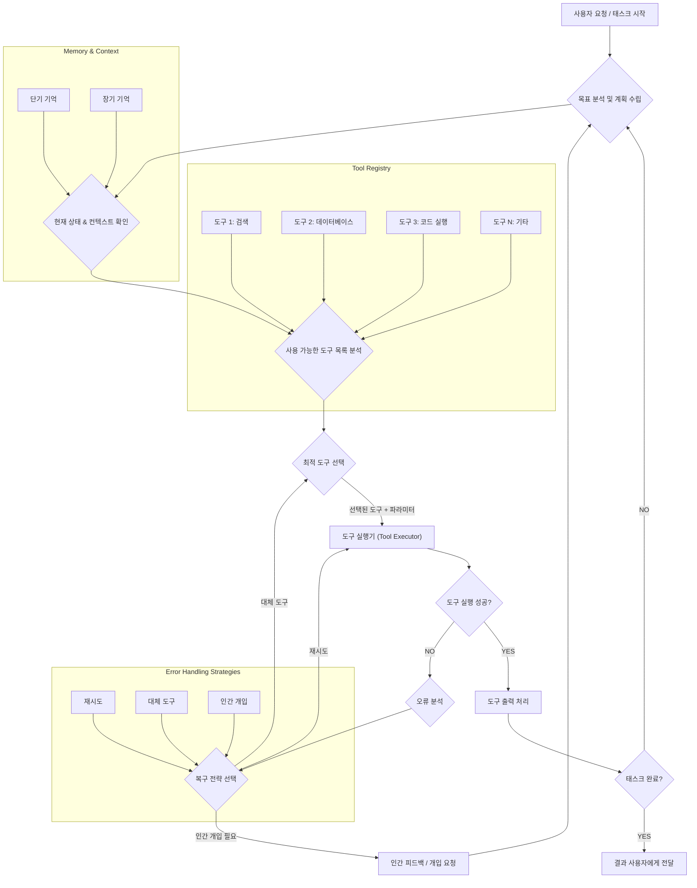

생성형 AI 에이전트는 복잡한 목표를 달성하기 위해 외부 환경과 상호작용하는 필수적인 구성 요소로, 외부 도구(Tool)를 효과적으로 활용하는 능력에 그 성패가 달려 있습니다. 단순한 API 호출을 넘어, 고급 도구 사용 패턴은 에이전트가 지능적으로 도구를 선택하고, 실행하며, 발생 가능한 오류에 대처하는 능력을 극대화하여 실제 비즈니스 환경에서의 실용성을 높입니다. 2026년 현재, 에이전트의 도구 사용은 단순한 프롬프트 엔지니어링을 넘어, 동적 도구 선택(Dynamic Tool Selection), 체인형 도구 실행(Chained Tool Use), 자가 수정(Self-Correction) 및 인간 개입(Human-in-the-Loop)을 포함하는 정교한 설계가 요구됩니다.

## 고급 도구 사용 패턴의 핵심 원리

AI 에이전트가 외부 도구를 성공적으로 사용하기 위한 여러 핵심 패턴이 존재합니다. 이 패턴들은 에이전트의 의사결정 로직과 통합되어, 다양한 시나리오에서 유연하고 견고한 동작을 가능하게 합니다.

### 1. 동적 도구 선택 (Dynamic Tool Selection)

에이전트는 주어진 태스크와 현재 컨텍스트에 가장 적합한 도구를 동적으로 식별하고 호출해야 합니다. 이는 정적으로 정의된 도구 호출 로직을 넘어서는 유연성을 제공합니다.

*   **프롬프트 기반 선택**: LLM이 태스크 설명과 사용 가능한 도구 목록을 바탕으로 어떤 도구를 사용할지, 어떤 인자를 전달할지 추론하도록 유도합니다.
*   **임베딩 기반 검색**: 도구의 기능 설명을 임베딩하여 벡터 데이터베이스에 저장하고, 에이전트의 현재 목표와 관련된 쿼리로 가장 유사한 도구를 검색하여 제안합니다.
*   **강화 학습(Reinforcement Learning)**: 에이전트가 도구 사용의 성공 여부에 따라 보상을 받고, 시간이 지남에 따라 최적의 도구 선택 전략을 학습하도록 합니다.

### 2. 체인형 도구 실행 (Chained Tool Use and Orchestration)

복잡한 태스크는 단일 도구 호출로 해결되지 않는 경우가 많습니다. 여러 도구를 순차적, 병렬적, 또는 조건부로 연결하여 실행하는 오케스트레이션이 필요합니다.

*   **순차적 실행**: 한 도구의 출력이 다음 도구의 입력으로 사용되는 파이프라인 형태입니다. 예를 들어, '데이터 검색' 도구로 정보를 얻은 후, 그 정보를 '요약' 도구에 전달하는 방식입니다.
*   **조건부 실행**: 이전 도구의 실행 결과에 따라 다음으로 호출할 도구나 실행 흐름을 변경합니다.
*   **병렬 실행**: 서로 독립적인 서브 태스크에 여러 도구를 동시에 호출하여 전체 처리 시간을 단축합니다.

### 3. 자가 수정 및 오류 처리 (Self-Correction and Error Handling)

도구 실행은 네트워크 오류, 잘못된 입력, 외부 시스템 문제 등 다양한 이유로 실패할 수 있습니다. 에이전트는 이러한 실패를 감지하고, 원인을 분석하며, 복구 전략을 실행할 수 있어야 합니다.

*   **오류 감지 및 분석**: 도구 API의 응답 코드, 에러 메시지 등을 파싱하여 실패 유형을 분류합니다.
*   **재시도(Retry) 메커니즘**: 일시적인 오류의 경우, 지수 백오프(Exponential Backoff) 전략을 사용하여 재시도를 수행합니다.
*   **대체 도구 사용**: 특정 도구가 지속적으로 실패할 경우, 동일한 기능을 제공하는 다른 도구를 시도합니다.
*   **인간 개입 요청(Human-in-the-Loop)**: 에이전트 스스로 해결하기 어려운 치명적인 오류나 예외 상황 발생 시, 인간 운영자에게 개입을 요청하여 문제를 해결합니다.

### 4. 컨텍스트 인식 도구 사용 (Context-Aware Tool Use)

도구 사용의 효율성을 높이려면 에이전트의 장기/단기 기억과 도구의 상태 정보가 긴밀하게 연동되어야 합니다. 이는 반복적인 정보 제공을 줄이고, 일관된 작업을 가능하게 합니다.

*   **도구 출력의 메모리 통합**: 도구 실행 결과를 에이전트의 컨텍스트 윈도우나 장기 기억에 저장하여 후속 의사결정에 활용합니다.
*   **도구별 상태 관리**: 특정 도구가 세션 기반의 상태를 요구하는 경우, 에이전트가 해당 상태를 추적하고 다음 호출에 반영합니다.

## Mermaid 다이어그램: 에이전트의 고급 도구 사용 흐름

다음 Mermaid 다이어그램은 에이전트가 복잡한 태스크를 해결하기 위해 도구를 동적으로 선택하고 실행하며, 오류를 처리하는 일반적인 흐름을 보여줍니다.



## 코드 예제: 동적 도구 선택 및 실행

Python을 사용하여 에이전트가 단순한 도구 레지스트리에서 도구를 선택하고 실행하는 패턴을 구현합니다. 실제 LLM 연동 부분은 추상화되어 있습니다.

```python
import json
from typing import Dict, Any, Callable, List

# --- 1. 도구 정의 (Tool Definition) ---
class Tool:
    def __init__(self, name: str, description: str, func: Callable):
        self.name = name
        self.description = description
        self.func = func

    def __call__(self, *args, **kwargs) -> Any:
        return self.func(*args, **kwargs)

# --- 2. 사용 가능한 도구 목록 ---
def search_web(query: str) -> str:
    """Performs a web search for the given query and returns top results."""
    print(f"Executing web search for: '{query}'")
    # Simulate API call
    if "weather" in query.lower():
        return "Today's weather in Seoul: 25C, Sunny."
    return f"Search results for '{query}': [Simulated data]"

def calculate(expression: str) -> str:
    """Evaluates a mathematical expression and returns the result."""
    print(f"Executing calculation for: '{expression}'")
    try:
        return str(eval(expression)) # DANGER: In real app, use safer eval or dedicated math lib
    except Exception as e:
        return f"Calculation failed: {e}"

TOOL_REGISTRY: Dict[str, Tool] = {
    "search_web": Tool("search_web", "Searches the internet for information.", search_web),
    "calculate": Tool("calculate", "Evaluates mathematical expressions.", calculate),
}

# --- 3. 에이전트의 도구 선택 및 실행 로직 (Simplified) ---
class Agent:
    def __init__(self, tool_registry: Dict[str, Tool]):
        self.tool_registry = tool_registry

    def _decide_tool_and_args(self, task: str) -> Dict[str, Any]:
        """Simulates LLM's decision process for tool selection.
           In a real scenario, this would involve a prompt to the LLM.
        """
        print(f"\nAgent analyzing task: '{task}'")
        if "calculate" in task.lower() or "math" in task.lower():
            expression = ''.join(filter(lambda x: x.isdigit() or x in '+-*/()', task))
            return {"tool_name": "calculate", "args": {"expression": expression or "0"}}
        elif "search" in task.lower() or "find" in task.lower() or "what is" in task.lower():
            query = task.replace("search for", "").replace("find", "").replace("what is", "").strip()
            return {"tool_name": "search_web", "args": {"query": query}}
        else:
            return {"tool_name": None, "args": {}}

    def execute_task(self, task: str) -> str:
        decision = self._decide_tool_and_args(task)
        tool_name = decision.get("tool_name")
        args = decision.get("args", {})

        if tool_name and tool_name in self.tool_registry:
            tool = self.tool_registry[tool_name]
            print(f"Agent selected tool: {tool.name} with args: {args}")
            try:
                result = tool(**args)
                print(f"Tool execution successful. Result: {result}")
                return result
            except Exception as e:
                print(f"Tool execution failed: {e}")
                return f"Error executing tool {tool_name}: {e}"
        else:
            print("No suitable tool found or decision was ambiguous.")
            return f"Agent cannot fulfill task: '{task}' without a suitable tool."

# --- 예제 실행 ---            
my_agent = Agent(TOOL_REGISTRY)

my_agent.execute_task("What is the weather in Seoul?")
my_agent.execute_task("Calculate 15 * (3 + 7) / 2")
my_agent.execute_task("Find latest news on AI innovation.")
my_agent.execute_task("Write a poem about trees.")
```

## 트레이드오프 (Trade-offs)

고급 도구 사용 패턴은 에이전트의 역량을 크게 확장하지만, 그만큼 설계 및 운영상의 트레이드오프가 발생합니다.

*   **복잡성 vs. 유연성**: 패턴이 정교해질수록 에이전트 시스템의 내부 로직이 복잡해집니다. 이로 인해 개발 및 디버깅 비용이 증가하지만, 에이전트는 더 다양한 외부 환경에 유연하게 적응하고 복잡한 태스크를 해결할 수 있습니다. (언제 좋음: 다양한 외부 시스템과 연동해야 하는 복잡한 비즈니스 로직. 언제 나쁨: 단순하고 반복적인 자동화 태스크.)
*   **자율성 vs. 안전성**: 에이전트가 도구를 자율적으로 선택하고 실행하는 능력이 커질수록, 의도치 않은 결과를 초래할 위험도 증가합니다. 특히 실제 시스템에 쓰기 작업을 수행하는 도구의 경우 높은 위험이 따릅니다. (언제 좋음: 인간 개입 없이 빠른 의사결정과 실행이 필요한 고가용성 시스템. 언제 나쁨: 금융 거래, 데이터 삭제 등 돌이킬 수 없는 중요한 작업.)
*   **성능(Latency) vs. 견고성(Robustness)**: 오류 처리 및 재시도 로직을 포함하면 도구 실행의 안정성이 높아지지만, 실패 시 추가적인 지연을 발생시킬 수 있습니다. 또한, 도구 선택을 위한 LLM 호출이나 임베딩 검색은 그 자체로 오버헤드를 가집니다. (언제 좋음: 안정적인 운영이 최우선인 미션 크리티컬 시스템. 언제 나쁨: 실시간 응답 속도가 중요한 대화형 서비스.)
*   **개발 노력 vs. 확장성**: 범용적인 도구 인터페이스와 레지스트리 시스템을 구축하는 초기 개발 비용은 높지만, 새로운 도구를 시스템에 쉽게 추가하고 에이전트의 역량을 확장할 수 있는 장점이 있습니다. (언제 좋음: 지속적으로 새로운 기능이나 서비스와 연동해야 하는 플랫폼. 언제 나쁨: 기능 변화가 거의 없는 고정된 태스크.)

## 실전 체크리스트

생성형 AI 에이전트에 고급 도구 사용 패턴을 적용할 때 다음 항목들을 검토하여 성공적인 구현을 보장합니다.

*   [ ] **도구 레지스트리 설계**: 모든 도구가 일관된 인터페이스로 등록되고 검색 가능한 중앙 집중식 도구 레지스트리가 존재하는가?
*   [ ] **동적 도구 선택 전략**: LLM 프롬프트, 임베딩 검색, 또는 강화 학습 중 어떤 방식으로 에이전트가 도구를 동적으로 선택할 것인지 명확하게 정의되었는가?
*   [ ] **체인형 실행 및 오케스트레이션**: 여러 도구 호출 간의 의존성, 순서, 병렬 실행 가능성을 관리하는 오케스트레이션 레이어가 구현되었는가?
*   [ ] **강력한 오류 처리**: 도구 실행 실패 시 재시도, 대체 도구 선택, 또는 인간 개입 요청 등 최소 3가지 이상의 복구 전략이 각 도구별로 또는 시스템 전반에 걸쳐 마련되었는가?
*   [ ] **컨텍스트 관리 통합**: 도구의 출력이나 상태가 에이전트의 장기/단기 기억과 연동되어 후속 도구 사용에 영향을 미칠 수 있도록 설계되었는가?
*   [ ] **보안 및 권한 관리**: 도구가 접근하는 외부 시스템에 대한 최소 권한 원칙이 적용되었으며, 에이전트의 도구 사용 권한이 적절히 제어되는가?
*   [ ] **성능 및 비용 모니터링**: 도구 사용 빈도, 성공률, 실패율, 응답 시간, 그리고 관련 비용을 추적하는 모니터링 시스템이 구축되어 있는가?
*   [ ] **인간 개입(Human-in-the-Loop) 지점**: 복잡하거나 중요한 도구 실행 전에 인간의 승인이 필요한 지점과 그 워크플로가 명확히 정의되어 있는가?