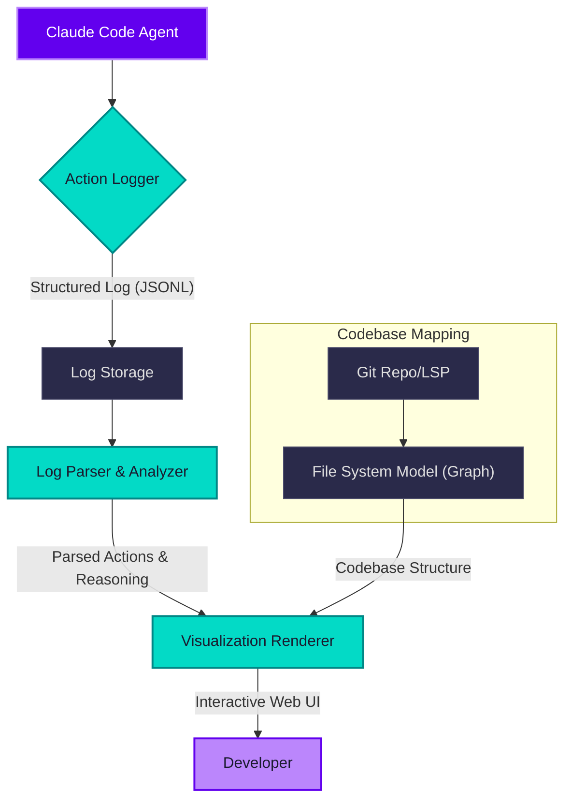

Large Language Model (LLM) 기반의 에이전트는 복잡한 코드베이스 내에서 작업을 수행하며 코드를 탐색하고, 분석하고, 수정합니다. 그러나 이 과정은 종종 '블랙 박스'처럼 느껴져 에이전트가 어떤 맥락에서 어떤 결정을 내렸는지 파악하기 어렵습니다. 에이전트의 세션 로그는 `무엇을 (what)` 했는지는 기록하지만, `어떻게 (how)` 코드베이스를 이해하고 작업 범위를 판단했는지에 대한 깊이 있는 통찰은 제공하지 못합니다. 원본 JSONL 로그만으로는 에이전트의 사고 과정을 추적하고 디버깅하는 데 한계가 명확합니다.

이를 해결하기 위해 에이전트의 코드베이스 탐색 및 수정 경로를 시각화하는 도구가 필수적입니다. 이 도구는 에이전트가 특정 작업을 수행하기 위해 코드베이스의 어느 부분을 탐색하고, 어떤 파일을 읽고, 어떤 파일을 수정했는지를 시각적으로 재현함으로써 에이전트의 의사결정 과정을 투명하게 드러내고, 개발자가 에이전트의 행동을 이해하고 개선하는 데 결정적인 도움을 줍니다.

### 핵심 개념: 투명한 에이전트 세션 재현

Mindwalk와 같은 시각화 도구의 핵심은 에이전트의 모든 상호작용을 구조화된 로그로 기록하고, 이 로그를 기반으로 코드베이스 위에서 에이전트의 '발자취'를 재현하는 것입니다. 저장소를 마치 '야간 지도'처럼 시각화하고, 에이전트가 검색, 읽기, 수정한 위치는 밝게 빛나게 하여 관련 영역과 에이전트의 작업 흐름을 한눈에 파악할 수 있도록 합니다.

이러한 시각화는 다음과 같은 질문에 답할 수 있습니다:
*   에이전트가 작업에 필요한 모든 관련 파일을 탐색했는가?
*   불필요한 파일을 탐색하여 Context Window를 낭비하지는 않았는가?
*   특정 버그를 수정할 때, 변경 범위가 적절했는가?
*   에이전트가 코드베이스의 구조를 얼마나 잘 이해하고 있는가?

### 구현 전략: Claude Code 하네스 로그 시각화

Claude Code 하네스 에이전트가 코드베이스를 탐색하고 수정하는 로그를 구조화하여 기록하고, 이를 기반으로 에이전트의 작업 경로와 관련 영역 판단을 시각화하는 간단한 도구를 개발하는 것이 목표입니다.

#### 1. 구조화된 로그 기록

에이전트의 각 액션은 시간, 파일 경로, 액션 타입 (읽기, 쓰기, 검색, 실행 등), 그리고 해당 액션에 대한 LLM의 간단한 추론 (`reasoning`)을 포함해야 합니다. JSONL 형식은 이러한 구조화된 로그를 저장하는 데 적합합니다.

```json
{"timestamp": "2026-07-20T10:00:01Z", "action": "read", "file": "src/components/Button.tsx", "reasoning": "Identifying existing button styles."}
{"timestamp": "2026-07-20T10:00:05Z", "action": "search", "query": "interface ITheme", "files": ["src/theme/types.ts"], "reasoning": "Locating theme interface for new component."}
{"timestamp": "2026-07-20T10:00:15Z", "action": "write", "file": "src/components/NewFeature.tsx", "reasoning": "Implementing initial component structure."}
{"timestamp": "2026-07-20T10:00:20Z", "action": "modify", "file": "src/styles/index.css", "reasoning": "Adding global styles for the new feature."}
```

#### 2. 코드베이스 모델링

코드베이스를 시각화하기 위해 파일 시스템 구조를 경량 그래프나 트리 형태로 모델링합니다. 각 파일/디렉토리는 노드가 되고, 계층 구조는 엣지가 됩니다. Git 리포지토리의 `ls-files`나 특정 언어의 LSP (Language Server Protocol)를 활용하여 파일 목록을 추출할 수 있습니다.

#### 3. 시각화 구현

간단한 웹 기반 인터페이스 (HTML/JS/CSS)를 사용하여 시각화를 구현할 수 있습니다. D3.js나 Three.js와 같은 라이브러리는 복잡한 데이터 시각화에 강력하지만, 초기 단계에서는 SVG나 HTML Canvas를 활용하여 파일 목록을 나열하고, 에이전트의 경로를 선으로 연결하거나, 방문한 파일을 색상으로 강조하는 방식으로 시작할 수 있습니다.

**예시: Python으로 간단한 로그 처리 및 HTML 출력**

```python
import json
import os

def generate_visualization_html(log_file, codebase_root):
    # Dummy representation of codebase structure (simplified)
    codebase_files = []
    for root, _, files in os.walk(codebase_root):
        for f in files:
            relative_path = os.path.relpath(os.path.join(root, f), codebase_root)
            codebase_files.append(relative_path)

    agent_actions = []
    with open(log_file, 'r') as f:
        for line in f:
            agent_actions.append(json.loads(line))

    # HTML generation
    html_content = """
    <!DOCTYPE html>
    <html lang="en">
    <head>
        <meta charset="UTF-8">
        <meta name="viewport" content="width=device-width, initial-scale=1.0">
        <title>Agent Codebase Exploration</title>
        <style>
            body { font-family: sans-serif; margin: 20px; background-color: #1a1a2e; color: #e0e0e0; }
            h1 { color: #bb86fc; }
            .codebase-map {
                display: grid;
                grid-template-columns: repeat(auto-fill, minmax(200px, 1fr));
                gap: 5px;
                border: 1px solid #3f3f5f;
                padding: 10px;
                border-radius: 8px;
            }
            .file-node {
                background-color: #2a2a4a;
                padding: 5px 8px;
                border-radius: 4px;
                font-size: 0.8em;
                white-space: nowrap;
                overflow: hidden;
                text-overflow: ellipsis;
                border: 1px solid #4a4a6a;
                color: #a0a0a0;
            }
            .file-node.visited {
                background-color: #6200ee; /* Purple for visited */
                border-color: #bb86fc;
                color: #ffffff;
                font-weight: bold;
            }
            .action-log {
                margin-top: 30px;
                border-top: 1px solid #3f3f5f;
                padding-top: 20px;
            }
            .action-item {
                background-color: #2a2a4a;
                margin-bottom: 5px;
                padding: 8px;
                border-radius: 4px;
                font-size: 0.9em;
            }
            .action-item span {
                font-weight: bold;
                color: #03dac6; /* Teal for actions */
            }
        </style>
    </head>
    <body>
        <h1>Agent Codebase Exploration Map</h1>
        <div class="codebase-map">
    """

    visited_files = set()
    for action in agent_actions:
        if "file" in action:
            visited_files.add(action["file"])
        if "files" in action and isinstance(action["files"], list):
            for f in action["files"]:
                visited_files.add(f)

    for file_path in sorted(codebase_files):
        is_visited = " visited" if file_path in visited_files else ""
        html_content += f'<div class="file-node{is_visited}" title="{file_path}">{file_path}</div>'

    html_content += """
        </div>
        <div class="action-log">
            <h2>Agent Action Log</h2>
    """

    for action in agent_actions:
        action_type = action.get("action", "unknown")
        file_info = action.get("file", action.get("files", "N/A"))
        reasoning = action.get("reasoning", "No reasoning provided.")
        timestamp = action.get("timestamp", "N/A")
        
        html_content += f"""
            <div class="action-item">
                [{timestamp}] <span>{action_type.upper()}</span>: {file_info} <br />
                Reasoning: {reasoning}
            </div>
        """
    
    html_content += """
        </div>
    </body>
    </html>
    """

    with open("agent_codebase_visualization.html", "w") as f:
        f.write(html_content)

# Example usage (assuming log.jsonl and a 'my_codebase' directory exist)
# with open('log.jsonl', 'w') as f:
#     f.write(json.dumps({"timestamp": "2026-07-20T10:00:01Z", "action": "read", "file": "src/components/Button.tsx", "reasoning": "Identifying existing button styles."}) + "\n")
#     f.write(json.dumps({"timestamp": "2026-07-20T10:00:05Z", "action": "search", "query": "interface ITheme", "files": ["src/theme/types.ts"], "reasoning": "Locating theme interface for new component."}) + "\n")
#     f.write(json.dumps({"timestamp": "2026-07-20T10:00:15Z", "action": "write", "file": "src/components/NewFeature.tsx", "reasoning": "Implementing initial component structure."}) + "\n")
#     f.write(json.dumps({"timestamp": "2026-07-20T10:00:20Z", "action": "modify", "file": "src/styles/index.css", "reasoning": "Adding global styles for the new feature."}) + "\n")
# os.makedirs('my_codebase/src/components', exist_ok=True)
# os.makedirs('my_codebase/src/theme', exist_ok=True)
# os.makedirs('my_codebase/src/styles', exist_ok=True)
# open('my_codebase/src/components/Button.tsx', 'a').close()
# open('my_codebase/src/components/NewFeature.tsx', 'a').close()
# open('my_codebase/src/theme/types.ts', 'a').close()
# open('my_codebase/src/styles/index.css', 'a').close()
# generate_visualization_html('log.jsonl', 'my_codebase')
```

### 2026년 트렌드 반영: Explainable AI for Agents

2026년 에이전트 개발 트렌드는 단순히 태스크를 성공시키는 것을 넘어, 에이전트의 `투명성 (Transparency)`과 `설명 가능성 (Explainability)`에 중점을 둡니다. 복잡한 문제를 해결하는 자율 에이전트의 도입이 증가하면서, 왜 특정 결정을 내렸는지, 어떤 정보에 기반하여 행동했는지를 이해하는 것이 더욱 중요해졌습니다. 특히 RAG (Retrieval Augmented Generation) 패턴이 보편화되면서, 에이전트가 어떤 문서를 검색하고 활용했는지 시각적으로 추적하는 기능은 할루시네이션을 줄이고 신뢰도를 높이는 데 필수적입니다. 코드베이스 탐색 시각화 도구는 이러한 `설명 가능한 에이전트 (Explainable Agents)`의 핵심 구성 요소가 됩니다.

### 데이터 흐름 Mermaid 다이어그램



---

## 트레이드오프

에이전트 코드베이스 탐색 시각화 도구를 구현하는 것은 여러 장점과 함께 고려해야 할 단점 및 트레이드오프가 존재합니다.

*   **디버깅 및 이해도 향상 vs. 로깅 오버헤드:**
    *   **언제 좋고:** 에이전트가 예상치 못한 동작을 하거나 특정 코드 수정에 실패했을 때, 시각화된 경로를 통해 문제의 원인 (예: 관련 없는 파일 탐색, 중요 파일 누락)을 직관적으로 파악하고 에이전트의 추론 과정을 이해하는 데 매우 효과적입니다. 새로운 에이전트 행동 패턴을 설계하거나 기존 에이전트의 성능을 최적화할 때도 유용합니다.
    *   **언제 나쁜지:** 에이전트의 모든 액션과 추론을 상세히 로깅하는 것은 상당한 I/O 오버헤드와 저장 공간을 요구할 수 있습니다. 특히 대규모 코드베이스에서 수많은 파일 상호작용이 발생하는 경우, 로깅 자체가 에이전트의 실행 속도를 저하시키거나 불필요한 비용을 발생시킬 수 있습니다.

*   **투명성 및 신뢰도 증진 vs. 시각화 도구 복잡성:**
    *   **언제 좋고:** 에이전트가 왜 그런 결정을 내렸는지, 어떤 코드 부분을 참조했는지 시각적으로 보여줌으로써 에이전트에 대한 개발자와 사용자의 신뢰도를 크게 높일 수 있습니다. 특히 규제가 중요한 산업에서 에이전트의 행동을 감사하고 설명하는 데 필수적인 기반이 됩니다.
    *   **언제 나쁜지:** 코드베이스의 규모, 파일 간의 복잡한 의존성, 다양한 에이전트 액션 타입을 효과적으로 시각화하는 것은 고도로 숙련된 프론트엔드 및 데이터 시각화 기술을 요구합니다. 3D 맵이나 복잡한 그래프 시각화는 개발 비용이 높고, 성능 최적화에 어려움을 겪을 수 있으며, 너무 복잡한 시각화는 오히려 정보를 압도하여 가독성을 떨어뜨릴 수 있습니다.

*   **실시간 모니터링 잠재력 vs. 구현 난이도:**
    *   **언제 좋고:** 에이전트가 작업을 수행하는 동안 실시간으로 코드베이스 탐색을 시각화하면, 문제가 발생했을 때 즉시 개입하거나 에이전트의 현재 진행 상황을 파악하는 데 유용합니다. 이는 장기 실행 에이전트의 진행 상황 모니터링 및 조기 경고 시스템 구축에 기여할 수 있습니다.
    *   **언제 나쁜지:** 실시간 로깅 처리, 웹소켓 등을 통한 실시간 데이터 전송, 그리고 브라우저에서 대규모 데이터셋을 끊김 없이 렌더링하는 것은 기술적으로 매우 어렵습니다. 특히 로깅된 데이터를 즉시 파싱하고 시각화 모델을 업데이트하는 과정에서 병목 현상이 발생할 수 있습니다.

*   **에이전트 성능 개선 피드백 vs. 데이터 정제 및 라벨링 비용:**
    *   **언제 좋고:** 시각화는 에이전트가 비효율적으로 탐색하거나 잘못된 가정으로 인해 실패하는 패턴을 식별하는 데 도움을 줍니다. 이러한 피드백은 프롬프트 엔지니어링, 툴 사용 최적화, 또는 RAG 시스템 개선을 통해 에이전트의 성능을 직접적으로 향상시킬 수 있는 기회를 제공합니다.
    *   **언제 나쁜지:** 시각화 결과로부터 의미 있는 피드백을 도출하고 이를 에이전트 학습 데이터로 활용하기 위해서는 로그 데이터를 추가로 정제하고 라벨링하는 과정이 필요합니다. 이는 추가적인 인력과 시간을 요구하며, 데이터의 양이 방대해질수록 이 비용은 기하급수적으로 증가할 수 있습니다.

---

## 실전 체크리스트

이 코드베이스 탐색 시각화 도구를 실제 프로젝트에 적용하기 위한 검증 항목입니다.

-   [ ] **구조화된 로그 스키마 정의:** 에이전트의 `action (읽기, 쓰기, 검색, 실행 등)`, `file_path`, `timestamp`, `llm_reasoning`, `tool_used` 필드를 포함하는 JSONL 로그 스키마를 확정했는가?
-   [ ] **에이전트 코드에 로깅 통합:** Claude Code 하네스 또는 커스텀 에이전트의 모든 파일 I/O 및 검색/실행 액션에 대해 위에서 정의한 스키마에 따라 로그를 기록하도록 구현했는가?
-   [ ] **코드베이스 메타데이터 수집 전략:** Git CLI (`git ls-files`) 또는 LSP (Language Server Protocol)를 활용하여 대상 코드베이스의 전체 파일 목록 및 기본적인 구조 정보를 수집하는 자동화된 파이프라인을 구축했는가?
-   [ ] **로그 파일 파싱 및 데이터 모델 구축:** 기록된 JSONL 로그 파일을 효율적으로 파싱하고, 이를 시각화에 적합한 데이터 모델 (예: 방문한 파일 목록, 액션 타임라인)로 변환하는 백엔드 로직을 개발했는가?
-   [ ] **최소 기능 시각화 구현:** 웹 기반 (HTML/CSS/JS)으로 최소한의 시각화 (예: 파일 목록 중 방문 파일 색상 강조, 액션 타임라인)를 구현하여 에이전트 경로를 직관적으로 확인할 수 있는가?
-   [ ] **성능 및 확장성 테스트:** 대규모 코드베이스 (예: 1,000개 이상의 파일) 및 장기 실행 에이전트 세션 (예: 10,000개 이상의 로그 엔트리)에 대해 시각화 도구가 지연 없이 동작하고 정보를 유의미하게 표시하는지 테스트했는가?
-   [ ] **피드백 루프 통합:** 시각화 결과를 통해 발견된 에이전트의 비효율적/잘못된 행동 패턴을 다시 에이전트 개선 (프롬프트 수정, 툴 사용 최적화)에 반영하는 프로세스를 수립했는가?