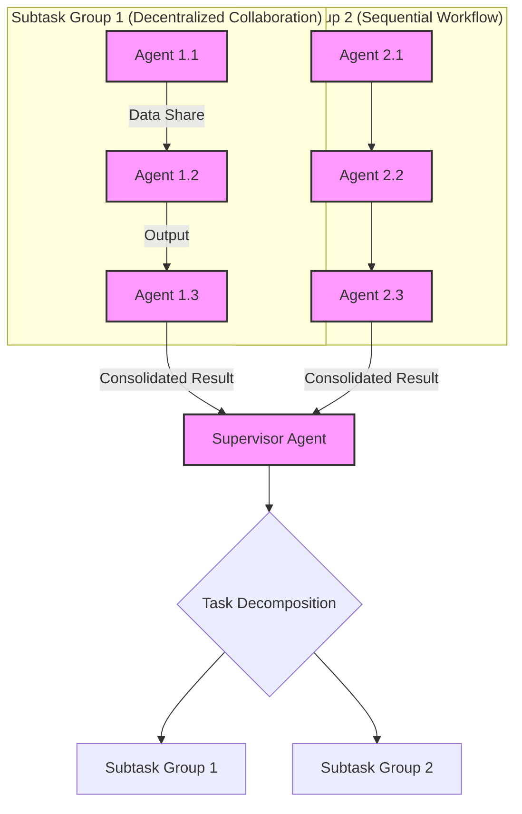

복잡한 작업을 효율적으로 처리하기 위해 단일 AI 에이전트의 역량에는 한계가 있습니다. 이러한 갭을 해소하기 위해 여러 AI 에이전트가 상호작용하며 협력하는 멀티 에이전트 시스템(Multi-Agent System, MAS) 디자인이 중요해지고 있습니다. 효과적인 MAS 디자인은 확장성, 강건성, 그리고 전문화된 문제 해결 능력을 극대화하여 훨씬 더 복잡하고 동적인 환경에 대응할 수 있게 합니다.

## 핵심 개념: 멀티 에이전트 시스템 협업의 중요성

멀티 에이전트 시스템은 단순히 여러 에이전트를 모아놓는 것을 넘어, 이들이 어떻게 상호작용하고 공동의 목표를 달성할지 전략적으로 설계하는 것이 핵심입니다. 이는 다음과 같은 이점을 제공합니다.

*   **복잡성 관리 (Complexity Management)**: 단일 에이전트가 감당하기 어려운 초대형 태스크를 여러 에이전트가 전문 분야별로 분할하여 처리, 문제 해결의 복잡도를 낮춥니다.
*   **확장성 (Scalability)**: 작업 부하에 따라 필요한 만큼 에이전트 인스턴스를 동적으로 추가하거나 제거하여 시스템의 처리 능력을 유연하게 조절합니다.
*   **강건성 (Robustness)**: 일부 에이전트가 오작동하거나 실패하더라도 다른 에이전트들이 작업을 인계받아 시스템 전체의 기능 연속성을 보장(fault tolerance)합니다.
*   **전문성 활용 (Specialized Expertise)**: 각 에이전트가 특정 도메인 지식, 데이터 처리, 도구 사용 등 고유한 전문성을 가지고 협력하여 최적의 결과를 도출합니다.

## 주요 협업 패턴 디자인 (Key Collaboration Pattern Designs)

멀티 에이전트 시스템의 협업은 다양한 패턴으로 설계될 수 있으며, 각 패턴은 고유한 장단점을 가집니다.

### 1. 중앙 집중식 오케스트레이션 (Centralized Orchestration)

이 패턴에서는 슈퍼바이저(Supervisor) 에이전트가 전체 워크플로우를 관리하고, 다른 워커(Worker) 에이전트들에게 작업을 할당, 조정, 그리고 진행 상황을 모니터링합니다. 모든 통신이 슈퍼바이저를 통해 이루어집니다.

*   **메커니즘**: 슈퍼바이저가 태스크를 분해하고, 각 서브 태스크를 적절한 워커에게 전달하며, 워커로부터 받은 결과를 통합합니다. 주로 메시지 큐나 공유 데이터 저장소를 사용합니다.

### 2. 분산형 협업 (Decentralized Collaboration: Swarm / Peer-to-Peer)

분산형 협업 시스템에서는 에이전트들이 명시적인 중앙 제어 에이전트 없이 직접 상호작용하며 자율적으로 결정을 내리고 협업합니다. 각 에이전트는 지역적인 정보와 규칙에 따라 행동합니다.

*   **메커니즘**: 에이전트 간 직접 메시지 교환, 공유 환경(예: 블랙보드 패턴)을 통한 간접적인 상호작용, 또는 강화 학습 기반의 협업 전략을 사용합니다.

### 3. 하이브리드 접근 방식 (Hybrid Approaches)

실제 복잡한 시스템에서는 중앙 집중식과 분산형의 장점을 결합한 하이브리드 모델이 자주 사용됩니다. 예를 들어, 상위 레벨에서는 슈퍼바이저가 큰 그림의 오케스트레이션을 담당하고, 하위 레벨의 에이전트 그룹 내에서는 분산형으로 협업이 이루어지는 방식입니다.

**협업 메커니즘 (Common Collaboration Mechanisms)**

에이전트 간 상호작용은 다음과 같은 방식으로 구현됩니다.

*   **메시지 기반 통신 (Message-based Communication)**: 에이전트 간 비동기 메시지 교환을 통해 정보, 명령, 결과 등을 전달합니다. Pub/Sub (Publish/Subscribe), RPC (Remote Procedure Call) 등이 활용됩니다.
*   **공유 메모리/블랙보드 (Shared Memory / Blackboard)**: 에이전트들이 공유된 지식 기반 또는 작업 공간에 정보를 쓰고 읽으며 협업합니다. 이는 특히 복잡하고 불확실한 문제 해결에 유용합니다.
*   **도구 사용 및 함수 호출 (Tool Use & Function Calling)**: 에이전트가 외부 도구(APIs, 데이터베이스, 코드 인터프리터 등)를 호출하여 정보를 얻거나 작업을 수행하고 결과를 공유함으로써 협업의 지평을 넓힙니다. 이는 LLM 기반 에이전트의 핵심 역량 중 하나입니다.

## 멀티 에이전트 시스템 협업 아키텍처 예시

아래 Mermaid 다이어그램은 슈퍼바이저가 하이브리드 방식으로 두 개의 서브 태스크 그룹을 오케스트레이션하는 시나리오를 보여줍니다. 각 서브 태스크 그룹은 고유의 협업 패턴을 가집니다.



### Python으로 구현하는 중앙 집중식 오케스트레이션 예시

이 Python 코드는 Supervisor가 DataProcessor, Validator, Aggregator 세 가지 역할을 가진 에이전트들을 순차적으로 오케스트레이션하는 간단한 예시입니다. 각 에이전트는 독립적인 스레드에서 실행되며, 메시지 큐를 통해 Supervisor와 통신합니다.

```python
import threading
import queue
import time

class Agent:
    def __init__(self, name, role, supervisor_inbox):
        self.name = name
        self.role = role
        self.inbox = queue.Queue() # For messages from supervisor or other agents
        self.supervisor_inbox = supervisor_inbox # To send results back to supervisor
        print(f"Agent {self.name} ({self.role}) initialized.")

    def send_to_supervisor(self, message):
        print(f"[{self.name}] Sending result to supervisor: {message}")
        self.supervisor_inbox.put((self.name, message)) # Sender name, message

    def process_task(self, task_data):
        print(f"[{self.name}] Processing task: {task_data}")
        time.sleep(0.3) # Simulate work
        return f"Result from {self.name} for '{task_data}': {task_data.upper()}"

    def run(self):
        while True:
            task_message = self.inbox.get() # Blocking call until a message is received
            if task_message == "STOP":
                print(f"[{self.name}] Shutting down.")
                break
            
            # Simulate different agent roles processing the task
            result = ""
            if self.role == "data_processor":
                result = self.process_task(task_message)
            elif self.role == "validator":
                result = f"Validation of '{task_message}': {'SUCCESS' if 'ERROR' not in task_message else 'FAILURE'}"
            elif self.role == "aggregator":
                result = f"Aggregated final output from '{task_message}'."

            self.send_to_supervisor(result)

class Supervisor:
    def __init__(self):
        self.supervisor_inbox = queue.Queue() # Supervisor's own inbox
        self.agents = {}
        self.threads = []

    def add_agent(self, name, role):
        agent = Agent(name, role, self.supervisor_inbox)
        self.agents[name] = agent
        return agent

    def start_agents(self):
        for agent in self.agents.values():
            thread = threading.Thread(target=agent.run, daemon=True)
            self.threads.append(thread)
            thread.start()
        print("All agents started.")

    def orchestrate_workflow(self, initial_task):
        print(f"\n[Supervisor] Initiating workflow with task: {initial_task}")
        
        # Step 1: Supervisor sends initial task to DataProcessorA
        self.agents["DataProcessorA"].inbox.put(initial_task)
        
        # Wait for result from DataProcessorA
        sender, processed_data = self.supervisor_inbox.get()
        print(f"[Supervisor] Received from {sender}: {processed_data}")

        # Step 2: Supervisor sends processed_data to ValidatorB
        self.agents["ValidatorB"].inbox.put(processed_data)

        # Wait for result from ValidatorB
        sender, validated_data = self.supervisor_inbox.get()
        print(f"[Supervisor] Received from {sender}: {validated_data}")

        # Step 3: Supervisor sends validated_data to AggregatorC
        self.agents["AggregatorC"].inbox.put(validated_data)

        # Wait for final result from AggregatorC
        sender, final_result = self.supervisor_inbox.get()
        print(f"[Supervisor] Final result from {sender}: {final_result}")
        
        return final_result

    def stop_agents(self):
        for agent in self.agents.values():
            agent.inbox.put("STOP")
        print("All agents sent STOP signal.")
        time.sleep(0.5) # Give agents a moment to process STOP

# Main execution
if __name__ == "__main__":
    supervisor = Supervisor()
    
    supervisor.add_agent("DataProcessorA", "data_processor")
    supervisor.add_agent("ValidatorB", "validator")
    supervisor.add_agent("AggregatorC", "aggregator")

    supervisor.start_agents()
    
    time.sleep(1) # Give agents a moment to fully initialize threads

    final_output = supervisor.orchestrate_workflow("raw_data_stream_id_123_abc")
    print(f"\n[MAIN] Workflow completed. Final output: {final_output}")

    supervisor.stop_agents()
```

## 트레이드오프 (Trade-offs)

멀티 에이전트 시스템 협업 패턴을 선택할 때는 각 방식의 장단점을 고려해야 합니다.

*   **중앙 집중식 오케스트레이션 (Centralized Orchestration)**
    *   **장점**: 제어의 용이성, 전체 시스템 가시성, 복잡한 로직 구현에 유리합니다.
    *   **단점**: 단일 실패 지점(Single Point of Failure)이 될 수 있으며, 슈퍼바이저가 병목 현상(Bottleneck)이 될 가능성이 있어 확장성이 떨어질 수 있습니다.
    *   **언제 좋은가**: 소규모의 잘 정의된 태스크, 높은 수준의 제어 및 감사(auditing)가 필요한 경우에 적합합니다.
    *   **언제 나쁜가**: 대규모 병렬 처리, 높은 자율성과 즉각적인 대응이 요구되는 시스템에는 부적합합니다.

*   **분산형 협업 (Decentralized Collaboration)**
    *   **장점**: 높은 확장성과 강건성(Robustness), 유연성(Flexibility)을 제공하며, 단일 실패 지점이 없습니다.
    *   **단점**: 에이전트 간의 복잡한 상태 관리와 협업 로직 디버깅이 어렵고, 전체 시스템의 가시성이 낮아질 수 있습니다.
    *   **언제 좋은가**: 대규모, 동적 환경, 높은 자율성이 중요한 태스크(예: 로봇 군집 제어)에 적합합니다.
    *   **언제 나쁜가**: 정교한 중앙 제어와 워크플로우 추적이 필요한 경우, 또는 에이전트 간의 조율 실패가 치명적인 결과로 이어질 수 있는 시스템에는 부적합합니다.

*   **블랙보드 패턴 (Blackboard Pattern)**
    *   **장점**: 에이전트 간 낮은 결합도(loose coupling), 비동기적이고 유연한 지식 공유가 가능하며, 문제 해결 전략이 불확실한 경우에 유용합니다.
    *   **단점**: 공유 데이터의 일관성 유지와 경쟁 조건(Race Condition) 관리가 어려울 수 있으며, 블랙보드 자체가 병목이 될 수 있습니다.
    *   **언제 좋은가**: 복잡하고 불확실한 문제(예: 음성 인식, 의료 진단)를 다양한 전문 에이전트가 협업하여 해결해야 할 때 효과적입니다.
    *   **언제 나쁜가**: 실시간 성능이 중요하거나, 데이터 일관성이 매우 엄격하게 요구되는 시스템에는 추가적인 관리 오버헤드가 발생합니다.

*   **에이전트 간 직접 통신 (Direct Agent-to-Agent Communication)**
    *   **장점**: 낮은 통신 오버헤드와 빠른 응답 시간을 제공하여, 에이전트 간 긴밀한 상호작용이 필요한 경우 효율적입니다.
    *   **단점**: 에이전트 간 높은 결합도(tight coupling)를 유발하며, 시스템의 복잡도가 증가하고 유연성이 저해될 수 있습니다.
    *   **언제 좋은가**: 에이전트 간 명확한 종속성이 있고, 소규모의 고정된 그룹 내에서 빠른 데이터 교환이 필요할 때 적합합니다.
    *   **언제 나쁜가**: 에이전트의 동적 추가/제거 또는 시스템 재구성이 빈번하게 발생하는 환경에는 유지보수 비용이 높습니다.

## 실전 체크리스트 (Practical Checklist)

멀티 에이전트 시스템 협업 패턴을 프로젝트에 적용할 때 다음 사항들을 검토하여 성공적인 구현을 보장해야 합니다.

*   [ ] **협업 프로토콜 정의**: 각 에이전트가 어떤 형식과 규칙으로 메시지를 주고받을지 (e.g., JSON Schema, Protocol Buffers) 명확하게 정의하고 문서화되었는가?
*   [ ] **상태 관리 전략**: 에이전트 간 공유되는 전역/부분 상태가 일관되게 유지되는 메커니즘(e.g., 트랜잭션, 낙관적/비관적 잠금)이 설계 및 구현되었는가?
*   [ ] **오류 처리 및 복구**: 에이전트 중 일부가 실패했을 때 시스템 전체가 어떻게 반응하고 복구할 수 있는지(e.g., 재시도 로직, 대체 에이전트 할당, 데드레터 큐)에 대한 전략이 마련되었는가?
*   [ ] **확장성 아키텍처**: 시스템 부하 증가 시 에이전트를 동적으로 추가하거나 제거하는 과정이 원활하게 설계되었으며, 컨테이너 오케스트레이션(e.g., Kubernetes)과 서비스 디스커버리 메커니즘이 고려되었는가?
*   [ ] **보안 및 접근 제어**: 에이전트 간 통신 및 공유 자원에 대한 보안 정책(인증, 인가, 암호화)이 적용되었으며, LLM API 키 관리 방안이 확립되었는가?
*   [ ] **모니터링 및 로깅**: 에이전트의 활동, 메시지 교환, 성능 지표를 실시간으로 추적하고 문제를 진단할 수 있는 모니터링 및 로깅 시스템(e.g., Spanlens, Prometheus, Grafana)이 구축되었는가?
*   [ ] **비용 최적화 (Cost Optimization)**: 불필요한 에이전트 인스턴스 실행이나 과도한 LLM API 호출을 방지하기 위한 전략(e.g., 캐싱, 컨텍스트 압축, 수요 기반 스케줄링)이 포함되어 운영 비용 효율성을 높였는가?
