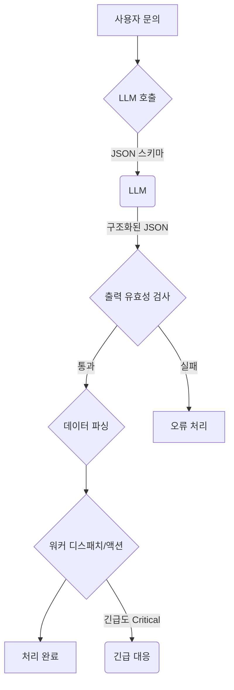

LLM 기반 에이전트 시스템에서 의사결정의 정확성과 효율성은 전체 시스템의 신뢰성을 좌우하는 핵심 요소입니다. 전통적인 LLM 활용 방식은 자유 형식의 긴 답변을 생성하는 데 초점을 맞추지만, 워커 디스패치, 긴급도 판단, 라우팅과 같은 핵심 의사결정에는 구조화된 출력이 필수적입니다. 구조화된 출력은 LLM의 비결정성을 줄이고, 후처리 로직을 간소화하며, 에이전트 시스템의 자동화 수준을 극대화합니다.

## 구조화된 출력 의사결정 모델의 중요성

LLM이 생성하는 자유 형식 텍스트는 유연하지만, 특정 비즈니스 로직에 통합하기 위해서는 복잡한 자연어 처리(NLP) 파싱이 필요합니다. 이 과정에서 파싱 오류나 LLM의 미묘한 출력 변화로 인해 시스템 오작동이 발생할 수 있습니다. 예를 들어, 고객 문의 처리 에이전트가 "이 문의는 기술 지원팀으로 전달하고, 긴급하게 처리해야 합니다. 고객은 매우 불만을 가지고 있습니다."와 같이 응답할 경우, 핵심 정보를 추출하는 정교한 로직이 요구됩니다.

반면, LLM이 미리 정의된 JSON, XML, 또는 YAML 스키마에 따라 응답하도록 유도하면, 이러한 정보를 기계가 쉽게 해석하고 활용할 수 있는 형태로 얻을 수 있습니다. 이는 시스템의 견고성을 높이고, 예측 불가능한 오류를 줄이며, 의사결정의 신뢰도를 향상시킵니다. Qwen3.5 기반의 Kev 방식 모델은 긴 답변 대신 예/아니오 확률, 선택지별 확률, 평가 점수 등을 구조화된 형태로 반환하여 이러한 이점을 극대화합니다. 이는 Playbook 에이전트 하네스에서 워커 디스패치, Lesson/Error 긴급도 판단과 같은 주요 의사결정 지점에 통합될 때 강력한 시너지를 발휘합니다.

## 구조화된 출력 활용 패턴 및 예시

구조화된 출력을 에이전트 의사결정 모델에 도입하는 핵심은 LLM에게 명확한 출력 형식을 지시하고, 그에 대한 유효성 검사를 수행하는 것입니다. 이는 프롬프트 엔지니어링과 스키마 정의를 통해 이루어집니다.

### 프롬프트 엔지니어링 및 스키마 정의

LLM에게 원하는 출력 형태를 명확히 지시하기 위해 JSON 스키마를 제공하고, 해당 스키마에 맞춰 응답하도록 요청합니다.

```json
{
  "type": "object",
  "properties": {
    "department": { "type": "string", "enum": ["tech", "billing", "sales", "general"] },
    "urgency": { "type": "string", "enum": ["low", "medium", "high", "critical"] },
    "customer_sentiment": { "type": "string", "enum": ["positive", "neutral", "negative"] },
    "requires_follow_up": { "type": "boolean" },
    "confidence_score": { "type": "number", "minimum": 0, "maximum": 1 }
  },
  "required": ["department", "urgency", "customer_sentiment", "requires_follow_up", "confidence_score"]
}
```

### 코드 예시: Python을 이용한 구조화된 출력 파싱

Python과 Pydantic 라이브러리를 사용하여 LLM의 구조화된 출력을 처리하는 예시입니다.

```python
from pydantic import BaseModel, Field
import json

class InquiryDecision(BaseModel):
    department: str = Field(..., description="담당 부서")
    urgency: str = Field(..., description="문의 긴급도")
    customer_sentiment: str = Field(..., description="고객 감정 상태")
    requires_follow_up: bool = Field(..., description="후속 조치 필요 여부")
    confidence_score: float = Field(..., description="확신도 (0-1)")

def get_simulated_llm_decision(user_query: str) -> InquiryDecision:
    # 실제 LLM API 호출 대신 시뮬레이션
    if "배송" in user_query:
        data = {"department": "sales", "urgency": "medium", "customer_sentiment": "negative", "requires_follow_up": True, "confidence_score": 0.85}
    elif "설정" in user_query:
        data = {"department": "tech", "urgency": "low", "customer_sentiment": "neutral", "requires_follow_up": False, "confidence_score": 0.92}
    else:
        data = {"department": "general", "urgency": "low", "customer_sentiment": "positive", "requires_follow_up": False, "confidence_score": 0.70}
    return InquiryDecision(**data)

# Example usage
query = "배송이 너무 느려요. 언제 도착하나요?"
decision = get_simulated_llm_decision(query)
print(f"문의: '{query}'")
print(f"결정: 부서={decision.department}, 긴급도={decision.urgency}")
```

이 코드는 예상 출력 구조를 정의하고, LLM의 응답을 받아 유효성을 검사합니다. 이를 통해 견고하고 예측 가능한 방식으로 LLM의 의사결정을 활용할 수 있습니다.

### 의사결정 흐름 시각화

구조화된 출력을 활용한 에이전트 의사결정 흐름입니다.



이 다이어그램은 LLM이 시스템의 핵심 의사결정 엔진으로 작동하는 방식을 보여줍니다.

## 트레이드오프

### 구조화된 출력 의사결정 모델 도입의 장단점

*   **정확성 및 신뢰성**:
    *   **장점**: 워커 디스패치, 긴급도 판단 등 핵심 의사결정 지점에서 파싱 오류 위험을 줄여 시스템의 신뢰성을 높입니다.
    *   **단점**: 창의적 텍스트 생성이 주 목적인 경우, 엄격한 구조화는 LLM의 유연성을 저해할 수 있습니다.

*   **자동화 및 통합 용이성**:
    *   **장점**: 에이전트 의사결정 결과를 다른 시스템에 자동으로 연동해야 할 때, 통합 작업을 간소화하고 개발/유지보수 비용을 절감합니다.
    *   **단점**: 의사결정 결과가 단순 정보 제공용일 경우, 추가 파싱/검증 오버헤드가 불필요할 수 있습니다.

*   **효율성 및 비용**:
    *   **장점**: 필요한 핵심 정보만 간결하게 얻어 토큰 사용량을 최적화하고 응답 지연 시간을 줄입니다. 고빈도 호출 시 특히 유리합니다.
    *   **단점**: 스키마 정의 및 프롬프트 엔지니어링에 초기 노력이 필요하며, 복잡한 스키마는 LLM 컨텍스트를 늘려 예상치 못한 토큰 증가를 초래할 수 있습니다.

## 실전 체크리스트

프로젝트에 에이전트 의사결정 모델과 구조화된 출력을 도입할 때 다음 항목들을 검증합니다.

- [ ] LLM 기반 의사결정이 필요한 핵심 지점을 모두 식별하고 명확한 스키마를 정의했는가?
- [ ] LLM의 출력이 정의된 스키마를 준수하는지 런타임 유효성 검사 로직(예: Pydantic, Zod)을 구현하고, 실패 시의 폴백 전략을 마련했는가?
- [ ] 구조화된 LLM 출력을 활용하여 다음 워커 디스패치 또는 액션을 자동 수행하는 로직을 구현했는가?
- [ ] 의사결정 모델의 응답 지연 시간 및 토큰 비용을 모니터링하고, 최적화 방안을 고려했는가?
- [ ] 의사결정의 정확도를 측정할 수 있는 평가 지표를 정의하고, 지속적인 모니터링 시스템을 구축했는가?