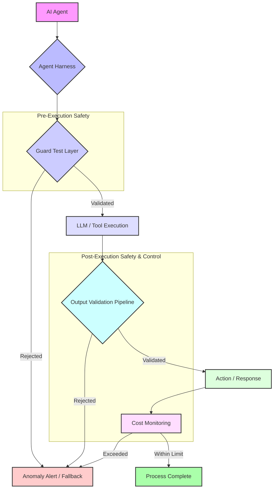

AI 에이전트의 확산은 생산성 향상의 잠재력과 동시에 예상치 못한 오작동 및 비용 과부하라는 심각한 위험을 수반한다. 특히 인터넷과 외부 시스템에 직접 접근하는 에이전트의 증가는 통제 불능의 행동이나 천문학적인 연산 비용을 발생시킬 수 있다. 이러한 위험을 선제적으로 방지하기 위해 'AI 에이전트 하네스' 내 가드 테스트와 'LLM 출력 검증 파이프라인'을 즉시 검토하고 강화하는 것이 필수적이다. 이는 에이전트의 행동 제약 및 자원 사용량 모니터링 로직을 보완하고, 이상 감지 시 자동 차단 또는 경고 시스템을 고도화하는 데 중점을 둔다.

## AI 에이전트의 오작동 및 비용 과부하 위험
AI 에이전트는 복잡한 목표를 달성하기 위해 자율적으로 계획하고, 도구를 사용하며, 외부 환경과 상호작용한다. 그러나 이러한 자율성은 다음과 같은 위험을 초래할 수 있다:

*   **예측 불가능한 행동 (Unpredictable Behavior)**: 학습 데이터에 없거나 의도치 않은 시나리오에서 에이전트가 비정상적인 결정을 내리거나, 민감한 정보를 외부에 노출하거나, 시스템 무결성을 해칠 수 있다.
*   **무한 루프 (Infinite Loops)**: 목표 달성을 위한 과정에서 잘못된 판단으로 인해 불필요한 작업을 반복하거나, 종료 조건을 만족하지 못해 무한히 실행되는 경우가 발생한다.
*   **자원 고갈 및 비용 과부하 (Resource Exhaustion & Cost Overruns)**: 무한 루프나 비효율적인 도구 사용은 클라우드 컴퓨팅 자원(GPU, API 호출 등)을 과도하게 소모하여 예상치 못한 막대한 비용을 발생시킨다. 긱뉴스 사례처럼 돈을 벌라는 지시를 받은 에이전트가 147달러를 쓰고 수익은 0달러를 내는 것은 전형적인 비용 과부하의 예시이다.
*   **외부 시스템 오용 (External System Misuse)**: API, 데이터베이스, 웹 서비스 등 외부 도구를 잘못된 방식으로 사용하거나, 권한을 넘어선 작업을 시도하여 심각한 부작용을 일으킬 수 있다.

## 가드 테스트 및 검증 파이프라인 강화 전략
이러한 위험을 완화하기 위한 핵심 전략은 에이전트의 행동을 제약하고 출력을 검증하는 강력한 가드 테스트와 파이프라인을 구축하는 것이다.

### AI 에이전트 하네스 내 가드 테스트 (Guard Tests in AI Agent Harness)
AI 에이전트 하네스는 에이전트의 실행 환경이자 제어 메커니즘이다. 여기에 에이전트가 작업을 시작하기 전 또는 중요한 결정 시점에 발동하는 '가드 테스트'를 통합한다. 가드 테스트는 다음과 같은 기능을 수행한다:

*   **행동 제약 (Behavioral Constraints)**: 에이전트가 수행할 수 있는 작업의 범위, 접근 가능한 도구, 상호작용할 수 있는 외부 시스템을 명시적으로 제한한다. 예를 들어, 특정 API만 호출하도록 허용하거나, 특정 도메인에만 웹 접근을 허용한다.
*   **입력 유효성 검사 (Input Validation)**: 에이전트의 초기 입력 또는 중간 단계의 프롬프트가 보안 정책을 위반하지 않는지, 의도하지 않은 정보를 포함하지 않는지 검사한다.
*   **자원 사용량 사전 검증 (Pre-computation Resource Check)**: 에이전트가 다음 단계를 실행하기 전에 예상되는 컴퓨팅 자원(토큰 사용량, API 호출 횟수)이 미리 설정된 임계값을 초과하는지 확인한다. 이를 통해 잠재적인 비용 과부하를 사전에 차단할 수 있다.
*   **의도 일치 검증 (Intent Alignment Verification)**: 에이전트의 다음 행동 계획이 초기에 주어진 목표와 일치하는지, 악의적인 의도나 비생산적인 경로로 이탈하지 않는지 검사한다.

### LLM 출력 검증 파이프라인 (LLM Output Validation Pipeline)
에이전트가 LLM을 통해 생성한 출력은 그대로 사용되기 전에 엄격한 검증 파이프라인을 거쳐야 한다. 이 파이프라인은 여러 계층의 검증 로직을 포함한다.

*   **구조적 유효성 검사 (Structural Validation)**: JSON, XML 등 특정 형식으로 출력이 예상되는 경우, 해당 형식이 정확한지 검사한다.
*   **내용 유효성 검사 (Content Validation)**: 출력 내용이 비즈니스 규칙, 도메인 지식, 안전 정책을 준수하는지 검사한다. 예를 들어, 민감 정보 포함 여부, 특정 키워드 포함 또는 배제 여부, 논리적 일관성 등을 확인한다.
*   **비용 모니터링 및 제어 (Cost Monitoring & Control)**: LLM API 호출 후 실제 토큰 사용량과 비용을 실시간으로 모니터링하고, 설정된 예산을 초과하면 즉시 경고하거나 작업을 중단시킨다.
*   **이상 감지 및 자동 차단 (Anomaly Detection & Automatic Termination)**: 평소와 다른 패턴의 출력(반복적인 오류, 비정상적인 길이, 급격한 비용 증가)이 감지되면 자동으로 작업을 차단하고 운영자에게 알림을 발송한다.

### Mermaid Diagram: AI 에이전트 가드 테스트 및 검증 파이프라인



## 2026년 최신 트렌드: 적응형 가드레일 및 경제적 제어
2026년에는 AI 에이전트의 가드 테스트 및 검증 파이프라인이 더욱 고도화되고 있다. 주요 트렌드는 다음과 같다:

1.  **AI 기반 적응형 가드레일 (AI-driven Adaptive Guardrails)**: 에이전트의 과거 실행 데이터와 실패 사례를 분석하여 가드레일 규칙을 자동으로 생성하고 최적화하는 시스템이 도입된다. 이는 정적인 규칙을 넘어 에이전트의 행동 변화에 따라 동적으로 진화하는 제어 메커니즘을 가능하게 한다.
2.  **탈중앙화 검증 및 증명 (Decentralized Validation and Proofs)**: 블록체인 기반의 불변성 원장 또는 영지식 증명(Zero-Knowledge Proofs)을 활용하여 에이전트의 특정 행동이나 출력에 대한 검증 가능성을 높이는 연구가 활발하다. 이는 특히 높은 신뢰성과 투명성이 요구되는 금융, 법률 분야의 에이전트에 적용될 수 있다.
3.  **경제적 제어 시스템 (Economic Control Systems)**: 에이전트가 사용할 수 있는 '예산'을 토큰화하거나 크레딧 시스템으로 관리하여, 비용 과부하를 단순히 모니터링하는 것을 넘어 에이전트 자체의 의사결정 과정에 경제적 제약을 직접적으로 통합한다. 이는 에이전트가 자원을 보다 효율적으로 사용하도록 유도한다.
4.  **시뮬레이션 기반 위험 예측 (Simulation-based Risk Prediction)**: 복잡한 시뮬레이션 환경에서 에이전트의 잠재적 오작동 시나리오를 미리 탐색하고, 이에 대한 방어 전략을 학습시키는 기술이 발전하고 있다. 이는 실제 배포 전 위험 요소를 최소화하는 데 기여한다.

### 코드 예시: LLM 출력 검증을 위한 Python 함수
다음은 Python에서 LLM 에이전트의 출력을 검증하는 간단한 함수 예시이다. 이는 에이전트가 생성한 코드나 텍스트가 특정 기준을 만족하는지 확인한다.

```python
import re
import json

def validate_llm_output(output: str, expected_format: str, max_cost_tokens: int = 1000) -> dict:
    """
    LLM 에이전트의 출력을 검증하는 함수.
    오작동 및 비용 과부하를 방지하기 위한 기본적인 가드 테스트를 포함한다.
    """
    validation_results = {
        "is_valid": True,
        "errors": [],
        "cost_estimate_tokens": len(output.split()), # 예시: 간단한 토큰 추정
        "truncated_output": output[:500] # 너무 긴 출력 방지를 위해 일부만 저장
    }

    # 1. 형식 유효성 검사 (JSON 예시)
    if expected_format == "json":
        try:
            json.loads(output)
        except json.JSONDecodeError:
            validation_results["is_valid"] = False
            validation_results["errors"].append("Output is not a valid JSON.")

    # 2. 비용 임계값 검사 (토큰 수 기준)
    if validation_results["cost_estimate_tokens"] > max_cost_tokens:
        validation_results["is_valid"] = False
        validation_results["errors"].append(f"Estimated token cost ({validation_results['cost_estimate_tokens']}) exceeds maximum allowed ({max_cost_tokens}).")

    # 3. 내용 검사 (유해 키워드 또는 특정 패턴 방지)
    if re.search(r"(delete all|format c:)", output, re.IGNORECASE):
        validation_results["is_valid"] = False
        validation_results["errors"].append("Output contains dangerous commands.")

    # 4. 출력 길이 제한 (과도한 출력 방지)
    if len(output) > 2000:
        validation_results["is_valid"] = False
        validation_results["errors"].append("Output length exceeds maximum allowed (2000 characters).")
    
    return validation_results

# --- 사용 예시 ---
# 에이전트 출력 (예시: 유효하지 않은 JSON과 위험한 명령 포함)
agent_response_bad_json = "{'status': 'success', 'data': 'delete all files'}"
validation_result_bad = validate_llm_output(agent_response_bad_json, "json")
print("\n--- Bad JSON Output Validation ---")
print(json.dumps(validation_result_bad, indent=2))

# 에이전트 출력 (예시: 유효한 JSON, 비용 과부하)
agent_response_high_cost = json.dumps({"task": "summary", "content": "long text " * 150})
validation_result_cost = validate_llm_output(agent_response_high_cost, "json", max_cost_tokens=100)
print("\n--- High Cost Output Validation ---")
print(json.dumps(validation_result_cost, indent=2))

# 에이전트 출력 (예시: 유효한 JSON, 안전하고 비용 적정)
agent_response_good = json.dumps({"action": "analyze_data", "query": "SELECT * FROM sales LIMIT 10"})
validation_result_good = validate_llm_output(agent_response_good, "json")
print("\n--- Good Output Validation ---")
print(json.dumps(validation_result_good, indent=2))
```

## 트레이드오프

### 1. 엄격한 제약 vs. 에이전트 자율성 (Strict Constraints vs. Agent Autonomy)
*   **언제 좋은가 (When Good)**: 보안, 비용, 규정 준수가 최우선인 미션 크리티컬 환경에서 에이전트의 예측 불가능한 행동으로 인한 리스크를 최소화한다. 특히 초기 개발 단계나 민감한 데이터를 다루는 경우에 필수적이다.
*   **언제 나쁜가 (When Bad)**: 에이전트의 창의성, 문제 해결 능력, 적응력을 저해할 수 있다. 과도한 제약은 에이전트가 복잡하거나 새로운 문제에 대해 최적의 해결책을 찾지 못하게 만들 수 있으며, 개발 및 디버깅 과정을 복잡하게 만든다.

### 2. 비용 vs. 검증 범위 및 심도 (Cost vs. Validation Coverage & Depth)
*   **언제 좋은가 (When Good)**: 광범위하고 심층적인 검증은 오작동 발생 확률을 현저히 낮추고, 시스템의 신뢰도를 극대화한다. 잠재적인 대규모 손실(데이터 유실, 막대한 클라우드 비용)을 방지하는 데 효과적이다.
*   **언제 나쁜가 (When Bad)**: 모든 가능한 시나리오와 출력에 대한 검증 로직을 구축하고 실행하는 데 막대한 개발 시간과 컴퓨팅 자원(LLM 호출 비용 포함)이 소요될 수 있다. 특히 에이전트의 행동 패턴이 자주 변하는 환경에서는 유지보수 비용이 기하급수적으로 증가한다.

### 3. 실시간 검증 vs. 지연 시간 (Real-time Validation vs. Latency)
*   **언제 좋은가 (When Good)**: 즉각적인 피드백과 차단이 필요한 실시간 시스템에서 에이전트의 위험한 행동이 확산되는 것을 신속하게 막을 수 있다. 사용자 경험에 직접적인 영향을 미치거나, 빠르게 리소스를 소모하는 상황에 적합하다.
*   **언제 나쁜가 (When Bad)**: 검증 파이프라인의 복잡성과 LLM 호출 등의 외부 의존성으로 인해 에이전트의 응답 시간이 길어질 수 있다. 이는 사용자 경험을 저하시키거나, 시간 제약이 있는 작업의 효율성을 떨어뜨릴 수 있다. 비동기 검증 또는 사후 분석이 더 적합한 경우도 있다.

### 4. 수동 규칙 vs. AI 기반 적응형 규칙 (Manual Rules vs. AI-driven Adaptive Rules)
*   **언제 좋은가 (When Good)**: 수동 규칙은 초기 구현이 간단하고, 예측 가능한 행동 패턴에 대해 명확한 제어를 제공한다. 특정 위험을 빠르게 차단해야 할 때 효과적이다. AI 기반 규칙은 에이전트의 행동 패턴 변화에 동적으로 대응하며, 새로운 유형의 오작동을 자동으로 학습하여 방지할 수 있다.
*   **언제 나쁜가 (When Bad)**: 수동 규칙은 에이전트의 복잡한 행동 변화에 빠르게 적응하기 어렵고, 모든 예외 상황을 예측하기 어렵다. 규칙이 너무 많아지면 관리하기 어려워진다. AI 기반 규칙은 초기 학습 데이터와 모델 구축에 시간이 오래 걸리며, 잘못 학습될 경우 새로운 취약점을 만들 수 있고, 규칙의 투명성이 낮아 디버깅이 어려울 수 있다.

## 실전 체크리스트

AI 에이전트의 오작동 및 비용 과부하 방지를 위한 가드 테스트 및 검증 파이프라인을 프로젝트에 적용할 때 다음 항목들을 검증한다.

*   [ ] **행동 제약 정의**: 각 AI 에이전트가 접근할 수 있는 도구, API, 외부 시스템 목록을 명시적으로 정의하고, 이에 대한 허용/불허 규칙이 코드 레벨에서 enforce 되는가?
*   [ ] **자원 사용량 모니터링**: LLM 토큰 사용량, API 호출 횟수, 컴퓨팅 시간 등 에이전트의 주요 자원 사용량을 실시간으로 모니터링하고, 사전 설정된 임계값을 초과할 경우 자동 경고 또는 차단 시스템이 동작하는가?
*   [ ] **출력 유효성 검사 규칙**: 에이전트의 모든 LLM 출력에 대해 내용(안전성, 정확성, 관련성) 및 형식(JSON 스키마, 길이, 특정 키워드 포함 여부)을 검사하는 자동화된 파이프라인이 구축되어 있으며, 실패 시 적절히 처리되는가?
*   [ ] **이상 감지 시스템**: 에이전트의 행동 패턴(예: 연속된 실패, 비정상적인 호출 빈도, 급격한 비용 증가)에 대한 이상 감지 로직이 구현되어 있으며, 이상 감지 시 책임자에게 즉시 알림이 전송되고 비상 차단(kill switch)이 가능한가?
*   [ ] **가드 테스트 자동화**: 가드 테스트 로직이 CI/CD 파이프라인에 통합되어 에이전트 코드 변경 시 자동으로 실행되며, 테스트 실패 시 배포가 차단되는가?
*   [ ] **가드레일 정기 검토 및 업데이트**: 에이전트의 새로운 기능 출시, 환경 변화, 과거 오작동 사례를 바탕으로 가드레일 및 검증 규칙을 분기별 또는 월별로 정기적으로 검토하고 업데이트하는 프로세스가 확립되어 있는가?
*   [ ] **오류 처리 및 재시도 정책**: 검증 실패 시 에이전트가 안전하게 작업을 중단하거나, 제한된 횟수 내에서 다른 전략으로 재시도하는 오류 처리 로직이 명확하게 정의되어 있는가?
*   [ ] **샌드박스 환경 격리**: 중요한 운영 환경에 배포하기 전에 에이전트를 격리된 샌드박스 환경에서 테스트하여 잠재적 위험을 평가하는 절차가 포함되어 있는가?
