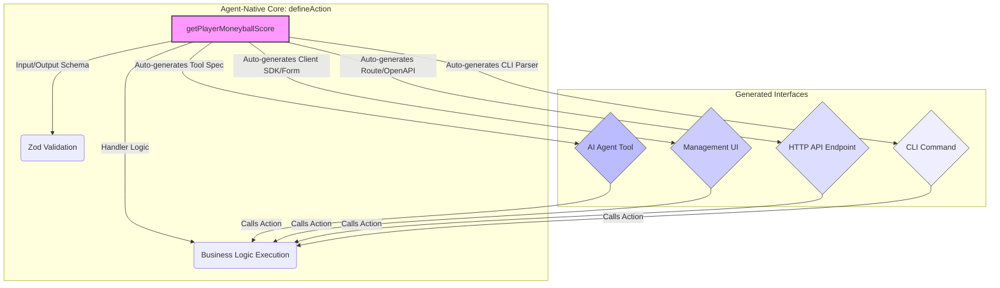

Agent-Native 프레임워크는 AI 에이전트와 기존 애플리케이션 기능을 통합하는 새로운 패러다임을 제시합니다. 핵심은 `defineAction`이라는 단일 추상화를 통해 애플리케이션의 특정 기능을 정의하고, 이를 사용자 인터페이스(UI), AI 에이전트 도구, HTTP API, CLI 등 다양한 접점에서 일관되게 호출할 수 있도록 하는 것입니다. 이 접근 방식은 기능 중복을 줄이고, 개발 효율성을 높이며, AI 에이전트가 실제 비즈니스 로직에 더 깊이 통합될 수 있는 기반을 마련합니다. 2026년 현재, AI 에이전트의 활용이 보편화됨에 따라, 이러한 통합 개발 경험은 생산성 향상의 핵심 요소로 부상하고 있습니다.

## 핵심 개념: `defineAction`을 통한 기능 통합

기존의 개발 방식에서는 UI 이벤트 핸들러, REST API 엔드포인트, 그리고 AI 에이전트의 도구 함수가 각각 별도로 구현되어 관리되었습니다. 이는 동일한 비즈니스 로직이 여러 곳에 분산되거나 중복 구현될 가능성을 높이며, 기능 변경 시 여러 지점을 수정해야 하는 비효율을 초래합니다. Agent-Native 프레임워크의 `defineAction`은 이러한 문제를 해결하기 위한 중앙 집중식 접근 방식입니다. 개발자는 애플리케이션이 수행할 수 있는 모든 작업을 단일 `Action`으로 정의하고, 프레임워크가 이 `Action`을 기반으로 다양한 인터페이스를 자동으로 생성하거나 통합합니다.

예를 들어, "Moneyballscore 연동"과 같은 핵심 워커 기능을 `defineAction`으로 구현하면, AI 에이전트는 이를 도구로 사용하여 스포츠 데이터 분석을 수행할 수 있고, 개발자는 관리 UI에서 이 기능을 직접 호출하여 결과를 확인할 수 있습니다. 이메일 답장 생성, 문서 요약, 데이터 조회 등 다양한 고수준 작업이 이 Action 정의를 통해 일관된 방식으로 처리될 수 있습니다. 이는 개발자가 AI 에이전트를 위한 새로운 기능을 만들 때마다 복잡한 툴링 레이어를 별도로 구축하는 부담을 덜어줍니다.

## 프로토타입 개발: Moneyballscore 연동 시나리오

Moneyballscore 연동 프로토타입은 Agent-Native 프레임워크의 가치를 명확히 보여줄 수 있습니다. "특정 선수의 Moneyballscore를 계산하고 기록하는" 액션을 `defineAction`으로 정의합니다. 이 정의는 입력 스키마, 출력 스키마, 그리고 실제 비즈니스 로직을 포함합니다.

### `defineAction` 코드 예제 (TypeScript-like)

```typescript
// src/actions/moneyballScore.ts
import { defineAction } from '@agent-native/core';
import { z } from 'zod'; // For input/output schema validation
import { calculateMoneyballScore } from '../services/moneyball';

export const getPlayerMoneyballScore = defineAction({
  name: 'GetPlayerMoneyballScore',
  description: 'Calculates the Moneyball score for a specific player based on their ID and optionally a season.',
  input: z.object({
    playerId: z.string().uuid().describe('Unique identifier for the player.'),
    season: z.number().int().min(1900).max(2100).optional().describe('Optional season year for score calculation. Defaults to current season if omitted.')
  }),
  output: z.object({
    score: z.number().describe('The calculated Moneyball score.'),
    rank: z.number().int().optional().describe('Optional rank of the player based on the score in their league.'),
    lastUpdated: z.string().datetime().describe('Timestamp of the last score calculation.')
  }),
  handler: async ({ playerId, season }) => {
    // 비즈니스 로직: 실제 Moneyballscore를 계산하거나 외부 서비스에서 가져옵니다.
    const { score, rank } = await calculateMoneyballScore(playerId, season);
    return { score, rank, lastUpdated: new Date().toISOString() };
  },
  // 프레임워크가 이 Action으로부터 자동으로 생성할 수 있는 추가 메타데이터
  http: {
    method: 'GET',
    path: '/players/{playerId}/moneyball-score'
  },
  cli: {
    command: 'moneyball-player-score',
    description: 'Retrieve Moneyball score for a player.'
  },
  agentTool: {
    name: 'moneyball_player_score_tool',
    description: 'Tool to get Moneyball score for a player.'
  }
});

// src/services/moneyball.ts (예시)
export async function calculateMoneyballScore(playerId: string, season?: number) {
  // 실제 스코어 계산 로직 (데이터베이스 조회, 통계 계산 등)
  console.log(`Calculating score for player ${playerId} in season ${season || 'current'}`);
  return { score: Math.random() * 100, rank: Math.floor(Math.random() * 50) + 1 };
}
```

이 `defineAction`을 통해 Moneyballscore 계산 기능은 다음과 같이 활용될 수 있습니다:

*   **AI 에이전트 도구**: 에이전트가 사용자 질의(예: "X 선수의 지난 시즌 Moneyballscore 알려줘")를 이해하면, 이 `getPlayerMoneyballScore` 액션을 도구로 호출하여 필요한 정보를 얻습니다.
*   **관리 UI**: 대시보드에서 관리자가 특정 선수의 ID를 입력하여 수동으로 Moneyballscore를 조회하고 싶을 때, UI 컴포넌트가 이 액션을 직접 호출합니다.
*   **HTTP API**: 외부 시스템이나 모바일 앱에서 특정 선수의 Moneyballscore를 조회하기 위해 `/api/players/{playerId}/moneyball-score` 엔드포인트를 호출할 수 있습니다.
*   **CLI**: 개발자나 운영자가 터미널에서 `moneyball-player-score --playerId <UUID> --season 2025` 명령어를 실행하여 스코어를 조회할 수 있습니다.

이러한 통합 방식은 개발자가 여러 플랫폼에 걸쳐 동일한 비즈니스 로직을 일관되게 제공하는 데 드는 오버헤드를 크게 줄여줍니다.

## Agent-Native 프레임워크의 동작 원리

Agent-Native 프레임워크는 `defineAction`으로 정의된 메타데이터를 활용하여 다양한 소비자(Consumers)를 위한 인터페이스를 생성합니다. 이는 일반적으로 코드 생성(Code Generation) 또는 런타임 추상화(Runtime Abstraction)를 통해 이루어집니다.

*   **API Gateway Integration**: `http` 메타데이터를 기반으로 API Gateway (예: AWS API Gateway, Vercel Edge Functions) 라우팅을 자동 설정하거나, OpenAPI 스펙을 생성하여 API 문서를 자동화합니다.
*   **Agent Tool Generation**: `name` 및 `description`과 `input` 스키마를 사용하여 LangChain, OpenAI Functions 등 에이전트 프레임워크에서 사용할 수 있는 Tool 정의를 자동으로 생성합니다.
*   **UI Component Scaffolding**: `input` 스키마를 기반으로 폼 컴포넌트를 자동으로 생성하거나, 액션 호출을 위한 클라이언트 측 SDK를 제공합니다.
*   **CLI Command Registration**: `cli` 메타데이터를 사용하여 CLI 애플리케이션의 서브커맨드와 인자 파싱을 자동화합니다.

이러한 과정은 개발자가 각 플랫폼별로 반복적인 보일러플레이트 코드를 작성하는 대신, 핵심 비즈니스 로직에 집중할 수 있도록 지원합니다.



## 트레이드오프

*   **개발 속도 및 일관성**: 이점: 단일 정의로 여러 접점 지원, 코드 중복 감소, AI 에이전트 통합 용이. 단점: 초기 프레임워크 학습 곡선이 존재하며, 모든 액션을 프레임워크에 맞춰 정의해야 하는 강제성이 있습니다. 언제 좋고/언제 나쁜지: 복잡한 애플리케이션에서 많은 기능을 AI 에이전트 및 다양한 인터페이스에 노출해야 할 때 탁월하며, 소규모 단일 목적 애플리케이션에서는 오버헤드일 수 있습니다.
*   **프레임워크 종속성**: 이점: 프레임워크가 제공하는 강력한 추상화와 자동화 기능을 활용할 수 있습니다. 단점: 특정 프레임워크에 대한 종속성이 높아져, 나중에 다른 프레임워크로 전환하기 어려울 수 있습니다. 언제 좋고/언제 나쁜지: 장기적인 관점에서 AI 에이전트 중심의 아키텍처를 지향하고, 개발 표준화를 꾀할 때 유리하며, 유연성과 커스텀 확장이 최우선인 경우에는 제약이 될 수 있습니다.
*   **성능 및 복잡성**: 이점: 잘 설계된 프레임워크는 최적화된 코드 생성 및 런타임 환경을 제공할 수 있습니다. 단점: 프레임워크 자체의 추상화 레이어가 런타임 오버헤드를 발생시키거나, 디버깅을 복잡하게 만들 수 있습니다. 언제 좋고/언제 나쁜지: 대부분의 비즈니스 로직에서 성능 오버헤드가 미미하며 개발 편의성이 더 중요할 때 좋고, 극도로 낮은 레이턴시나 하드웨어 직접 제어가 필요한 경우에는 신중한 검토가 필요합니다.
*   **유연성 vs. 규격화**: 이점: 모든 액션이 일관된 방식으로 정의되므로, 팀 내 개발 표준을 강화하고 새로운 팀원 온보딩을 가속화합니다. 단점: 프레임워크가 제공하는 범위 밖의 매우 특수한 요구사항이나 비표준 인터페이스를 통합하기 어려울 수 있습니다. 언제 좋고/언제 나쁜지: 대부분의 일반적인 CRUD 및 비즈니스 로직 액션에 적합하며, 매우 특수하고 동적인 인터페이스 요구사항이 빈번한 경우에는 프레임워크의 유연성 한계를 고려해야 합니다.

## 실전 체크리스트

Agent-Native 프레임워크 도입을 검토할 때 다음 사항을 확인해야 합니다:

- [ ] **핵심 워커 기능 정의**: Moneyballscore 연동과 같이 AI 에이전트와 UI에서 공통으로 활용할 핵심 `defineAction` 목록을 5개 이상 정의했는가?
- [ ] **AI 에이전트 도구 연동 테스트**: `defineAction`으로 정의된 액션이 AI 에이전트 프레임워크(예: LangChain, OpenAI Assistant API)에서 정상적인 도구로 인식되고 호출되는지 검증했는가?
- [ ] **관리 UI 통합 프로토타입**: `defineAction`을 활용하여 Moneyballscore 조회/변경 기능을 포함하는 관리 UI 컴포넌트 프로토타입을 성공적으로 구현하고 연동했는가?
- [ ] **성능 오버헤드 측정**: `defineAction` 레이어를 통한 액션 호출이 기존 API 호출 대비 허용 가능한 수준의 레이턴시 및 리소스 오버헤드를 가지는지 측정하고 기록했는가?
- [ ] **개발자 경험 평가**: `defineAction`을 사용하는 개발 프로세스가 기존 방식보다 더 효율적이고 직관적인지, 그리고 새로운 액션 정의에 대한 진입 장벽이 낮은지 팀원 피드백을 수렴했는가?
- [ ] **보안 및 접근 제어 통합**: `defineAction`으로 정의된 각 액션에 대한 인증(Authentication) 및 권한 부여(Authorization) 메커니즘이 프레임워크 수준에서 효과적으로 통합될 수 있는지 확인했는가?
- [ ] **데이터 유효성 검사 및 오류 처리**: `input` 스키마를 통한 자동 유효성 검사가 예상대로 동작하며, 액션 실행 중 발생하는 오류가 일관된 방식으로 처리되고 사용자/에이전트에게 전달되는지 테스트했는가?