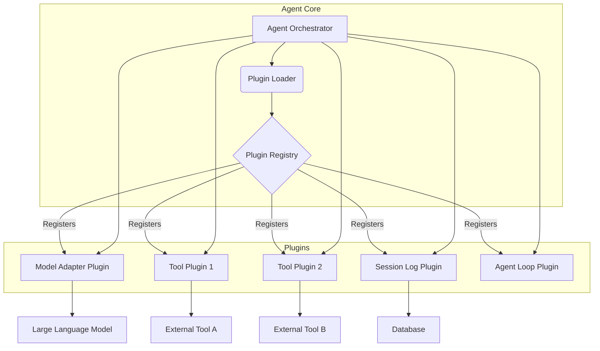

## Agent Plugin Architecture: Modular Design for Extensible AI Systems

Recent advancements, exemplified by open-source coding agents like DeepSeek Harness, introduce a powerful architectural paradigm: "Everything is a Plugin." This approach shifts away from modifying fixed core components directly. Instead, elements such as Model Adapters, Tools, Session Logs, and even the Agent Loop itself are structured as plugins, allowing the agent's behavior and execution environment to be assembled dynamically. This document explores how a plugin architecture maximizes the flexibility and extensibility of AI agents.

### Why Plugin Architecture?

AI agent systems must effectively integrate and manage rapidly evolving LLMs (Large Language Models) and diverse external tools. A fixed architecture often leads to inefficiencies, requiring extensive system modifications whenever a new model is released or a specific tool is needed. Plugin architecture offers a robust solution to these challenges:

1.  **Flexibility**: It allows for the runtime replacement or addition of functionalities, independent of specific models or tools. For instance, within a Claude Code harness, an agent's Model Adapter for a particular workflow can be easily swapped from Claude 3.5 to Claude 5 or Gemini Flash.
2.  **Extensibility**: New features or tools can be added as plugins, making it easy to extend the system. This is crucial for keeping agent functionalities up-to-date in the fast-paced AI ecosystem.
3.  **Modularity**: Each component operates as an independent module, simplifying development, testing, and maintenance. Plugins have clear interfaces, minimizing their impact on other components.
4.  **Reusability**: Once developed, plugins can be reused across different agent systems or workflows, enhancing development efficiency.

### Principles of Plugin Architecture Design

Key design principles for implementing the 'Everything is a Plugin' concept include:

*   **Interface-Driven Design**: All plugin types (Model Adapter, Tool, Agent Loop, etc.) must define clear and consistent interfaces. This ensures the core system interacts with plugins through these interfaces, without being coupled to specific implementations.
*   **Runtime Loading**: Plugins should be dynamically loadable at application startup or as needed. This can be achieved using mechanisms like Go's `plugin` package or Python's `importlib`.
*   **Dependency Injection**: Any dependencies a plugin requires (e.g., configuration, other service instances) should be injected by the core system. This maintains plugin independence and improves testability.

### Go Example for Agent Tool Plugins

The following Go example demonstrates a simple agent tool plugin architecture. It defines a `Tool` interface and dynamically loads `CodeAnalyzer` and `IssueTracker` plugins that implement this interface.

```go
// plugin/tool.go
package plugin

import "fmt"

// Tool interface definition
type Tool interface {
	Name() string
	Description() string
	Execute(args map[string]interface{}) (string, error)
}

// RegisteredTools global map to hold registered plugins
var RegisteredTools = make(map[string]Tool)

func RegisterTool(tool Tool) {
	RegisteredTools[tool.Name()] = tool
	fmt.Printf("Tool '%s' registered.\n", tool.Name())
}
```

```go
// plugins/code_analyzer.go
package main

import (
	"fmt"
	"plugin_arch/plugin" // Adjust path to your project structure
)

// CodeAnalyzer implements the Tool interface
type CodeAnalyzer struct{}

func (ca *CodeAnalyzer) Name() string {
	return "CodeAnalyzer"
}

func (ca *CodeAnalyzer) Description() string {
	return "Analyzes code for potential issues and suggests improvements."
}

func (ca *CodeAnalyzer) Execute(args map[string]interface{}) (string, error) {
	code, ok := args["code"].(string)
	if !ok {
		return "", fmt.Errorf("missing 'code' argument")
	}
	fmt.Printf("Analyzing code: %s\n", code)
	// Simulate code analysis logic (e.g., AST parsing, static analysis)
	return "Code analysis complete: Potential bug in line 23. Suggest refactor.", nil
}

// init function is called by the Go plugin system to register the tool
func init() {
	plugin.RegisterTool(&CodeAnalyzer{})
}
```

```go
// plugins/issue_tracker.go
package main

import (
	"fmt"
	"plugin_arch/plugin" // Adjust path to your project structure
)

// IssueTracker implements the Tool interface
type IssueTracker struct{}

func (it *IssueTracker) Name() string {
	return "IssueTracker"
}

func (it *IssueTracker) Description() string {
	return "Creates and manages issues in an issue tracking system."
}

func (it *IssueTracker) Execute(args map[string]interface{}) (string, error) {
	title, ok := args["title"].(string)
	if !ok {
		return "", fmt.Errorf("missing 'title' argument")
	}
	description, ok := args["description"].(string)
	if !ok {
		return "", fmt.Errorf("missing 'description' argument")
	}
	fmt.Printf("Creating issue: %s - %s\n", title, description)
	// Simulate actual issue tracking system integration
	return fmt.Sprintf("Issue '%s' created with ID: #12345", title), nil
}

// init function is called by the Go plugin system to register the tool
func init() {
	plugin.RegisterTool(&IssueTracker{})
}
```

```go
// main.go (Agent Core)
package main

import (
	"fmt"
	"plugin"
	"plugin_arch/plugin" // Package containing plugin interface and registration func
	"log"
)

func main() {
	// Load plugins (in a real environment, dynamic path or config file loading)
	// Go plugins require compiled .so files at build time.
	// Build with: `go build -buildmode=plugin -o plugins/code_analyzer.so plugins/code_analyzer.go`
	// And: `go build -buildmode=plugin -o plugins/issue_tracker.so plugins/issue_tracker.go`
	
	pluginPaths := []string{
		"plugins/code_analyzer.so",
		"plugins/issue_tracker.so",
	}

	for _, pPath := range pluginPaths {
		_, err := plugin.Open(pPath)
		if err != nil {
			log.Printf("Error loading plugin %s: %v", pPath, err)
			// In production, robust error handling strategy is necessary
		}
	}

	// Agent logic utilizing loaded plugins (Tools)
	fmt.Println("\n--- Agent utilizing plugins ---")

	if caTool, ok := plugin.RegisteredTools["CodeAnalyzer"]; ok {
		result, err := caTool.Execute(map[string]interface{}{
			"code": "func main() { /* ... */ }",
		})
		if err != nil {
			log.Println("Error executing CodeAnalyzer:", err)
		} else {
			fmt.Println("CodeAnalyzer Result:", result)
		}
	} else {
		fmt.Println("CodeAnalyzer plugin not found.")
	}

	if itTool, ok := plugin.RegisteredTools["IssueTracker"]; ok {
		result, err := itTool.Execute(map[string]interface{}{
			"title":       "Refactor main function",
			"description": "The main function needs refactoring due to high complexity.",
		})
		if err != nil {
			log.Println("Error executing IssueTracker:", err)
		} else {
			fmt.Println("IssueTracker Result:", result)
		}
	} else {
		fmt.Println("IssueTracker plugin not found.")
	}
}
```

In this example, `main.go` can invoke `CodeAnalyzer` and `IssueTracker` via the `plugin.Tool` interface without needing to know their concrete implementations. This demonstrates how new tools can be added or existing ones modified, extending the agent's functionality without altering the `main.go` codebase.

### Architecture Diagram



The diagram above illustrates how the Agent Core, through a Plugin Loader, registers and utilizes various plugins. Each plugin exists as an independent component, and the core interacts with them via interfaces.

### Reflecting 2026 Trends

AI agent development in 2026 demands increasingly diverse and complex interactions. A plugin architecture is a core strategy for addressing these trends:

*   **Multimodality**: With the advent of agents processing various modalities like text, image, and voice, specialized plugins (e.g., Image Captioning Plugin, Speech-to-Text Plugin) can be flexibly added to handle modal-specific inputs and outputs.
*   **Specialized Agents**: When an agent needs to be optimized for a specific domain or task, plugins encapsulating that domain knowledge and interaction patterns can be rapidly developed and deployed.
*   **Enhanced Autonomy**: By plugin-izing the Agent Loop itself, decision-making processes, planning strategies, and self-correction mechanisms can be dynamically swapped, allowing for experimentation and optimization of agent autonomy.
*   **Real-time Adaptation & Learning**: The ability to monitor agent behavior at runtime and, when necessary, activate learning or optimization plugins enables real-time improvement of system performance.

## 트레이드오프

Agent Plugin Architecture offers significant advantages, but its adoption requires considering inherent tradeoffs.

*   **Flexibility vs. Increased Complexity**:
    *   **언제 좋은가 (When Good)**: When a system needs to support diverse LLMs, tools, and workflows, and must adapt to rapid changes. Separating core logic from specific implementations can reduce long-term maintenance costs.
    *   **언제 나쁜가 (When Bad)**: For simple, fixed-function agent systems, excessive abstraction and indirect calls can introduce unnecessary complexity and overhead. Initial development costs may increase.
*   **Extensibility vs. Performance Overhead**:
    *   **언제 좋은가 (When Good)**: When system functionalities are expected to be continuously added or changed. Especially in cases where runtime dynamic loading is required (like Go's `plugin` package), features can be extended without system restarts.
    *   **언제 나쁜가 (When Bad)**: Plugin loading and dynamic dispatch can introduce a slight runtime overhead compared to statically linked code. For environments demanding extreme low-latency (sub-millisecond), careful performance analysis is necessary.
*   **Modularity/Reusability vs. Dependency Management**:
    *   **언제 좋은가 (When Good)**: When individual plugins can have independent development cycles, facilitating parallel work by multiple teams, and when developed plugins have high potential for reuse in other projects.
    *   **언제 나쁜가 (When Bad)**: If inter-plugin dependencies become complex, managing versions, compatibility issues, and resolving dependency conflicts can be challenging. Changes to a plugin interface can affect all implementations, requiring careful management.
*   **Isolation vs. Runtime Safety**:
    *   **언제 좋은가 (When Good)**: If an error occurs in a plugin, it can be replaced or disabled without affecting the entire core system, thereby increasing system resilience.
    *   **언제 나쁜가 (When Bad)**: Dynamically loaded plugins can pose potential security risks. Without robust mechanisms to verify plugin origin and integrity, there's a risk of malicious code injection. Establishing a sandbox environment is crucial.

## 실전 체크리스트

When implementing an Agent Plugin Architecture in a real project, the following items should be verified and applied:

- [ ] **플러그인 인터페이스 정의 명확성 (Clarity of Plugin Interface Definition)**: Are the interfaces for core Agent Loop, Model Adapter, Tool, and other plugin types clearly defined and designed with future extensibility in mind? (e.g., consistent input/output types for `Execute` methods)
- [ ] **동적 로딩 메커니즘 구현 (Dynamic Loading Mechanism Implementation)**: Is the dynamic loading mechanism (e.g., Go's `plugin` package, Python's `importlib`) operating stably, and does it ensure system stability during runtime plugin addition/removal?
- [ ] **의존성 주입 전략 수립 (Dependency Injection Strategy Establishment)**: Is a mechanism in place for the core system to securely inject external resources (e.g., configurations, loggers, database clients) required by plugins? (e.g., constructor injection, setter injection)
- [ ] **버전 관리 및 호환성 전략 (Version Management and Compatibility Strategy)**: Is a versioning policy (e.g., Semantic Versioning) established to maintain compatibility with existing plugins when plugin interfaces change?
- [ ] **성능 벤치마킹 및 최적화 (Performance Benchmarking and Optimization)**: Has performance benchmarking been conducted for key workflows to ensure that runtime overhead from plugin loading and execution is within acceptable limits? If necessary, have caching or asynchronous processing strategies been applied?
- [ ] **보안 및 샌드박싱 (Security and Sandboxing)**: Are sandbox environments (e.g., containerization) or privilege management mechanisms established to prevent potential security vulnerabilities when executing external plugins?
- [ ] **테스트 자동화 (Test Automation)**: Are unit, integration, and E2E tests for each plugin and the entire integrated agent system automated to prevent regressions when new plugins are added?