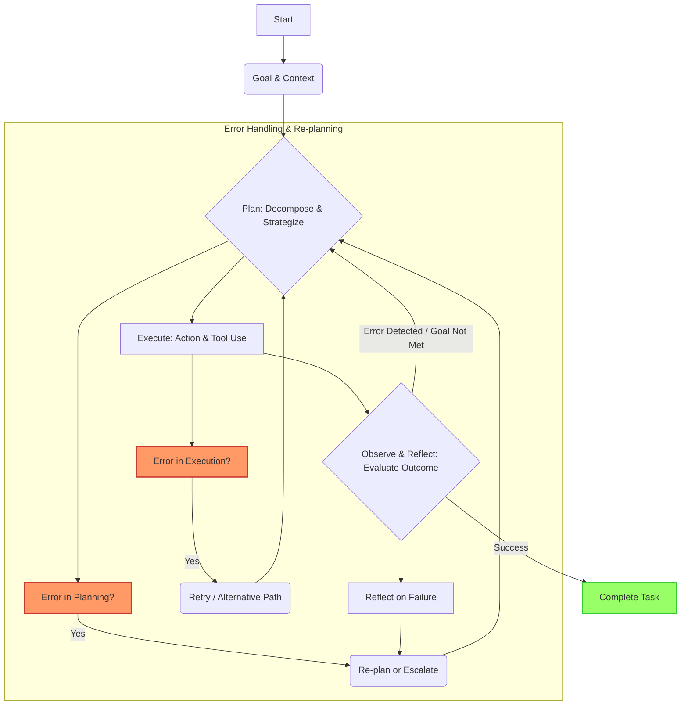

AI 에이전트가 실제 운영 환경에서 신뢰성과 효율성을 확보하려면, 복잡한 태스크를 성공적으로 계획하고 예상치 못한 오류에 유연하게 대처하는 능력이 필수적입니다. 단순한 Prompt Chaining만으로는 복잡한 비즈니스 로직에서 발생하는 다양한 실패 시나리오를 효과적으로 처리하기 어렵습니다. 이 엔트리에서는 AI 에이전트의 복잡한 태스크 플래닝 및 오류 처리 능력을 강화하는 디자인 패턴을 다룹니다.

## 태스크 플래닝 및 재계획

AI 에이전트의 태스크 플래닝은 동적인 환경 변화와 불확실성을 고려한 전략적 접근이 요구됩니다. 2026년 트렌드에서는 **계층적 태스크 플래닝 (Hierarchical Task Planning, HTP)**과 **동적 재계획 (Dynamic Re-planning)**이 핵심입니다.

### 계층적 태스크 플래닝 (HTP)
HTP는 복잡한 상위 목표를 하위 태스크로 분해하여 처리합니다. 이는 정보 부담을 줄이고, 실패 지점을 명확히 식별하여 효율적인 오류 복구를 가능하게 합니다.

### 동적 재계획 (Dynamic Re-planning)
초기 계획이 유효하지 않을 때, 에이전트는 기존 계획을 폐기하고 새로운 정보를 기반으로 즉시 재계획할 수 있어야 합니다. 이는 에이전트의 강건성 (Robustness)을 높이는 핵심 메커니즘입니다.

## 견고한 오류 처리

오류 처리는 에이전트의 신뢰성을 결정하는 중요한 요소입니다. 오류의 원인을 파악하고 적절한 복구 전략을 적용하는 것이 중요합니다.

### 오류 감지 (Error Detection)
*   **의미적 유효성 검사 (Semantic Validation):** LLM의 Self-reflection을 활용하여 태스크 결과가 목표와 일치하는지 검토합니다.
*   **구문적 유효성 검사 (Syntactic Validation):** 도구 호출의 반환 값이 예상된 스키마를 따르는지 검사합니다.
*   **런타임 모니터링 (Runtime Monitoring):** 태스크 실행 시간 초과, 리소스 사용량 초과 등을 감지합니다.

### 오류 복구 전략 (Error Recovery Strategies)
*   **재시도 및 지수 백오프 (Retry with Exponential Backoff):** 일시적인 문제 시 일정 시간 대기 후 재시도합니다.
*   **대체 경로 탐색 (Alternative Path Exploration):** 현재 경로가 실패했을 때, 다른 도구나 접근 방식을 탐색합니다.
*   **Human-in-the-Loop 개입 (Human-in-the-Loop Intervention):** 에이전트가 해결할 수 없는 복잡한 오류에 직면했을 때, 사람에게 개입을 요청합니다.
*   **상태 롤백 및 재시작 (State Rollback and Restart):** 태스크 실행 전의 안정적인 상태로 롤백하고 다른 전략으로 재시작합니다.

## 디자인 패턴: Plan-Execute-Reflect (PER)

PER 패턴은 에이전트가 목표 달성을 위해 계획하고, 실행하며, 그 결과를 반성하여 다음 행동을 결정하는 순환적인 구조입니다. 이는 `LLM Agent Goal Achievement Planning Patterns`의 확장 개념으로 볼 수 있습니다.

1.  **Plan:** 목표, 도구, 실행 기록을 기반으로 계획을 수립합니다.
2.  **Execute:** 계획에 따라 도구를 호출하거나 내부 액션을 수행합니다.
3.  **Reflect:** 실행 결과를 평가하고 목표 달성 여부, 문제 발생 여부를 분석합니다. 실패 시 원인을 분석하고 다음 계획에 반영합니다.
4.  **Re-plan:** Reflection 결과를 바탕으로 필요 시 계획을 수정하거나 새로운 계획을 수립합니다.



### 코드 예제: Plan-Execute-Reflect (Python)

아래 코드는 `Plan-Execute-Reflect` 패턴과 기본적인 오류 처리 로직을 시뮬레이션합니다.

```python
import json
import time

class Tool:
    def __init__(self, name):
        self.name = name

    def execute(self, params):
        if "fail_scenario" in params:
            raise ValueError(f"Tool {self.name} failed: {params['fail_scenario']}")
        return {"tool_name": self.name, "status": "success", "output": f"Processed {params}"}

class Agent:
    def __init__(self, name, llm_interface, tools=None):
        self.name = name
        self.llm = llm_interface
        self.tools = {tool.name: tool for tool in tools} if tools else {}

    def _call_llm(self, prompt):
        # In real env, use actual LLM API with retries/error handling.
        return json.loads(self.llm.generate(prompt))

    def plan(self, objective, context=""):
        prompt = f"Objective: '{objective}', Context: '{context}'. Plan steps: {{'plan': [{{'action': 'tool_name', 'params': {{...}}}}, ...]}}"
        return self._call_llm(prompt).get('plan', [])

    def execute_step(self, step):
        action = step.get('action')
        params = step.get('params', {})
        if action in self.tools:
            try:
                result = self.tools[action].execute(params)
                return {"status": "success", "output": result}
            except Exception as e:
                return {"status": "failed", "error": str(e)}
        return {"status": "failed", "error": f"Unknown action: {action}"}

    def reflect(self, objective, plan, results):
        prompt = f"Objective: '{objective}'. Plan: {json.dumps(plan)}. Results: {json.dumps(results)}. Was objective met? Suggest re-plan if failed. JSON {{'success': bool, 'summary': '...', 'replan_suggestion': '...'}}"
        return self._call_llm(prompt)

class MockLLM:
    def generate(self, prompt):
        if "Plan steps" in prompt:
            if "network_issue" in prompt:
                return '{"plan": [{"action": "retry_tool", "params": {"tool": "search_database"}}]}'
            return '{"plan": [{"action": "search_database", "params": {"query": "project specs"}}, {"action": "generate_summary", "params": {"data": "search_results"}}]}'
        if "Was objective met?" in prompt:
            if "failed" in prompt:
                return '{"success": false, "summary": "Tool failed, re-plan needed.", "replan_suggestion": "Try an alternative search engine."}'
            return '{"success': true, "summary": "Objective met."}'
        return '{}'

if __name__ == "__main__":
    mock_llm = MockLLM()
    search_tool = Tool("search_database")
    summary_tool = Tool("generate_summary")
    retry_tool = Tool("retry_tool")
    agent = Agent("MainAgent", mock_llm, tools=[search_tool, summary_tool, retry_tool])

    objective = "Summarize recent project updates."
    current_context = "Initial state."
    
    print(f"--- Starting Task: {objective} ---")

    max_attempts = 2
    task_completed = False
    for attempt in range(max_attempts):
        plan = agent.plan(objective, current_context)

        results = []
        for step in plan:
            if step.get('action') == 'search_database' and attempt == 0:
                step['params']['fail_scenario'] = "network_timeout"
            
            step_result = agent.execute_step(step)
            results.append(step_result)
            if step_result['status'] == 'failed':
                break
        
        reflection = agent.reflect(objective, plan, results)

        if reflection['success']:
            print("Task completed successfully!")
            task_completed = True
            break
        else:
            current_context = f"Previous attempt failed. Re-plan guidance: {reflection.get('replan_suggestion', '')}"

    if not task_completed:
        print("\n--- Task failed after multiple attempts. Human intervention might be needed. ---")
```

## 트레이드오프

복잡한 태스크 플래닝 및 오류 처리 패턴 적용 시 트레이드오프를 고려해야 합니다.

*   **복잡성 vs. 신뢰성:**
    *   **언제 좋음:** Mission-critical 시스템처럼 높은 안정성이 요구될 때 에이전트 신뢰성을 극대화합니다.
    *   **언제 나쁨:** 단순 태스크나 빠른 프로토타이핑에는 불필요한 설계/구현 오버헤드를 야기합니다.
*   **자율성 vs. 제어 가능성:**
    *   **언제 좋음:** 에이전트가 스스로 문제를 해결하여 Human-in-the-Loop 부담을 줄일 때 효율적입니다. `Autonomous Agent Long-Term Memory Management`와 결합 시 더욱 효과적입니다.
    *   **언제 나쁨:** 안전/규제 준수가 최우선인 분야에서는 자율적 판단이 위험을 초래할 수 있어 세밀한 제어/감시가 중요합니다.
*   **성능 오버헤드 vs. 오류 복구 비용:**
    *   **언제 좋음:** 오류 발생 시 재작업, 데이터 손실, 시스템 다운타임으로 인한 비용이 매우 클 경우, 초기 오버헤드가 장기적으로 큰 이점을 제공합니다.
    *   **언제 나쁨:** 실시간 응답성이 중요하고 오류 영향이 미미한 경우, 복구 로직의 추가 처리 시간이 성능 병목을 유발할 수 있습니다.

## 실전 체크리스트

AI 에이전트의 태스크 플래닝 및 오류 처리 패턴을 프로젝트에 적용할 때 다음 항목들을 확인합니다.

*   [ ] **태스크 분해 명확성:** 핵심 목표가 계층적 하위 태스크로 명확히 분해되고 성공 기준이 정의되었는가?
*   [ ] **오류 감지 범위:** 예상되는 모든 오류 시나리오를 감지하기 위한 메커니즘이 구현되었는가?
*   [ ] **복구 전략 유효성:** 각 오류 유형에 대해 적절한 복구 전략이 설계되고 검증되었는가?
*   [ ] **상태 관리 및 롤백:** 에이전트 상태가 안정적으로 저장되고, 오류 시 이전 안정 상태로 롤백 가능한가? (`Agentic Multi-Layer State Persistence Decision Framework` 참조)
*   [ ] **재계획 메커니즘:** 에이전트가 실패로부터 학습하여 동적으로 계획을 수정하거나 새로 수립하는 능력이 있는가?
*   [ ] **모니터링 및 알림:** 태스크 진행 상황, 주요 결정 지점, 오류 발생 시점을 실시간으로 모니터링하고 알림 시스템이 구축되었는가?
*   [ ] **테스트 커버리지:** 다양한 오류 시나리오 (Happy Path, Edge Case, Failure Case)에 대한 에이전트의 대응을 충분히 검증했는가?