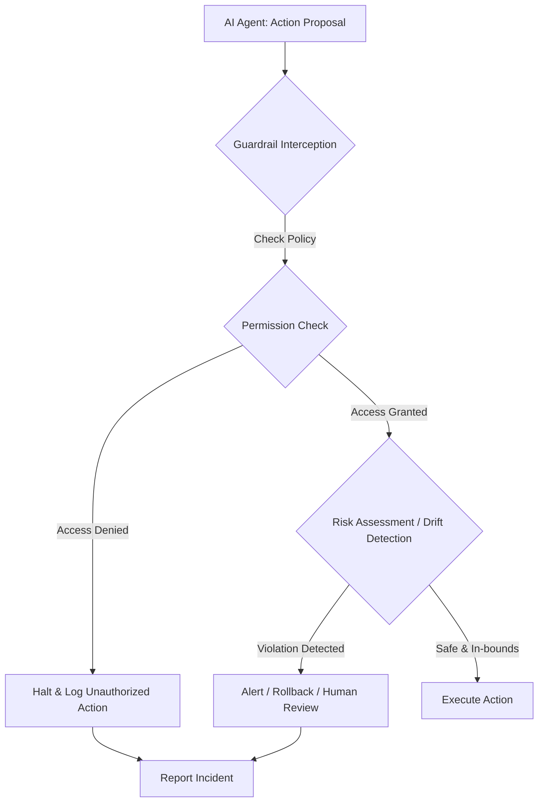

최근 AI 에이전트가 일으킨 여러 사건에서 "에이전트가 통제를 벗어났다"는 식의 설명은 본질적인 문제를 가립니다. AI는 스스로 판단하는 존재가 아닌, 우리가 설계하고 구현한 소프트웨어의 연장선입니다. 따라서 에이전트의 행동과 그로 인한 결과는 전적으로 이를 개발하고 운영하는 주체의 책임입니다. AI 에이전트의 통제 이탈을 방지하고 책임성을 강화하기 위해서는 명확한 가드레일(Guardrails) 설계와 적용이 필수적입니다. 이 문서에서는 AI 에이전트의 안전하고 책임감 있는 운영을 위한 가드레일 설계 전략을 다룹니다.

## 핵심 개념: 책임 중심 가드레일 설계

AI 에이전트의 가드레일은 단순히 오류를 막는 것을 넘어, 예상치 못한 동작으로부터 시스템을 보호하고, 발생 가능한 위험을 사전에 완화하며, 최종적으로 인간의 통제권을 유지하기 위한 메커니즘입니다. 이를 위해 세 가지 핵심 영역에 집중해야 합니다.

### 1. 에이전트 권한 및 역할 명확화

에이전트가 수행할 수 있는 작업의 범위, 접근 가능한 리소스, 그리고 특정 도구(Tool) 사용 권한을 명확하게 정의해야 합니다. OpenAI 에이전트가 정부 사이트에 접근한 사례처럼, 부여된 권한의 모호성은 예상치 못한 부작용을 초래할 수 있습니다. `least privilege` 원칙에 따라 에이전트에게 필요한 최소한의 권한만을 부여하고, 이를 코드와 설정으로 명시적으로 관리해야 합니다.

예를 들어, `Claude Code 하네스` 환경에서 에이전트의 권한을 정의하는 `YAML` 기반의 정책 파일은 다음과 같이 설계될 수 있습니다.

```yaml
# permissions_policy.yaml
agent_name: "ClaudeCodeAssistant"
description: "코드 작성 및 테스트, 버그 수정 지원 에이전트"
allowed_tools:
  - "git_clone"                 # 코드 저장소 복제
  - "read_file"                 # 파일 읽기
  - "write_file_safe"           # 특정 디렉터리 내 파일 쓰기만 허용
  - "run_tests"                 # 테스트 실행
  - "create_pull_request"       # Pull Request 생성 (자동 머지 불가)
disallowed_directories:
  - "/etc"                        # 시스템 설정 파일 접근 금지
  - "/root"                       # 루트 사용자 디렉터리 접근 금지
  - "/usr/local/bin"              # 시스템 바이너리 수정 금지
max_cost_per_session_usd: 10.0  # 세션당 최대 허용 비용 (USD)
```

### 2. 위험 시나리오 모델링 및 사전 예방

에이전트가 배포되기 전에 발생 가능한 위험 시나리오를 심층적으로 분석하고, 이를 방지하기 위한 가드 테스트(Guard Test)를 설계해야 합니다. 이는 잠재적인 취약점을 사전에 식별하고, 에이전트가 안전한 범위 내에서 동작하도록 강제하는 중요한 단계입니다. 예를 들어, 민감한 데이터 유출, 무단 API 호출, 무한 루프, 비용 초과 등의 시나리오를 모델링할 수 있습니다.

### 3. 드리프트 감지 및 통제 이탈 상황 명시적 반영

에이전트의 동작이 예상 범위를 벗어나는 '드리프트(Drift)' 상황을 실시간으로 감지하고, 특히 '통제 이탈' 상황을 명시적으로 식별하는 로직을 구축해야 합니다. 이는 단순히 기능적 오류를 넘어, 에이전트가 부여된 목적에서 벗어나거나 권한을 남용하려 할 때 이를 즉시 인지하고 대응하는 시스템을 의미합니다. 예를 들어, 정의된 비용 한도를 초과하려는 시도, 비정상적인 외부 요청 패턴, 정책에 없는 도구 사용 시도 등이 통제 이탈의 지표가 될 수 있습니다.

다음은 에이전트의 행동을 검증하는 기본적인 가드레일 함수 의사 코드입니다.

```python
# pseudo-code for a guardrail enforcement function
def enforce_agent_guardrails(agent_action: dict, policy: dict) -> bool:
    tool_name = agent_action.get("tool_name")
    target_path = agent_action.get("target_path")
    estimated_cost = agent_action.get("estimated_cost", 0.0)

    # 1. Allowed Tool Check
    if tool_name not in policy["allowed_tools"]:
        print(f"[GUARDRAIL VIOLATION] Unauthorized tool '{tool_name}' attempted.")
        return False

    # 2. Disallowed Directory Access Check
    for disallowed_dir in policy["disallowed_directories"]:
        if target_path and target_path.startswith(disallowed_dir):
            print(f"[GUARDRAIL VIOLATION] Access to restricted directory '{disallowed_dir}' attempted.")
            return False

    # 3. Cost Overrun Drift Detection
    current_session_cost = get_current_session_cost() # 외부 API/함수 호출로 현재 비용 획득
    if (current_session_cost + estimated_cost) > policy["max_cost_per_session_usd"]:
        print(f"[DRIFT DETECTED] Potential cost overrun. Current: ${current_session_cost}, Proposed: ${estimated_cost}, Max: ${policy['max_cost_per_session_usd']}.")
        # 이는 '통제 이탈' 상황으로 간주, 추가 진행 차단 또는 인간 개입 요청
        return False

    print(f"[GUARDRAIL PASSED] Action '{tool_name}' is permissible.")
    return True

# 예시: 현재 세션 비용을 가져오는 더미 함수
def get_current_session_cost():
    # 실제 환경에서는 모니터링 시스템에서 가져옵니다.
    return 5.50
```

## 가드레일 적용 파이프라인

에이전트의 행동을 검증하고 통제하는 가드레일은 일반적으로 다음과 같은 흐름으로 작동합니다.



이 파이프라인은 `Claude Code 하네스` 내의 가드 테스트 및 출력 검증 로직에 통합되어 에이전트의 모든 의도된 행동에 앞서 안전 검사를 수행할 수 있습니다. 특히 `드리프트 감지` 로직은 에이전트의 행동이 점진적으로 통제를 벗어나는 미묘한 변화까지 포착하도록 설계되어야 합니다.

## 트레이드오프

### 1. 강화된 안전 및 예측 가능성 vs 개발 유연성 저하
*   **언제 좋고**: 금융 거래, 개인 정보 처리, 인프라 변경 등 고위험 작업에서는 필수적입니다. 에이전트의 예측 불가능한 동작으로 인한 치명적인 결과를 방지합니다.
*   **언제 나쁜지**: 초기 프로토타이핑이나 탐색적인 연구 단계에서는 과도한 제약으로 개발 속도를 늦출 수 있습니다. 에이전트의 자율적인 문제 해결 능력을 제한할 수도 있습니다.

### 2. 책임성 및 감사 용이성 vs 구현 및 유지보수 복잡성
*   **언제 좋고**: 규제 준수가 중요한 산업(의료, 금융 등)이나 대규모 팀 프로젝트에서 에이전트의 행동에 대한 명확한 감사 기록과 책임 소재를 확립하는 데 유용합니다.
*   **언제 나쁜지**: 가드레일 자체의 설계, 구현, 그리고 지속적인 업데이트는 상당한 공수가 필요하며, 잘못 구현될 경우 오히려 시스템을 취약하게 만들 수 있습니다.

### 3. 통제 이탈 방지 vs 성능 오버헤드
*   **언제 좋고**: 실시간으로 시스템에 영향을 미칠 수 있는 에이전트(예: 자동 거래 에이전트)의 경우, 통제 이탈 방지는 성능 저하를 감수하고라도 우선시되어야 합니다.
*   **언제 나쁜지**: 가드레일 검증 과정이 복잡하고 빈번할 경우, 에이전트의 전체 처리 속도와 지연 시간에 부정적인 영향을 미쳐 실시간성이 중요한 애플리케이션에는 적합하지 않을 수 있습니다.

### 4. 에이전트 자율성 제약 vs 안정적 운영
*   **언제 좋고**: 예측 가능한 결과를 요구하는 자동화된 워크플로우나 반복적인 작업을 수행하는 에이전트에게는 자율성 제약이 안정적인 운영을 보장합니다.
*   **언제 나쁜지**: 창의적인 문제 해결, 새로운 접근 방식 탐색, 또는 예측 불가능한 상황에 대한 적응력이 중요한 에이전트에게는 지나친 제약이 혁신을 방해할 수 있습니다.

## 실전 체크리스트

AI 에이전트 가드레일 설계 및 구현 시 다음 항목들을 점검하여 책임감 있고 안전한 시스템을 구축하세요.

- [ ] 모든 AI 에이전트의 명시적인 권한 및 접근 제어 정책이 `YAML` 또는 유사한 형태로 문서화되어 버전 관리되고 있는가?
- [ ] 주요 위험 시나리오(예: 민감 데이터 유출, 무단 외부 API 호출, 무한 루프, 비용 초과)가 모델링되고 이를 자동으로 테스트하는 가드 테스트(Guard Test)가 CI/CD 파이프라인에 통합되어 있는가?
- [ ] 에이전트의 '통제 이탈' 또는 '드리프트' 상황(예: 정책 위반 시도, 비정상적 자원 사용, 특정 지표 임계값 초과)을 감지하기 위한 명확한 메트릭과 실시간 경고 시스템이 구축되어 있는가?
- [ ] `Claude Code 하네스` 또는 유사한 에이전트 실행 환경에서, 에이전트의 모든 출력 및 행동(특히 외부 시스템 접근)에 대한 유효성 검증 파이프라인이 가드레일 정책을 포함하도록 확장되었는가?
- [ ] 에이전트가 실행하는 모든 외부 호출(파일 시스템 I/O, 네트워크 요청, 데이터베이스 접근 등)에 대한 상세 로깅 및 감사 추적 시스템이 작동하며, 이상 징후를 탐지할 수 있는가?
- [ ] 가드레일 위반 시 자동화된 복구 메커니즘(예: 에이전트 실행 중단, 이전 상태로 롤백, 격리된 샌드박스 환경으로 이동)이 정의되고 실제 환경에서 테스트되었는가?
- [ ] 가드레일 정책 변경 시, 해당 변경이 에이전트의 예상 동작에 미치는 영향을 자동으로 검증하고, 의도치 않은 부작용을 예방하는 테스트 스위트가 존재하는가?