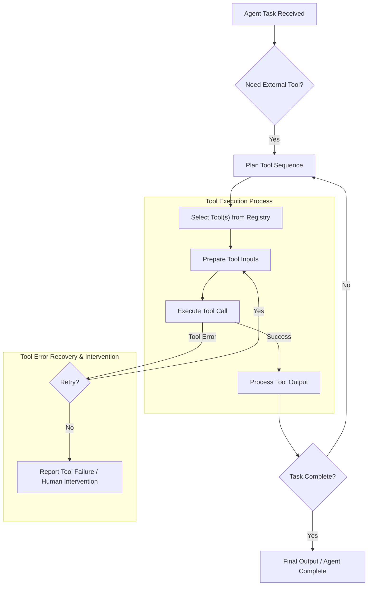

AI 에이전트에게 외부 도구(External Tools)를 연동하는 것은 대규모 언어 모델(LLM)의 내재된 한계를 극복하고 실제 세계의 복잡한 문제를 해결하기 위한 필수적인 전략입니다. LLM은 방대한 지식을 가지고 있지만, 실시간 정보 접근, 특정 계산 수행, 외부 시스템 조작 등은 외부 도구의 도움 없이는 불가능합니다. 효과적인 도구 연동은 에이전트의 자율성과 문제 해결 능력을 비약적으로 향상시킵니다. 이 엔트리에서는 AI 에이전트의 외부 도구 연동의 중요성과 다양한 활용 패턴, 그리고 2026년 최신 트렌드를 심층적으로 다룹니다.

## 에이전트 외부 도구 연동의 중요성

LLM은 본질적으로 학습된 데이터 내에서 추론하고 생성하는 능력을 가집니다. 그러나 다음과 같은 한계에 직면합니다:

*   **실시간 정보 부족**: 최신 뉴스, 주가, 날씨 등 학습 데이터 이후의 실시간 정보에 접근할 수 없습니다.
*   **정확한 계산 및 로직 수행 어려움**: 복잡한 수학 계산, 데이터베이스 쿼리, 코드 실행 등은 LLM 단독으로 정확히 수행하기 어렵습니다.
*   **외부 시스템 제어 불가**: API 호출을 통한 이메일 전송, 파일 시스템 접근, 데이터베이스 업데이트 등 실제 액션 수행은 불가능합니다.

외부 도구는 이러한 LLM의 한계를 보완하여, 에이전트가 현실 세계와 상호작용하고 훨씬 더 광범위한 태스크를 수행할 수 있도록 합니다. 이는 마치 사람에게 팔다리와 감각 기관을 제공하여 물리적 환경과 상호작용할 수 있게 하는 것과 같습니다.

## 핵심 개념: 도구 정의와 오케스트레이션

에이전트가 도구를 효과적으로 사용하려면, 도구는 명확하게 정의되어야 하고, 에이전트는 이를 적절히 오케스트레이션할 수 있어야 합니다.

### 도구 정의 및 스키마

각 외부 도구는 그 기능, 필요한 입력 파라미터, 반환 값의 형식을 명확하게 설명하는 스키마를 가져야 합니다. 일반적으로 JSON Schema나 OpenAPI Specification과 같은 표준 형식이 활용됩니다. 에이전트는 이 스키마를 통해 어떤 도구가 필요한 태스크에 적합한지 판단하고, 정확한 파라미터로 도구를 호출할 수 있습니다.

```python
import json

class WeatherTool:
    def __init__(self):
        self.name = "get_current_weather"
        self.description = "Retrieves the current weather for a given city."
        self.parameters = {
            "type": "object",
            "properties": {
                "location": {
                    "type": "string",
                    "description": "The city name, e.g., Seoul"
                },
                "unit": {
                    "type": "string",
                    "enum": ["celsius", "fahrenheit"],
                    "description": "The unit of temperature to use"
                }
            },
            "required": ["location"]
        }

    def execute(self, location: str, unit: str = "celsius"):
        print(f"Executing WeatherTool for {location} in {unit}...")
        # Simulate API call
        if location.lower() == "seoul":
            return {"location": location, "temperature": 25, "unit": unit, "conditions": "Sunny"}
        elif location.lower() == "new york":
            return {"location": location, "temperature": 75, "unit": unit, "conditions": "Partly Cloudy"}
        else:
            return {"error": "City not found"}

class Agent:
    def __init__(self, tools):
        self.tools = {tool.name: tool for tool in tools}

    def call_tool(self, tool_name: str, **kwargs):
        if tool_name not in self.tools:
            return {"error": f"Tool '{tool_name}' not found."}
        
        tool = self.tools[tool_name]
        try:
            # Basic validation against schema (simplified)
            for param, schema in tool.parameters.get("properties", {}).items():
                if param in tool.parameters.get("required", []) and param not in kwargs:
                    raise ValueError(f"Missing required parameter: {param}")
                if param in kwargs and "enum" in schema and kwargs[param] not in schema["enum"]:
                    raise ValueError(f"Invalid value for {param}: {kwargs[param]}")
            
            result = tool.execute(**kwargs)
            return {"tool_output": result}
        except Exception as e:
            return {"tool_error": str(e)}

    def process_request(self, natural_language_request: str):
        print(f"Agent processing: '{natural_language_request}'")
        # In a real agent, an LLM would parse the request and decide which tool to call
        # For demonstration, we'll hardcode a a tool call decision for simplicity.
        if "weather" in natural_language_request.lower() and "seoul" in natural_language_request.lower():
            print("LLM identified a need for WeatherTool for Seoul.")
            return self.call_tool("get_current_weather", location="Seoul", unit="celsius")
        elif "weather" in natural_language_request.lower() and "new york" in natural_language_request.lower():
             print("LLM identified a need for WeatherTool for New York.")
             return self.call_tool("get_current_weather", location="New York", unit="fahrenheit")
        else:
            return {"response": "I can only get weather information for known cities at the moment."}

# Example Usage
weather_tool = WeatherTool()
my_agent = Agent(tools=[weather_tool])

print("--- Scenario 1: Valid weather request ---")
result1 = my_agent.process_request("What's the weather like in Seoul today?")
print(json.dumps(result1, indent=2, ensure_ascii=False))

print("\n--- Scenario 2: Valid weather request with unit ---")
result2 = my_agent.process_request("How hot is it in New York in Fahrenheit?")
print(json.dumps(result2, indent=2, ensure_ascii=False))

print("\n--- Scenario 3: Unknown city ---")
result3 = my_agent.process_request("Tell me about the weather in London.")
print(json.dumps(result3, indent=2, ensure_ascii=False))

print("\n--- Scenario 4: Tool not called ---")
result4 = my_agent.process_request("Hello, how are you?")
print(json.dumps(result4, indent=2, ensure_ascii=False))
```

### 도구 오케스트레이션 패턴

에이전트는 주어진 태스크를 해결하기 위해 단일 도구를 사용하거나, 여러 도구를 조합하여 복잡한 워크플로우를 구성할 수 있습니다. 이는 다음과 같은 패턴으로 구현됩니다:

1.  **단일 도구 사용 (Single-Tool Use)**: 특정하고 간단한 태스크에 하나의 도구를 호출합니다. 예: 현재 날씨 조회.
2.  **순차적 도구 사용 (Sequential Tool Use)**: 여러 단계를 거쳐야 하는 복잡한 태스크에 도구를 순차적으로 호출합니다. 각 도구의 출력은 다음 도구의 입력으로 사용될 수 있습니다. 예: 사용자 문의 -> 검색 도구 -> 결과 요약 도구 -> 이메일 발송 도구.
3.  **병렬 도구 사용 (Parallel Tool Use)**: 독립적으로 실행될 수 있는 여러 정보를 동시에 가져와서 에이전트의 상황 인식을 높입니다. 예: 특정 주제에 대한 웹 검색과 데이터베이스 검색을 동시에 수행.
4.  **조건부 도구 사용 (Conditional Tool Use)**: 도구 호출 결과나 중간 추론 단계에 따라 다음 도구 사용 여부 또는 어떤 도구를 사용할지 결정합니다. 예: 웹 검색 결과가 불충분하면 백업 데이터베이스 검색 도구 사용.
5.  **인간 개입 도구 사용 (Human-in-the-Loop Tool Use)**: 민감하거나 중요한 결정이 필요한 시점에 인간의 승인이나 추가 정보를 요청하는 도구를 사용합니다. 이는 에이전트의 폭주(Runaway Agent) 방지 및 안전성 확보에 중요합니다.



## 2026년 최신 트렌드

*   **자율적인 도구 생성 및 적응 (Autonomous Tool Creation and Adaptation)**: 에이전트가 단순히 기존 도구를 사용하는 것을 넘어, 스스로 필요한 도구를 생성하거나 기존 도구를 개선하는 방향으로 진화합니다. 코드 생성 능력을 활용하여 맞춤형 스크립트나 API 래퍼를 즉석에서 생성하고 활용하는 패턴이 확산될 것입니다.
*   **고급 오류 복구 및 자가 치유 (Advanced Error Recovery and Self-Healing)**: 도구 사용 중 발생하는 오류를 단순 재시도(Retry)를 넘어, 오류 메시지를 분석하여 문제의 근원을 파악하고, 자동으로 수정 조치를 취하거나 대체 도구를 찾아 사용하는 자가 치유 능력이 강화됩니다. 이를 위해 도구 에러 패턴 학습 및 분류 시스템이 중요해집니다.
*   **보안 강화 및 권한 관리 (Enhanced Security and Access Control)**: 외부 도구 연동은 잠재적인 보안 위험을 내포하므로, 2026년에는 최소 권한의 원칙(Principle of Least Privilege)에 기반한 세분화된 접근 제어, 입력 값 Sanitization, 샌드박스 환경(Sandbox Environment)에서의 도구 실행 등 보안이 더욱 강조됩니다. 에이전트의 행위를 모니터링하고 이상 징후를 탐지하는 시스템(Agent Malfunction Prevention)도 필수적입니다.
*   **멀티모달 도구 연동 (Multimodal Tool Integration)**: 텍스트 기반 도구 외에 이미지 인식, 음성 처리, 비디오 분석 등 멀티모달 능력을 가진 외부 도구를 에이전트가 활용하여, 더욱 풍부한 정보를 처리하고 복합적인 문제를 해결할 수 있게 됩니다.
*   **지속적인 상태 관리 (Persistent State Management)**: 장기 실행 태스크에서 도구 사용 간의 컨텍스트(Context)와 상태(State)를 효율적으로 유지하고 관리하는 패턴이 중요해집니다. 이는 에이전트가 여러 도구 호출에 걸쳐 일관된 작업을 수행하고, 이전 작업의 결과를 효과적으로 활용할 수 있게 합니다.

## 트레이드오프

*   **자율성 vs. 통제 (Autonomy vs. Control)**: 완전 자율적인 도구 사용은 효율성을 극대화하지만, 잘못된 판단으로 인한 예상치 못한 부작용(예: 비용 폭증, 데이터 손상)의 위험이 있습니다. 중요한 작업에는 인간 개입 지점(Human-in-the-Loop)을 설계하여 통제력을 확보해야 합니다. 이는 에이전트의 책임감 있는 개발을 위해 필수적입니다.
*   **도구 복잡성 vs. 유지보수성 (Tool Complexity vs. Maintainability)**: 강력하고 다양한 기능을 제공하는 도구는 에이전트의 능력을 확장하지만, 도구 자체의 개발 및 유지보수 비용이 증가하고 에이전트가 도구를 이해하고 올바르게 사용하는 데 필요한 복잡성도 커집니다. 간결하고 목적에 맞는 도구 설계가 중요합니다.
*   **응답 지연 vs. 기능성 (Latency vs. Capability)**: 외부 도구를 호출하는 것은 LLM 자체의 추론보다 훨씬 긴 지연 시간(Latency)을 유발할 수 있습니다. 실시간에 가까운 응답이 필요한 애플리케이션에서는 도구 호출 횟수를 최소화하거나 비동기 처리 전략을 고려해야 합니다. 높은 기능성과 빠른 응답 속도 사이의 균형을 찾아야 합니다.
*   **보안 vs. 유연성 (Security vs. Flexibility)**: 에이전트에게 광범위한 외부 도구 접근 권한을 부여하면 다양한 태스크를 수행할 수 있지만, 이는 보안 취약점을 증가시킬 수 있습니다. 반대로, 엄격한 보안 정책은 에이전트의 유연성을 제한합니다. 도구별 세분화된 권한 관리와 강력한 입력 검증 로직이 요구됩니다.

## 실전 체크리스트

프로젝트에 에이전트 외부 도구 연동을 적용할 때 다음 항목들을 검토하십시오:

*   [ ] 모든 외부 도구의 기능, 입력, 출력 스키마가 명확히 정의되고 버전 관리되고 있는가? (예: OpenAPI Spec 또는 JSON Schema)
*   [ ] 에이전트의 도구 사용 중 발생할 수 있는 오류(API 타임아웃, 유효하지 않은 응답 등)에 대한 견고한 오류 처리 및 복구 메커니즘이 구현 및 테스트되었는가?
*   [ ] 각 외부 도구 호출에 대해 최소 권한(Least Privilege) 원칙이 적용되었으며, 입력 값 Sanitization 및 출력 값 검증 로직이 포함되어 보안 취약점을 최소화하는가?
*   [ ] 에이전트가 도구를 호출하는 모든 과정에 대한 상세 로깅(Logging) 및 추적(Tracing) 기능이 구현되어, 문제 발생 시 디버깅 및 분석이 용이한가?
*   [ ] 외부 API 호출로 인한 비용 발생 가능성이 있는 도구에 대해 비용 모니터링 및 예산 제한 가드레일이 설정되어 있는가?
*   [ ] 재정 거래, 시스템 변경 등 중요하거나 되돌릴 수 없는(Irreversible) 도구 작업에 대해 인간의 승인(Human Approval) 또는 감독(Oversight)이 필요한 개입 지점(Checkpoint)이 명확히 정의되어 있는가?
*   [ ] 주요 도구 사용 워크플로우에 대한 성능 벤치마크가 존재하며, 예상 지연 시간(Latency) 및 처리량(Throughput) 목표를 충족하는지 정기적으로 검증하는가?