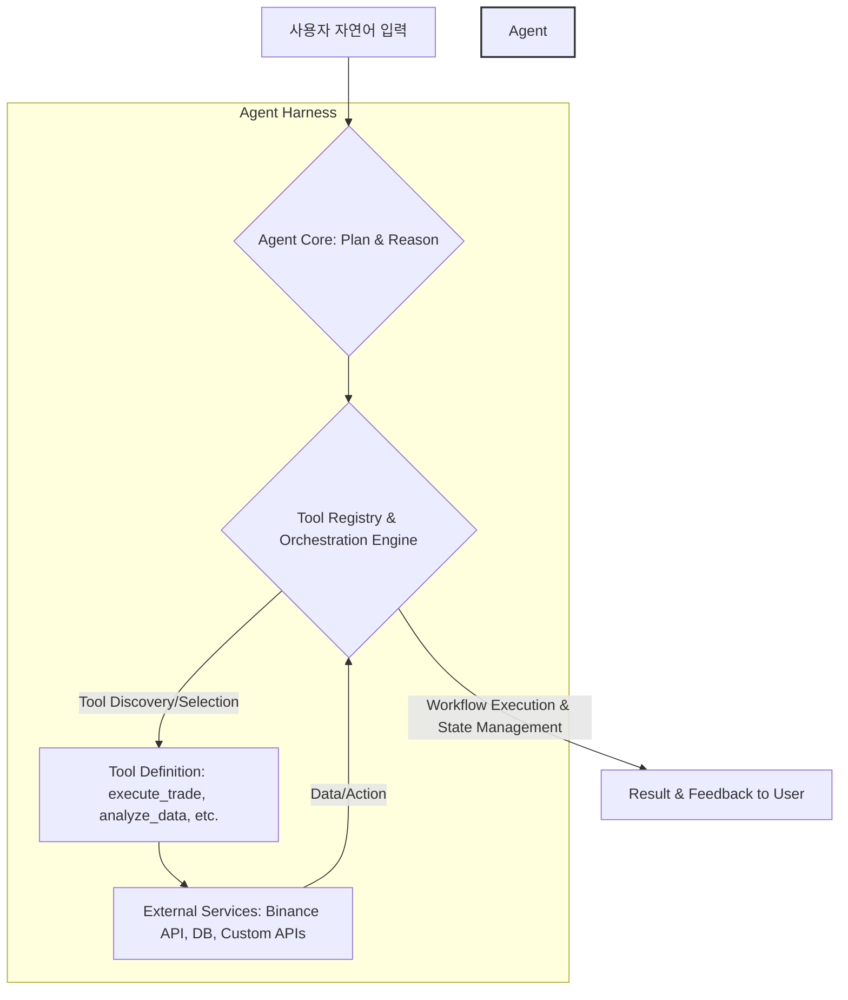

AI 에이전트의 역할은 단순히 정보 검색이나 콘텐츠 생성 보조를 넘어, 실제 비즈니스 로직을 수행하고 외부 시스템과 상호작용하는 자동화된 행위자로 진화하고 있습니다. 특히, Binance의 'AI Agent Skill'과 같이 자연어 명령으로 현물/선물 거래를 자동화하는 사례는 AI 에이전트가 현실 세계에서 직접적인 액션을 취할 수 있음을 보여줍니다. 이러한 고급 기능을 구현하기 위해서는 AI 에이전트 하네스의 기능 확장과 통합 전략이 필수적입니다.

## AI 에이전트 하네스의 핵심 구성 요소

AI 에이전트 하네스(Harness)는 에이전트가 다양한 도구(Tools)와 서비스를 활용하여 복잡한 작업을 수행할 수 있도록 지원하는 프레임워크입니다. 이는 에이전트의 역량을 확장하고, 신뢰성, 안정성, 보안을 보장하는 역할을 합니다.

### 1. Tool/Skill 통합 모듈
에이전트가 외부 시스템과 상호작용하기 위한 인터페이스를 제공합니다. 이는 API 호출, 데이터베이스 연동, 외부 프로그램 실행 등 다양한 형태로 구현될 수 있습니다. 중요한 것은 에이전트가 이 모듈을 통해 어떤 `Tool`을 언제, 어떻게 사용할지 결정하는 메커니즘을 제공하는 것입니다.

### 2. 오케스트레이션 엔진
단일 `Tool` 사용을 넘어 여러 `Tool`을 조합하고, 순서를 제어하며, 중간 결과를 관리하여 복잡한 워크플로를 완성하는 역할을 합니다. 이는 `DAG (Directed Acyclic Graph)`나 상태 머신(State Machine)과 같은 패턴을 활용하여 구현될 수 있습니다. `moneyballscore`와 같은 워커들의 예측을 실제 자동화된 액션으로 전환하는 프레임워크를 구상할 때 핵심적인 구성 요소입니다.

### 3. 상태 관리 및 컨텍스트 지속성
장기 실행 워크플로에서 에이전트의 이전 작업 상태, 결정 근거, 중간 결과 등을 저장하고 필요시 재사용하여 효율성과 일관성을 유지합니다. 이는 `Persistent Memory`나 `Automated Context Management`와 밀접하게 관련됩니다.

## 자연어 기반 자동화 Skill 통합 전략

에이전트 하네스에 새로운 `Skill`을 통합하는 과정은 다음과 같은 단계를 포함합니다.

1.  **Skill 정의 및 등록**: 자동화하려는 특정 작업(예: 주식 매수/매도, 데이터 분석, 보고서 생성)을 `Tool`로 정의합니다. 각 `Tool`은 명확한 입력(`Input`), 출력(`Output`), 그리고 설명을 포함해야 합니다. 이 설명은 에이전트가 `Tool`을 선택하고 사용할 때 중요한 정보가 됩니다.
2.  **Tool 선택 및 실행**: 에이전트 코어는 사용자의 자연어 명령을 분석하고, `Tool Registry`에 등록된 `Skill` 중 가장 적합한 것을 선택합니다. 이후 해당 `Tool`의 `Input Parameter`를 추출하여 `Tool`을 실행합니다.
3.  **실행 결과 처리**: `Tool` 실행 후 반환된 결과를 파싱하고, 다음 액션을 결정하거나 사용자에게 피드백을 제공합니다.

### 예시: Mock Trading Skill 통합

```python
import json

class TradingSkill:
    def __init__(self, api_key: str):
        self.api_key = api_key
        # 실제 환경에서는 거래소 API 초기화 로직이 들어갑니다.
        print(f"TradingSkill initialized with API Key: {api_key[:5]}...")

    def execute_trade(self, symbol: str, quantity: float, side: str):
        """
        주어진 종목(symbol)과 수량(quantity)으로 매수(BUY) 또는 매도(SELL) 거래를 실행합니다.
        :param symbol: 거래할 주식 또는 암호화폐 종목 코드 (예: "BTCUSDT")
        :param quantity: 거래할 수량
        :param side: "BUY" 또는 "SELL"
        :return: 거래 실행 결과 JSON
        """
        if side.upper() not in ["BUY", "SELL"]:
            return {"status": "error", "message": "Invalid side. Must be 'BUY' or 'SELL'."}

        print(f"Executing {side.upper()} trade for {quantity} of {symbol}...")
        # 실제 거래 로직 (API 호출 등)
        trade_id = f"mock_trade_{hash(symbol+str(quantity)+side)}"
        result = {
            "status": "success",
            "trade_id": trade_id,
            "symbol": symbol,
            "quantity": quantity,
            "side": side.upper(),
            "timestamp": "2026-07-20T10:00:00Z" # 2026년 기준
        }
        return result

# 에이전트가 인식할 Tool의 정의 (예: JSON Schema, Pydantic 모델 등)
trading_tool_schema = {
    "name": "execute_trade",
    "description": "금융 시장에서 주식 또는 암호화폐를 매수하거나 매도하는 기능을 제공합니다.",
    "parameters": {
        "type": "object",
        "properties": {
            "symbol": {"type": "string", "description": "거래할 자산의 심볼 (예: BTCUSDT)"},
            "quantity": {"type": "number", "description": "거래할 수량"},
            "side": {"type": "string", "enum": ["BUY", "SELL"], "description": "거래 방향: 매수 또는 매도"}
        },
        "required": ["symbol", "quantity", "side"]
    }
}

# 에이전트 하네스 내부의 모의 에이전트 로직
class AgentHarness:
    def __init__(self):
        self.tools = {"execute_trade": TradingSkill("mock_api_key_12345")}
        self.tool_schemas = {"execute_trade": trading_tool_schema}

    def process_natural_language_command(self, command: str):
        print(f"Agent received command: \"{command}\"")
        # 실제 LLM 호출을 모의합니다. LLM이 command를 분석하여 tool_call을 생성했다고 가정.
        if "비트코인 0.5개 매수" in command:
            tool_call = {
                "tool_name": "execute_trade",
                "parameters": {"symbol": "BTCUSDT", "quantity": 0.5, "side": "BUY"}
            }
        elif "이더리움 2개 팔아" in command:
            tool_call = {
                "tool_name": "execute_trade",
                "parameters": {"symbol": "ETHUSDT", "quantity": 2.0, "side": "SELL"}
            }
        else:
            return "Could not understand your command or find a suitable tool."

        tool_name = tool_call["tool_name"]
        parameters = tool_call["parameters"]

        if tool_name in self.tools:
            tool_instance = self.tools[tool_name]
            method = getattr(tool_instance, tool_name) # Assuming tool_name matches method name
            result = method(**parameters)
            return json.dumps(result, indent=2)
        else:
            return f"Error: Tool '{tool_name}' not found."

# 실행 예제
harness = AgentHarness()
print(harness.process_natural_language_command("비트코인 0.5개 매수해줘"))
print(harness.process_natural_language_command("이더리움 2개 팔아"))
print(harness.process_natural_language_command("날씨 알려줘")) # 적합한 Tool 없음
```

## 에이전트 하네스 아키텍처



## 2026년 트렌드 및 미래 전망

2026년 AI 에이전트 하네스의 발전은 신뢰성, 투명성, 그리고 안전성에 중점을 둘 것입니다. 실제 자산 관리나 중요한 의사 결정에 에이전트를 활용하려면, 에이전트의 판단 근거를 추적할 수 있는 `explainable AI` 기능과, 예측 불가능한 상황에 대비한 `Guardrails` 및 `Safety Constraints` 디자인이 필수적입니다. 또한, 멀티-모달(Multimodal) 입력 처리와 `Human-in-the-loop` 검증 프로세스 통합을 통해 더욱 견고하고 실용적인 자동화 시스템이 구축될 것입니다. 복잡한 `Multi-Agent System`에서의 협업 및 `Conflict Resolution` 능력도 중요해질 것입니다.

## 트레이드오프

AI 에이전트 하네스 기능 확장 및 통합 전략을 수립할 때는 다양한 트레이드오프를 고려해야 합니다.

*   **자동화 수준 vs. 제어 가능성**: 완전 자동화된 액션은 효율성을 극대화하지만, 오작동 시 위험을 증가시킵니다. 높은 위험도의 작업(예: 금융 거래)에서는 `Human-in-the-loop` 검증이나 `Soft-scheduling` 같은 방식으로 에이전트의 자율성을 제한하는 것이 좋습니다. 반대로 반복적이고 저위험 작업은 최대한 자동화하여 생산성을 높일 수 있습니다. 이는 `agents/ai-agent-safety-constraint-control-design-patterns`과 연관됩니다.
*   **범용성 vs. 도메인 특화 성능**: 범용적인 `Tool` 통합 프레임워크는 다양한 산업에 적용하기 용이하지만, 특정 도메인(예: 금융)의 복잡한 요구사항을 충족시키기 어렵습니다. 도메인 특화 `Tool`은 높은 성능을 제공하지만, 재사용성이 낮고 개발 비용이 증가합니다. 초기에는 범용적인 접근 방식을 택하고, 핵심 기능에 대해서는 점진적으로 도메인 특화 `Tool`을 개발하는 전략이 효과적일 수 있습니다.
*   **개발 속도 vs. 안정성 및 보안**: 신속한 `Skill` 개발 및 통합은 빠른 시장 대응을 가능하게 하지만, 충분한 테스트와 보안 검토 없이 배포될 경우 시스템 전체의 안정성을 해칠 수 있습니다. 특히 외부 `API` 연동 시 `Authentication`, `Rate Limiting`, `Error Handling` 등을 철저히 구현해야 합니다. 개발 초기에는 `Proof of Concept` 단계에서 속도에 집중하되, 프로덕션 배포 전에는 반드시 `Agent Safety Constraint` 및 `Security Audit`를 수행해야 합니다.
*   **복잡성 증가 vs. 관리 용이성**: 다양한 `Tool`과 복잡한 워크플로를 통합하면 시스템의 기능성은 크게 향상되지만, 관리 및 디버깅이 어려워질 수 있습니다. `Modular Design`, `Version Control for Tools`, `Centralized Logging`, `Monitoring` 시스템을 통해 복잡성을 관리해야 합니다. `Agentic Context Compaction`과 같은 기술로 `Context Window`를 최적화하여 관리 부담을 줄일 수 있습니다.

## 실전 체크리스트

AI 에이전트 하네스에 자동화 기능을 통합할 때 다음 항목들을 검증합니다.

*   [ ] **Tool 정의 표준화**: 모든 `Tool`에 대한 입력(`Input`), 출력(`Output`), 설명(`Description`)이 명확하게 정의되고 표준화된 형식(예: JSON Schema)을 따르는가?
*   [ ] **보안 프로토콜 구현**: 외부 시스템 연동 `Tool`에 대해 `API Key` 관리, `OAuth` 인증, `Rate Limiting` 등 적절한 보안 프로토콜이 적용되었는가?
*   [ ] **오류 처리 및 복구 메커니즘**: `Tool` 실행 실패 시 적절한 오류 처리 로직과 워크플로 복구 메커니즘(`Rollback`, `Retry`)이 설계되어 있는가?
*   [ ] **모니터링 및 로깅**: 에이전트의 `Tool` 선택, 실행, 워크플로 진행 상황에 대한 상세한 `Logging` 및 `Monitoring` 시스템이 구축되어 있는가?
*   [ ] **인간 개입(Human-in-the-loop) 지점**: 고위험 또는 불확실한 작업에 대해 에이전트의 최종 결정을 사람이 검토하고 승인할 수 있는 지점(`Checkpoint`)이 명확하게 정의되어 있는가?
*   [ ] **성능 벤치마킹**: 새로운 `Skill` 통합 후 에이전트의 전체 워크플로 처리 시간 및 리소스 사용량에 대한 성능 벤치마킹을 수행했는가?
*   [ ] **확장성 아키텍처**: 향후 더 많은 `Tool`과 복잡한 워크플로를 추가할 경우를 대비하여 하네스 아키텍처가 `Scalable`하게 설계되어 있는가?
