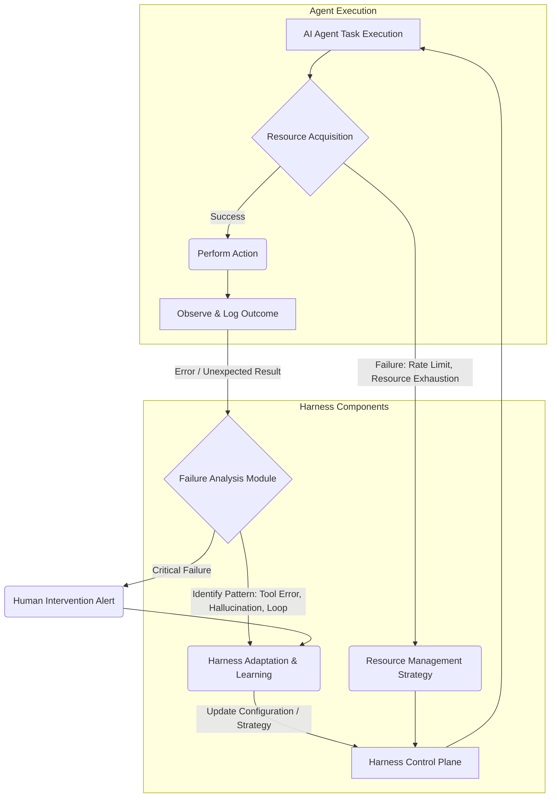

AI 에이전트가 복잡한 비즈니스 프로세스를 자율적으로 수행하려면, 예측 불가능한 현실 세계의 자원 제약과 다양한 실패 양상을 효과적으로 관리하는 '하네스(harness)' 강화가 필수적이다. Pion과 같은 자율 운영 에이전트가 실제 사업 환경에 적용될 때, 자원 확보 능력과 실패 패턴 분석을 통해 하네스를 지속적으로 고도화하는 것은 에이전트의 안정성과 신뢰성을 결정하는 핵심 요소이다. 시뮬레이션 성공이 현실 복잡성을 대변하지 못하기에, 실제 운영 데이터를 기반으로 한 하네스 고도화 전략이 중요하다.

## 자원 확보 능력 분석
AI 에이전트의 자원 확보는 컴퓨팅 리소스, API 토큰, 외부 서비스 접근 권한, 데이터베이스 커넥션, 시간 예산 등을 포함한다. 하네스는 이러한 자원들을 동적으로 예측하고 모니터링하여 최적의 상태를 유지해야 한다.

### 동적 자원 할당 및 모니터링
-   **API Rate Limit 관리**: 하네스는 각 API의 Rate Limit을 인지하고, 토큰 버킷(Token Bucket) 같은 알고리즘으로 호출을 조절한다. 호출 급증 시 감지하여 전략을 조정하거나 대안 자원을 탐색한다.
-   **컴퓨팅 및 메모리**: LLM 추론 시 GPU 메모리나 CPU 사용량 피크를 감지, 과도한 소비 예상 시 태스크 분할 또는 우선순위 조정을 한다.
-   **데이터베이스 커넥션 풀**: 과도한 DB 커넥션 요청을 방지하기 위해 커넥션 풀을 관리하고 에이전트 사용을 통제한다.

## 실패 양상 분석
에이전트의 실패는 단순 오류를 넘어 시스템의 취약점이나 환경 변화를 반영하는 중요한 신호다. 실패 양상을 면밀히 분석하여 하네스는 복원력을 강화할 수 있다.

### 실패 유형 분류 및 자동 진단
주요 실패 유형은 다음과 같다:
1.  **도구 사용 오류 (Tool Use Errors)**: 에이전트가 외부 도구를 잘못 호출하거나, 비정상적인 결과를 받을 때 발생.
2.  **LLM 환각 (Hallucinations)**: LLM이 사실과 다른 정보 생성 또는 존재하지 않는 도구 호출 시도.
3.  **무한 루프 (Infinite Loops)**: 에이전트가 특정 상태에서 반복 작업에 갇히는 현상.
4.  **비용 초과 (Cost Overruns)**: LLM 토큰 또는 컴퓨팅 자원 사용량이 예산을 초과하는 경우.
5.  **외부 서비스 장애 (External Service Outages)**: 의존하는 외부 API나 서비스의 일시적/영구적 장애.
하네스는 이러한 실패를 자동으로 감지하고 `observability` 시스템을 통해 상세 로깅 및 추적, 사전 정의된 전략으로 복구를 시도해야 한다.

## 하네스 설계: 복원력 강화
견고한 하네스는 다양한 복구 전략을 내재하여 에이전트의 자율성을 보장하면서도 통제 불능 상태를 방지한다.

### 핵심 복원력 메커니즘
-   **적응형 재시도 (Adaptive Retries)**: 일시적 네트워크 오류나 Rate Limit 초과 시, 지수 백오프(Exponential Backoff)를 포함한 재시도 전략으로 복구한다. 실패 유형에 따라 횟수와 간격을 동적으로 조절한다.
-   **서킷 브레이커 (Circuit Breakers)**: 반복적인 외부 서비스 실패 시, 해당 서비스 호출을 일시 중단하여 시스템 부하 및 장애 전파를 방지한다.
-   **폴백 전략 (Fallback Strategies)**: 주된 자원 확보/도구 사용 실패 시, 대체 자원/도구를 사용한다. (예: 느린 LLM 모델 → 다른 모델 전환)
-   **휴먼 인 더 루프 (Human-in-the-Loop) 체크포인트**: 중요한 결정이나 반복적 실패 시 인간 개입을 요청하여 폭주를 방지하고 학습 기회를 제공한다.
-   **옵저버빌리티 및 알림**: 에이전트 상태, 자원 사용량, 실패 지점 등을 실시간 모니터링하고 임계치 초과 시 즉시 알림을 전송하여 신속한 문제 해결 및 하네스 개선을 돕는다.

## 코드 예제: 자원 확보 및 오류 처리 강화
아래 Python 코드는 AI 에이전트가 외부 API를 호출할 때 Rate Limit을 고려한 재시도 로직과 함께, 발생 가능한 오류를 처리하고 자원 사용을 로깅하는 하네스 구성 요소를 보여준다.

```python
import time
import random
import logging
from functools import wraps

logging.basicConfig(level=logging.INFO, format='%(asctime)s - %(levelname)s - %(message)s')

class RateLimiter:
    def __init__(self, calls_per_minute: int):
        self.calls_per_minute = calls_per_minute
        self.interval = 60 / calls_per_minute
        self.last_call_time = 0
        self.queue = []

    def __call__(self, func):
        @wraps(func)
        def wrapper(*args, **kwargs):
            now = time.time()
            if now - self.last_call_time < self.interval:
                sleep_time = self.interval - (now - self.last_call_time)
                logging.info(f"Rate limit hit. Sleeping for {sleep_time:.2f}s before calling {func.__name__}")
                time.sleep(sleep_time)
            
            self.last_call_time = time.time()
            return func(*args, **kwargs)
        return wrapper

class AgentHarness:
    def __init__(self, max_retries: int = 3, initial_backoff: float = 1.0):
        self.max_retries = max_retries
        self.initial_backoff = initial_backoff

    def robust_tool_call(self, tool_func, *args, **kwargs):
        for attempt in range(self.max_retries + 1):
            try:
                logging.info(f"Attempt {attempt + 1}/{self.max_retries + 1} for {tool_func.__name__}")
                result = tool_func(*args, **kwargs)
                logging.info(f"Tool call {tool_func.__name__} successful.")
                return result
            except Exception as e:
                logging.error(f"Tool call {tool_func.__name__} failed on attempt {attempt + 1}: {e}")
                if attempt < self.max_retries:
                    sleep_time = self.initial_backoff * (2 ** attempt) + random.uniform(0, 1)
                    logging.warning(f"Retrying {tool_func.__name__} after {sleep_time:.2f}s...")
                    time.sleep(sleep_time)
                else:
                    logging.critical(f"Tool call {tool_func.__name__} permanently failed after {self.max_retries + 1} attempts.")
                    raise

# 예제 외부 API 호출 함수 (Rate Limit 시뮬레이션)
@RateLimiter(calls_per_minute=5) # 1분에 5회 호출 제한
def external_api_call(data: str):
    if random.random() < 0.2: # 20% 확률로 실패 시뮬레이션
        raise ConnectionError(f"Failed to connect to external service for data: {data}")
    logging.info(f"Processing data: {data}")
    return f"Processed: {data}"

# 에이전트 하네스 사용
harness = AgentHarness(max_retries=2)

if __name__ == "__main__":
    test_data = ["item_A", "item_B", "item_C", "item_D", "item_E", "item_F", "item_G"]
    for data in test_data:
        try:
            harness.robust_tool_call(external_api_call, data)
        except Exception as e:
            logging.error(f"Main loop caught error for {data}: {e}")
        time.sleep(0.5) # 다음 호출을 위한 약간의 지연
```

## Mermaid Diagram: 에이전트 하네스 강화 피드백 루프


## 트레이드오프

AI 에이전트 하네스를 자원 확보 및 실패 양상 분석 기반으로 강화하는 것은 시스템의 복원력을 크게 향상시키지만, 다음과 같은 트레이드오프를 고려해야 한다.

-   **복잡성 증가 vs. 안정성 증대**:
    -   **언제 좋은가**: 에이전트가 복잡한 실제 환경에서 미션 크리티컬한 태스크를 수행해야 할 때, 초기 개발 및 유지보수 비용이 높더라도 시스템 안정성과 예측 가능성이 필수적인 경우.
    -   **언제 나쁜가**: 단순하고 단발적인 태스크나 실험적인 PoC(Proof of Concept) 단계에서는 과도한 하네스 로직이 개발 속도를 저해하고 불필요한 오버헤드를 발생시킨다.
-   **자원 모니터링 및 제어 오버헤드 vs. 효율적인 자원 사용**:
    -   **언제 좋은가**: 제한된 자원(API 할당량, 컴퓨팅 파워) 내에서 많은 에이전트 태스크를 효율적으로 분배하고 비용을 최적화해야 할 때. 낭비와 폭주를 방지한다.
    -   **언제 나쁜가**: 자원이 풍부하고 태스크의 중요도가 낮아 자원 효율성보다 빠른 실행이 우선시될 때는, 모니터링 로직 자체가 시스템에 추가적인 부하를 줄 수 있다.
-   **자동화된 복구 vs. 인간 개입의 적절성**:
    -   **언제 좋은가**: 예측 가능하고 반복적인 실패 패턴(예: 네트워크 일시 장애, Rate Limit)에 대해 신속하게 대응하여 에이전트의 중단 없는 운영을 보장할 때.
    -   **언제 나쁜가**: 복잡하고 새로운 유형의 실패, 또는 도덕적/법적 판단이 필요한 경우에는 자동화된 복구 로직이 더 큰 문제를 야기할 수 있으며, 인간의 섬세한 판단이 필요하다.
-   **로그 및 진단 데이터의 양 vs. 문제 해결 용이성**:
    -   **언제 좋은가**: 에이전트의 실행 경로, 자원 사용, 실패 원인을 깊이 있게 분석하여 하네스 개선 포인트를 도출하고, 사후 감사(post-mortem)에 필요한 상세 정보를 확보할 때.
    -   **언제 나쁜가**: 너무 많은 로깅은 스토리지 비용을 증가시키고, 노이즈가 많아 실제 의미 있는 정보를 찾기 어렵게 만들 수 있다. 적절한 필터링 및 집계 전략이 필요하다.

## 실전 체크리스트

AI 에이전트의 자원 확보 및 실패 양상 분석을 통해 하네스를 강화할 때 다음 항목들을 점검하십시오.

-   [ ] 에이전트가 사용하는 모든 외부 API에 대해 Rate Limit과 오류 응답을 처리하는 `adaptive retry` 및 `circuit breaker` 로직이 구현되었는가?
-   [ ] LLM의 `hallucination`을 감지하고, 이를 통한 잘못된 도구 사용 또는 비즈니스 로직 실행을 차단하는 `validation layer`가 존재하는가?
-   [ ] 에이전트의 `무한 루프` 발생을 감지하고, 이를 강제로 종료하거나 `human-in-the-loop` 개입을 요청하는 메커니즘이 설계되었는가?
-   [ ] 에이전트의 `LLM 토큰 사용량` 및 `컴퓨팅 자원` 사용량을 실시간으로 모니터링하고, 예산 임계치 초과 시 알림 및 자동 조치(예: 태스크 일시 중단)가 가능한가?
-   [ ] 에이전트의 `실패 유형`을 (예: 도구 오류, LLM 환각, 외부 서비스 장애) 명확히 분류하고, 각 유형에 따른 전용 진단 및 복구 전략이 정의되어 있는가?
-   [ ] 에이전트의 주요 실행 경로와 자원 사용 상태를 추적할 수 있는 `분산 트레이싱(distributed tracing)` 및 `중앙화된 로깅(centralized logging)` 시스템이 구축되었는가?
-   [ ] 중요한 비즈니스 로직을 수행하는 에이전트의 경우, `실패 시 폴백(fallback)`할 수 있는 대체 플랜이나 수동 운영 절차가 문서화되어 있는가?