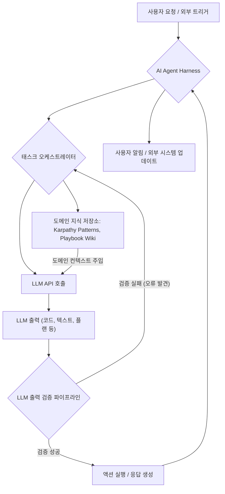

AI 기술의 빠른 발전 속에서, 단순 기반 모델(Foundation Model) API 호출에 의존하는 'AI 래퍼'의 한계가 명확해지고 있습니다. 이러한 래퍼는 초기 시장 우위를 점할 수 있으나, 장기적인 경쟁력과 차별성을 확보하기 어렵습니다. 진정한 가치를 창출하고 지속 가능한 우위를 확보하기 위해서는 AI 에이전트가 단순한 지능을 넘어 실제 비즈니스 워크플로와 가치 사슬에 깊이 통합되는 '수직화' 전략이 필수적입니다. playbook의 AI 에이전트 하네스 개발은 이러한 통찰을 바탕으로, 단순 LLM API 호출을 넘어 전체 워크플로와 가치 사슬을 소유하는 수직 통합형 접근 방식을 강화합니다. 이는 기반 모델의 원시 지능만으로는 얻기 힘든 차별화된 에이전트 능력을 구축하는 핵심입니다.

## 수직화된 AI 에이전트 하네스의 본질

AI 에이전트 하네스(AI Agent Harness)의 수직화는 단순히 LLM과의 연동을 넘어, 특정 도메인의 복잡한 태스크를 처음부터 끝까지 자율적으로 수행하고 검증하는 시스템을 구축하는 것을 의미합니다. 이는 다음 두 가지 핵심 요소의 결합으로 이루어집니다.

### 1. 고유 도메인 지식(Domain-Specific Knowledge) 통합

범용 LLM은 방대한 지식을 보유하지만, 특정 도메인의 깊이 있는 전문 지식이나 암묵지(tacit knowledge)는 부족할 수 있습니다. 수직 통합된 하네스는 다음과 같은 방식으로 고유 도메인 지식을 활용하여 에이전트의 성능을 극대화합니다.

*   **Karpathy LLM Wiki 패턴**: Andrej Karpathy의 LLM 관련 패턴 및 베스트 프랙티스를 playbook의 도메인에 맞게 정제하고 내재화하여, 에이전트의 내부 추론(reasoning)과 코드 생성 등에 반영합니다. 이는 고품질의 출력을 유도하고 시행착오를 줄이는 데 기여합니다.
*   **LLM 출력 검증 파이프라인(LLM Output Validation Pipeline)**: 에이전트가 생성한 출력을 도메인 특화된 규칙, 휴리스틱, 심지어 외부 시스템 호출을 통해 검증합니다. 예를 들어, 코드 생성 에이전트라면 정적 분석 도구, 테스트 케이스 실행, 심지어 실제 환경에서의 안전성 검사를 통해 신뢰도를 확보합니다. 이는 환각(hallucination)과 오류를 최소화하는 데 결정적인 역할을 합니다.

### 2. 태스크 오케스트레이션(Task Orchestration) 강화

수직화된 하네스는 단일 프롬프트-응답 사이클을 넘어, 여러 단계를 포함하는 복잡한 태스크를 자율적으로 계획, 실행, 모니터링, 그리고 필요에 따라 재계획하는 오케스트레이션 능력을 갖춥니다. 이는 에이전트가 단순히 답변을 제공하는 것을 넘어, 능동적으로 문제를 해결하고 목표를 달성하도록 돕습니다.

*   **다단계 계획 및 실행**: 목표 달성을 위한 하위 태스크(sub-tasks)를 동적으로 생성하고, 각 태스크의 실행 순서를 결정합니다.
*   **상태 관리 및 컨텍스트 지속성**: 장기 실행 태스크(long-running tasks) 전반에 걸쳐 에이전트의 현재 상태와 중요한 컨텍스트를 유지하고 관리합니다.
*   **도구 사용(Tool Use) 확장**: 특정 도메인 태스크를 수행하기 위한 전용 도구(API, 내부 시스템, 스크립트 등)를 유연하게 활용하고, 도구 사용 중 발생할 수 있는 오류를 처리하는 로직을 포함합니다.

## 수직화된 AI 에이전트 하네스 아키텍처 예시

다음 Mermaid 다이어그램은 수직화된 AI 에이전트 하네스의 일반적인 워크플로를 보여줍니다.



### Go 기반의 에이전트 하네스 구현 예시 (개념적)

playbook의 AI 에이전트 하네스는 효율성과 확장성을 위해 Go 언어를 활용한 마이크로 서비스 패턴으로 구현될 수 있습니다. 다음은 도메인 지식 주입 및 출력 검증을 담당하는 핵심 컴포넌트의 개념적인 코드 구조입니다.

```go
package agentharness

import (
	"errors"
	"fmt"
	"strings"
)

// DomainKnowledge represents specific domain rules or patterns relevant to playbook's operations.
type DomainKnowledge struct {
	ID      string
	Content string
}

// LLMOutputValidator defines an interface for validating LLM outputs based on domain rules.
type LLMOutputValidator interface {
	Validate(output string, domainContext map[string]interface{}) error
}

// PlaybookKarpathyValidator implements LLMOutputValidator for playbook-specific patterns.
type PlaybookKarpathyValidator struct{}

func (v *PlaybookKarpathyValidator) Validate(output string, domainContext map[string]interface{}) error {
	// Simulate Karpathy LLM Wiki pattern validation logic, e.g., checking for specific structural elements.
	// domainContext could include 'expected_format', 'strict_mode', 'required_keywords', etc.
	
	if len(output) < 50 && domainContext["minimum_length_check"].(bool) {
		return errors.New("output too short for domain requirements")
	}
	// Placeholder for actual complex pattern validation (e.g., AST analysis for code, semantic checks for text)
	if !strings.Contains(output, domainContext["required_phrase"].(string)) {
		return errors.New(fmt.Sprintf("output missing required phrase: %s", domainContext["required_phrase"]))
	}
	fmt.Println("PlaybookKarpathyValidator: Output conforms to Karpathy patterns.")
	return nil
}

// AgentTaskOrchestrator manages the lifecycle of an AI agent's task.
type AgentTaskOrchestrator struct {
	KnowledgeBase []DomainKnowledge
	Validator     LLMOutputValidator
	// Other components for LLM interaction, tool calling, state management
}

// ExecuteTask orchestrates an AI agent's operation, incorporating domain knowledge and validation.
func (ato *AgentTaskOrchestrator) ExecuteTask(taskRequest string, params map[string]interface{}) (string, error) {
	fmt.Printf("Orchestrating task: %s\n", taskRequest)

	// Step 1: Prepare domain context for LLM
	// This could involve retrieving relevant playbook patterns or wiki entries.
	domainCtx := map[string]interface{}{
		"minimum_length_check": true,
		"required_phrase":      "structured flow",
		"playbook_patterns":    ato.KnowledgeBase, // Inject relevant domain knowledge
	}

	// Step 2: Simulate LLM API call (e.g., generating code or a detailed plan)
	// In a real system, this would be an actual API call with a carefully crafted prompt.
	llmGeneratedOutput := fmt.Sprintf("// Generated code with a structured flow based on: %s\nfunc main() { /* ... */ }", taskRequest)

	// Step 3: Validate LLM output using the domain-specific validator
	if err := ato.Validator.Validate(llmGeneratedOutput, domainCtx); err != nil {
		fmt.Printf("LLM output validation failed: %v\n", err)
		// If validation fails, the orchestrator might retry, refine the prompt, or escalate.
		return "", fmt.Errorf("output validation error: %w", err)
	}

	fmt.Printf("LLM output successfully validated for task '%s'.\n", taskRequest)

	// Step 4: Execute actions based on validated output (e.g., commit code, update wiki, send notification)
	finalResult := fmt.Sprintf("Task '%s' completed with validated output.\nOutput: %s", taskRequest, llmGeneratedOutput)
	return finalResult, nil
}
```

## 트레이드오프

수직화된 AI 에이전트 하네스 전략은 강력한 이점을 제공하지만, 몇 가지 트레이드오프를 고려해야 합니다.

*   **개발 복잡성 vs. 차별성 및 신뢰도**: 초기 개발 및 유지보수 복잡성이 증가합니다. 일반적인 AI 래퍼보다 더 많은 도메인 지식, 오케스트레이션 로직, 검증 파이프라인을 구축해야 합니다. 그러나 이는 에이전트의 차별화된 성능과 높은 신뢰도를 보장하여, 단순 LLM 에이전트가 해결하기 어려운 복잡한 문제를 해결할 수 있을 때 유리합니다. 반대로, 범용적인 간단한 태스크에는 과도한 오버헤드가 될 수 있습니다.
*   **유지보수 비용 vs. 시스템 안정성**: 도메인 지식과 오케스트레이션 로직은 비즈니스 요구사항 변화에 따라 지속적으로 업데이트되어야 합니다. 이는 높은 유지보수 비용을 수반하지만, 에이전트의 오작동이나 환각으로 인한 비즈니스 리스크를 현저히 낮춰 시스템의 전반적인 안정성을 크게 향상시킬 수 있을 때 중요합니다. 빠르게 변화하는 도메인이나 실험적인 기능 개발 단계에서는 유연성이 저해될 수 있습니다.
*   **범용성 vs. 도메인 특화 성능**: 수직화는 특정 도메인에 대한 깊은 이해를 기반으로 하므로, 해당 도메인에서의 에이전트 성능을 극대화합니다. 그러나 다른 도메인으로의 확장이나 재사용은 추가적인 커스터마이징이 필요하여 범용성이 떨어질 수 있습니다. 핵심 비즈니스 영역에서 절대적인 성능 우위가 필요할 때 선택하며, 광범위한 사용 사례를 커버해야 할 때는 신중한 설계가 필요합니다.
*   **LLM 의존도 감소 vs. 초기 학습 곡선**: LLM에만 의존하는 대신, 자체 로직과 데이터로 보완하여 LLM의 한계를 극복합니다. 이는 LLM 모델 변화에 대한 의존도를 낮추지만, 에이전트 개발자가 도메인 전문성과 시스템 설계 역량을 동시에 갖춰야 하는 높은 학습 곡선을 요구합니다. LLM 자체의 성능이 매우 뛰어난 단순 태스크에는 과도한 엔지니어링이 될 수 있습니다.

## 실전 체크리스트

playbook의 AI 에이전트 하네스 수직화 전략을 성공적으로 적용하기 위한 실전 체크리스트입니다.

- [ ] **도메인 지식 모듈화 및 주입 방법론 정의**: Karpathy 패턴, 내부 위키, 전문가 시스템 등 고유 도메인 지식을 에이전트가 활용할 수 있도록 명확하게 구조화하고 관리하는 방법론이 확립되었는가?
- [ ] **태스크 오케스트레이션 엔진 설계 검토**: 복잡한 다단계 워크플로를 자율적으로 계획, 실행, 재계획할 수 있는 에이전트 오케스트레이션 로직이 견고하게 설계되었으며, 에러 처리 및 상태 관리가 포함되어 있는가?
- [ ] **LLM 출력 검증 파이프라인 구현 여부**: 생성된 LLM 출력을 도메인 특화된 규칙(예: 코드 컴파일, 테스트 통과, 정합성 검증)에 따라 자동으로 검증하고, 실패 시 피드백 루프를 통해 재시도 또는 수정 지시를 내리는 시스템이 구현되었는가?
- [ ] **모니터링 및 로깅 전략 수립**: 에이전트의 모든 의사결정 과정, 도구 사용, LLM 호출 및 출력 검증 결과를 상세히 추적하고 분석할 수 있는 통합 모니터링 및 로깅 시스템이 구축되었는가?
- [ ] **확장성 및 유연성 확보 방안 검토**: 새로운 도메인 지식 추가, LLM 모델 변경, 외부 도구 통합 등 미래 변화에 유연하게 대응할 수 있도록 아키텍처가 모듈화 및 확장 가능하도록 설계되었는가?
- [ ] **인간 개입(Human-in-the-Loop) 지점 명확화**: 에이전트가 자율적으로 처리하기 어려운 예외 상황이나 중요한 의사결정 지점에서 인간의 검토 및 승인을 받을 수 있는 절차가 명확하게 정의되어 있는가?
- [ ] **성능 및 비용 최적화 전략 적용**: 수직화로 인해 증가할 수 있는 컴퓨팅 자원 및 LLM 토큰 비용을 최적화하기 위한 캐싱, 병렬 처리, 모델 라우팅 등의 전략이 고려되었는가?