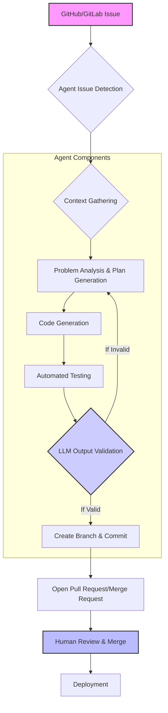

소프트웨어 개발 프로세스에서 반복적이고 예측 가능한 태스크는 자동화의 좋은 후보입니다. 2026년 현재, AI 에이전트는 단순한 코드 스니펫 제안을 넘어 GitHub/GitLab 이슈를 감지하고, 필요한 코드를 작성하며, 테스트를 수행하고, 최종적으로 Merge Request (MR) 또는 Pull Request (PR)를 생성하는 자율적인 개발 워크플로 자동화의 핵심 주체로 부상하고 있습니다. 이는 개발팀의 생산성을 극대화하고, 인적 오류를 줄이며, 더 중요한 창의적 작업에 집중할 수 있게 하는 패러다임의 변화를 의미합니다.

## AI 에이전트 기반 개발 워크플로의 핵심 개념

AI 에이전트 기반의 이슈/PR 자동화 워크플로는 여러 단계에 걸쳐 이루어집니다. 각 단계에서 에이전트는 특정 도구와 지식을 활용하여 목표를 달성합니다.

### 1. 이슈 감지 및 분석 (Issue Detection & Analysis)
에이전트는 GitHub/GitLab의 특정 레포지토리를 모니터링하며 새로운 이슈가 생성되거나 기존 이슈가 업데이트될 때 이를 감지합니다. 이슈의 제목, 설명, 라벨 등을 분석하여 작업의 종류, 우선순위, 복잡도를 파악합니다. 자연어 이해(NLU) 능력을 통해 개발자가 작성한 이슈 설명을 정확히 해석하고, 필요한 경우 추가적인 질문을 통해 모호성을 해소합니다.

### 2. 코드 맥락 이해 및 계획 수립 (Code Context Understanding & Planning)
이슈 분석 후, 에이전트는 관련 코드베이스의 맥락을 이해합니다. 이는 코드 지식 그래프(Code Knowledge Graph), 임베딩 기반 코드 검색(Embedding-based Code Search), 또는 정적 코드 분석 도구와의 연동을 통해 이루어집니다. 파악된 맥락을 바탕으로 에이전트는 문제 해결을 위한 단계별 계획을 수립합니다. 예를 들어, 어떤 파일을 수정해야 할지, 어떤 함수를 변경하거나 새로 추가해야 할지 등을 결정합니다.

### 3. 코드 생성 및 테스트 (Code Generation & Testing)
계획에 따라 LLM 에이전트는 실제 코드를 생성합니다. 이는 특정 언어 및 프레임워크의 코드를 포함하며, 필요한 경우 스크립트, 설정 파일 등도 함께 생성합니다. 생성된 코드는 즉시 자동화된 테스트 환경(예: CI/CD 파이프라인)에서 빌드 및 단위 테스트(Unit Test), 통합 테스트(Integration Test) 등을 거쳐 기능적 정확성을 검증받습니다. 테스트 실패 시 에이전트는 피드백을 받아 코드를 수정하고 재시도하는 자율 개선 루프를 실행합니다.

### 4. LLM 출력 검증 파이프라인 연동 (LLM Output Validation Pipeline Integration)
LLM의 고질적인 문제인 할루시네이션(Hallucination)과 비정확성을 방지하기 위해, 생성된 코드는 독립적인 LLM 출력 검증 파이프라인을 통과해야 합니다. 이 파이프라인은 다양한 기준(예: 보안 취약성, 코딩 컨벤션 준수, 성능 최적화, 기존 코드와의 일관성)에 따라 코드를 평가하고, 이상 징후 발생 시 에이전트에게 경고를 보내거나 수정을 지시합니다. 이는 `evaluation/claude-code-generation-validation-pipeline-extension`과 같은 패턴을 활용할 수 있습니다.

### 5. MR/PR 생성 및 관리 (MR/PR Creation & Management)
검증된 코드는 새로운 브랜치에 커밋(Commit)되고, 변경 사항에 대한 상세 설명, 관련 이슈 링크, 자동 생성된 테스트 결과 등을 포함한 MR/PR이 자동으로 생성됩니다. 에이전트는 필요한 경우 코드 리뷰어 자동 할당, 라벨 추가 등의 작업도 수행하며, PR에 대한 후속 코멘트 처리나 충돌 해결을 위한 추가 작업도 지원할 수 있습니다.

이러한 워크플로는 `harness-engineering/hub-worker-compounding-pattern`에서 논의된 '허브-워커 복리 자동화' 전략에 통합되어, 중앙 허브 에이전트가 이슈 분배 및 전체 워크플로를 조율하고, 전문 워커 에이전트들이 각 단계를 수행하는 형태로 확장될 수 있습니다.



## 코드 예시: Python 기반 Git 자동화 에이전트 스켈레톤

다음은 AI 에이전트가 GitHub 이슈를 기반으로 PR을 생성하는 과정의 핵심 로직을 보여주는 단순화된 Python 스켈레톤 코드입니다. 실제 구현에서는 LLM API 호출, 코드 수정 로직, 정교한 에러 처리 및 상태 관리가 필요합니다.

```python
import os
from github import Github
from openai import OpenAI # Or Anthropic/Gemini client

# Configuration
GITHUB_TOKEN = os.getenv("GITHUB_TOKEN")
REPO_NAME = "your-org/your-repo"
LLM_CLIENT = OpenAI(api_key=os.getenv("OPENAI_API_KEY"))

def get_issue_details(repo, issue_number):
    issue = repo.get_issue(number=issue_number)
    return {"title": issue.title, "body": issue.body, "number": issue.number}

def generate_code_with_llm(prompt):
    response = LLM_CLIENT.chat.completions.create(
        model="gpt-4o", # Example LLM
        messages=[
            {"role": "system", "content": "You are an expert software engineer."}, 
            {"role": "user", "content": prompt}
        ]
    )
    return response.choices[0].message.content

def validate_code(code, issue_context):
    # This is where the LLM Output Validation Pipeline would be integrated.
    # For simplicity, we'll assume a basic check or external service call.
    if "<ERROR_DETECTED>" in code: # Placeholder for actual validation result
        return False, "Validation failed: Placeholder error."
    return True, "Code validated successfully."

def main(issue_number):
    g = Github(GITHUB_TOKEN)
    repo = g.get_user().get_repo(REPO_NAME.split('/')[1]) # Adjust for org repos

    issue_data = get_issue_details(repo, issue_number)
    print(f"Processing issue #{issue_number}: {issue_data['title']}")

    # Step 1: Generate initial plan
    plan_prompt = f"Given the issue '{issue_data['title']}: {issue_data['body']}', outline a technical plan (files to modify, functions to implement) to resolve it."
    plan = generate_code_with_llm(plan_prompt)
    print(f"\nGenerated Plan:\n{plan}")

    # Step 2: Generate code based on plan (simplified)
    code_prompt = f"Based on this plan: '{plan}' and issue '{issue_data['title']}', generate the necessary Python code to implement the feature/fix. Provide only the code block."
    generated_code = generate_code_with_llm(code_prompt)
    print(f"\nGenerated Code:\n```python\n{generated_code}\n```")

    # Step 3: Validate code
    is_valid, validation_msg = validate_code(generated_code, issue_data)
    if not is_valid:
        print(f"Code validation failed: {validation_msg}. Retrying or escalating.")
        # In a real agent, this would trigger refinement or human intervention.
        return

    # Step 4: Create a new branch, commit, and PR (simplified CLI interactions)
    branch_name = f"feature/issue-{issue_number}-{issue_data['title'].replace(' ', '-').lower()[:20]}"
    commit_message = f"feat: Resolve #{issue_number} - {issue_data['title']}"
    pr_title = f"Feat: Resolve #{issue_number} - {issue_data['title']}"
    pr_body = f"Resolves #{issue_number}\n\nGenerated by AI agent.\n\nPlan:\n{plan}\n\nCode:\n```python\n{generated_code}\n```"

    print(f"\nSimulating Git operations:\n")
    print(f"git checkout -b {branch_name}")
    print(f"echo '{generated_code}' > new_feature.py") # Simulate file creation
    print(f"git add new_feature.py")
    print(f"git commit -m '{commit_message}'")
    print(f"git push origin {branch_name}")

    # In a real scenario, use PyGithub or GitPython to interact directly.
    # Example: repo.create_pull(title=pr_title, body=pr_body, head=branch_name, base="main")
    print(f"\nPull Request created (simulated): {pr_title}")
    print(f"Body: {pr_body}")

if __name__ == "__main__":
    # This part would be triggered by a webhook or cron job in a real system
    # For demonstration, we'll use a dummy issue number.
    DUMMY_ISSUE_NUMBER = 123
    main(DUMMY_ISSUE_NUMBER)
```

## 2026년 최신 트렌드 반영

AI 에이전트 기반 개발 워크플로는 다음과 같은 2026년 트렌드를 반영하여 진화하고 있습니다:

*   **자율성 강화 (Enhanced Autonomy)**: 더 이상 단순한 도구 호출이 아닌, 복잡한 문제 해결을 위한 장기 계획 수립, 자가 수정, 심지어 외부 API 호출을 통한 정보 탐색까지 자율적으로 수행하는 에이전트가 주류를 이룹니다.
*   **멀티모달 에이전트 (Multimodal Agents)**: 코드 외에 다이어그램, UI/UX 디자인 Mockup 등 다양한 입력 타입을 이해하고, 이를 바탕으로 코드를 생성하거나 수정하는 능력이 중요해집니다.
*   **지속적 학습 및 컨텍스트 관리 (Continuous Learning & Context Management)**: 에이전트가 과거의 성공 및 실패 경험에서 학습하고, 대규모 코드베이스의 컨텍스트를 효율적으로 관리하여 일관성과 정확성을 유지하는 `agents/ai-agent-persistent-memory-automated-context-management` 패턴이 필수적입니다.
*   **보안 및 안전성 (Security & Safety)**: 생성된 코드가 보안 취약점을 포함하지 않도록 `agents/ai-agent-safety-constraint-control-design-patterns`과 같은 가드레일과 함께 엄격한 검증 파이프라인이 내재화됩니다.
*   **인간-AI 협업 최적화 (Optimized Human-AI Collaboration)**: 에이전트가 모든 것을 자동화하기보다는, 인간 개발자와의 협업 지점을 명확히 정의하고, 복잡한 의사결정이나 창의적 문제 해결에는 인간의 개입을 요청하는 형태로 진화합니다.

## 트레이드오프

### 1. 개발 속도 및 일관성 vs 초기 구축 복잡성
*   **언제 좋고**: 반복적인 버그 수정, 표준화된 기능 추가, 마이그레이션 등 예측 가능한 개발 태스크에 적용 시 개발 속도를 획기적으로 향상시키고 코드 품질의 일관성을 유지할 수 있습니다. 특히 대규모 프로젝트에서 `harness-engineering/agentic-coding-claude-harness-playbook-strategy`와 같은 전략을 통해 생산성을 증대할 수 있습니다.
*   **언제 나쁜지**: 초기 에이전트 개발, 워크플로 정의, LLM 출력 검증 파이프라인 구축에 상당한 시간과 리소스가 필요합니다. 특히 복잡하거나 고도로 맞춤화된 요구사항이 많은 프로젝트에서는 초기 투자 대비 효용이 낮을 수 있습니다.

### 2. 리소스 효율성 vs 할루시네이션 및 오류 위험
*   **언제 좋고**: 단순 반복 작업에 에이전트를 투입하여 인적 리소스를 절약하고, 24시간 자동화된 운영을 통해 CI/CD 파이프라인의 효율을 극대화할 수 있습니다.
*   **언제 나쁜지**: LLM의 할루시네이션이나 잘못된 코드 생성은 예상치 못한 버그를 유발하거나 보안 취약점을 만들 수 있습니다. 이를 검증하기 위한 `evaluation/llm-output-validation-quality-metrics-design`과 같은 강력한 검증 및 모니터링 시스템 없이는 배포 위험이 커집니다.

### 3. 개발자 경험 향상 vs 디버깅 및 관리의 어려움
*   **언제 좋고**: 개발자들이 반복적인 boilerplate 코드 작성이나 간단한 버그 수정에서 해방되어, 더 복잡하고 창의적인 문제 해결에 집중할 수 있게 하여 개발자 만족도를 높입니다.
*   **언제 나쁜지**: 에이전트가 생성한 코드에서 문제가 발생했을 때, 에이전트의 의사결정 과정을 추적하고 디버깅하는 것은 매우 어려울 수 있습니다. 에이전트 자체의 실패나 예기치 않은 동작은 시스템 전체의 안정성을 저해할 수 있으며, `harness-engineering/llm-agent-artifact-first-diagnosis`와 같은 패턴으로 디버깅 체계를 갖춰야 합니다.

## 실전 체크리스트

AI 에이전트 기반 이슈/PR 자동화 워크플로를 실제 프로젝트에 적용할 때 다음 항목들을 점검해야 합니다.

- [ ] **이슈 파싱 및 이해 정확도 측정**: 에이전트가 GitHub/GitLab 이슈의 제목과 본문을 90% 이상 정확하게 이해하고 필요한 정보를 추출하는지 정량적으로 검증합니다.
- [ ] **LLM 출력 검증 파이프라인 구축 여부**: 생성된 코드가 단위 테스트, 린트(Lint) 검사, 보안 스캔을 100% 통과하며, 추가적으로 LLM 기반의 의미론적 검증 단계가 포함되어 있는지 확인합니다.
- [ ] **코드 생성 및 PR 생성 주기 (Cycle Time) 최적화**: 이슈 감지부터 PR 생성까지 걸리는 평균 시간을 측정하고, 목표치(예: < 30분) 이내로 유지되는지 모니터링합니다.
- [ ] **인간 개입 지점 명확화**: 에이전트가 자율적으로 처리할 수 없는 복잡한 시나리오나 중요한 의사결정 지점에서 인간 개발자에게 적절하게 에스컬레이션(Escalation)하는 메커니즘이 구현되어 있는지 확인합니다.
- [ ] **보안 및 권한 관리**: 에이전트가 Git 레포지토리 및 CI/CD 시스템에 접근할 때 필요한 최소한의 권한(Least Privilege)을 부여하고, 토큰 및 자격 증명 관리가 안전하게 이루어지는지 주기적으로 감사합니다.
- [ ] **Rollback 및 복구 전략**: 에이전트가 생성한 코드로 인해 프로덕션 환경에 문제가 발생했을 때, 신속하게 이전 상태로 Rollback하거나 복구할 수 있는 절차와 자동화된 도구가 마련되어 있는지 검토합니다.
- [ ] **성능 및 비용 모니터링**: 에이전트 운영에 필요한 LLM API 호출 비용, 컴퓨팅 리소스 사용량 등을 지속적으로 모니터링하고, `project-ops/claude-code-cost-optimization-strategies`와 같은 전략을 통해 비용 효율성을 최적화합니다.