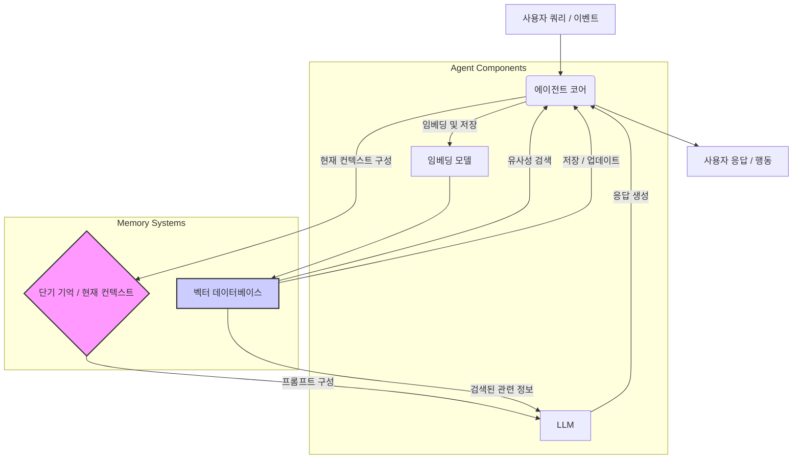

AI 에이전트가 복잡하고 지속적인 상호작용을 성공적으로 수행하려면 장기 기억력은 필수적입니다. 거대 언어 모델(LLM)의 컨텍스트 윈도우(context window)는 그 크기에 한계가 있어, 과거의 대화나 경험을 지속적으로 참조하거나 학습된 지식을 기반으로 의사결정을 개선하는 데 제약이 있습니다. 장기 기억 시스템은 이러한 한계를 극복하고, 에이전트가 시간이 지남에 따라 점진적으로 발전하며 더 정교한 태스크를 처리할 수 있도록 지원합니다. 특히, 복잡한 프로젝트나 사용자별 맞춤형 상호작용이 필요한 시나리오에서는 장기 기억 설계가 에이전트의 성능과 유용성을 결정짓는 핵심 요소로 작용합니다.

## LLM 컨텍스트 윈도우의 한계와 외부 기억 시스템

LLM은 기본적으로 장기 기억을 보유하지 않으며, 현재 입력된 컨텍스트 윈도우 내의 정보만을 처리할 수 있습니다. 이는 마치 단기 기억 상실증 환자와 유사하여, 이전 상호작용이나 학습 내용을 스스로 기억하여 다음 단계에 활용하기 어렵게 만듭니다. 이러한 한계를 극복하기 위해 에이전트는 외부 기억 시스템(External Memory Systems)을 활용해야 합니다.

### 벡터 데이터베이스 (Vector Databases)

가장 보편적인 외부 기억 시스템으로, 텍스트를 임베딩(embedding) 벡터 형태로 변환하여 저장하고, 유사성 검색(similarity search)을 통해 관련 정보를 효율적으로 검색하는 데 사용됩니다. 에이전트의 모든 경험, 관찰, 학습된 지식 등이 임베딩 형태로 저장되어 필요할 때마다 검색될 수 있습니다.

### 그래프 데이터베이스 (Graph Databases)

복잡한 지식 관계나 엔티티 간의 상호 연결성을 관리하는 데 유용합니다. 에이전트가 특정 도메인 지식 그래프를 구축하고, 이 지식 그래프 내에서 추론하거나 새로운 관계를 발견하는 데 활용될 수 있습니다.

## RAG (Retrieval Augmented Generation) 패턴을 통한 기억 활용

장기 기억을 활용하는 핵심 패턴은 RAG (Retrieval Augmented Generation)입니다. 에이전트는 사용자의 쿼리나 현재 태스크를 기반으로 외부 지식 저장소에서 가장 관련성이 높은 정보를 검색합니다. 검색된 정보는 LLM의 프롬프트 컨텍스트에 추가되어, LLM이 더 풍부하고 정확한 정보를 바탕으로 추론하고 응답을 생성할 수 있도록 돕습니다.

### 일화 기억 (Episodic Memory)

특정 이벤트나 경험의 순차적인 기록을 의미합니다. 과거 대화 기록, 에이전트가 수행했던 태스크의 단계, 관찰된 환경 변화 등이 여기에 해당합니다. 이를 통해 에이전트는 과거 경험에서 학습하고, 반복적인 실수를 줄이거나 특정 상황에 대한 패턴을 인식할 수 있습니다.

### 의미 기억 (Semantic Memory)

일반적인 지식, 개념, 사실 등을 포함합니다. 에이전트의 페르소나, 사용 가능한 도구에 대한 설명서, 특정 도메인의 전문 지식, 일반 상식 등이 의미 기억에 저장됩니다. 이는 에이전트가 일관성 있는 행동을 유지하고, 광범위한 지식을 바탕으로 유연하게 응답하도록 합니다.

## 메모리 관리 전략

효율적인 장기 기억 시스템을 구축하기 위해서는 적절한 메모리 관리 전략이 필요합니다.

*   **최신성 (Recency)**: 최근에 생성되거나 참조된 정보에 높은 가중치를 부여합니다. 최신 정보가 현재 태스크에 더 관련성이 높을 가능성이 크기 때문입니다.
*   **빈도 (Frequency)**: 자주 참조되는 정보에 높은 가중치를 부여합니다. 이는 에이전트의 핵심 지식이나 자주 필요한 정보일 가능성이 높습니다.
*   **중요도 (Importance)**: 에이전트의 현재 목표나 태스크, 또는 전반적인 에이전트의 역할과 관련된 정보에 높은 가중치를 부여합니다. 중요도 평가는 별도의 소형 LLM이나 휴리스틱 모델을 통해 수행될 수 있습니다.
*   **망각 (Forgetting)**: 비활성 정보나 중요도가 낮은 정보를 주기적으로 정리하여 메모리 저장소의 효율성을 유지합니다. 이는 `성능(performance)`과 `비용(cost)` 최적화에 기여합니다.

## 2026년 최신 트렌드

*   **하이브리드 메모리 아키텍처**: 벡터 DB, 그래프 DB, 관계형 DB 등 여러 저장소를 결합하여 다양한 형태의 지식(구조화된 데이터, 비구조화된 텍스트, 관계형 정보)을 통합 관리하는 접근 방식이 확산되고 있습니다.
*   **자기 성찰 (Self-Reflection) 기반 메모리 통합**: 에이전트가 자신의 행동과 결과를 분석하고, 이로부터 얻은 통찰력을 바탕으로 새로운 지식을 생성하거나 기존 기억을 업데이트하는 메커니즘이 중요해지고 있습니다. 이는 메타 학습(meta-learning) 능력을 강화합니다.
*   **지속적 학습 (Continual Learning)**: 에이전트가 새로운 상호작용과 외부 데이터를 지속적으로 통합하여 지식을 확장하고 적응하는 능력을 강화하는 연구가 활발합니다.

## 코드 예시: RAG 기반 장기 기억 에이전트 (Mock)

다음은 RAG 패턴을 활용하여 장기 기억을 사용하는 AI 에이전트의 간략한 파이썬 예시입니다. 실제 환경에서는 임베딩 모델과 벡터 데이터베이스가 연동됩니다.

```python
import uuid
from typing import List, Dict

# Mock Vector Database
class VectorDB:
    def __init__(self):
        self.store: Dict[str, Dict] = {} # {id: {text: ..., embedding: ...}}
        print("Mock VectorDB initialized.")

    def add(self, texts: List[str], embeddings: List[List[float]]):
        ids = []
        for text, embedding in zip(texts, embeddings):
            _id = str(uuid.uuid4())
            self.store[_id] = {"text": text, "embedding": embedding}
            ids.append(_id)
        print(f"Added {len(texts)} entries to VectorDB.")
        return ids

    def search(self, query_embedding: List[float], k: int = 1):
        # In a real scenario, this would compute cosine similarity
        # For simplicity, we'll return the first k available entries
        print(f"Searching VectorDB for top {k} results...")
        if not self.store:
            return []
        
        results = list(self.store.values())
        return [{"text": entry["text"]} for entry in results[:k]]

# Mock Large Language Model
class LLM:
    def __init__(self):
        print("Mock LLM initialized.")

    def generate(self, prompt: str):
        # Simulate LLM response based on prompt content
        if "과거 대화" in prompt and "장기 기억" in prompt:
            return "과거 대화를 바탕으로, '장기 기억' 개념은 에이전트의 지속적인 학습과 복잡한 문제 해결에 필수적인 요소입니다."
        return "일반적인 답변입니다. 질문에 대한 구체적인 정보가 필요합니다."

# Agent with Long-Term Memory Capabilities
class AgentWithLongTermMemory:
    def __init__(self, llm: LLM, vector_db: VectorDB):
        self.llm = llm
        self.vector_db = vector_db
        self.episodic_memory: List[str] = [] # Short-term within current session
        print("Agent with Long-Term Memory initialized.")

    def _get_embedding(self, text: str) -> List[float]:
        # Dummy embedding function: In real-world, use an actual embedding model
        return [hash(text) % 1000 / 1000.0] * 1536 # Example: 1536-dim vector

    def add_to_memory(self, interaction: str, is_episodic: bool = True):
        if is_episodic:
            self.episodic_memory.append(interaction)
        # Store in vector DB for long-term recall, regardless of type
        self.vector_db.add([interaction], [self._get_embedding(interaction)])
        print(f"Added '{interaction}' to memory.")

    def recall_from_long_term_memory(self, query: str, k: int = 3) -> List[str]:
        query_embedding = self._get_embedding(query)
        results = self.vector_db.search(query_embedding, k=k)
        return [res["text"] for res in results]

    def process_query(self, query: str):
        self.add_to_memory(f"사용자 쿼리: {query}")
        
        # 1. Recall relevant long-term memories based on the query
        recalled_memories = self.recall_from_long_term_memory(query, k=2)
        
        # 2. Construct context for LLM
        context = f"현재 대화 요약 (최근 3개): {', '.join(self.episodic_memory[-3:])}\n" \
                  f"과거 기억에서 검색된 관련 정보: {', '.join(recalled_memories) if recalled_memories else '없음'}\n" \
                  f"사용자 질문: {query}"
        
        # 3. Generate response using LLM
        response = self.llm.generate(context)
        self.add_to_memory(f"에이전트 응답: {response}")
        return response

# Example Usage
llm_model = LLM()
vector_store = VectorDB()
agent = AgentWithLongTermMemory(llm_model, vector_store)

print("\n--- 첫 번째 상호작용 ---")
response1 = agent.process_query("장기 기억력을 가진 AI 에이전트는 무엇인가요?")
print(f"에이전트 응답: {response1}")

print("\n--- 두 번째 상호작용 (시간 경과 후) ---")
response2 = agent.process_query("이전에 설명한 '장기 기억' 개념에 대해 더 자세히 알려주세요.")
print(f"에이전트 응답: {response2}")
```

## 장기 기억 에이전트 아키텍처



## 트레이드오프

장기 기억을 가진 AI 에이전트를 설계할 때는 여러 트레이드오프를 고려해야 합니다.

*   **RAG 기반 메모리 시스템 복잡성 vs. LLM 컨텍스트 윈도우 효율성**: 
    *   **언제 좋은가?**: LLM의 컨텍스트 윈도우 제한을 넘어 방대한 양의 정보를 처리하고, 최신 정보나 특정 도메인 지식을 활용해야 할 때 RAG는 효율적입니다. 환각(hallucination)을 줄이고 사실적 정확성을 높일 수 있습니다.
    *   **언제 나쁜가?**: 추가적인 인프라(벡터 DB, 임베딩 모델) 및 검색 로직 관리가 필요하여 시스템 복잡성이 증가하며, 검색 지연 시간이 전체 응답 시간에 영향을 줄 수 있습니다. 단순하거나 단기적인 태스크에는 과도한 오버헤드가 될 수 있습니다.

*   **메모리 스토어의 데이터 정합성 vs. 실시간 업데이트 요구사항**: 
    *   **언제 좋은가?**: 에이전트의 지식이 자주 변경되거나 최신 정보에 대한 즉각적인 반영이 필요한 경우, 실시간 또는 준실시간 업데이트 파이프라인을 구축하여 에이전트의 의사결정 품질을 향상시킬 수 있습니다.
    *   **언제 나쁜가?**: 데이터 정합성 유지를 위한 복잡한 동기화 메커니즘이 필요하며, 업데이트 빈도가 높을수록 인덱싱 비용 및 컴퓨팅 자원 소모가 커집니다. 데이터 불일치 또는 지연 문제가 발생할 위험이 있습니다.

*   **메모리 추상화 및 압축 vs. 정보 손실 위험**: 
    *   **언제 좋은가?**: 에이전트가 장기간 운영되면서 발생하는 방대한 데이터를 효율적으로 관리하고, 관련성 높은 정보를 LLM 컨텍스트 윈도우에 효과적으로 넣기 위해 중요 정보만을 요약하거나 추상화할 때 유용합니다. `비용(cost)` 및 `성능(performance)` 최적화에 기여합니다.
    *   **언제 나쁜가?**: 추상화 과정에서 세부 정보가 손실되어 에이전트의 미묘한 의사결정이나 특정 상황 판단에 필요한 디테일이 누락될 수 있습니다. 정보 손실이 치명적인 경우(예: 법률, 의료 분야)에는 신중한 접근이 필요합니다.

## 실전 체크리스트

장기 기억력을 가진 AI 에이전트를 프로젝트에 적용할 때 다음 항목들을 검증해야 합니다.

*   [ ] **메모리 저장소 선택**: 사용 사례의 데이터 규모, 접근 패턴, 정합성 요구사항을 고려하여 벡터 데이터베이스(Vector Database), 그래프 데이터베이스(Graph Database), 또는 하이브리드(Hybrid) 아키텍처 중 최적의 솔루션을 선정했는가?
*   [ ] **임베딩 모델 일관성**: 메모리 저장 및 검색에 사용되는 임베딩 모델(Embedding Model)이 일관성을 유지하며, 특정 도메인에 특화된 모델이 필요한 경우 해당 모델을 적용했는가?
*   [ ] **RAG 검색 전략 최적화**: 검색 쿼리 증강, 다단계 검색, 재랭킹(Reranking) 등 고급 RAG 전략을 도입하여 검색 정확도와 재현율(Recall)을 극대화했는가?
*   [ ] **메모리 관리 정책 정의**: Recency, Frequency, Importance 기반의 메모리 관리 및 망각(Forgetting) 정책을 명확히 정의하고, 이를 통해 메모리 저장소의 효율성을 지속적으로 유지하고 있는가?
*   [ ] **자기 성찰 (Self-Reflection) 메커니즘 구현**: 에이전트가 자신의 행동과 결과를 평가하고, 새로운 지식을 생성하거나 기존 기억을 업데이트하는 자기 성찰 루프를 설계하고 구현했는가?
*   [ ] **지속적 학습 파이프라인 구축**: 에이전트가 새로운 상호작용과 외부 데이터를 기반으로 지식을 지속적으로 학습하고 업데이트할 수 있는 데이터 파이프라인을 구축했는가?
*   [ ] **메모리 시스템 성능 모니터링**: 메모리 시스템의 검색 지연 시간(Latency), 처리량(Throughput), 저장 `비용(cost)` 등을 지속적으로 모니터링하고, 병목 현상 발생 시 즉각적으로 대응할 수 있는 시스템을 갖추었는가?