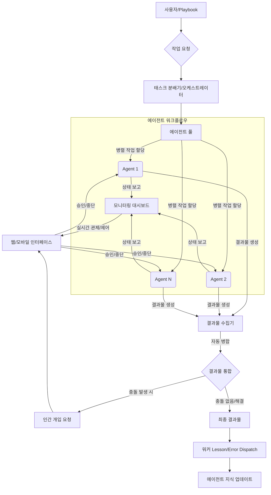

AI 에이전트 기반 개발 환경에서 생산성을 극대화하기 위해서는 에이전트의 작업을 효율적으로 관제하고 병렬 작업을 관리하는 기능이 필수적입니다. 특히 Claude Code와 같은 터미널 기반 에이전트가 여러 머신에서 동시에 작업할 때, 각 세션의 상태를 파악하고 결과물을 통합하는 과정은 상당한 오버헤드를 발생시킵니다. ADHDev는 이러한 문제에 대한 실질적인 해결책을 제시하며, Playbook의 '프로젝트 관제탑' 기능을 강화하는 데 중요한 벤치마킹 포인트를 제공합니다.

## AI 에이전트 관제 및 병렬 작업 관리의 필요성

AI 에이전트, 특히 코드 생성 및 수정 작업을 수행하는 에이전트는 복잡한 태스크를 여러 단계로 나누어 처리하며, 때로는 동시에 여러 에이전트가 다른 부분을 담당해야 합니다. 이러한 분산된 작업 환경에서 개발자는 다음 질문에 직면합니다:

*   어떤 에이전트가 현재 활성 상태인가?
*   어떤 태스크가 완료되었고, 어떤 에이전트가 중단되었는가?
*   인간의 승인(Human-in-the-Loop)을 기다리는 작업은 무엇인가?
*   여러 에이전트가 생성한 코드나 문서를 어떻게 효과적으로 병합할 것인가?

이러한 불확실성은 개발 프로세스를 지연시키고, '워커 lesson/error dispatch'의 효율을 저해하여 에이전트의 학습 및 개선 주기를 늦춥니다. ADHDev의 접근 방식은 이러한 문제를 웹/모바일 인터페이스를 통해 실시간으로 해결하고, 병렬 작업의 라이프사이클을 자동화하는 데 초점을 맞춥니다. 2026년의 최신 트렌드는 에이전트 시스템이 단순히 작업을 자동화하는 것을 넘어, 투명한 운영(transparent operation)과 효율적인 협업(efficient collaboration)을 위한 고도화된 관제 기능을 요구합니다.

### ADHDev 벤치마킹을 통한 Playbook 관제탑 기능 강화

Playbook은 '프로젝트 관제탑' 기능을 통해 에이전트의 활동을 통합적으로 관리하는 것을 목표로 합니다. ADHDev의 핵심 아이디어는 다음과 같은 방식으로 Playbook의 기능을 확장할 수 있습니다:

1.  **실시간 에이전트 작업 상태 시각화 (Real-time Agent Task Status Visualization):**
    각 Claude Code 하네스 세션의 상태(Running, Paused, Awaiting Approval, Completed, Error)를 웹 및 모바일 대시보드에서 명확하게 표시합니다. 이는 터미널 로그를 일일이 확인하는 수고를 덜어주고, 한눈에 시스템 전반의 건강 상태를 파악할 수 있게 합니다.

2.  **웹/모바일 기반 제어 (Web/Mobile-based Control):**
    대시보드에서 직접 특정 에이전트 세션을 일시 중지, 재개, 승인, 또는 강제 종료할 수 있는 기능을 제공합니다. 이는 긴급 상황 대응 및 미세 조정을 가능하게 하여, 에이전트의 폭주(runaway)를 방지하고 리소스 소비를 최적화합니다.

3.  **병렬 작업 관리 (Parallel Task Management):**
    Playbook의 워크플로우 엔진이 여러 에이전트에게 독립적인 서브태스크를 동시에 할당하고, 각 태스크의 진행 상황을 개별적으로 추적합니다. 이는 대규모 프로젝트에서 개발 시간을 단축하는 데 기여합니다.

4.  **자동 결과물 병합 (Automated Result Merging):**
    병렬로 실행된 에이전트 작업의 결과물(예: 코드 변경 사항, 문서 초안, 테스트 결과)을 자동으로 수집하고, Git merge, semantic diff/patching 등의 기술을 활용하여 통합하는 워크플로우를 구축합니다. 충돌(conflict) 발생 시에는 인간의 개입을 요청하는 메커니즘을 제공하여, '워커 lesson/error dispatch'의 중요한 학습 포인트로 활용합니다.

다음 Mermaid 다이어그램은 이 강화된 워크플로우를 시각화합니다.



### 구현 예시: Playbook 에이전트 하네스 (Python)

Playbook 환경에서 ADHDev에서 영감을 받은 에이전트 오케스트레이션 기능을 구현하는 개념적인 Python 코드는 다음과 같습니다. `AgentHarness`는 에이전트의 작업을 래핑하고, 상태를 업데이트하며, 병렬 실행을 관리합니다.

```python
import threading
import time
from enum import Enum
from typing import Dict, Any, Callable

class AgentStatus(Enum):
    IDLE = "IDLE"
    RUNNING = "RUNNING"
    PAUSED = "PAUSED"
    AWAITING_APPROVAL = "AWAITING_APPROVAL"
    COMPLETED = "COMPLETED"
    FAILED = "FAILED"

class PlaybookAgentOrchestrator:
    def __init__(self):
        self.agent_sessions: Dict[str, Dict[str, Any]] = {}
        self.task_queue: list = []
        self.lock = threading.Lock()

    def register_agent_session(self, session_id: str, agent_name: str, task_fn: Callable):
        with self.lock:
            self.agent_sessions[session_id] = {
                "agent_name": agent_name,
                "status": AgentStatus.IDLE,
                "task_fn": task_fn,
                "result": None,
                "thread": None
            }
        print(f"[Orchestrator] Session '{session_id}' registered for {agent_name}")

    def _run_agent_task(self, session_id: str):
        session = self.agent_sessions[session_id]
        try:
            self.update_agent_status(session_id, AgentStatus.RUNNING)
            print(f"[Agent:{session['agent_name']}] Task started for session {session_id}")
            result = session["task_fn"]()
            session["result"] = result
            self.update_agent_status(session_id, AgentStatus.COMPLETED)
            print(f"[Agent:{session['agent_name']}] Task completed for session {session_id}")
        except Exception as e:
            session["result"] = str(e)
            self.update_agent_status(session_id, AgentStatus.FAILED)
            print(f"[Agent:{session['agent_name']}] Task failed for session {session_id}: {e}")

    def dispatch_task(self, session_id: str):
        with self.lock:
            if session_id not in self.agent_sessions:
                print(f"[Orchestrator] Error: Session '{session_id}' not found.")
                return
            if self.agent_sessions[session_id]["status"] != AgentStatus.IDLE:
                print(f"[Orchestrator] Session '{session_id}' is not idle.")
                return
            
            thread = threading.Thread(target=self._run_agent_task, args=(session_id,))
            self.agent_sessions[session_id]["thread"] = thread
            thread.start()

    def update_agent_status(self, session_id: str, status: AgentStatus):
        with self.lock:
            if session_id in self.agent_sessions:
                self.agent_sessions[session_id]["status"] = status
                # Real-time dashboard update would happen here
                # e.g., push to a WebSocket or message queue

    def get_agent_status(self, session_id: str) -> AgentStatus:
        with self.lock:
            return self.agent_sessions.get(session_id, {}).get("status", AgentStatus.IDLE)

    def get_all_agent_statuses(self) -> Dict[str, AgentStatus]:
        with self.lock:
            return {sid: data["status"] for sid, data in self.agent_sessions.items()}

    def request_approval(self, session_id: str, message: str):
        self.update_agent_status(session_id, AgentStatus.AWAITING_APPROVAL)
        print(f"[Orchestrator] Session '{session_id}' awaiting approval: {message}")
        # Notification to human via web/mobile interface

    def approve_task(self, session_id: str):
        if self.get_agent_status(session_id) == AgentStatus.AWAITING_APPROVAL:
            print(f"[Orchestrator] Session '{session_id}' approved. Resuming...")
            # Logic to resume agent, e.g., signal the paused thread
            self.update_agent_status(session_id, AgentStatus.RUNNING) # Or continue previous status
        else:
            print(f"[Orchestrator] Session '{session_id}' not in AWAITING_APPROVAL state.")

# --- Usage Example ---
orchestrator = PlaybookAgentOrchestrator()

def agent_task_code_gen():
    print("    [Agent CodeGen] Generating code...")
    time.sleep(2)
    print("    [Agent CodeGen] Code generated.")
    return {"code": "def hello_world(): return 'Hello'"}

def agent_task_test_gen():
    print("    [Agent TestGen] Generating tests...")
    time.sleep(3)
    print("    [Agent TestGen] Tests generated.")
    return {"tests": "test_hello_world.py"}

orchestrator.register_agent_session("session_1", "ClaudeCodeGen", agent_task_code_gen)
orchestrator.register_agent_session("session_2", "ClaudeTestGen", agent_task_test_gen)

orchestrator.dispatch_task("session_1")
orchestrator.dispatch_task("session_2")

# Simulate monitoring via web/mobile
for _ in range(5):
    print(f"[Monitor] Current statuses: {orchestrator.get_all_agent_statuses()}")
    time.sleep(1)

# Simulate a scenario where Agent 1 needs approval
orchestrator.update_agent_status("session_1", AgentStatus.AWAITING_APPROVAL)
orchestrator.request_approval("session_1", "Please review generated code for security risks.")
print(f"[Monitor] After approval request: {orchestrator.get_all_agent_statuses()}")

orchestrator.approve_task("session_1")
print(f"[Monitor] After approval: {orchestrator.get_all_agent_statuses()}")

# Wait for all threads to finish for clean shutdown
for sid, data in orchestrator.agent_sessions.items():
    if data["thread"] and data["thread"].is_alive():
        data["thread"].join()

print("\n--- Final Results ---")
for sid, data in orchestrator.agent_sessions.items():
    print(f"Session {sid} ({data['agent_name']}): Status={data['status'].value}, Result={data['result']}")
```

위 코드는 Playbook의 오케스트레이터가 에이전트 세션을 등록하고, 태스크를 병렬로 디스패치하며, 실시간으로 상태를 업데이트하고 모니터링하는 기본적인 프레임워크를 보여줍니다. 실제 시스템에서는 이 상태 업데이트가 웹소켓(WebSocket)이나 메시지 큐(Message Queue)를 통해 중앙 대시보드로 푸시되어 사용자에게 실시간으로 반영될 것입니다. 결과물 병합은 에이전트 작업 완료 후 별도의 서비스에서 Git merge 또는 기타 코드 통합 로직을 통해 처리됩니다.

## 트레이드오프

AI 에이전트 관제 및 병렬 작업 관리 기능 강화는 여러 트레이드오프를 수반합니다. 이를 고려하여 Playbook의 전략을 수립해야 합니다.

*   **복잡성 증가 vs. 효율성 향상**: 이 기능을 도입하면 초기 시스템 설계 및 구현의 복잡성이 크게 증가합니다. 다중 에이전트 상태 관리, 병렬 처리 동기화, 결과물 병합 로직 구현은 개발 비용과 시간이 많이 듭니다. 그러나 일단 구축되면 장기적으로 프로젝트의 생산성과 관리 효율성을 비약적으로 향상시킬 수 있습니다. 따라서 대규모의 장기 프로젝트에 적합하며, 소규모 단기 프로젝트에서는 초기 오버헤드가 더 클 수 있습니다.
*   **중앙 집중식 제어 vs. 에이전트 자율성**: 웹/모바일 인터페이스를 통한 중앙 집중식 관제 및 제어는 개발자가 에이전트의 오작동을 즉시 파악하고 개입할 수 있게 합니다. 이는 안정성과 예측 가능성을 높이지만, 에이전트의 완전한 자율성을 제한할 수 있습니다. 에이전트의 복잡성과 신뢰도에 따라 자율성과 제어의 균형점을 찾는 것이 중요합니다. 미션 크리티컬한 작업에는 엄격한 제어가, 탐색적/실험적 작업에는 높은 자율성이 유리합니다.
*   **자동 병합 정확도 vs. 수동 검토 필요성**: 자동 병합 기능은 개발자의 수작업을 크게 줄여주지만, 특히 코드 변경과 같은 복잡한 결과물에서는 완벽한 정확도를 보장하기 어렵습니다. 잘못된 자동 병합은 오히려 새로운 버그를 유발할 수 있습니다. 따라서 자동 병합 후에도 일정 수준의 인간 검토(Human Review) 프로세스를 유지해야 합니다. 반복적이고 예측 가능한 작업의 경우 자동 병합 비율을 높이고, 복잡하거나 민감한 영역에서는 수동 검토 비중을 높이는 전략이 필요합니다.
*   **모니터링 오버헤드 vs. 가시성 확보**: 실시간 에이전트 상태 모니터링 시스템은 추가적인 리소스(CPU, 메모리, 네트워크)와 저장 공간을 요구합니다. 모든 에이전트의 모든 상태 변화를 기록하고 전송하는 것은 시스템에 상당한 부하를 줄 수 있습니다. 그러나 이 오버헤드는 문제 발생 시 빠른 진단과 해결을 가능하게 하여 장기적인 관점에서 불필요한 비용을 줄여줍니다. 초기에는 핵심 지표 위주로 모니터링을 시작하고, 필요에 따라 점진적으로 확장하는 방식이 효과적입니다.

## 실전 체크리스트

Playbook의 AI 에이전트 관제 및 병렬 작업 관리 기능을 강화하기 위한 실전 체크리스트는 다음과 같습니다.

*   - [ ] **에이전트 작업 상태 대시보드 구현 여부:** 각 Claude Code 하네스 세션의 상태(Running, Paused, Awaiting Approval, Completed, Error)를 실시간으로 표시하는 웹/모바일 대시보드가 구축되었는가?
*   - [ ] **병렬 작업 디스패치 및 할당 전략 수립 여부:** 복수의 에이전트에게 서브태스크를 효율적으로 분배하고, 각 에이전트의 작업 부하를 균형 있게 관리하는 워크플로우와 전략이 정의되었는가?
*   - [ ] **에이전트 제어 인터페이스 구현 여부:** 대시보드에서 특정 에이전트 세션을 일시 중지, 재개, 승인, 또는 강제 종료할 수 있는 기능이 웹/모바일 인터페이스를 통해 제공되는가?
*   - [ ] **결과물 자동 병합 메커니즘 설계 및 테스트 여부:** 병렬 작업으로 생성된 코드, 문서 등 결과물을 자동으로 수집하고, 충돌 감지 및 해결(Git merge, semantic diff)을 포함한 통합 메커니즘이 설계 및 충분히 테스트되었는가?
*   - [ ] **인간 개입(Human-in-the-Loop) 워크플로우 통합 여부:** 에이전트 작업 중 인간의 승인이 필요한 지점(예: 중요한 코드 변경, 모호한 의사결정)에서 적절한 알림 및 승인/반려 워크플로우가 통합되었는가?
*   - [ ] **'워커 lesson/error dispatch' 시스템 연동 여부:** 에이전트의 실패, 충돌, 또는 인간의 개입이 발생한 경우, 해당 이벤트를 '워커 lesson/error dispatch' 시스템으로 자동 전송하여 에이전트 학습 데이터로 활용하는 파이프라인이 구축되었는가?
*   - [ ] **시스템 확장성 및 안정성 검증 여부:** 동시에 수십 개 이상의 에이전트 세션을 안정적으로 관제하고 병렬 작업을 처리할 수 있도록 시스템 부하 테스트 및 장애 복구 시나리오 검증이 완료되었는가?