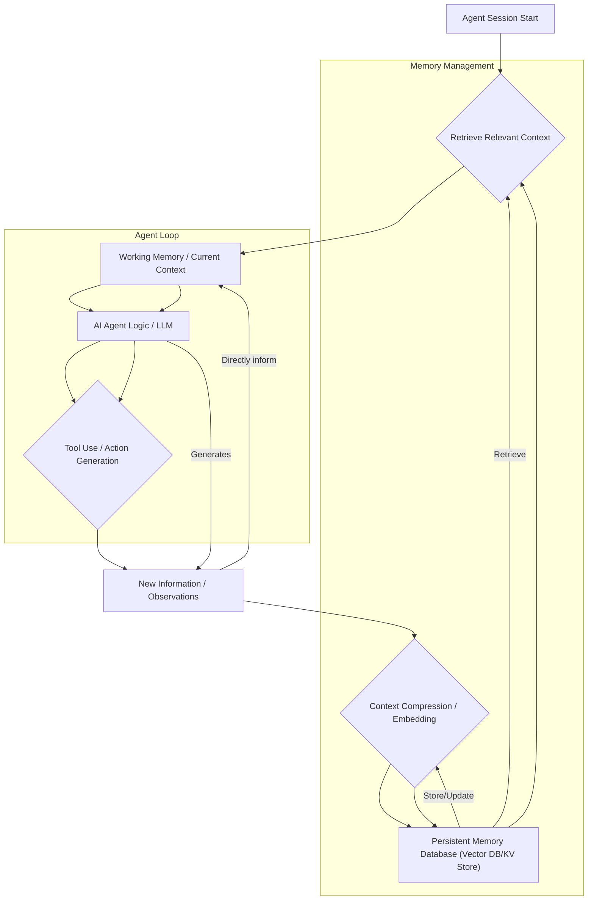

## AI 에이전트의 영구 메모리 시스템 도입: 세션 간 컨텍스트 유지의 중요성
AI 에이전트, 특히 복잡한 코딩이나 장기 프로젝트를 수행하는 에이전트는 세션이 종료되면 이전의 모든 학습과 컨텍스트를 잊어버리는 문제에 직면합니다. 이는 매 세션마다 스택, 아키텍처, 기존 코드베이스에 대한 설명을 재차 제공해야 하는 비효율성을 초래하며, 대규모 언어 모델 (LLM)의 제한적인 컨텍스트 윈도우 한계를 더욱 심화시킵니다. 이러한 문제를 해결하기 위해 영구 메모리 시스템 (Persistent Memory System) 도입은 AI 에이전트의 효율성과 자율성을 획기적으로 향상시킬 수 있는 핵심 전략입니다.

### 왜 영구 메모리가 필요한가?
AI 에이전트가 복잡한 작업을 수행하거나 여러 단계를 거쳐야 하는 프로젝트에 참여할 때, 이전의 결정, 사용한 도구, 생성된 코드, 발생한 오류 등 모든 정보는 다음 단계를 위한 중요한 컨텍스트가 됩니다. 그러나 현재 대부분의 에이전트 시스템은 세션 기반으로 동작하며, 세션이 끝나면 이 컨텍스트가 사라집니다. 이는 다음과 같은 문제점을 야기합니다.

*   **비효율적인 반복 작업**: 매번 동일하거나 유사한 컨텍스트를 다시 주입해야 하므로, 불필요한 토큰 소비와 시간 낭비가 발생합니다.
*   **컨텍스트 윈도우 한계**: LLM의 컨텍스트 윈도우는 아무리 커져도 무한하지 않으며, 모든 과거 정보를 담기 어렵습니다. 중요한 정보를 압축하여 저장하고 필요할 때 불러오는 메커니즘이 필수적입니다.
*   **장기 목표 달성 어려움**: 장기적인 목표를 가진 에이전트는 일관된 컨텍스트 없이는 진행 상황을 기억하고 계획을 수정하기 어렵습니다.
*   **정체된 지식 (Stale Knowledge) 문제**: 시간이 지남에 따라 정보의 관련성이 떨어지거나 최신 정보와 충돌할 수 있습니다. 영구 메모리는 이러한 지식의 관리 및 업데이트 메커니즘을 포함해야 합니다.

### agentmemory 라이브러리 활용 전략
`agentmemory`와 같은 라이브러리는 AI 코딩 에이전트의 영구 메모리 시스템 구축을 위한 강력한 도구입니다. 이 라이브러리는 에이전트의 도구 사용 내역이나 중간 생각 과정 등을 백그라운드에서 자동으로 캡처하고 압축하여 저장합니다. 다음 세션이 시작될 때, 이 저장된 컨텍스트를 에이전트에게 다시 주입함으로써 연속성을 제공합니다.

핵심 동작 방식은 다음과 같습니다:
1.  **자동 캡처**: 에이전트가 수행하는 모든 관련 작업 (API 호출, 파일 I/O, 코드 생성, 중간 결과 등)을 자동으로 기록합니다.
2.  **압축 및 임베딩**: 기록된 데이터를 효율적인 형태로 압축하고, Vector Embedding을 통해 의미적으로 유사한 정보를 빠르게 검색할 수 있도록 인덱싱합니다.
3.  **영구 저장**: 파일 시스템, 데이터베이스, 혹은 벡터 데이터베이스 (Vector DB) 등의 영구 저장소에 데이터를 보관합니다.
4.  **컨텍스트 주입**: 새로운 세션 시작 시, 현재 작업에 가장 관련성이 높은 과거 컨텍스트를 검색하여 에이전트에게 제공합니다.

이는 `playbook`의 허브-워커 (Hub-Worker) 복리 자동화 패턴에 통합될 때 큰 시너지를 발휘할 수 있습니다. 각 워커 세션 간 컨텍스트를 유지함으로써, 워커들은 이전 작업의 상태와 학습 내용을 기반으로 다음 작업을 효율적으로 수행할 수 있게 됩니다.

### 영구 메모리 시스템 아키텍처
영구 메모리 시스템은 단순한 저장소를 넘어, 에이전트의 학습과 행동을 지속적으로 지원하는 지식 기반 역할을 합니다. 다음은 일반적인 영구 메모리 시스템의 구성 요소와 정보 흐름을 나타내는 Mermaid 다이어그램입니다.

다이어그램에서 볼 수 있듯이, 에이전트 세션은 영구 메모리에서 관련 컨텍스트를 검색하여 시작하고, 작업 중 생성되는 새로운 정보는 압축 및 임베딩 과정을 거쳐 영구 메모리에 다시 저장됩니다. 이 순환적인 구조는 에이전트가 지속적으로 학습하고 진화할 수 있도록 합니다.

### 2026년 트렌드와 영구 메모리
2026년에는 AI 에이전트가 더욱 복잡하고 자율적인 역할을 수행할 것으로 예상됩니다. 이 트렌드 속에서 영구 메모리 시스템은 다음과 같은 핵심적인 역할을 담당할 것입니다.

*   **강화된 자율 학습**: 에이전트가 직접 경험을 통해 학습하고, 그 학습 결과를 영구적으로 저장하여 다음 작업에 활용하는 자율 학습 루프의 핵심 구성 요소가 됩니다.
*   **멀티 에이전트 협업 효율 증대**: 여러 에이전트가 협업하는 시스템에서, 각 에이전트의 개별적인 지식과 공유 지식을 영구적으로 관리함으로써 팀워크와 문제 해결 능력을 향상시킵니다.
*   **개인화된 AI 서비스**: 사용자별 맞춤형 AI 서비스에서 개인의 선호, 과거 상호작용, 학습 이력을 영구 메모리에 저장하여 더욱 정교하고 개인화된 경험을 제공합니다.
*   **코드베이스 이해 및 유지보수**: 코딩 에이전트가 대규모 코드베이스를 지속적으로 학습하고, 변경 사항을 반영하며, 복잡한 리팩토링이나 버그 수정 작업을 더 효과적으로 수행할 수 있도록 지원합니다.

## 트레이드오프

### 1. 컨텍스트 정확도 vs. 저장 비용
*   **언제 좋고**: 높은 정확도의 컨텍스트 저장은 에이전트의 작업 품질을 향상시키고 재학습 비용을 줄입니다. 특히 중요한 결정이나 복잡한 코드 생성 작업에 유리합니다.
*   **언제 나쁜지**: 모든 정보를 무분별하게 저장하면 저장 공간 및 관리 비용이 급증하며, 검색 시 불필요한 노이즈가 발생할 수 있습니다. 제한된 자원 환경이나 실시간 처리 요구사항이 높은 경우 불리합니다.

### 2. 즉각적인 검색 성능 vs. 지식 유지 관리 복잡성
*   **언제 좋고**: 벡터 DB와 같은 고성능 검색 시스템은 에이전트가 필요한 정보를 빠르게 찾아 컨텍스트로 활용할 수 있게 하여 반응성을 높입니다. 이는 대화형 에이전트나 실시간 코드 제안에 유용합니다.
*   **언제 나쁜지**: 지식의 최신성 유지, 중복 제거, 부정확하거나 오래된 정보의 폐기 등 메모리 유지 관리 로직이 복잡해질 수 있습니다. 특히 빠르게 변화하는 환경에서 지식의 `stale` 문제를 해결하기 위한 추가 개발 및 운영 오버헤드가 발생합니다.

### 3. 자동화된 컨텍스트 캡처 vs. 에이전트 행동 예측 가능성
*   **언제 좋고**: `agentmemory`처럼 백그라운드에서 자동으로 에이전트의 행동을 캡처하고 저장하는 방식은 개발자의 개입 없이 에이전트의 학습 데이터를 축적하고, 휴먼 인 더 루프 (Human-in-the-loop) 없이 자율성을 높일 수 있습니다.
*   **언제 나쁜지**: 캡처 메커니즘이 불투명하거나 과도하게 많은 정보를 저장할 경우, 에이전트가 어떤 정보를 기반으로 추론하는지 파악하기 어려워 `디버깅` 및 `감사(audit)`가 복잡해질 수 있습니다. 예기치 않은 과거 컨텍스트가 주입되어 오작동을 일으킬 위험도 존재합니다.

### 4. 범용 메모리 시스템 vs. 도메인 특화 메모리
*   **언제 좋고**: 범용적인 영구 메모리 시스템은 다양한 에이전트와 태스크에 재사용될 수 있어 개발 효율성을 높입니다. 초기 도입 및 테스트에 유리합니다.
*   **언제 나쁜지**: 특정 도메인(예: 코드 생성, 과학 연구)에서는 해당 도메인의 특성을 반영한 최적화된 데이터 구조나 검색 로직이 필요할 수 있습니다. 범용 시스템은 이러한 최적화를 제공하기 어려워 성능이나 정확도가 저하될 수 있습니다.

## 실전 체크리스트

프로젝트에 AI 에이전트 영구 메모리 시스템을 도입할 때 다음 항목들을 검증해야 합니다:

- [ ] **컨텍스트 캡처 범위 정의**: 에이전트의 어떤 행동 (도구 사용, 코드 생성, 사용자 피드백, 내부 추론)이 영구 메모리에 저장될 가치가 있는지 명확히 정의되었는가?
- [ ] **데이터 압축 및 임베딩 전략 검증**: 저장될 컨텍스트가 효율적으로 압축되고, 검색 성능을 위한 적절한 임베딩 모델과 전략이 적용되었는지 (예: 청크 크기, 임베딩 모델 선택) 확인되었는가?
- [ ] **컨텍스트 검색 관련성 평가**: 검색된 과거 컨텍스트가 현재 에이전트의 태스크에 얼마나 관련성이 높은지 정량적으로 평가하고 (예: RAGAS 메트릭), 기준치 이상의 정확도를 보이는가?
- [ ] **메모리 저장소의 확장성 및 내구성**: 선택된 영구 메모리 저장소 (파일 시스템, 벡터 DB 등)가 예상되는 데이터 볼륨과 에이전트 수에 대해 확장 가능하며, 데이터 손실 없이 안정적으로 운영될 수 있는가?
- [ ] **지식 업데이트 및 만료 정책 구현**: 오래되거나 부정확한 지식을 자동으로 제거하거나 업데이트하는 `aging` 또는 `eviction` 정책이 설계 및 구현되어 `stale` 컨텍스트 문제를 방지하는가?
- [ ] **보안 및 개인정보 보호**: 민감한 정보가 영구 메모리에 저장될 경우, 암호화, 접근 제어 등 적절한 보안 및 개인정보 보호 조치가 적용되었는가?
- [ ] **성능 오버헤드 측정**: 영구 메모리 시스템 도입으로 인한 전체 에이전트 응답 시간 및 컴퓨팅 자원 사용량 증가가 허용 가능한 범위 내에 있는지 측정 및 최적화되었는가?