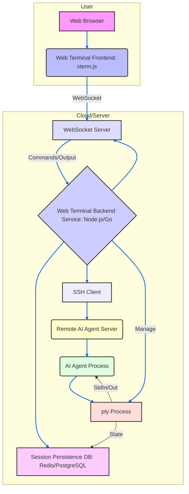

AI 에이전트의 원격 관리 시 발생하는 세션 단절 문제는 개발자 및 운영자의 생산성을 크게 저해하는 요소입니다. 특히 Claude Code와 같은 대규모 언어 모델(LLM) 기반의 에이전트가 장시간 복잡한 작업을 수행할 때, 노트북을 닫거나 네트워크 환경이 불안정해지면 SSH 세션이 끊겨 작업 컨텍스트가 유실되는 경우가 빈번합니다. 이러한 문제는 모바일 환경에서의 접근성을 제한하며, 웹 브라우저 기반의 일회성 터미널 경험 또한 영구적인 작업 흐름을 지원하지 못하는 한계점을 가집니다. 이 엔트리에서는 AI 에이전트의 원활한 원격 관리 및 세션 지속성을 보장하기 위한 Persistent Web Terminal 솔루션의 아키텍처와 구현 전략을 제시합니다.

## Persistent Web Terminal의 필요성 및 아키텍처

AI 에이전트는 복잡한 개발, 데이터 분석, 시스템 관리 등의 작업을 수행하며 예측 불가능한 실행 시간을 가질 수 있습니다. 기존의 SSH + tmux 조합은 어느 정도의 세션 지속성을 제공하지만, 모바일 환경에서의 사용성, 브라우저 기반의 통합 UX, 그리고 복잡한 협업 시나리오에는 부적합합니다. Persistent Web Terminal은 클라이언트-서버 모델을 통해 이러한 문제점을 해결하며, 에이전트와의 상호작용 세션을 서버 측에서 영구적으로 유지하고 브라우저를 통해 언제든 재접속하여 작업을 이어서 진행할 수 있도록 합니다.

### 핵심 아키텍처 구성 요소

1.  **Web Terminal Backend Service**: WebSocket 서버를 포함하며, 클라이언트의 요청을 받아 실제 터미널 프로세스(e.g., `bash`, `zsh`)를 생성하고 관리합니다. `pty` (pseudo-terminal) 라이브러리를 사용하여 프로세스의 I/O를 캡처하고 WebSocket을 통해 클라이언트에 전달합니다. 세션 상태를 저장하고 복원하는 로직을 포함합니다.
2.  **Web Terminal Frontend**: `xterm.js`와 같은 라이브러리를 사용하여 브라우저에서 터미널 에뮬레이션을 구현합니다. WebSocket을 통해 Backend Service와 실시간으로 통신하며, 사용자 입력을 Backend로 전달하고 Backend로부터 받은 출력을 화면에 렌더링합니다.
3.  **Session Management Layer**: 사용자 인증, 권한 부여, 세션 영속화(persistence)를 담당합니다. Redis 또는 데이터베이스를 사용하여 활성 세션 상태, 연결된 `pty` 프로세스 정보 등을 저장하고, 클라이언트 재접속 시 해당 세션을 로드하여 연결합니다.
4.  **SSH Proxy/Agent Integration**: AI 에이전트가 동작하는 원격 서버와의 SSH 연결을 관리합니다. Backend Service는 SSH 클라이언트 역할을 하여 에이전트의 SSH 세션을 시작하고, 이 세션을 `pty` 프로세스와 연결하여 웹 터미널을 통해 제어할 수 있도록 합니다.



### 구현 예시 (Node.js)

Node.js 환경에서 `express`와 `ws` (WebSocket), 그리고 `node-pty` 라이브러리를 사용하여 기본적인 persistent 웹 터미널 백엔드를 구현할 수 있습니다. `node-pty`는 pseudo-terminal을 생성하고 프로세스와의 I/O를 처리합니다. 세션 지속성은 각 `pty` 프로세스의 상태를 저장하고, 클라이언트가 재접속할 때 해당 상태를 다시 연결하는 방식으로 구현됩니다.

```javascript
// server.js (Simplified for illustration)
const express = require('express');
const { WebSocketServer } = require('ws');
const pty = require('node-pty');

const app = express();
const port = 3000;

// Map to store active pty sessions
const ptySessions = new Map(); // sessionId -> { ptyProcess, wsConnection }

app.use(express.static('public')); // Serve frontend files

const server = app.listen(port, () => {
  console.log(`Server listening on port ${port}`);
});

const wss = new WebSocketServer({ server });

wss.on('connection', (ws, req) => {
  const sessionId = req.url.split('/')[1]; // Extract session ID from URL
  let ptyProcess;

  if (ptySessions.has(sessionId)) {
    // Re-attach to existing session
    const session = ptySessions.get(sessionId);
    ptyProcess = session.ptyProcess;
    // Close previous WebSocket if any
    if (session.wsConnection) {
      session.wsConnection.close();
    }
    session.wsConnection = ws;
    console.log(`Re-attached to session: ${sessionId}`);
  } else {
    // Create new session
    ptyProcess = pty.spawn('bash', [], {
      name: 'xterm-color',
      cols: 80,
      rows: 30,
      cwd: process.env.HOME,
      env: process.env
    });
    ptySessions.set(sessionId, { ptyProcess, wsConnection: ws });
    console.log(`New session created: ${sessionId}`);
  }

  ptyProcess.onData(data => {
    ws.send(data); // Send pty output to client
  });

  ws.on('message', message => {
    ptyProcess.write(message.toString()); // Write client input to pty
  });

  ws.on('close', () => {
    console.log(`Client disconnected from session: ${sessionId}`);
    // Do not kill ptyProcess immediately, keep it persistent
    // Clear wsConnection from session to allow re-attachment
    const session = ptySessions.get(sessionId);
    if (session) {
        session.wsConnection = null;
    }
  });

  // Handle pty process exit (e.g., if AI agent completes or crashes)
  ptyProcess.onExit(() => {
    console.log(`Session ${sessionId} pty process exited.`);
    if (ptySessions.has(sessionId)) {
        const session = ptySessions.get(sessionId);
        if (session.wsConnection) {
            session.wsConnection.send('\r\nSession terminated. Please refresh or start a new session.\r\n');
            session.wsConnection.close();
        }
        ptySessions.delete(sessionId);
    }
  });
});
```

위 코드는 `sessionId`를 통해 기존 `pty` 프로세스에 재연결하는 간단한 로직을 보여줍니다. 실제 프로덕션 환경에서는 세션 ID의 안전한 관리, 인증, 그리고 `pty` 프로세스가 장시간 유휴 상태일 때의 리소스 관리 전략이 필요합니다.

## 2026년 최신 트렌드 반영

AI 에이전트 원격 관리 UX와 세션 지속성 개선은 2026년에도 다음과 같은 방향으로 진화할 것입니다.

*   **Cloud-Native Orchestration Integration**: Kubernetes, Nomad와 같은 컨테이너 오케스트레이션 플랫폼과의 긴밀한 통합을 통해 AI 에이전트 및 웹 터미널 백엔드 서비스의 배포, 스케일링, 복원력을 자동화합니다. 서버리스 함수를 활용한 경량 에이전트 워크로드 관리도 확산될 것입니다.
*   **WebTransport 및 WebCodecs 활용**: WebSockets의 대안으로 WebTransport를 사용하여 저지연, 고성능의 양방향 스트리밍을 구현합니다. 이는 대량의 터미널 출력이나 비디오 스트리밍(예: 에이전트의 GUI 작업 시각화)이 필요한 경우 더욱 효율적인 통신을 가능하게 합니다. WebCodecs를 통해 브라우저 내에서 직접 고성능 미디어 처리를 수행하여 에이전트의 시각적 피드백을 강화합니다.
*   **AI 기반 세션 진단 및 자동 복구**: 에이전트 세션의 비정상 종료 징후를 AI가 실시간으로 감지하고, 이전에 저장된 컨텍스트를 기반으로 세션을 자동으로 재시작하거나 복구하는 기능이 도입됩니다. 이는 사용자 개입 없이 에이전트의 연속성을 극대화합니다.
*   **Seamless Multi-Device Handoff**: 단순히 세션 재연결을 넘어, 사용자가 모바일에서 작업하다 데스크톱으로 전환할 때 UI 레이아웃, 입력 방식 등이 자동으로 최적화되어 끊김 없는 경험을 제공합니다. 이는 WebAuthn과 같은 최신 인증 기술과 결합되어 강력한 보안을 유지하면서도 편리한 사용자 경험을 제공합니다.
*   **Zero-Trust Security Model for Agent Access**: 에이전트 환경 접근에 대한 엄격한 제로 트러스트(Zero-Trust) 보안 모델을 적용합니다. 각 세션 및 API 호출에 대해 최소 권한 원칙을 따르고, 다단계 인증(MFA), 하드웨어 보안 토큰, 세션별 JIT(Just-In-Time) 권한 부여를 통해 보안을 강화합니다.

## 트레이드오프

Persistent Web Terminal 아키텍처는 분명한 이점을 제공하지만, 고려해야 할 트레이드오프도 존재합니다.

*   **보안 복잡성 (Security Complexity)**
    *   **언제 좋은가**: 에이전트가 민감한 데이터나 시스템 리소스에 접근할 때, 세션 hijacking, 데이터 유출 등을 방지하기 위해 엄격한 보안 프로토콜과 감사 로깅이 필수적입니다. 이는 통합된 보안 관리가 가능하게 합니다.
    *   **언제 나쁜가**: 간단한 내부 도구나 개발 환경에서는 과도한 보안 설정이 초기 구현 비용을 증가시키고 관리 오버헤드를 유발할 수 있습니다.
*   **서버 리소스 소비 (Server Resource Consumption)**
    *   **언제 좋은가**: 장시간 실행되거나 자원 집약적인 AI 에이전트 작업을 안정적으로 호스팅할 때, 서버 측에서 세션을 관리함으로써 클라이언트 장치의 배터리 소모를 줄이고 컴퓨팅 부담을 경감시킵니다.
    *   **언제 나쁜가**: 수많은 동시 사용자에게 각기 다른 `pty` 프로세스를 제공해야 할 경우, 백엔드 서버의 CPU, 메모리, 네트워크 트래픽 부담이 급증하여 스케일링 문제가 발생할 수 있습니다.
*   **초기 설정 및 배포 복잡성 (Initial Setup & Deployment Complexity)**
    *   **언제 좋은가**: 표준화된 개발/운영 환경을 구축하고, 다수의 팀원이나 에이전트가 동일한 환경에서 작업해야 할 때, 한 번의 설정으로 일관된 환경을 제공하여 효율성을 높입니다.
    *   **언제 나쁜가**: 단일 사용자 또는 소규모 팀에서 임시적인 작업에만 웹 터미널이 필요한 경우, SSH나 기존 터미널 에뮬레이터를 사용하는 것보다 초기 설정 및 배포에 더 많은 시간과 노력이 소요될 수 있습니다.
*   **네트워크 지연 및 안정성 (Network Latency & Reliability)**
    *   **언제 좋은가**: 백엔드 서버가 AI 에이전트와 네트워크적으로 가까이 위치하거나, 클라이언트와 서버 간에 고대역폭/저지연 연결이 보장될 때, 쾌적한 터미널 사용 경험을 제공합니다.
    *   **언제 나쁜가**: 클라이언트와 서버 간의 네트워크 환경이 불안정하거나 지연이 높은 경우, 터미널 반응 속도가 느려지거나 세션이 끊기는 현상이 발생하여 사용자 경험을 저해할 수 있습니다.
*   **브라우저 종속성 (Browser Dependency)**
    *   **언제 좋은가**: 웹 브라우저만 있으면 어떤 장치에서든 접근 가능하므로, 크로스-플랫폼 호환성과 이동성이 중요한 경우 매우 유용합니다.
    *   **언제 나쁜가**: 특정 브라우저의 제한 사항(예: WebSocket 연결 수, WebAssembly 성능)에 의해 기능이 제약될 수 있으며, 브라우저가 제공하지 않는 고급 터미널 기능(예: 특정 키 바인딩, 그래픽 렌더링)은 구현이 어렵거나 불가능할 수 있습니다.

## 실전 체크리스트

Persistent Web Terminal을 AI 에이전트 관리 환경에 적용할 때 다음과 같은 항목들을 검증해야 합니다.

*   [ ] **인증 및 권한 부여**: 웹 터미널 접속 시 사용자 인증(OAuth2, JWT 등)과 에이전트별, 사용자별 최소 권한 원칙(Least Privilege)이 정확히 적용되는가?
*   [ ] **세션 암호화**: 클라이언트와 백엔드 간의 모든 통신(WebSocket, SSH 프록시)이 TLS/SSL을 통해 암호화되고, 민감한 정보가 평문으로 노출되지 않는가?
*   [ ] **세션 유휴 타임아웃**: 유휴 상태의 세션을 자동으로 종료하거나 절전 모드로 전환하여 불필요한 서버 리소스 소비를 방지하는 정책이 구현되었는가?
*   [ ] **모바일 반응형 UX**: 스마트폰 및 태블릿 환경에서 웹 터미널 UI가 적절히 렌더링되고, 터치 기반 입력 및 가상 키보드와의 호환성이 확보되는가?
*   [ ] **에이전트 로그 스트리밍**: AI 에이전트의 표준 출력 및 에러 로그가 웹 터미널을 통해 실시간으로 스트리밍되며, 로그 기록 및 검색 기능이 제공되는가?
*   [ ] **리소스 모니터링 및 경고**: 각 `pty` 프로세스 및 백엔드 서비스의 CPU, 메모리, 네트워크 사용량을 실시간으로 모니터링하고, 임계치 초과 시 경고 시스템이 작동하는가?
*   [ ] **오류 처리 및 복구**: 네트워크 단절, 백엔드 서비스 재시작 등 예기치 않은 오류 발생 시, 클라이언트가 세션을 안전하게 재연결하고 이전 컨텍스트를 복구할 수 있는 메커니즘이 존재하는가?
*   [ ] **컨텍스트 지속성 검증**: 에이전트 작업 도중 웹 터미널 연결이 끊어졌다가 재연결되었을 때, 에이전트가 이전 작업 상태를 완벽하게 이어서 수행하는지 엔드투엔드 테스트를 통해 검증하는가?