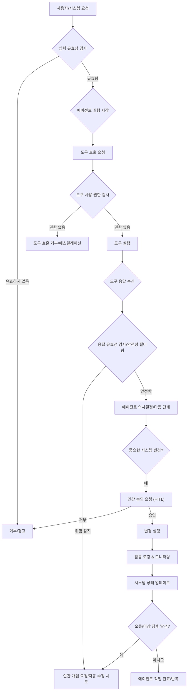

AI 에이전트가 실제 환경에 배포되면서, 오작동이나 예상치 못한 위험을 방지하기 위한 안전성 및 제약 조건 제어 디자인의 중요성이 부각되고 있다. 에이전트의 자율성과 효율성을 유지하면서도, 시스템의 안정성과 신뢰성을 보장하는 것은 프로덕션 환경에서 필수적인 과제이다. 이 엔트리는 실제 운영 환경에서 AI 에이전트의 안전성을 확보하고 제약 조건을 효과적으로 관리하기 위한 설계 패턴과 실질적인 접근 방식을 제시한다.

## 핵심 개념: 안전성 및 제약 조건 제어

AI 에이전트의 안전성(Safety)은 시스템이 의도치 않은 해를 끼치거나, 기대치 않은 방식으로 작동하여 부정적인 결과를 초래하는 것을 방지하는 능력이다. 제약 조건 제어(Constraint Control)는 이러한 안전성을 보장하기 위해 에이전트의 행동 범위, 사용 가능한 도구, 접근 권한 등을 명시적으로 제한하고 관리하는 메커니즘을 의미한다. 주요 위험 요소로는 다음과 같은 것들이 있다.

*   **오작동 (Malfunction)**: 잘못된 판단이나 정보 처리로 인한 에이전트의 오류.
*   **의도치 않은 결과 (Unintended Consequences)**: 목표 달성을 위한 과정에서 부수적으로 발생하는 예측 불가능한 부정적 영향.
*   **보안 취약점 (Security Vulnerabilities)**: 에이전트가 접근 가능한 시스템이나 데이터에 대한 무단 접근 및 오용.
*   **윤리적 문제 (Ethical Issues)**: 편향된 데이터 학습, 차별적 행동, 개인 정보 침해 등.

이러한 위험을 완화하기 위해 에이전트 설계 단계부터 안전성 및 제약 조건 제어를 통합하는 것이 중요하다.

## AI 에이전트 안전성 및 제약 조건 제어 설계 패턴

### 1. 명시적 가드레일 (Explicit Guardrails) 및 정책 시행

에이전트의 입력, 처리 과정, 출력에 걸쳐 명확한 규칙과 정책을 적용하여 허용 가능한 행동 범위를 정의한다. 이는 에이전트가 의도된 목적을 벗어나지 않도록 하는 기본적인 방어 메커니즘이다.

*   **입력/출력 유효성 검사 (Input/Output Validation)**: 에이전트에게 전달되는 프롬프트나 에이전트가 생성하는 응답이 특정 형식, 길이, 내용 제약을 준수하는지 확인한다. 민감 정보 필터링, 비속어 검출 등이 포함될 수 있다.
*   **도구 사용 제한 (Tool Use Restrictions)**: 에이전트가 사용할 수 있는 외부 도구(API, 데이터베이스 등)의 목록을 명시하고, 각 도구의 호출 인자나 반환 값에 대한 제약을 설정한다. 예를 들어, 민감한 데이터베이스에 대한 `DELETE` 쿼리 금지.
*   **컨텍스트 윈도우 및 정보 흐름 제어 (Context Window & Information Flow Control)**: 에이전트가 접근할 수 있는 정보의 범위를 제한하고, 특정 정보가 다른 컴포넌트로 전파되는 것을 통제한다.

```python
import re

def validate_agent_input(text: str) -> bool:
    """
    Check for potential malicious commands or sensitive keywords in agent input.
    """
    denylist_keywords = ["delete all", "drop table", "rm -rf"]
    if any(keyword in text.lower() for keyword in denylist_keywords):
        print(f"Detected denylisted keyword: {text}")
        return False
    # Regex to prevent SQL injection patterns
    if re.search(r"('|;|" "--" "|\bOR\b|\bAND\b)", text, re.IGNORECASE):
        print(f"Detected potential SQL injection pattern: {text}")
        return False
    return True

def restrict_tool_access(tool_name: str, allowed_tools: list[str]) -> bool:
    """
    Ensure the agent only uses explicitly allowed tools.
    """
    if tool_name not in allowed_tools:
        print(f"Attempted to use unauthorized tool: {tool_name}")
        return False
    return True

# Example Usage
# is_valid_input = validate_agent_input("Show me user data") # True
# is_valid_input = validate_agent_input("DELETE ALL FROM Users") # False
# can_use_tool = restrict_tool_access("execute_sql", ["search_db", "send_email"]) # False
```

### 2. Human-in-the-Loop (HITL) 메커니즘

위험도가 높거나 불확실성이 큰 결정에 대해 인간의 개입을 필수로 설정한다. 이는 에이전트의 자율적 판단을 최종적으로 검토하고 승인하는 안전 장치 역할을 한다.

*   **확인 단계 (Confirmation Steps)**: 에이전트가 시스템에 중요한 변경을 가하거나, 외부 시스템에 데이터를 전송하는 등의 민감한 작업을 수행하기 전에 사용자 또는 관리자의 명시적인 승인을 요구한다.
*   **에스컬레이션 프로토콜 (Escalation Protocols)**: 에이전트가 해결할 수 없는 문제에 직면했거나, 안전성 가드레일을 위반할 가능성이 있는 경우, 자동으로 인간 전문가에게 상황을 보고하고 개입을 요청한다.

### 3. 관측 가능성 (Observability) 및 모니터링

에이전트의 모든 활동을 실시간으로 기록하고, 시스템의 상태와 에이전트의 행동을 지속적으로 모니터링한다. 이는 문제 발생 시 신속한 탐지, 진단 및 대응을 가능하게 한다.

*   **활동 로깅 (Activity Logging)**: 에이전트의 결정, 사용한 도구, 생성된 출력, 상호작용 기록 등을 상세하게 기록한다.
*   **이상 탐지 (Anomaly Detection)**: 에이전트의 평소 행동 패턴에서 벗어나는 이상 징후를 자동으로 탐지하고 경고를 발생시킨다. (예: 평소보다 비정상적으로 많은 API 호출, 비정상적인 데이터 접근 시도).
*   **감사 기능 (Auditing Capabilities)**: 에이전트의 행동에 대한 이력을 추적하여 규정 준수 및 책임 소재를 명확히 할 수 있도록 지원한다.

### 4. 실패 안전 (Failsafe) 및 롤백 전략 (Rollback Strategies)

예상치 못한 실패나 오작동 시 시스템의 안정성을 유지하고, 이전의 안전한 상태로 복구할 수 있는 메커니즘을 마련한다.

*   **멱등성 (Idempotency)**: 에이전트의 작업이 여러 번 실행되더라도 동일한 결과를 초래하도록 설계하여, 부분적인 실패 후 재시도 시 시스템의 불일치를 방지한다.
*   **트랜잭션 실행 (Transactional Execution)**: 여러 단계로 구성된 에이전트 작업이 원자적으로(Atomic) 실행되도록 보장한다. 모든 단계가 성공하거나, 하나라도 실패하면 전체 작업을 취소(Rollback)하여 일관성을 유지한다.
*   **상태 스냅샷 (State Snapshotting)**: 에이전트의 중요한 상태나 데이터베이스를 주기적으로 스냅샷하여, 문제 발생 시 특정 시점으로 복구할 수 있도록 한다.

### 5. 샌드박싱 (Sandboxing) 및 최소 권한 (Least Privilege)

에이전트가 실행되는 환경과 접근 가능한 리소스에 대한 엄격한 격리 및 권한 관리를 적용한다.

*   **격리된 실행 환경 (Isolated Execution Environments)**: 에이전트를 컨테이너(Docker) 또는 가상 머신과 같이 격리된 환경에서 실행하여, 에이전트의 오작동이 전체 시스템에 미치는 영향을 최소화한다.
*   **세분화된 권한 모델 (Granular Permission Models)**: 에이전트가 필요한 최소한의 권한만을 갖도록 설정한다. 예를 들어, 파일 시스템에 대한 읽기 전용 접근, 특정 API 엔드포인트에 대한 접근 허용 등.

## AI 에이전트 안전성 제어 흐름 (Mermaid Diagram)



## 트레이드오프

*   **안전성 vs. 성능**:
    *   **좋을 때**: 민감한 작업이나 높은 신뢰성이 요구되는 시스템에서, 추가적인 검증 및 제어 메커니즘은 치명적인 오류를 방지하여 장기적인 시스템 안정성을 보장한다.
    *   **나쁠 때**: 실시간 응답 속도가 중요한 환경(예: 고빈도 거래, 인터랙티브 UX)에서 과도한 안전성 검사는 에이전트의 반응 속도를 저하시켜 사용자 경험을 해치거나 비즈니스 기회를 놓칠 수 있다.
*   **안전성 vs. 자율성**:
    *   **좋을 때**: 에이전트의 행동에 명확한 제약을 두어 예측 불가능한 결과를 줄이고, 시스템의 안정적인 운영을 보장한다. 특히 규제 준수가 중요한 산업에서 필수적이다.
    *   **나쁠 때**: 에이전트의 문제 해결 능력이나 창의적인 탐색을 제한할 수 있다. 너무 엄격한 제약은 새로운 사용 사례 발굴이나 최적화 기회를 막을 수 있다.
*   **개발 복잡도 vs. 견고성**:
    *   **좋을 때**: 초기 설계 단계에서 안전성 패턴을 통합하면, 장기적으로 유지보수 비용을 절감하고 예기치 않은 버그나 보안 문제를 사전에 방지하여 시스템의 견고성을 높인다.
    *   **나쁠 때**: 안전성 메커니즘을 구현하고 테스트하는 데 추가적인 개발 시간과 리소스가 소요된다. 특히 MVP(Minimum Viable Product) 단계에서는 초기 배포 속도를 늦출 수 있다.
*   **리소스 오버헤드 vs. 위험 완화**:
    *   **좋을 때**: 모니터링, 로깅, 샌드박싱 등은 시스템 리소스를 소모하지만, 잠재적인 재정적 손실, 평판 하락, 법적 문제 등 치명적인 비즈니스 위험을 효과적으로 완화한다.
    *   **나쁠 때**: 제한된 예산이나 리소스 환경에서 불필요하게 복잡한 안전성 설계는 운영 비용을 증가시키고, 다른 중요한 기능 개발에 필요한 리소스를 잠식할 수 있다.

## 실전 체크리스트

AI 에이전트의 안전성 및 제약 조건 제어 디자인을 프로젝트에 적용할 때 다음 항목들을 검증한다.

*   [ ] 모든 외부 도구 호출에 대한 명시적인 허용 목록(Allowlist)과 거부 목록(Denylist) 정책이 구현되었는가?
*   [ ] 민감한 정보(PII, 금융 데이터)가 에이전트의 컨텍스트 윈도우에 포함되기 전, 또는 출력되기 전에 적절히 필터링/마스킹되는가?
*   [ ] 에이전트의 중요 작업(예: 데이터 수정, 외부 시스템 연동) 수행 전, 인간 승인(Human-in-the-Loop) 단계가 설계 및 구현되었는가?
*   [ ] 에이전트의 모든 의사결정 및 도구 사용 이력이 추적 가능하도록 상세히 로깅되고, 이상 징후 발생 시 경고 시스템이 작동하는가?
*   [ ] 에이전트가 실행되는 환경이 최소 권한 원칙(Least Privilege Principle)에 따라 구성되었으며, 불필요한 시스템 접근 권한이 없는가?
*   [ ] 에이전트 작업 실패 시, 시스템의 일관성을 유지하기 위한 롤백 또는 복구 메커니즘이 존재하며 테스트되었는가?
*   [ ] 에이전트의 행동이 예상 범위를 벗어날 경우, 자동으로 안전 모드로 전환되거나 긴급 종료될 수 있는 failsafe 메커니즘이 마련되었는가?