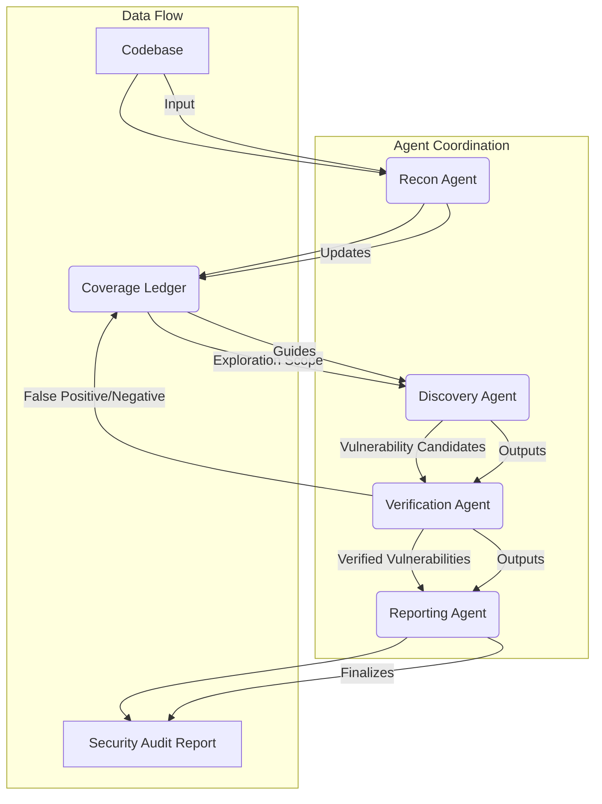

## AI 에이전트 기반 보안 감사: PoC 개발

최신 소프트웨어 개발 환경은 복잡하고 빠르게 변화하며, 이에 따라 보안 감사의 효율성과 정확성 요구가 증대되고 있습니다. 수동 보안 감사만으로는 방대한 코드베이스의 모든 잠재적 취약점을 포괄하기 어렵습니다. AI 에이전트는 이러한 문제를 해결하기 위한 혁신적인 접근 방식을 제공합니다. 자율적이고 협력적인 에이전트 시스템을 통해 코드베이스 정찰부터 취약점 탐색, 검증, 보고서 작성에 이르는 전 과정을 자동화하여 보안 감사 역량을 크게 강화할 수 있습니다.

이 문서는 코딩 에이전트를 보안 감사자로 전환하는 스킬 개발 PoC에 대한 아키텍처와 핵심 개념을 탐구합니다. 특히 '커버리지 장부(Coverage Ledger)'와 '별개의 검증 에이전트(Separate Verification Agent)' 개념을 중심으로 LLM 출력의 신뢰성을 높이고 False Positive(오탐)를 최소화하는 방안을 모색합니다.

### 핵심 개념

AI 에이전트 기반 보안 감사는 여러 특화된 에이전트의 협력을 통해 이루어집니다. 각 에이전트는 특정 역할을 수행하며 전체 감사 프로세스를 구성합니다.

1.  **정찰 에이전트 (Reconnaissance Agent)**: 코드베이스를 분석하여 프로젝트 구조, 기술 스택, 주요 의존성, 데이터 흐름 등을 파악합니다. 초기 정보 수집을 통해 후속 취약점 탐색의 효율성을 높입니다.
2.  **탐색 에이전트 (Discovery Agent)**: 정찰 에이전트가 수집한 정보와 Coverage Ledger를 기반으로 잠재적 취약점을 탐색합니다. SAST(Static Application Security Testing) 및 DAST(Dynamic Application Security Testing) 기법을 모방하거나, LLM의 코드 이해 능력을 활용하여 비정상적인 코드 패턴이나 알려진 취약점 패턴을 식별합니다.
3.  **검증 에이전트 (Verification Agent)**: 탐색 에이전트가 발견한 취약점 후보들을 독립적으로 검증합니다. 이는 LLM 기반 에이전트의 고질적인 문제인 환각(Hallucination) 및 오탐을 줄이는 데 필수적입니다. 별개의 에이전트가 탐색 에이전트의 가설을 반증(falsification)하거나 실제 exploit 가능성을 시뮬레이션하여 취약점의 유효성을 확인합니다.
4.  **보고서 작성 에이전트 (Reporting Agent)**: 검증된 취약점들을 종합하여 표준화된 보안 감사 보고서를 생성합니다. 보고서는 취약점의 심각도, 영향, 재현 경로, 권장 수정 방안 등을 포함합니다.

### 커버리지 장부 (Coverage Ledger)

Coverage Ledger는 에이전트들이 감사 과정에서 분석한 코드 영역, 파일, 모듈, 기능 등을 기록하는 중앙화된 메커니즘입니다. 이는 다음과 같은 이점을 제공합니다:

*   **중복 방지**: 이미 분석된 영역에 대한 비효율적인 재탐색을 방지합니다.
*   **탐색 범위 최적화**: 미탐색 영역을 식별하여 탐색 에이전트에게 할당함으로써 감사의 완전성을 보장합니다.
*   **진행 상황 추적**: 전체 감사 프로세스의 진행 상황과 남은 작업을 시각화할 수 있습니다.
*   **LLM 컨텍스트 관리**: 에이전트에게 필요한 최소한의 컨텍스트만 제공하여 LLM 비용을 최적화합니다.

### 독립 검증 에이전트 (Independent Verification Agent)

LLM 기반 에이전트의 가장 큰 도전 과제 중 하나는 생성된 결과의 신뢰성입니다. 탐색 에이전트가 잠재적 취약점을 식별하더라도, 이것이 실제 유효한 취약점인지에 대한 검증이 반드시 필요합니다. 독립 검증 에이전트는 다음 방식으로 신뢰성을 높입니다:

*   **반증 시도**: 발견된 취약점 후보가 실제로 exploit 가능한지, 또는 단순한 코드 스타일 문제인지 등을 검증합니다. 예를 들어, 특정 취약점 패턴이 발견되면 해당 패턴에 대한 PoC (Proof of Concept) 코드를 생성하고 실행하여 실제 동작 여부를 확인합니다.
*   **다중 에이전트 합의**: 여러 검증 에이전트가 동일한 취약점 후보에 대해 독립적으로 검증하고 결과를 비교하여 합의에 도달하는 방식을 사용할 수 있습니다.
*   **Sandbox 환경**: 안전한 격리된 환경에서 취약점 검증을 수행하여 실제 시스템에 미칠 수 있는 잠재적 위험을 최소화합니다.

### 아키텍처 및 워크플로우

다음 Mermaid 다이어그램은 AI 에이전트 기반 보안 감사 PoC의 전반적인 아키텍처와 데이터 흐름을 보여줍니다.



**설명**: Recon Agent가 Codebase를 분석하여 Coverage Ledger를 초기화하고 업데이트합니다. Discovery Agent는 Coverage Ledger의 탐색 범위 지침을 받아 Vulnerability Candidates를 생성합니다. Verification Agent는 이 후보들을 검증하여 Verified Vulnerabilities로 확정하거나, False Positive/Negative로 분류하여 Coverage Ledger에 피드백을 주어 재탐색을 유도합니다. 최종적으로 Reporting Agent가 Verified Vulnerabilities를 취합하여 Security Audit Report를 생성합니다.

### 코드 예제 (Python)

다음은 Python을 이용한 에이전트 기반 감사 스킬의 간소화된 개념 코드입니다. 실제 구현에서는 LLM API 호출, 툴 사용, 상태 관리 등이 복잡하게 추가됩니다.

```python
import os
import json

class CodebaseScanner:
    def __init__(self, base_path):
        self.base_path = base_path
        self.coverage_ledger = set() # Track files/modules scanned

    def get_codebase_structure(self):
        """ 코드베이스 구조를 파악 (예: 파일 목록, 디렉토리 구조) """
        structure = []
        for root, dirs, files in os.walk(self.base_path):
            for name in files:
                file_path = os.path.join(root, name)
                structure.append(file_path)
        return structure

    def get_file_content(self, file_path):
        """ 파일 내용을 읽어옵니다. """
        with open(file_path, 'r', encoding='utf-8', errors='ignore') as f:
            return f.read()

class ReconAgent:
    def __init__(self, scanner: CodebaseScanner):
        self.scanner = scanner

    def run_reconnaissance(self):
        print("Recon Agent: Starting code analysis...")
        all_files = self.scanner.get_codebase_structure()
        print(f"Recon Agent: Found {len(all_files)} files.")
        # Update coverage ledger with initially discovered files
        for f in all_files:
            self.scanner.coverage_ledger.add(f)
        return all_files

class DiscoveryAgent:
    def __init__(self, scanner: CodebaseScanner, llm_client):
        self.scanner = scanner
        self.llm_client = llm_client
        self.potential_vulnerabilities = []

    def find_vulnerabilities(self):
        print("Discovery Agent: Starting vulnerability discovery...")
        for file_path in list(self.scanner.coverage_ledger):
            if file_path not in self.scanner.scanned_for_vuln:
                content = self.scanner.get_file_content(file_path)
                prompt = f"Analyze the following code for potential security vulnerabilities (SQLi, XSS, RCE, etc.):\n\n```\n{content}\n```\nRespond with JSON: {{ "vulnerabilities": [{{ "type": "", "severity": "", "location": "", "description": "" }}] }}"
                
                # Simulate LLM call
                # response = self.llm_client.generate(prompt)
                # For PoC, let's mock a response
                if "password" in content and "hardcoded" in content:
                    self.potential_vulnerabilities.append({
                        "type": "Hardcoded Credential",
                        "severity": "High",
                        "location": file_path,
                        "description": "Found a hardcoded password string."
                    })
                self.scanner.scanned_for_vuln.add(file_path)
        return self.potential_vulnerabilities

class VerificationAgent:
    def __init__(self, scanner: CodebaseScanner, llm_client):
        self.scanner = scanner
        self.llm_client = llm_client
        self.verified_vulnerabilities = []

    def verify_vulnerability(self, vuln_candidate):
        print(f"Verification Agent: Verifying {vuln_candidate['type']} in {vuln_candidate['location']}...")
        file_content = self.scanner.get_file_content(vuln_candidate['location'])
        
        # Simulate independent verification (e.g., attempt to exploit or use a different LLM/tool)
        # For PoC, a simple check if the description matches actual content and is not trivial
        if vuln_candidate['type'] == "Hardcoded Credential" and "password" in file_content:
            print("Verification Agent: Hardcoded credential confirmed.")
            return True
        
        print(f"Verification Agent: {vuln_candidate['type']} in {vuln_candidate['location']} could not be independently verified.")
        return False

    def run_verification(self, candidates):
        for candidate in candidates:
            if self.verify_vulnerability(candidate):
                self.verified_vulnerabilities.append(candidate)
            else:
                # Feedback to coverage ledger or discovery agent for refinement
                print(f"Verification Agent: Candidate {candidate['type']} failed verification. Consider re-evaluation.")
        return self.verified_vulnerabilities

class ReportingAgent:
    def generate_report(self, vulnerabilities):
        print("Reporting Agent: Generating audit report...")
        report_data = {"audit_summary": f"Found {len(vulnerabilities)} verified vulnerabilities.", "vulnerabilities": vulnerabilities}
        return json.dumps(report_data, indent=2)

# PoC Execution Flow
if __name__ == "__main__":
    # Mock LLM client (in real scenarios, use actual LLM APIs)
    class MockLLMClient:
        def generate(self, prompt):
            # A very simplistic mock
            if "password" in prompt:
                return '{"vulnerabilities": [{"type": "Hardcoded Credential", "severity": "High", "location": "mock_file", "description": "Hardcoded secret found."}]}'
            return '{"vulnerabilities": []}'

    # Setup a mock codebase for demonstration
    os.makedirs("mock_codebase", exist_ok=True)
    with open("mock_codebase/main.py", "w") as f:
        f.write("username = 'admin'\npassword = 'supersecretpassword'\napi_key = os.getenv('API_KEY')")
    with open("mock_codebase/utils.py", "w") as f:
        f.write("def helper_func():\n    pass")

    scanner = CodebaseScanner("mock_codebase")
    scanner.scanned_for_vuln = set() # Add this to scanner for tracking

    llm_client = MockLLMClient()

    recon_agent = ReconAgent(scanner)
    discovery_agent = DiscoveryAgent(scanner, llm_client)
    verification_agent = VerificationAgent(scanner, llm_client)
    reporting_agent = ReportingAgent()

    # 1. Reconnaissance
    recon_agent.run_reconnaissance()
    print(f"Initial Coverage: {scanner.coverage_ledger}")

    # 2. Discovery
    potential_vulns = discovery_agent.find_vulnerabilities()
    print(f"Discovered {len(potential_vulns)} potential vulnerabilities: {potential_vulns}")

    # 3. Verification
    verified_vulns = verification_agent.run_verification(potential_vulns)
    print(f"Verified {len(verified_vulns)} vulnerabilities: {verified_vulns}")

    # 4. Reporting
    audit_report = reporting_agent.generate_report(verified_vulns)
    print("--- Final Security Audit Report ---")
    print(audit_report)

    # Cleanup mock codebase
    os.remove("mock_codebase/main.py")
    os.remove("mock_codebase/utils.py")
    os.rmdir("mock_codebase")
```

이 예제 코드는 각 에이전트의 기본적인 역할을 보여줍니다. 실제 시스템에서는 `llm_client`가 Anthropic Claude, OpenAI GPT와 같은 실제 LLM API를 호출하고, `CodebaseScanner`는 Git 리포지토리나 CI/CD 파이프라인과 통합됩니다. Coverage Ledger는 RAG(Retrieval Augmented Generation) 시스템과 통합되어 에이전트에게 필요한 코드 스니펫만 효율적으로 제공할 수 있습니다.

### 2026년 최신 트렌드 반영

2026년에는 AI 에이전트 기반 보안 감사가 더욱 고도화될 것으로 예상됩니다:

*   **멀티모달 LLM 통합**: 코드뿐만 아니라 디자인 문서, 네트워크 구성도 등 다양한 형태의 데이터를 분석하여 더욱 포괄적인 취약점 탐색이 가능해집니다.
*   **자율적 수정 및 재검증 루프**: 취약점을 발견하고 보고하는 것을 넘어, 에이전트가 직접 수정 패치를 제안하고 이를 테스트, 재검증하는 자율적인 Remediation 루프가 구현됩니다. 이는 개발 사이클에 보안을 더욱 깊숙이 통합(Shift-Left Security)하는 데 기여합니다.
*   **강화 학습 기반 에이전트 (RL-based Agents)**: 실제 exploit 시뮬레이션 환경에서 강화 학습을 통해 에이전트가 취약점을 더욱 효과적으로 발견하고 검증하는 전략을 학습할 수 있습니다.
*   **설명 가능한 AI (Explainable AI, XAI)**: 에이전트가 특정 취약점을 발견한 근거와 판단 과정을 명확하게 제시하여, 인간 감사자의 이해와 신뢰를 높입니다. 이는 규제 준수 측면에서도 중요합니다.

## 트레이드오프

AI 에이전트 기반 보안 감사 스킬 개발은 많은 이점을 제공하지만, 고려해야 할 트레이드오프도 존재합니다.

*   **확장성 및 속도 vs. 초기 개발 복잡성**: AI 에이전트 시스템은 대규모 코드베이스를 빠르고 일관되게 감사할 수 있습니다. **(언제 좋은가)** 방대한 레거시 코드나 CI/CD 파이프라인에 통합되어 빠르게 반복되는 개발 환경에서 특히 유리합니다. **(언제 나쁜가)** 하지만 이러한 시스템의 설계, 구현, 튜닝은 초기 투자 비용과 기술적 복잡성이 높습니다. 작은 프로젝트나 리소스가 제한된 팀에는 과도할 수 있습니다.
*   **일관성 및 커버리지 vs. 오탐(False Positive) 및 미탐(False Negative) 위험**: Coverage Ledger를 통해 감사 범위의 일관성과 완전성을 높일 수 있습니다. 독립 검증 에이전트는 오탐을 줄이는 데 기여합니다. **(언제 좋은가)** 반복적인 감사 작업에서 인간의 실수를 줄이고 표준화된 결과를 제공하는 데 탁월합니다. **(언제 나쁜가)** LLM의 본질적인 한계로 인해 여전히 오탐이나 미탐의 가능성이 존재하며, 이를 완전히 제거하기 위한 검증 메커니즘 구축은 매우 어렵습니다. 특히 엣지 케이스나 새로운 유형의 취약점 발견에는 한계가 있을 수 있습니다.
*   **자율성 vs. 제어 및 보안 위험**: 에이전트가 자율적으로 코드베이스를 분석하고 때로는 PoC exploit을 시도함으로써 효율성이 극대화됩니다. **(언제 좋은가)** 인간의 개입 없이 24시간 감사를 수행하며 신속한 대응이 가능합니다. **(언제 나쁜가)** 에이전트의 오작동이나 Sandbox 이탈 시 실제 시스템에 unintended damage를 줄 위험이 있습니다. 에이전트가 민감한 정보를 외부로 유출하거나 잘못된 판단으로 인한 시스템 변경을 초래할 수 있으므로 강력한 제어 및 격리 메커니즘이 필수적입니다.
*   **비용 효율성 vs. LLM 토큰 비용**: 장기적으로 반복적인 수동 감사 비용을 절감하고 전문가 의존도를 낮출 수 있습니다. **(언제 좋은가)** 감사 대상이 매우 크거나 자주 변경되는 경우 장기적인 총 소유 비용(TCO) 측면에서 유리합니다. **(언제 나쁜가)** LLM API 호출에 따른 토큰 비용이 예상보다 높을 수 있으며, 이는 특히 복잡한 분석이나 재검증 과정에서 급증할 수 있습니다. 비용 최적화를 위한 정교한 컨텍스트 관리 및 프롬프트 엔지니어링이 요구됩니다.

## 실전 체크리스트

AI 에이전트 기반 보안 감사 스킬을 프로젝트에 적용할 때 다음 항목들을 검증해야 합니다.

*   [ ] **에이전트 역할 및 협업 프로토콜 명확화**: 각 에이전트 (정찰, 탐색, 검증, 보고) 의 책임과 입력/출력 인터페이스가 명확하게 정의되어 있으며, 상호작용 프로토콜이 오류 없이 작동하는지 확인되었는가?
*   [ ] **커버리지 장부 구현 및 유효성 검증**: 코드베이스의 모든 중요 영역이 Coverage Ledger에 기록되고, 에이전트가 이를 기반으로 탐색 작업을 효율적으로 배정받으며, 미탐색 영역이 없는지 주기적으로 검증되는가?
*   [ ] **독립 검증 에이전트의 오탐 감소 효과 측정**: 검증 에이전트 도입 후 보안 감사 과정에서 보고되는 오탐(False Positive) 비율이 최소 20% 이상 감소하였음을 통계적으로 측정하였는가?
*   [ ] **샌드박스(Sandbox) 환경 격리 및 보안 강화**: 취약점 검증 에이전트가 실행되는 환경이 프로덕션 시스템과 완벽하게 격리되어 있으며, 샌드박스 이스케이프(Sandbox Escape) 방지 메커니즘이 구현되고 정기적으로 감사되는가?
*   [ ] **LLM 출력의 재현성 및 일관성 확보**: 동일한 코드 스니펫과 프롬프트에 대해 LLM 기반 에이전트가 일정 수준 이상의 재현 가능한(reproducible) 결과를 생성하며, 시간 경과에 따른 출력 품질 저하가 모니터링되는가?
*   [ ] **성능 및 비용 최적화 기준 충족**: 전체 감사 프로세스에 소요되는 시간(Latency)과 LLM API 토큰 사용 비용이 사전에 정의된 KPI를 충족하는지 지속적으로 모니터링하고 최적화 계획이 수립되어 있는가?
*   [ ] **보안 감사 보고서의 가독성 및 액션 가능성**: 생성된 보고서가 개발팀이 이해하기 쉽고, 명확한 수정 가이드라인을 제공하며, JIRA와 같은 이슈 트래킹 시스템과 연동되어 후속 조치가 용이한가?