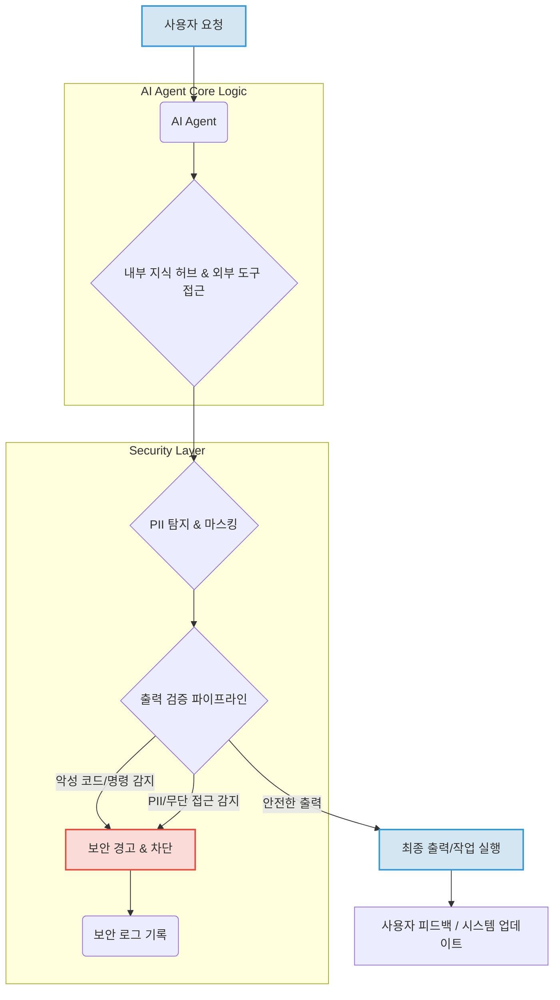

AI 에이전트의 발전은 효율성과 자동화의 새로운 지평을 열었지만, 동시에 심각한 보안 및 개인정보 보호 위험을 수반합니다. 사용자 대신 자율적으로 작업을 수행하는 과정에서 민감 정보(PII) 유출, 무단 접근, 악의적인 명령 수행 등 예기치 않은 취약점이 발생할 수 있습니다. Meta Muse 사례는 에이전트형 AI가 잠재적으로 Mac 사용자를 감시하고, 무단 메시지 접근 및 헐값 판매, 집 주소 전달과 같은 심각한 문제를 일으킬 수 있음을 경고합니다. 이러한 위협에 대응하여 AI 에이전트의 보안 및 개인정보 보호 강화는 필수적인 과제입니다.

## AI 에이전트 보안 위협의 이해

AI 에이전트의 고유한 특성(자율성, 외부 도구 사용, 광범위한 데이터 접근)은 기존 시스템과는 다른 보안 위협을 야기합니다.
*   **PII 유출**: 에이전트가 처리하는 데이터 중 개인 식별 정보가 포함될 경우, 부적절한 출력이나 로깅으로 인해 민감 정보가 외부에 노출될 위험이 있습니다.
*   **무단 접근 및 권한 오용**: 에이전트가 특정 시스템이나 데이터에 접근할 수 있는 권한을 가질 때, 제어 실패나 프롬프트 인젝션(Prompt Injection)을 통해 해당 권한이 악용될 수 있습니다.
*   **제로데이 취약점**: 미지의 취약점을 통해 에이전트의 제어 흐름이 탈취되거나, 의도치 않은 시스템 명령이 실행될 수 있습니다.
*   **탈옥(Jailbreak) 및 오작동**: 악의적인 입력으로 에이전트의 안전 장치(Guardrails)를 우회하여 정책 위반 행위를 유도할 수 있습니다.

## Claude Code 하네스 보안 강화 전략

Claude Code 하네스와 같은 에이전트 개발 환경에서는 이러한 위협에 대한 다층적인 방어 전략이 필요합니다.

### PII 유출 방어를 위한 가드 테스트 강화
개인 비공개 지식 허브(Private Knowledge Hub)와 같은 민감한 데이터 소스를 다루는 에이전트의 경우, PII 유출을 사전에 방지하는 가드 테스트(Guard Test)가 필수적입니다. 이는 에이전트가 생성하는 모든 출력에 대해 PII 패턴을 검사하고, 발견 시 마스킹 또는 필터링하는 방식으로 이루어집니다.

```python
import re

def detect_and_mask_pii(text: str) -> str:
    """
    텍스트에서 PII 패턴을 감지하고 마스킹합니다.
    이 예시에서는 이메일 주소, 전화번호, 주민등록번호(예시)를 마스킹합니다.
    """
    # 이메일 주소 마스킹
    text = re.sub(r"[a-zA-Z0-9._%+-]+@[a-zA-Z0-9.-]+\.[a-zA-Z]{2,}", "[EMAIL_MASKED]", text)
    # 전화번호 마스킹 (한국 휴대폰 번호 형식 예시)
    text = re.sub(r"\b010-\d{4}-\d{4}\b", "[PHONE_MASKED]", text)
    # 주민등록번호 마스킹 (가상의 형식 예시)
    text = re.sub(r"\b\d{6}-[1-4]\d{6}\b", "[RRN_MASKED]", text)
    # IP 주소 마스킹
    text = re.sub(r"\b(?:\d{1,3}\.){3}\d{1,3}\b", "[IP_MASKED]", text)
    return text

# 예시 사용
sensitive_text = "제 이메일은 test@example.com이고, 전화번호는 010-1234-5678입니다. 서버 IP는 192.168.1.100입니다."
masked_text = detect_and_mask_pii(sensitive_text)
print(masked_text)
# 출력: 제 이메일은 [EMAIL_MASKED]이고, 전화번호는 [PHONE_MASKED]입니다. 서버 IP는 [IP_MASKED]입니다.
```

이러한 PII 마스킹 로직은 에이전트의 최종 출력 단계 또는 중간 처리 단계에 통합되어야 합니다. 특히 코드 하네스(Code Harness)는 이러한 보안 검사를 위한 통합 지점을 제공하여, 에이전트가 생성하는 코드, 문서, 메시지 등 모든 형태의 출력에 대해 일관된 보안 정책을 적용할 수 있도록 합니다.

### 출력 검증 파이프라인에 추가 보안 검사 포함
에이전트가 외부 시스템에 명령을 내리거나 사용자에게 정보를 전달하기 전에, 출력 검증 파이프라인(Output Validation Pipeline)을 통해 추가적인 보안 검사를 수행해야 합니다.
*   **명령어 화이트리스트/블랙리스트**: 에이전트가 사용할 수 있는 외부 도구의 명령어(tool call)를 미리 정의하고, 허용되지 않는 명령은 차단합니다.
*   **데이터 형식 및 내용 검증**: 출력되는 데이터가 예상된 형식과 범위를 준수하는지 확인하고, 악성 스크립트나 SQL 인젝션(SQL Injection)과 같은 공격 페이로드가 포함되지 않도록 검사합니다.
*   **권한 확인**: 에이전트가 특정 자원에 접근하거나 변경하는 경우, 해당 작업에 대한 적절한 권한이 있는지 최종 확인하는 단계를 추가합니다.

### AI 에이전트 보안 흐름 다이어그램



## 최신 보안 트렌드 (2026년 기준)

2026년 현재, AI 에이전트 보안은 더욱 정교해진 공격 벡터에 대응하기 위해 다음과 같은 방향으로 진화하고 있습니다.
*   **행위 기반 이상 탐지(Behavioral Anomaly Detection)**: 에이전트의 평소 작동 패턴을 학습하여 비정상적인 행위(예: 갑작스러운 대량 데이터 접근, 비인가 외부 API 호출 시도)를 실시간으로 탐지하고 차단하는 시스템이 고도화되고 있습니다.
*   **설명 가능한 AI (Explainable AI, XAI) 기반 보안 감사**: 에이전트의 의사결정 과정을 시각화하고 분석하여, 왜 특정 결정을 내렸는지 이해함으로써 잠재적인 보안 취약점이나 편향된 작동을 사전에 파악합니다. 이는 규제 준수(Compliance)에도 중요한 역할을 합니다.
*   **실시간 위협 인텔리전스 통합**: 최신 제로데이 공격 정보나 취약점 데이터베이스를 실시간으로 에이전트의 가드레일 시스템에 통합하여, 새로운 위협에 즉각적으로 대응할 수 있도록 합니다.
*   **연합 학습(Federated Learning) 기반 PII 보호**: 여러 에이전트 또는 기관이 데이터를 직접 공유하지 않고도 모델을 공동으로 학습시켜 PII 유출 위험을 최소화하면서도, 에이전트의 성능을 향상시키는 접근 방식이 주목받고 있습니다.

## 트레이드오프

AI 에이전트 보안 및 개인정보 보호 강화를 위한 접근 방식은 다음과 같은 트레이드오프를 가집니다.

*   **보안 강화 vs. 성능 및 처리 속도**:
    *   **언제 좋은가**: 민감 정보를 다루거나, 외부 시스템에 치명적인 영향을 줄 수 있는 에이전트에 적용 시, 잠재적 손실을 막아 전반적인 시스템 안정성을 높입니다.
    *   **언제 나쁜가**: 모든 에이전트 출력에 과도한 보안 검사를 적용하면 지연 시간이 증가하여 실시간 상호작용이 중요한 애플리케이션의 사용자 경험을 저하시킬 수 있습니다.
*   **엄격한 제어 vs. 에이전트 자율성 및 유연성**:
    *   **언제 좋은가**: 미션 크리티컬하거나 규제 준수가 엄격한 환경(예: 금융, 의료)에서 에이전트의 예측 불가능한 행동을 최소화하여 안전성을 보장합니다.
    *   **언제 나쁜가**: 에이전트의 창의성이나 문제 해결 능력을 제한하여, 복잡하고 새로운 문제에 대한 자율적인 해결 능력을 저해할 수 있습니다.
*   **개발 복잡성 증가 vs. 보안 위험 감소**:
    *   **언제 좋은가**: 초기 개발 단계에서 보안을 내재화하면 장기적으로 취약점 발견 및 수정 비용을 절감하고, 재앙적인 보안 사고를 예방합니다.
    *   **언제 나쁜가**: 모든 잠재적 위협에 대비한 복잡한 보안 메커니즘은 개발 주기를 늘리고, 추가적인 유지보수 오버헤드를 발생시켜 시장 출시 시간을 지연시킬 수 있습니다.
*   **PII 보호 강화 vs. 데이터 활용성**:
    *   **언제 좋은가**: 개인정보 유출 위험을 최소화하여 법적, 윤리적 문제를 회피하고, 사용자의 신뢰를 확보합니다.
    *   **언제 나쁜가**: 과도한 PII 마스킹이나 접근 제한은 에이전트가 데이터에서 유의미한 패턴을 학습하거나, 개인화된 서비스를 제공하는 능력을 저하시킬 수 있습니다.
*   **제로데이 취약점 방어 노력 vs. 현실적인 위협 범위**:
    *   **언제 좋은가**: 고가치 자산을 보호하고, 경쟁사로부터의 지적 재산 보호 등 최악의 시나리오에 대비할 수 있습니다.
    *   **언제 나쁜가**: 모든 제로데이 취약점을 예측하고 방어하는 것은 거의 불가능하며, 지나친 투자는 자원 낭비로 이어질 수 있습니다. 현실적인 위협 모델링과 우선순위 설정이 중요합니다.

## 실전 체크리스트

AI 에이전트 프로젝트에 보안 및 개인정보 보호 강화를 적용하기 위한 실전 체크리스트입니다.

*   [ ] **PII 마스킹 및 필터링 구현**: 에이전트의 모든 출력(로그, 메시지, 코드 등)에 대해 PII 패턴 감지 및 마스킹/필터링 로직이 올바르게 통합되었는지 검증합니다.
*   [ ] **제로데이 취약점 방어용 가드 테스트 정의**: 에이전트가 외부 도구를 호출하거나 시스템 명령을 실행하기 전에, 잠재적인 제로데이 취약점을 방어하기 위한 시나리오 기반의 가드 테스트 스위트가 마련되었는지 확인합니다.
*   [ ] **출력 검증 파이프라인에 추가 보안 로직 포함**: 에이전트의 최종 출력 전에 명령어 화이트리스트, 데이터 형식 검증, 악성 페이로드 감지 등의 보안 검사 단계가 명확하게 정의되고 활성화되었는지 확인합니다.
*   [ ] **에이전트 권한 최소화(Least Privilege)**: 에이전트가 시스템 자원 및 데이터에 접근하는 권한이 업무 수행에 필요한 최소한으로 제한되어 있는지 정기적으로 감사합니다.
*   [ ] **비공개 지식 허브 접근 제어 강화**: 개인 비공개 지식 허브에 대한 에이전트의 접근이 엄격한 인증 및 인가 메커니즘을 통해 통제되고, 모든 접근 시도가 로깅되는지 확인합니다.
*   [ ] **정기적인 보안 감사 및 침투 테스트**: AI 에이전트 시스템 전체에 대한 정기적인 보안 감사(Security Audit) 및 침투 테스트(Penetration Test)를 수행하고, 발견된 취약점에 대한 신속한 조치 계획이 수립되었는지 확인합니다.
*   [ ] **프롬프트 인젝션 방어 메커니즘 구현**: 사용자 프롬프트에 악의적인 명령이 포함될 경우 이를 탐지하고 무력화하는 프롬프트 인젝션 방어 메커니즘이 에이전트 입력 단에 적용되었는지 확인합니다.