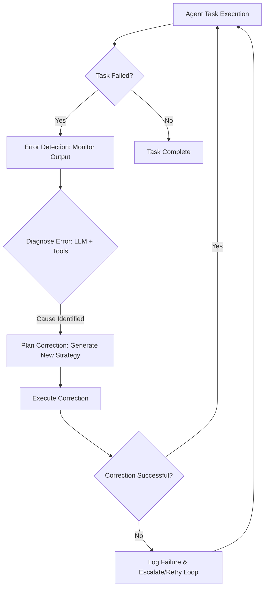

AI 에이전트의 복잡성이 증가하고 자율성이 높아짐에 따라, 에이전트가 자체적으로 오류를 감지하고, 진단하며, 수정하는 능력은 시스템의 안정성과 신뢰성을 보장하는 핵심 요소로 부상하고 있습니다. 특히 예측 불가능한 운영 환경에서 에이전트의 오류 개선 능력은 장기적인 목표 달성과 비즈니스 연속성을 위해 필수적입니다. 이 문서는 자기 수정 기능을 갖춘 AI 에이전트를 설계하기 위한 원칙과 실제 적용 가능한 패턴을 제시합니다.

## 자기 수정 기능의 핵심 구성 요소
자기 수정 기능을 갖춘 AI 에이전트는 다음과 같은 다단계 프로세스를 통해 오류를 관리합니다.

### 1. 모니터링 및 이상 감지 (Monitoring & Anomaly Detection)
에이전트의 행동, 출력, 그리고 시스템 상태를 지속적으로 관찰하여 정상 범위에서 벗어나는 이상 징후를 감지하는 단계입니다. 이는 에이전트의 목표 달성 여부, 도구 사용의 성공률, 응답의 일관성, 시스템 리소스 사용량 등을 포함할 수 있습니다. 2026년 트렌드에서는 실시간 스트리밍 데이터 분석, 시계열 이상 감지 알고리즘(예: Isolation Forest, Prophet), 그리고 LLM 기반의 의미론적(semantic) 이상 감지 기법이 중요하게 활용됩니다.

### 2. 오류 진단 및 근본 원인 분석 (Error Diagnosis & Root Cause Analysis)
이상 징후가 감지되면, 에이전트는 해당 문제의 근본 원인을 파악해야 합니다. 이 단계에서는 LLM이 추론 엔진으로 활용되어 로그, 컨텍스트 정보, 과거 실행 기록 등을 분석하여 문제 발생의 원인을 추론합니다. 예를 들어, 특정 도구의 API 호출 실패, 잘못된 입력 파라미터, 잘못된 추론 경로, 혹은 외부 시스템의 문제 등을 식별합니다. Knowledge Graph와 연동하여 도메인 지식을 활용하면 진단 정확도를 높일 수 있습니다.

### 3. 수정 계획 수립 (Corrective Action Planning)
근본 원인이 파악되면, 에이전트는 문제를 해결하기 위한 구체적인 수정 계획을 수립합니다. 이는 새로운 도구 호출 시도, 입력 파라미터 조정, 추론 로직 재구성, 이전 상태로 롤백, 혹은 외부 시스템 관리자에게 알림 등 다양한 형태를 가질 수 있습니다. LLM은 새로운 계획을 생성하고, 유효성을 검증하며, 잠재적 부작용을 예측하는 데 핵심적인 역할을 수행합니다.

### 4. 실행 및 검증 (Execution & Verification)
수정 계획이 수립되면 에이전트는 이를 실행하고, 수정 조치가 성공적으로 이루어졌는지 다시 모니터링하여 검증합니다. 검증 과정에서 문제가 해결되지 않았다면, 에이전트는 다른 수정 전략을 시도하거나 문제 해결을 위한 에스컬레이션 경로를 활성화할 수 있습니다. 지속적인 피드백 루프는 에이전트가 시간이 지남에 따라 더 효과적인 수정 전략을 학습하도록 돕습니다.

## 아키텍처 패턴: 피드백 루프와 메타-러닝
자기 수정 에이전트의 핵심은 강력한 피드백 루프(Feedback Loop)와 이를 통해 학습하는 메타-러닝(Meta-Learning) 능력에 있습니다.



### LLM 기반 자기 수정 워크플로우 예시 (Python)
아래는 LLM을 활용한 간단한 자기 수정 에이전트의 의사 코드입니다. 에이전트가 특정 작업을 수행하려다 실패할 경우, LLM에게 실패 원인 진단 및 수정 방안을 요청하고, 그에 따라 재시도하는 로직을 보여줍니다.

```python
import time

class ToolExecutionError(Exception):
    pass

class SelfCorrectingAgent:
    def __init__(self, llm_client, tools):
        self.llm = llm_client
        self.tools = tools
        self.max_retries = 3

    def execute_task(self, task_description, current_context):
        attempts = 0
        while attempts < self.max_retries:
            attempts += 1
            try:
                print(f"[Attempt {attempts}] Executing task: {task_description}")
                # Simulate LLM deciding a tool to use and its parameters
                tool_choice, tool_params = self._decide_tool(task_description, current_context)
                result = self._call_tool(tool_choice, tool_params)
                
                if not self._validate_result(result, task_description):
                    raise ToolExecutionError("Tool result validation failed.")

                print(f"Task successful: {result}")
                return result

            except ToolExecutionError as e:
                print(f"[Error] {e}. Attempting self-correction...")
                correction_plan = self._diagnose_and_plan_correction(task_description, current_context, e)
                current_context = self._apply_correction_plan(current_context, correction_plan)
                time.sleep(1) # simulate some delay for retry
            except Exception as e:
                print(f"[Critical Error] {e}. Escalating...")
                self._escalate_problem(e)
                return None

        print(f"Task failed after {self.max_retries} attempts. Giving up.")
        return None

    def _decide_tool(self, task_description, context):
        # LLM call to decide tool and params based on task and context
        # For demo, just hardcode a potential failure
        if "fetch_data" in task_description and context.get("data_source") != "valid":
            return "fetch_data_tool", {"source": context.get("data_source", "invalid_source")}
        return "generic_tool", {"input": task_description}

    def _call_tool(self, tool_name, params):
        # Simulate tool execution and potential failure
        if tool_name == "fetch_data_tool" and params["source"] == "invalid_source":
            raise ToolExecutionError(f"Failed to fetch data from {params['source']}: Invalid source.")
        print(f"Calling {tool_name} with {params}")
        return f"Data fetched from {params['source']}"
    
    def _validate_result(self, result, task_description):
        # LLM or rule-based validation of the tool's output
        # For demo, assume any string result is valid unless specific failure
        return "Failed" not in result

    def _diagnose_and_plan_correction(self, task_description, context, error):
        # LLM call for diagnosis and correction planning
        prompt = f"Task '{task_description}' failed with error: {error}. Current context: {context}. Diagnose the root cause and propose a corrective action in JSON format (e.g., {{'action': 'update_context', 'key': 'data_source', 'value': 'valid_source'}} or {{'action': 'retry_with_different_params', 'params': {{...}}}})."
        # Simulate LLM response
        if "invalid_source" in str(error):
            return {"action": "update_context", "key": "data_source", "value": "valid_source"}
        return {"action": "retry"}

    def _apply_correction_plan(self, current_context, plan):
        if plan["action"] == "update_context":
            current_context[plan["key"]] = plan["value"]
            print(f"Applied correction: Updated context {plan['key']} to {plan['value']}")
        elif plan["action"] == "retry":
            print("Applied correction: Retrying task.")
        # Add more complex correction logic here
        return current_context

    def _escalate_problem(self, error):
        print(f"[Escalation] Sending alert for critical error: {error}")
        # Integrate with monitoring/alerting systems

# Example Usage
# llm_mock = type('LLM', (object,), {'predict': lambda s: 'correction_plan'})()
# agent = SelfCorrectingAgent(llm_mock, {})
# agent.execute_task("fetch_data_for_report", {"data_source": "invalid_source"})
```

## 트레이드오프
자기 수정 에이전트를 설계할 때 고려해야 할 주요 트레이드오프는 다음과 같습니다.

*   **복잡성 vs. 견고성**: 자기 수정 로직을 추가하면 에이전트 시스템의 전체적인 복잡성이 증가합니다. 이는 개발, 디버깅, 유지보수 비용을 높일 수 있습니다. 반면, 예측 불가능한 상황에 대한 에이전트의 견고성과 자율성은 크게 향상됩니다. 언제 좋냐면 에이전트가 고위험 환경에서 장기적인 목표를 수행해야 할 때 좋습니다. 언제 나쁘냐면 단순 반복 작업이나 오류 발생 가능성이 낮은 폐쇄된 시스템에서는 과도한 오버헤드가 될 수 있습니다.
*   **계산 비용 vs. 신뢰성**: 자기 수정 과정은 추가적인 LLM 호출, 데이터 분석, 계획 수립 등의 과정을 포함하므로 상당한 계산 리소스와 시간이 소요될 수 있습니다. 이는 실시간 응답이 필수적인 애플리케이션에서는 병목 현상을 유발할 수 있습니다. 그러나 시스템의 전반적인 신뢰성과 자율성을 극대화합니다. 언제 좋냐면 에이전트의 실패 비용이 계산 비용보다 훨씬 높을 때 (예: 금융 거래, 의료 진단) 좋습니다. 언제 나쁘냐면 응답 속도가 최우선이거나 비용 제약이 엄격한 서비스에선 부적합할 수 있습니다.
*   **과잉 수정 위험 vs. 정체**: 에이전트가 사소한 문제에도 과도하게 자기 수정 로직을 발동하면 불필요한 작업 수행이나 심지어 문제를 악화시킬 수 있습니다. 반대로 자기 수정 능력이 부족하면 에이전트가 한계에 봉착했을 때 정체되거나 완전히 실패할 위험이 있습니다. 언제 좋냐면 오류의 유형과 심각도에 따라 동적으로 수정 전략을 조절할 수 있을 때 좋습니다. 언제 나쁘냐면 오류 감지 임계값이 너무 낮거나 수정 로직이 과잉 반응하도록 설계될 때 나쁩니다.
*   **투명성 vs. 자율성**: 에이전트가 복잡한 자기 수정 과정을 거칠수록 내부 의사 결정 과정을 추적하고 이해하기 어려워질 수 있습니다. 이는 디버깅 및 감사(auditing)에 문제를 일으킬 수 있습니다. 하지만 이는 에이전트의 높은 수준의 자율성을 가능하게 합니다. 언제 좋냐면 에이전트가 대부분의 문제를 독립적으로 해결하여 인간의 개입을 최소화해야 할 때 좋습니다. 언제 나쁘냐면 규제 준수나 인간의 통제가 중요한 시스템에서는 투명성 확보를 위한 추가적인 메커니즘이 필요합니다.

## 실전 체크리스트
자기 수정 기능을 갖춘 AI 에이전트를 프로젝트에 적용할 때 다음 항목들을 검증하세요.

*   [ ] **오류 감지 메커니즘 설계**: 에이전트의 출력, 시스템 로그, 도구 실행 결과 등 다양한 소스에서 이상 징후를 감지하는 명확한 기준과 자동화된 모니터링 시스템이 구축되었는가?
*   [ ] **진단 정확도 평가**: 실제 오류 상황을 시뮬레이션하여 에이전트의 LLM 기반 진단 모듈이 근본 원인을 정확하게 식별하는지 정량적으로 평가하고 개선하고 있는가?
*   [ ] **수정 계획의 안정성 검증**: 에이전트가 생성한 수정 계획이 기존 시스템에 부작용을 일으키지 않고 문제를 효과적으로 해결하는지 샌드박스 환경에서 충분히 테스트하고 있는가?
*   [ ] **재시도 및 에스컬레이션 정책**: 자기 수정 실패 시, 에이전트가 무한 루프에 빠지지 않도록 재시도 횟수 제한, 백오프 전략, 그리고 인간 운영자에게 알리는 에스컬레이션 메커니즘이 명확하게 정의되어 있는가?
*   [ ] **피드백 루프 구현**: 에이전트의 자기 수정 성공 및 실패 사례를 지속적으로 기록하고, 이를 통해 에이전트가 향후 더 나은 수정 전략을 학습할 수 있는 메타-러닝 파이프라인이 구축되었는가?
*   [ ] **자원 사용량 모니터링**: 자기 수정 과정에서 발생하는 추가적인 계산 리소스(LLM 토큰, CPU/GPU 등) 및 시간 비용을 지속적으로 모니터링하고, 최적화 방안을 고려하고 있는가?
*   [ ] **컨텍스트 관리**: 자기 수정 과정에서 에이전트의 컨텍스트(context)가 올바르게 업데이트되고 유지되어, 이전 실패로부터 학습한 정보가 다음 시도에 효과적으로 활용되는가?