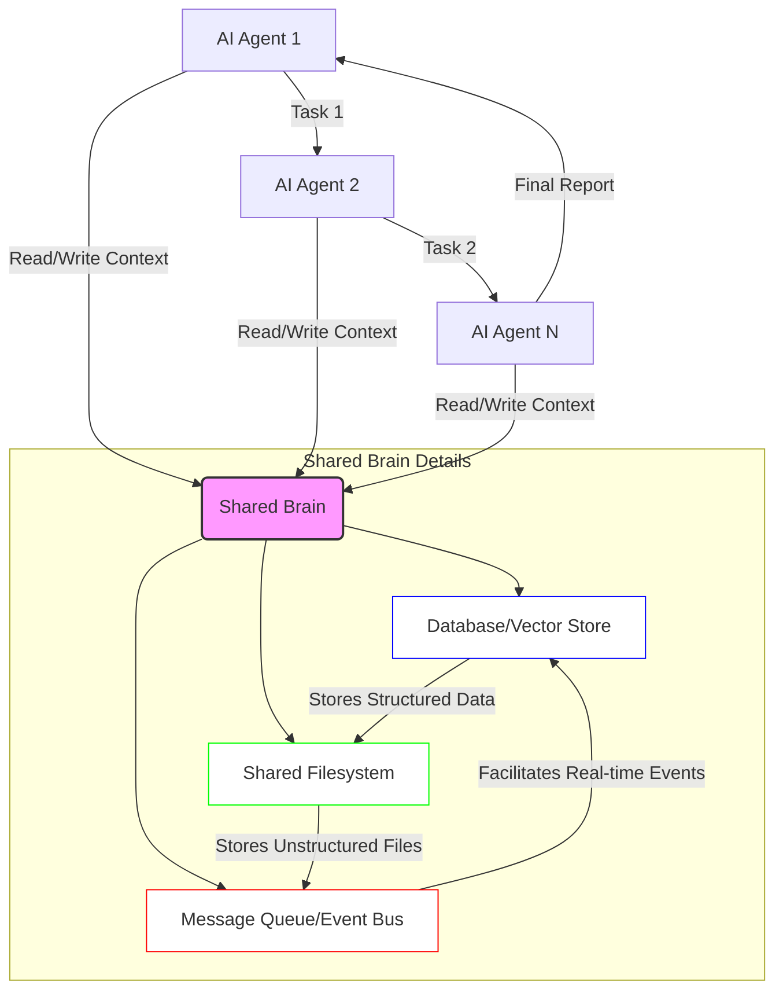

AI 에이전트 시스템에서 개별 에이전트는 독립적인 컨텍스트를 유지하여 작동합니다. 이는 단일 에이전트의 작업 효율성을 높일 수 있지만, 여러 에이전트가 복잡한 태스크를 협업하거나 장기간에 걸쳐 일관된 정보를 유지해야 할 때 심각한 문제로 작용합니다. 각 에이전트가 고유한 경험과 학습 내용을 개별적으로만 보유하게 되면, 다른 에이전트는 이미 해결된 문제나 축적된 지식을 알지 못해 중복 작업, 비효율적인 의사결정, 그리고 전반적인 시스템의 일관성 저하를 초래합니다.

공유 두뇌(Shared Brain) 시스템은 이러한 문제를 해결하기 위해 도입되는 핵심 아키텍처 패턴입니다. 이는 여러 AI 에이전트가 접근하고 수정할 수 있는 중앙 집중식 또는 분산형 지식 저장소를 의미합니다. 마치 인간 팀원들이 공유 문서나 공통된 데이터베이스를 통해 정보를 교환하듯이, AI 에이전트들도 이 공유 두뇌를 통해 컨텍스트를 지속적으로 공유하고 업데이트합니다. 이를 통해 '허브-워커 복리 자동화' 시나리오에서 워커 에이전트 간의 정보 일관성을 확보하고 전체 시스템의 효율성과 지능을 증대시킬 수 있습니다.

### 공유 두뇌 시스템의 핵심 개념 및 작동 원리

공유 두뇌는 단순히 데이터베이스를 넘어서, 에이전트의 의사결정 과정에 필요한 모든 종류의 컨텍스트 정보를 포함할 수 있습니다. 여기에는 다음과 같은 요소들이 포함될 수 있습니다.

*   **지속성(Persistence)**: 에이전트 세션이 종료되어도 정보가 손실되지 않고 유지됩니다.
*   **접근성(Accessibility)**: 권한이 있는 모든 에이전트가 필요한 정보에 접근할 수 있습니다.
*   **일관성(Consistency)**: 여러 에이전트가 동시에 정보를 수정할 때 데이터의 정합성이 유지됩니다.
*   **구조화(Structuring)**: 복잡한 지식도 효율적으로 저장하고 검색할 수 있도록 구조화됩니다.

SFS(Shared Filesystem)와 같은 프로젝트들은 이러한 공유 두뇌 개념을 파일 시스템 형태로 구현하여, 에이전트들이 파일 경로를 통해 컨텍스트를 관리하도록 합니다. 각 에이전트는 특정 작업의 결과물, 학습된 패턴, 현재 상태 등을 파일로 저장하고, 다른 에이전트는 이 파일을 읽어 자신의 의사결정에 활용할 수 있습니다.

### 공유 두뇌 아키텍처 예시

가장 기본적인 공유 두뇌는 분산 파일 시스템, 데이터베이스, 또는 메시지 큐 시스템 위에 구축될 수 있습니다. 다음 Mermaid 다이어그램은 여러 AI 에이전트가 중앙 집중식 공유 두뇌를 통해 상호작용하는 일반적인 시나리오를 보여줍니다.



### 코드 예시: 파이썬 기반의 간단한 공유 컨텍스트 시스템

다음은 파이썬으로 구현된 매우 간단한 형태의 공유 컨텍스트(Shared Context) 시스템 예제입니다. 실제 프로덕션 환경에서는 Redis, Kafka, 또는 전용 분산 데이터베이스를 활용하여 훨씬 견고하게 구축됩니다.

```python
import json
import threading
import time

class SharedBrain:
    def __init__(self, storage_path="shared_brain_data.json"):
        self.storage_path = storage_path
        self.lock = threading.Lock()
        self._data = self._load_data()

    def _load_data(self):
        try:
            with open(self.storage_path, 'r', encoding='utf-8') as f:
                return json.load(f)
        except FileNotFoundError:
            return {}
        except json.JSONDecodeError:
            print("Warning: Corrupt shared brain data, starting fresh.")
            return {}

    def _save_data(self):
        with open(self.storage_path, 'w', encoding='utf-8') as f:
            json.dump(self._data, f, indent=2, ensure_ascii=False)

    def get_context(self, key):
        with self.lock:
            return self._data.get(key)

    def set_context(self, key, value):
        with self.lock:
            self._data[key] = value
            self._save_data() # Persist immediately for simplicity

    def append_log(self, agent_id, message):
        with self.lock:
            if "logs" not in self._data:
                self._data["logs"] = []
            self._data["logs"].append({"agent": agent_id, "message": message, "timestamp": time.time()})
            self._save_data()

class AIAgent:
    def __init__(self, agent_id, shared_brain):
        self.agent_id = agent_id
        self.brain = shared_brain

    def perform_task(self, task_name, info=None):
        print(f"Agent {self.agent_id} starting task: {task_name}")
        self.brain.append_log(self.agent_id, f"Started {task_name}")

        # Read shared context
        shared_status = self.brain.get_context("global_status")
        print(f"Agent {self.agent_id} reads global status: {shared_status}")

        # Update shared context
        new_status = f"Agent {self.agent_id} completed {task_name} at {time.time()}"
        self.brain.set_context("global_status", new_status)
        self.brain.append_log(self.agent_id, f"Updated global status: {new_status}")

        if info:
            self.brain.set_context(f"{self.agent_id}_task_info", info)

        print(f"Agent {self.agent_id} finished task: {task_name}")

# Usage example
if __name__ == "__main__":
    shared_brain_instance = SharedBrain()

    agent1 = AIAgent("Alpha", shared_brain_instance)
    agent2 = AIAgent("Beta", shared_brain_instance)
    agent3 = AIAgent("Gamma", shared_brain_instance)

    # Agent Alpha initializes the global status
    agent1.brain.set_context("global_status", "Initialized by Alpha")

    # Agents perform tasks sequentially or concurrently (with locking)
    agent1.perform_task("Data Processing", {"items_processed": 100})
    time.sleep(0.1)
    agent2.perform_task("Analysis", {"data_source": "processed_by_alpha"})
    time.sleep(0.1)
    agent3.perform_task("Reporting", {"report_type": "summary"})

    # Check final shared status and logs
    print("\n--- Final Shared Brain State ---")
    print(json.dumps(shared_brain_instance._data, indent=2, ensure_ascii=False))
```

이 예제에서는 `SharedBrain` 클래스가 `shared_brain_data.json` 파일을 통해 컨텍스트를 영구적으로 저장하고, `threading.Lock`을 사용하여 동시성 문제를 최소화합니다. 각 `AIAgent`는 이 `SharedBrain` 인스턴스를 공유하여 정보를 읽고 쓸 수 있습니다.

### 2026년 최신 트렌드 반영: Knowledge Graph 및 Vector Store 통합

2026년에는 공유 두뇌 시스템이 단순한 파일 시스템이나 데이터베이스를 넘어 더욱 정교한 형태로 진화하고 있습니다. 특히 Knowledge Graph (지식 그래프)와 Vector Database (벡터 데이터베이스)의 통합은 에이전트의 지능형 컨텍스트 관리 능력을 극대화합니다.

*   **Knowledge Graph**: 에이전트 간의 관계형 지식을 구조화하고 추론을 가능하게 합니다. 특정 개념, 엔티티, 이벤트 간의 복잡한 연결을 표현함으로써, 에이전트가 단순한 키-값 검색을 넘어 고차원적인 지식 추론을 수행하도록 돕습니다. 예를 들어, "X 에이전트가 Y 모듈을 수정했다"는 사실을 저장하고, 이어서 "Y 모듈은 Z 서비스에 의존한다"는 지식을 활용하여 X 에이전트의 변경 사항이 Z 서비스에 미칠 영향을 예측할 수 있습니다.
*   **Vector Database**: 비정형 텍스트, 이미지, 오디오 등의 컨텍스트를 임베딩(embedding) 형태로 저장하고 유사성 검색을 가능하게 합니다. 에이전트가 방대한 비정형 데이터를 효율적으로 검색하고, 현재 작업과 가장 관련성 높은 컨텍스트 조각을 '기억'해내도록 돕습니다. RAG(Retrieval-Augmented Generation) 패턴에서 중요한 역할을 합니다.

이 두 기술의 조합은 AI 에이전트가 시맨틱(Semantic)한 이해를 바탕으로 컨텍스트를 공유하고, 더욱 능동적으로 협업하며, 복잡한 문제 해결 능력을 향상시키는 데 필수적인 요소로 자리매김하고 있습니다.

## 트레이드오프

공유 두뇌 시스템은 AI 에이전트의 협업 및 지속성을 크게 향상시키지만, 도입 시 신중하게 고려해야 할 트레이드오프가 존재합니다.

*   **복잡성 증가 vs. 기능성 향상**:
    *   **언제 좋고**: 여러 에이전트가 긴밀하게 협력해야 하거나, 장기간에 걸쳐 일관된 컨텍스트를 유지해야 하는 복잡한 자동화 워크플로우(예: '허브-워커' 패턴)에 매우 유리합니다. 에이전트 간 지식 격차를 줄이고 시너지 효과를 창출합니다.
    *   **언제 나쁜지**: 단일 에이전트가 독립적으로 수행하는 단순 반복 작업에는 과도한 아키텍처 오버헤드가 발생할 수 있습니다. 시스템 설계, 구현, 유지보수 비용이 증가합니다.

*   **데이터 일관성 및 동시성 제어 vs. 성능 오버헤드**:
    *   **언제 좋고**: 다수의 에이전트가 동일한 정보에 의존하거나 정보를 업데이트해야 할 때, 데이터의 정합성을 보장하여 잘못된 의사결정을 방지합니다. 크리티컬한 시스템에서 데이터 신뢰성이 최우선일 때 필수적입니다.
    *   **언제 나쁜지**: 정교한 동시성 제어(락킹, 트랜잭션 등)는 시스템의 처리량(throughput)과 응답 시간(latency)에 영향을 줄 수 있습니다. 높은 빈도로 빠르게 변화하는 데이터를 처리해야 하는 실시간 시스템에서는 병목 현상이 발생할 수 있습니다.

*   **확장성(Scalability) vs. 단일 실패 지점(Single Point of Failure) 위험**:
    *   **언제 좋고**: 적절히 설계된 분산 공유 두뇌(예: 분산 데이터베이스)는 많은 수의 에이전트와 대규모 데이터를 처리할 수 있도록 확장됩니다.
    *   **언제 나쁜지**: 중앙 집중식 공유 두뇌는 단일 실패 지점이 되어 전체 에이전트 시스템의 가용성에 치명적인 영향을 줄 수 있습니다. 또한, 샤딩(sharding)이나 복제(replication)를 고려하지 않으면 병목 현상이 발생하기 쉽습니다.

*   **보안 및 접근 제어 vs. 관리 복잡성**:
    *   **언제 좋고**: 민감한 정보를 공유하거나, 에이전트별로 접근 권한을 엄격하게 구분해야 할 때 필수적입니다. 데이터 무결성과 시스템 보안을 강화합니다.
    *   **언제 나쁜지**: 에이전트별 역할 기반 접근 제어(RBAC)나 데이터 암호화 등을 구현하는 과정에서 관리 및 운영 복잡성이 크게 증가합니다. 세분화된 권한 관리가 불필요한 환경에서는 단순성을 해칩니다.

## 실전 체크리스트

AI 에이전트 공유 두뇌 시스템을 실제 프로젝트에 도입할 때 다음 체크리스트를 활용하여 성공적인 구현을 위한 준비를 검증하십시오.

*   [ ] **데이터 모델 및 스키마 설계**: 공유할 컨텍스트의 유형, 구조, 관계를 명확히 정의하고, 에이전트 간 합의된 데이터 스키마를 마련했는가? (예: JSON Schema, Protobuf)
*   [ ] **컨텍스트 지속성 전략**: 에이전트 세션 종료 및 시스템 재시작에도 컨텍스트가 안전하게 보존될 수 있는 영구 저장소(파일 시스템, 데이터베이스, 벡터 스토어 등)를 선정하고 구현했는가?
*   [ ] **동시성 및 일관성 메커니즘**: 여러 에이전트가 동시에 공유 두뇌에 접근하고 수정할 때 데이터 충돌을 방지하고 일관성을 유지하기 위한 락킹, 트랜잭션, 버전 관리 등의 전략을 수립하고 적용했는가?
*   [ ] **접근 제어 및 보안**: 공유 두뇌 내 민감한 정보에 대한 에이전트별 접근 권한을 정의하고, 인증 및 권한 부여(Authentication & Authorization) 메커니즘을 구현하여 무단 접근을 방지했는가?
*   [ ] **성능 및 확장성 고려**: 예상되는 에이전트 수, 데이터 볼륨, 트래픽 패턴을 기반으로 공유 두뇌 시스템의 성능 병목 지점을 분석하고, 필요시 샤딩, 캐싱, 비동기 처리 등의 확장성 전략을 계획했는가?
*   [ ] **모니터링 및 로깅**: 공유 두뇌의 상태, 에이전트의 컨텍스트 접근 및 수정 패턴, 잠재적인 데이터 불일치 등을 실시간으로 감지하고 추적할 수 있는 모니터링 및 로깅 시스템을 구축했는가?
*   [ ] **장애 복구 및 백업**: 공유 두뇌 시스템의 장애 발생 시 데이터 손실을 최소화하고 신속하게 복구할 수 있는 백업 및 복구 전략을 수립하고 주기적으로 테스트했는가?