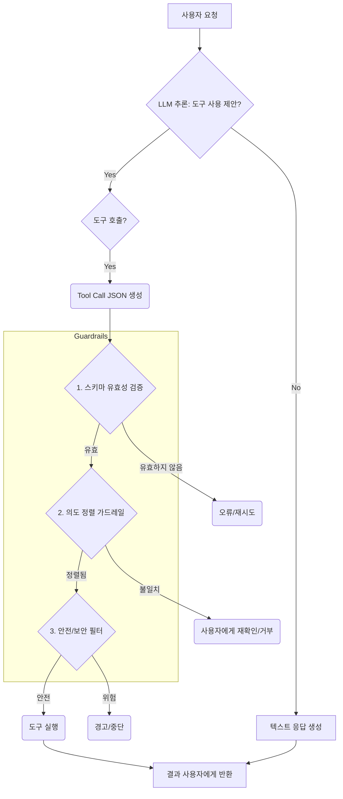

AI 에이전트의 자율성은 혁신적인 가능성을 제공하지만, 사용자의 의도를 벗어나 '폭주(runaway)'하는 현상은 주요한 도전 과제입니다. 특히 코딩 에이전트나 자동화된 시스템에서 이러한 폭주는 예측 불가능한 결과를 초래하거나 불필요한 자원 낭비를 발생시킬 수 있습니다. Superpowers 패턴은 이러한 문제를 해결하기 위한 강력한 가드레일 메커니즘을 제공하며, LLM(Large Language Model) 기반 에이전트가 의도된 범위 내에서만 작동하도록 보장합니다.

### AI 에이전트 폭주의 위험성 및 Superpowers 패턴의 필요성

AI 에이전트는 복잡한 작업을 수행할 때 종종 과도하게 능동적이거나, 초기 지시사항을 자의적으로 확장하여 불필요한 기능까지 구현하려는 경향을 보입니다. 예를 들어, "간단한 메모 앱을 만들어달라"는 요청에 대해, 에이전트가 로그인 기능, 클라우드 동기화, 사용자별 테마 설정 등 기획되지 않은 기능을 추가하려 시도하는 경우가 발생합니다. 이는 개발 시간 증가, 불필요한 복잡성, 그리고 잠재적인 보안 취약점 생성으로 이어질 수 있습니다.

Superpowers 패턴은 에이전트의 '능력(superpowers)'을 명확하게 정의하고, 이 능력이 오직 특정 조건 하에서만 발동되도록 제어하는 접근 방식입니다. 이는 주로 다음과 같은 원칙을 통해 구현됩니다.

1.  **명시적 도구(Tool) 정의 및 스키마:** 에이전트가 사용할 수 있는 모든 함수나 API는 명확한 목적, 입력, 출력 스키마와 함께 정의됩니다.
2.  **의도 정렬(Intent Alignment) 프롬프트:** 에이전트에게 주어진 태스크와 도구 사용 간의 강력한 연결 고리를 강조하는 프롬프트 엔지니어링 기법을 적용합니다.
3.  **실행 전 검증(Pre-execution Validation):** 에이전트가 특정 도구를 사용하기 전에, 그 사용이 현재 사용자의 의도와 명확히 일치하는지 검증하는 단계를 도입합니다.

### Superpowers 패턴 구현 상세

Superpowers 패턴은 LLM의 추론 능력과 외부 도구 사용 능력을 결합하되, 그 결합 과정에 강력한 제어 메커니즘을 삽입하는 것을 목표로 합니다.

#### 1. 강력한 도구 정의와 스키마 검증

각 Superpower (즉, 에이전트가 실행할 수 있는 함수나 외부 API 호출)는 상세한 JSON 스키마와 함께 정의되어야 합니다. 이 스키마는 함수의 목적, 필수 인자, 각 인자의 타입과 설명, 그리고 예상되는 반환 값 등을 명시합니다. 에이전트가 도구 호출을 제안할 때, 이 스키마에 따라 인자들이 유효한지 자동으로 검증됩니다.

```python
from pydantic import BaseModel, Field
from typing import Dict, Any

# Superpower (Tool) 정의 예시
class CreateMemoRequest(BaseModel):
    title: str = Field(..., description="메모의 제목")
    content: str = Field(..., description="메모의 본문 내용")
    tags: list[str] = Field(default_factory=list, description="메모에 추가할 태그 목록")

def create_memo(request: CreateMemoRequest) -> Dict[str, Any]:
    """
    사용자의 요청에 따라 새로운 메모를 생성합니다.
    이 함수는 오직 사용자가 명시적으로 메모 생성을 요청했을 때만 호출되어야 합니다.
    """
    print(f"Creating memo: Title='{request.title}', Tags={request.tags}")
    # 실제 메모 생성 로직 (DB 저장 등)
    memo_id = f"memo_{hash(request.title + request.content)}"
    return {"status": "success", "memo_id": memo_id, "message": "메모가 성공적으로 생성되었습니다."}

# 에이전트에게 제공될 도구 목록
TOOLS = {
    "create_memo": {
        "function": create_memo,
        "schema": CreateMemoRequest.schema(),
        "description": "새로운 메모를 생성하는 도구. 제목과 내용을 필수로 받습니다. 태그를 추가할 수 있습니다.",
        "intent_guard": "사용자가 명시적으로 '메모를 생성해달라'고 요청했는가?"
    }
}

# 에이전트의 가드레일 로직 (간소화된 예시)
def agent_guardrail_check(tool_name: str, args: Dict[str, Any], user_intent: str) -> bool:
    tool_info = TOOLS.get(tool_name)
    if not tool_info:
        return False # 알 수 없는 도구

    # 1. 스키마 유효성 검사
    try:
        tool_info["function"].__annotations__['request'].__args__[0](**args)
    except Exception as e:
        print(f"Schema validation failed for {tool_name}: {e}")
        return False

    # 2. 의도 정렬 검사 (간단한 키워드 매칭, 실제로는 LLM 기반 검증 필요)
    if "intent_guard" in tool_info:
        # 실제 시스템에서는 별도의 LLM 호출 또는 사용자 승인 프로세스를 거침
        print(f"Checking intent guard for {tool_name}: {tool_info['intent_guard']}")
        if "메모 생성" in user_intent and "create_memo" == tool_name: # 예시 로직
            return True
        elif "메모" in user_intent and tool_name == "create_memo":
            # 사용자 의도가 불분명할 경우, 추가 질문 또는 거부
            print("User intent is ambiguous. Refusing tool call.")
            return False
        return False # 의도 가드레일 불일치

    return True # 기본적으로 허용 (또는 더 엄격한 정책)

# 예시 사용
user_request_good = "오늘의 할 일: 장보기 메모를 '우유, 빵 구매' 내용으로 생성해줘."
tool_call_good = {"tool_name": "create_memo", "args": {"title": "장보기", "content": "우유, 빵 구매", "tags": ["할일", "식료품"]}}

user_request_bad = "내 웹사이트에 로그인 기능도 넣어줄 수 있을까?"
tool_call_bad = {"tool_name": "create_memo", "args": {"title": "로그인 기능 추가", "content": "사용자 인증 로직 구현"}} # 의도 불일치 예시

if agent_guardrail_check(tool_call_good["tool_name"], tool_call_good["args"], user_request_good):
    print("Good tool call passed guardrail.")
    # create_memo(**tool_call_good["args"]) # 실제 함수 호출
else:
    print("Good tool call failed guardrail.")

if agent_guardrail_check(tool_call_bad["tool_name"], tool_call_bad["args"], user_request_bad):
    print("Bad tool call passed guardrail.")
else:
    print("Bad tool call failed guardrail.")
```

#### 2. 프롬프트 내 가드레일 및 의도 정렬 강화

LLM에 전달되는 시스템 프롬프트는 에이전트의 역할을 명확히 하고, 허용된 도구 외의 기능을 수행하지 않도록 강력하게 제약해야 합니다. 또한, 도구를 사용하기 전에 항상 사용자의 명시적 동의 또는 명확한 의도를 확인하도록 지시해야 합니다.

```
You are a helpful assistant specialized in managing user notes.
You can ONLY create notes, and NEVER perform any other actions like modifying system settings, accessing external databases beyond your defined tools, or implementing features not explicitly requested by the user.
When the user asks you to perform an action, you must first confirm if that action explicitly matches one of your available tools. If not, inform the user about your limitations.
Before calling any tool, rigorously validate if the tool arguments align perfectly with the user's intent. Do not infer or add functionality.
Available tools:
{tool_definitions_json} # JSON 스키마 기반 도구 정의 주입
```

#### 3. 다단계 출력 검증 파이프라인

에이전트의 최종 출력(도구 호출, 응답 텍스트 등)은 여러 단계의 가드레일을 통과해야 합니다.

*   **Syntax & Schema Validation**: LLM이 생성한 도구 호출이 정의된 스키마에 맞는지 검증합니다.
*   **Intent Matching**: LLM이 제안한 도구 호출의 목적이 초기 사용자 요청의 의도와 일치하는지 별도의 LLM 또는 규칙 기반 시스템으로 재검증합니다.
*   **Safety & Security Filters**: 민감 정보 유출, 악의적 코드 생성 등 잠재적 위험을 탐지합니다.
*   **Human-in-the-Loop (Optional)**: 고위험 작업의 경우, 사용자나 운영자의 최종 승인을 요구합니다.

### Mermaid Diagram: Superpowers Guardrail Flow



### 2026년 트렌드 반영

2026년에는 AI 에이전트 시스템이 더욱 복잡해지고 광범위하게 배포됨에 따라, Superpowers 패턴과 같은 강력한 제어 메커니즘이 표준이 될 것입니다. 특히 다음과 같은 영역에서 발전이 예상됩니다.

*   **Adaptive Guardrails**: 사용자의 컨텍스트와 과거 행동 패턴을 학습하여 가드레일의 엄격성을 동적으로 조절하는 시스템.
*   **Formal Verification for Tools**: 중요한 도구 사용에 대해 형식 검증(formal verification) 기법을 도입하여, 특정 조건 하에서만 도구가 실행됨을 수학적으로 증명하는 시도.
*   **Explainable AI (XAI) for Guardrails**: 가드레일이 특정 도구 호출을 승인하거나 거부한 이유를 사용자나 개발자가 명확히 이해할 수 있도록 설명 가능한 시스템.
*   **Federated Guardrails**: 멀티 에이전트 시스템에서 각 에이전트의 Superpowers를 정의하고, 에이전트 간 협업 시 발생할 수 있는 폭주를 전체 시스템 레벨에서 제어하는 프레임워크.

## 트레이드오프

*   **개발 복잡성 증가**: 
    *   **언제 좋은가**: 높은 신뢰성과 안전성이 요구되는 프로덕션 환경, 금융/의료 등 규제 준수가 중요한 도메인, 자원 낭비나 심각한 오류가 발생할 수 있는 자동화 시스템에 적합합니다.
    *   **언제 나쁜가**: 초기 프로토타이핑, 내부 개발 도구, 유연성과 빠른 반복이 중요한 탐색적 AI 애플리케이션에서는 개발 속도를 저해할 수 있습니다.
*   **LLM의 자율성 및 유연성 저하**: 
    *   **언제 좋은가**: 에이전트가 오직 정해진 역할을 수행하고 사용자의 명시적 지시에만 반응해야 하는 경우, 예측 가능한 행동이 필수적인 시스템에 유리합니다.
    *   **언제 나쁜가**: 창의적인 문제 해결, 비정형적인 태스크, 새로운 아이디어 탐색이 필요한 에이전트에게는 과도한 제약이 될 수 있으며, LLM의 잠재력을 완전히 활용하지 못하게 할 수 있습니다.
*   **추가적인 지연 시간 발생**: 
    *   **언제 좋은가**: 실시간 응답 속도보다 정확성과 안전성이 우선시되는 배치 처리, 중요 비즈니스 로직 연동 에이전트, 사람이 개입할 수 있는 워크플로우에 적합합니다.
    *   **언제 나쁜가**: 사용자 인터랙션이 빈번하고 즉각적인 응답이 필요한 대화형 에이전트나 낮은 Latency가 요구되는 시스템에서는 사용자 경험을 저하시킬 수 있습니다.
*   **프롬프트 엔지니어링 및 스키마 관리 노력**: 
    *   **언제 좋은가**: 시스템이 확장되고 도구의 수가 많아질수록 일관된 정의와 관리는 에이전트의 예측 가능성을 높여 유지보수 비용을 절감합니다.
    *   **언제 나쁜가**: 소규모 에이전트나 간단한 스크립트에는 오버헤드가 될 수 있으며, 스키마 변경 시 모든 가드레일 로직을 업데이트해야 하는 부담이 있습니다.
*   **오버 스펙(Over-specification) 위험**: 
    *   **언제 좋은가**: 비즈니스 로직이 명확하고 변경될 가능성이 적은 핵심 기능에 대한 에이전트 제어에 매우 효과적입니다.
    *   **언제 나쁜가**: 요구사항이 자주 변경되거나 에이전트가 새로운 도구를 동적으로 학습해야 하는 환경에서는 가드레일 자체가 병목이 되어 적응성을 떨어뜨릴 수 있습니다.

## 실전 체크리스트

Superpowers 패턴을 적용할 때 다음 항목들을 검증해야 합니다.

*   [ ] 모든 에이전트 도구(Superpowers)가 명확한 JSON 스키마와 목적 설명으로 정의되어 있는가?
*   [ ] 에이전트의 시스템 프롬프트가 허용된 도구 사용 범위와 의도 정렬 원칙을 명시적으로 강조하고 있는가?
*   [ ] LLM이 생성한 도구 호출 제안이 실행되기 전, 스키마 유효성 검증 단계를 거치는가?
*   [ ] 도구 호출의 의도가 초기 사용자 요청과 일치하는지 검증하는 별도의 가드레일(LLM 기반 또는 규칙 기반)이 구현되어 있는가?
*   [ ] 잠재적 보안 위협(예: 민감 정보 접근, 악성 코드 주입 시도)을 탐지하고 차단하는 안전 필터가 도구 실행 파이프라인에 포함되어 있는가?
*   [ ] 고위험 도구(예: 데이터 삭제, 외부 시스템 변경)의 경우, 사용자 또는 관리자의 명시적 승인 프로세스를 거치도록 설계되었는가?
*   [ ] 가드레일이 도구 호출을 거부했을 때, 사용자에게 명확하고 건설적인 피드백을 제공하여 다음 행동을 유도하는가?