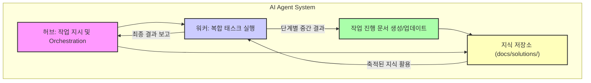

# AI 에이전트의 투명한 작업 실행 및 지식 통합 (Transparent AI Agent Task Execution and Knowledge Integration)

## 배경: 복합 태스크 자동화의 도전 과제

현대 AI 시스템은 단일 작업을 넘어 복합적이고 장기적인 태스크를 자율적으로 처리하는 AI 에이전트(AI Agents) 중심으로 발전하고 있습니다. 그러나 이러한 에이전트의 작업 실행 과정은 종종 불투명하게 진행되어, 디버깅, 감사, 재현성 확보에 어려움을 겪습니다. 특히 '허브-워커 복리 자동화'와 같은 분산된 에이전트 시스템에서는 각 워커(Worker) 에이전트가 어떤 단계를 거쳐 어떤 결정을 내렸는지 추적하기가 더욱 복잡해집니다. 이로 인해 에이전트의 오작동 원인 파악이 어렵고, 성공적인 작업 방식이 조직 내 지식으로 축적되기 어렵다는 문제가 발생합니다.

## FablePool 영감: 공개적이고 단계별 작업 실행 및 기록

FablePool 프로젝트는 크라우드펀딩 모델을 AI 에이전트의 작업 실행에 접목하여, 후원자들이 자금을 모아 하나의 야심찬 인스트럭션(Instruction)에 대한 AI의 단계별 수행 과정을 공개적으로 공유하는 개념을 제시합니다. 이 아이디어는 AI 에이전트의 작업 실행에 '투명성'과 '공개적 기록'이라는 중요한 가치를 부여합니다. 이러한 접근 방식은 playbook 내 AI 에이전트가 복합적인 지시를 단계별로 수행하고 그 과정과 결과물을 '공개적으로 공유'하는 방식을 허브(Hub) 시스템에 통합하는 데 중요한 영감을 제공합니다. 이는 특히 `docs/solutions/`와 같은 지식 저장소에 워커 에이전트의 작업 진행 상황 및 결과가 명확하게 기록되도록 시스템화하는 데 활용될 수 있습니다.

## 핵심 원칙 및 아키텍처 (Core Principles and Architecture)

AI 에이전트의 투명한 작업 실행 및 지식 통합을 위한 핵심 원칙은 다음과 같습니다.

### 1. 작업 투명성 (Task Transparency)

각 에이전트 워커는 할당된 태스크의 모든 주요 단계를 기록하고, 중간 결과와 최종 결정을 표준화된 형식으로 문서화해야 합니다. 이는 에이전트의 '생각의 흐름(Chain of Thought)'을 외부에서 확인할 수 있도록 합니다.

### 2. 지식 복리화 (Knowledge Compounding)

에이전트의 작업 기록은 단순한 로그를 넘어, 재사용 가능한 지식 아티팩트(Knowledge Artifact)로 간주됩니다. 이러한 아티팩트는 새로운 태스크 수행 시 에이전트의 컨텍스트(Context)로 활용되거나, 인간의 검토 및 개선을 위한 자료로 사용되어 전체 시스템의 지능을 지속적으로 향상시킵니다.

### 3. 허브-워커-지식 저장소 모델 (Hub-Worker-Knowledge Store Model)

*   **허브 (Hub)**: 태스크를 정의하고 워커 에이전트에 할당합니다. 워커의 진행 상황을 모니터링하고, 필요 시 개입하거나 최종 결과를 취합합니다.
*   **워커 (Worker)**: 할당된 태스크를 단계별로 실행하며, 각 단계의 상세 내용과 결과를 지식 저장소에 기록합니다.
*   **지식 저장소 (`docs/solutions/`)**: 워커 에이전트가 생성한 마크다운 문서를 체계적으로 저장합니다. 이 문서는 에이전트의 작업 실행에 대한 정량적, 정성적 증거를 포함하며, 향후 유사 태스크를 위한 레퍼런스(Reference) 역할을 수행합니다.



## 구현 상세 (Implementation Details)

### 단계별 작업 기록 프로토콜 (Step-by-step Task Logging Protocol)

워커 에이전트는 태스크를 수행하는 동안 다음 정보를 포함하는 구조화된 기록을 생성해야 합니다.

*   **단계 이름 (Step Name)**: 현재 수행 중인 작업의 간결한 이름.
*   **타임스탬프 (Timestamp)**: 단계가 시작되거나 완료된 시간.
*   **설명 (Description)**: 단계의 목적과 수행 내용에 대한 요약.
*   **입력 (Inputs)**: 해당 단계에 사용된 주요 입력 데이터 또는 프롬프트.
*   **출력 (Outputs)**: 단계의 결과로 생성된 주요 데이터, 결정, 또는 다음 단계에 전달될 정보.
*   **사용된 도구 (Tools Used)**: 해당 단계에서 호출된 외부 도구 또는 API 목록.
*   **오류/예외 (Errors/Exceptions)**: 발생한 문제 및 처리 방식.
*   **코드 블록 (Code Block)**: 특정 단계에서 실행된 코드 스니펫.

### `docs/solutions/` 문서화 가이드라인

생성된 기록은 `docs/solutions/{task-slug}.md` 형식의 마크다운 파일로 저장됩니다. 각 파일은 해당 태스크의 전체 실행 이력을 담는 단일 출처(Single Source of Truth)가 됩니다. 마크다운의 헤딩(##, ###), 리스트, 코드 블록 기능을 적극 활용하여 가독성을 높입니다.

### 코드 예제: Python Agent로 마크다운 문서 생성

다음 Python 코드는 AI 에이전트가 자신의 작업 단계를 `docs/solutions` 디렉터리 내의 마크다운 파일에 기록하는 방식을 보여줍니다. 이 패턴은 에이전트의 각 행동을 투명하게 문서화하고, 축적된 문서를 통해 지식을 통합하는 데 활용될 수 있습니다.

```python
import os
import datetime

class AgentTaskExecutor:
    def __init__(self, task_name, output_dir="docs/solutions"):
        self.task_name = task_name
        self.output_dir = output_dir
        self.doc_path = os.path.join(output_dir, f"{self.to_kebab_case(task_name)}.md")
        os.makedirs(output_dir, exist_ok=True)
        self._initialize_document()

    def to_kebab_case(self, text):
        return text.replace(" ", "-").lower()

    def _initialize_document(self):
        with open(self.doc_path, "w", encoding="utf-8") as f:
            f.write(f"# AI Agent Task: {self.task_name}\n\n")
            f.write(f"## Overview\n")
            f.write(f"This document tracks the execution of the AI agent for the task: '{self.task_name}'.\n")
            f.write(f"Initiated: {datetime.datetime.now().isoformat()}\n\n")

    def log_step(self, step_name, description, details=None, code_block=None):
        with open(self.doc_path, "a", encoding="utf-8") as f:
            f.write(f"### Step: {step_name}\n")
            f.write(f"- **Timestamp**: {datetime.datetime.now().isoformat()}\n")
            f.write(f"- **Description**: {description}\n")
            if details:
                f.write(f"- **Details**:\n")
                f.write(f"{details}\n")
            if code_block:
                f.write(f"```python\n{code_block}\n```\n")
            f.write("\n")

    def finalize_task(self, final_result):
        with open(self.doc_path, "a", encoding="utf-8") as f:
            f.write(f"## Task Completion\n")
            f.write(f"**Final Result**: {final_result}\n")
            f.write(f"Completed: {datetime.datetime.now().isoformat()}\n")

if __name__ == "__main__":
    agent_task = AgentTaskExecutor("Complex Data Analysis and Report Generation")

    agent_task.log_step(
        "Data Acquisition",
        "Collecting raw data from various sources.",
        details="Sources: Internal DB, External API (FinanceData.com)",
        code_block="""
import pandas as pd
# Simulate data collection
data = pd.DataFrame({'A': [1,2,3], 'B': [4,5,6]})
print("Data acquired successfully.")
"""
    )

    agent_task.log_step(
        "Data Preprocessing",
        "Cleaning and transforming raw data for analysis.",
        details="Removed null values, normalized numerical features."
    )

    agent_task.log_step(
        "Model Training",
        "Training a predictive model on the processed data.",
        code_block="""
from sklearn.linear_model import LinearRegression
model = LinearRegression()
# model.fit(X_train, y_train)
print("Model trained.")
"""
    )

    agent_task.finalize_task("Report generated and saved as 'analysis_report.pdf'.")
    print(f"Task documentation saved to {agent_task.doc_path}")

```

## 트레이드오프 (Trade-offs)

이러한 투명한 작업 실행 및 지식 통합 방식은 여러 장점과 단점을 가집니다.

*   **투명성 및 디버깅 용이성 (Transparency & Easier Debugging)**
    *   **좋을 때**: 에이전트의 복잡한 추론 과정이나 예상치 못한 동작을 이해하고 디버깅하는 데 필수적입니다. 특히 2026년에는 설명 가능한 AI(Explainable AI, XAI)에 대한 요구가 증대됩니다.
    *   **나쁠 때**: 모든 단계를 기록하는 데 추가적인 로직과 리소스가 필요하여 에이전트의 실행 오버헤드가 증가할 수 있습니다.

*   **지식 축적 및 재사용성 (Knowledge Accumulation & Reusability)**
    *   **좋을 때**: 성공적인 작업 패턴, 문제 해결 전략, 도구 사용법 등이 마크다운 문서 형태로 조직의 영구적인 지식 자산으로 축적됩니다. 이는 새로운 에이전트 개발 또는 기존 에이전트 개선 시 학습 데이터로 활용될 수 있습니다.
    *   **나쁠 때**: 문서화된 정보의 양이 방대해질 경우, 필요한 정보를 효율적으로 검색하고 필터링하는 메커니즘이 없으면 '정보 과부하(Information Overload)'가 발생할 수 있습니다.

*   **재현성 및 감사 가능성 (Reproducibility & Auditability)**
    *   **좋을 때**: 에이전트의 작업 실행을 정확히 재현하거나 규제 준수를 위한 감사(Audit) 요구사항을 충족하는 데 매우 효과적입니다. 특히 금융, 의료 등 규제가 엄격한 산업군에서 중요합니다.
    *   **나쁠 때**: 기록의 정확성과 일관성을 유지하기 위한 엄격한 프로토콜과 검증 프로세스가 필요하며, 이를 구축하는 데 초기 비용이 발생합니다.

*   **보안 및 프라이버시 (Security & Privacy)**
    *   **좋을 때**: 민감 정보를 기록하지 않거나 적절히 마스킹하는 정책과 함께 사용될 경우, 에이전트의 동작에 대한 신뢰도를 높일 수 있습니다.
    *   **나쁠 때**: 에이전트가 처리하는 데이터에 민감 정보(Personally Identifiable Information, PII)가 포함될 경우, 모든 작업 기록이 외부에 '공개적'으로 노출될 위험이 존재합니다. 강력한 데이터 마스킹(Data Masking) 및 접근 제어(Access Control) 전략이 필수적입니다.

## 실전 체크리스트 (Practical Checklist)

이 지식 통합 패턴을 프로젝트에 적용할 때 검증해야 할 항목들입니다.

- [ ] **워커 에이전트 작업 단계 정의**: 각 워커 에이전트가 수행할 핵심 작업 단계를 명확히 식별하고 문서화 프로토콜에 맞게 정의했는가?
- [ ] **자동화된 문서 생성 로직 구현**: 에이전트의 각 작업 단계가 완료될 때마다 자동으로 `docs/solutions/`에 마크다운 문서를 생성하거나 업데이트하는 로직을 구현했는가?
- [ ] **구조화된 정보 기록**: 타임스탬프, 입력, 출력, 사용 도구, 코드 블록 등 핵심 정보가 문서에 구조화된 형태로 기록되는가?
- [ ] **지식 저장소 검색 및 활용 시스템**: 축적된 마크다운 문서에서 필요한 정보를 효율적으로 검색하고, 새로운 에이전트 작업에 컨텍스트로 주입하는 시스템을 구축했는가?
- [ ] **민감 정보 처리 정책**: 기록될 정보에 민감한 데이터가 포함될 경우, 적절한 마스킹, 암호화 또는 접근 제어 정책을 수립하고 적용했는가?
- [ ] **문서 버전 관리 및 변경 이력**: `docs/solutions/`의 문서들이 Git과 같은 버전 관리 시스템으로 관리되어 변경 이력 추적이 가능한가?
- [ ] **허브-워커 간 문서화 피드백 루프**: 허브가 워커의 문서화 품질을 검토하고 피드백을 제공하여 문서화 기준을 지속적으로 개선하는 메커니즘이 있는가?
