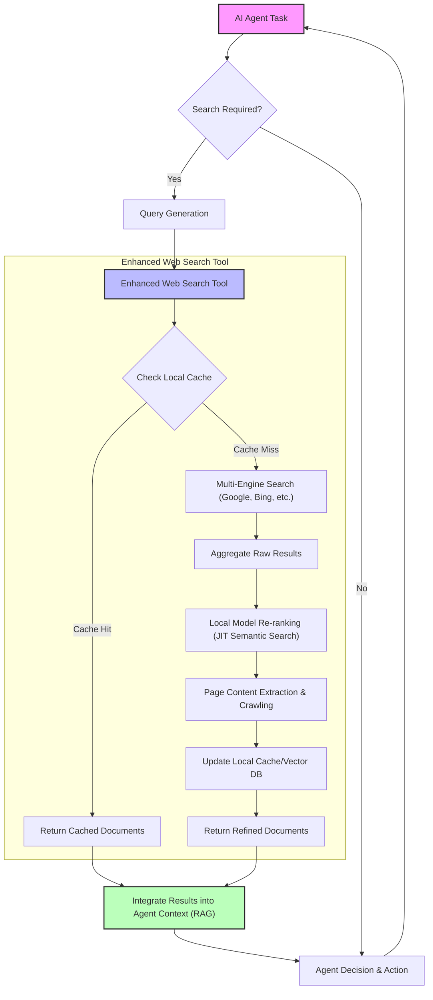

AI 에이전트의 인지 능력은 정보 접근성에 크게 좌우된다. 특히 동적으로 변화하는 웹 환경에서 최신의 정확한 정보를 신속하게 획득하고 활용하는 능력은 에이전트의 성능을 결정하는 핵심 요소이다. 기존 AI 에이전트의 웹 검색 기능은 단순히 외부 API 호출에 그치는 경우가 많아, 결과의 신뢰성, 관련성, 그리고 처리 비용 면에서 한계를 드러냈다. 이 문서에서는 AI 에이전트의 웹 검색 및 수집 기능을 혁신적으로 강화하기 위한 로컬 우선(local-first) 접근 방식과 그 핵심 요소들을 탐구한다.

## AI 에이전트를 위한 웹 검색 및 데이터 수집의 중요성

AI 에이전트가 복잡한 태스크를 수행하고, 실시간으로 변화하는 정보를 바탕으로 의사결정을 내리려면 강력한 웹 검색 및 데이터 수집 기능이 필수적이다. 이는 단순한 정보 탐색을 넘어, 특정 웹 페이지의 심층 분석, 구조화되지 않은 데이터에서 핵심 정보 추출, 그리고 이를 에이전트의 추론 컨텍스트에 통합하는 과정을 포함한다. 특히 2026년 현재, LLM의 한계인 할루시네이션(hallucination)을 줄이고 최신 정보에 대한 접근성을 높이기 위해 Retrieval-Augmented Generation (RAG) 아키텍처는 필수적인 구성 요소로 자리 잡았다.

## 로컬 우선 웹 검색 및 수집 아키텍처

`wigolo`와 같은 로컬 우선 웹 검색/수집 도구는 AI 에이전트의 검색 효율성과 정확성을 획기적으로 향상시킬 수 있는 방법론을 제시한다. 이는 다음과 같은 핵심 기능으로 구성된다.

### 1. 다중 검색 엔진 결과 통합 및 재정렬

단일 검색 엔진의 한계를 극복하기 위해, 여러 상용 및 오픈소스 검색 엔진(예: Google, Bing, DuckDuckGo, Brave Search 등 18개 이상)의 결과를 통합하고 집계한다. 이렇게 수집된 원시(raw) 검색 결과는 단순히 나열되는 것이 아니라, 에이전트의 현재 목표와 컨텍스트에 맞춰 로컬에서 실행되는 모델(예: 경량 임베딩 모델)을 통해 재정렬(re-ranking)된다. 이 과정에서 JIT(Just-In-Time) 의미 검색(semantic search) 기술이 활용되어 검색 쿼리와 결과 문서 간의 의미론적 유사도를 극대화하여 에이전트가 필요로 하는 가장 관련성 높은 정보를 최상단에 배치한다.

### 2. 페이지 읽기, 크롤링 및 데이터 추출

검색 결과로 얻은 URL에 대해 페이지 내용을 효율적으로 읽고, 필요한 경우 웹사이트를 크롤링하여 더 넓은 범위의 정보를 수집한다. 이 과정에서 HTML 파싱, 텍스트 정제, 이미지 및 비디오와 같은 멀티모달 콘텐츠 처리 등이 이루어진다. 수집된 페이지에서는 에이전트의 태스크에 필요한 특정 데이터 포인트(예: 제품 가격, 뉴스 기사 요약, 코드 스니펫)를 정확하게 추출하는 기능이 중요하다. 이를 위해 XPath, CSS Selector, 또는 LLM 기반의 정보 추출 프롬프트 등이 활용될 수 있다.

### 3. 로컬 캐싱 및 유사 문서 검색

수집된 웹 페이지 콘텐츠는 로컬 벡터 데이터베이스에 캐싱되어 불필요한 네트워크 요청을 줄이고 응답 속도를 향상시킨다. 이는 비용 절감에도 기여한다. 에이전트가 이전에 검색했거나 유사한 정보를 다시 필요로 할 경우, 캐시된 데이터를 활용하여 즉각적인 응답을 제공한다. 유사 문서 검색(similar document search) 기능은 새로운 검색 쿼리가 들어왔을 때, 기존 캐시된 문서들 중에서 의미론적으로 가장 유사한 문서를 찾아내어 에이전트의 컨텍스트를 풍부하게 하는 데 사용된다.

## AI 에이전트 하네스 통합 시 고려사항

이러한 웹 검색 및 수집 기능은 AI 에이전트 하네스(harness) 내에서 독립적인 도구(tool) 또는 서비스로 통합된다. 에이전트는 특정 정보가 필요할 때 이 기능을 호출하고, 그 결과를 바탕으로 다음 행동을 결정한다.

```python
# Hypothetical Python implementation for an enhanced web search tool
import requests
from bs4 import BeautifulSoup
from typing import List, Dict, Optional
import json

class EnhancedWebSearchTool:
    def __init__(self, search_engines: List[str] = None, local_reranker_model: Optional[object] = None, cache_db: Optional[object] = None):
        self.search_engines = search_engines or ["google", "bing"]
        self.local_reranker = local_reranker_model # Placeholder for a local embedding/reranking model
        self.cache_db = cache_db # Placeholder for a local vector DB

    def _perform_raw_search(self, query: str) -> List[Dict]:
        """Simulates multi-engine search and aggregates results."""
        all_results = []
        print(f"Searching for '{query}' across {self.search_engines}...")
        for engine in self.search_engines:
            # In a real scenario, this would call actual search APIs
            mock_results = [
                {"title": f"Result A from {engine} for {query}", "url": f"http://example.com/{engine}/A", "snippet": "Relevant snippet A..."},
                {"title": f"Result B from {engine} for {query}", "url": f"http://example.com/{engine}/B", "snippet": "Another snippet B..."}
            ]
            all_results.extend(mock_results)
        return all_results

    def _rerank_results_locally(self, query: str, results: List[Dict]) -> List[Dict]:
        """Re-ranks results based on query and local model."""
        if not self.local_reranker:
            return results # No reranker, return as is
        
        print("Locally re-ranking search results...")
        # Placeholder: In reality, embed query and results, then calculate similarity
        # For demonstration, we'll just sort by snippet length as a proxy
        return sorted(results, key=lambda x: len(x['snippet']), reverse=True)

    def _extract_content_from_url(self, url: str) -> str:
        """Simulates fetching and extracting main content from a URL."""
        try:
            print(f"Fetching content from {url}...")
            # For a real implementation, handle HTTP requests, parse HTML, extract main text
            response = requests.get(url, timeout=5)
            response.raise_for_status()
            soup = BeautifulSoup(response.text, 'html.parser')
            # Simple extraction: remove scripts and styles, then get text
            for script_or_style in soup(["script", "style"]):
                script_or_style.extract()
            return soup.get_text(separator=' ', strip=True)[:1000] # Max 1000 chars
        except Exception as e:
            print(f"Error fetching {url}: {e}")
            return ""

    def search_and_collect(self, query: str, num_results: int = 5) -> List[Dict]:
        """Performs enhanced web search and data collection."""
        # 1. Check cache first
        if self.cache_db:
            cached_results = self.cache_db.get_similar(query, top_k=1)
            if cached_results:
                print("Cache hit for similar query!")
                return cached_results

        # 2. Perform raw search
        raw_results = self._perform_raw_search(query)

        # 3. Re-rank results locally
        reranked_results = self._rerank_results_locally(query, raw_results)
        
        final_results = []
        for result in reranked_results[:num_results]:
            # 4. Extract content and add to result
            content = self._extract_content_from_url(result['url'])
            result['full_content'] = content
            final_results.append(result)
            
            # 5. Store in cache
            if self.cache_db and content:
                self.cache_db.add(query, content, result['url'])
                
        return final_results

# --- Agent usage example ---
class MockLocalReranker:
    def rerank(self, query, docs):
        # A real reranker would use embeddings and cosine similarity
        return docs # For this mock, assume it does nothing

class MockCacheDB:
    def __init__(self):
        self.store = {}
    def get_similar(self, query, top_k):
        # Very simplistic similarity check based on keywords
        for q, content_url_tuple in self.store.items():
            if query.lower() in q.lower() or any(word in content_url_tuple[0].lower() for word in query.lower().split()):
                return [{"title": f"Cached result for {q}", "url": content_url_tuple[1], "full_content": content_url_tuple[0]}]
        return []
    def add(self, query, content, url):
        self.store[query] = (content, url)

# Initialize the enhanced tool
reranker = MockLocalReranker()
cache = MockCacheDB()
web_search_tool = EnhancedWebSearchTool(local_reranker_model=reranker, cache_db=cache)

# Agent asks a question
agent_query = "What are the latest advancements in AI agent local memory systems?"
search_results = web_search_tool.search_and_collect(agent_query, num_results=3)

print("\n--- Agent Receives Search Results ---")
for i, res in enumerate(search_results):
    print(f"Result {i+1}: {res['title']} (URL: {res['url']})")
    # print(f"  Content Snippet: {res['full_content'][:150]}...")

# Agent makes another, similar query to test cache
agent_query_2 = "Recent local memory innovations for AI agents"
search_results_2 = web_search_tool.search_and_collect(agent_query_2, num_results=1)

print("\n--- Agent Receives Second Search Results (testing cache) ---")
for i, res in enumerate(search_results_2):
    print(f"Result {i+1}: {res['title']} (URL: {res['url']})")
```

### Mermaid Diagram: AI Agent 웹 검색 강화 워크플로우



## 트레이드오프

AI 에이전트의 웹 검색 및 수집 기능 강화를 위한 로컬 우선 접근 방식은 여러 이점을 제공하지만, 동시에 고려해야 할 트레이드오프가 존재한다.

*   **정확성 및 관련성 향상 vs. 시스템 복잡도 증가**: 다중 엔진 검색 및 로컬 재정렬은 에이전트 태스크에 대한 검색 결과의 정확성과 관련성을 크게 높인다. 하지만, 여러 검색 API를 관리하고, 로컬 모델을 통합하며, 캐싱 메커니즘을 구현하는 것은 시스템 설계와 운영의 복잡도를 증가시킨다. `언제 좋은가`: 높은 정확도가 필수적인 미션 크리티컬 에이전트 태스크나, LLM 할루시네이션을 최소화해야 하는 경우 효과적이다. `언제 나쁜가`: 간단한 정보 탐색만으로 충분하거나, 개발 및 유지보수 리소스가 제한적인 프로젝트에서는 오버헤드가 될 수 있다.
*   **API 비용 절감 및 속도 향상 vs. 로컬 자원 소모**: 로컬 캐싱과 로컬 모델 기반 재정렬은 외부 검색 API 호출 빈도를 줄여 비용을 절감하고, 네트워크 지연을 최소화하여 검색 속도를 향상시킨다. 하지만, 로컬 모델 실행과 데이터 캐싱을 위한 컴퓨팅 자원(CPU, 메모리, 저장 공간)이 추가로 필요하다. `언제 좋은가`: 대량의 검색 요청이 발생하거나 실시간 응답이 중요한 서비스에서 비용 효율성과 성능 최적화를 달성할 수 있다. `언제 나쁜가`: 에이전트가 제한적인 엣지 디바이스에서 실행되거나, 클라우드 자원을 유연하게 확장할 수 있는 환경에서는 로컬 자원 관리의 이점이 희석될 수 있다.
*   **데이터 신뢰성 및 일관성 vs. 최신성 관리의 어려움**: 캐시된 데이터는 빠른 접근성을 제공하며, 웹사이트 변경에 따른 불안정성을 줄일 수 있다. 그러나 캐시된 데이터가 실제 웹의 최신 정보와 동기화되지 않으면 정보의 최신성이 떨어진다. `언제 좋은가`: 비교적 변동이 적은 정적 정보나, 주기적인 업데이트 스케줄을 통해 최신성을 관리할 수 있는 경우에 유리하다. `언제 나쁜가`: 주식 시세, 실시간 뉴스, 스포츠 점수와 같이 극도의 최신성이 요구되는 정보에는 캐싱 정책에 대한 정교한 설계가 필요하며, 경우에 따라 캐싱이 부적절할 수 있다.
*   **커스터마이징 및 제어 vs. 초기 설정 및 튜닝 복잡성**: 로컬 모델을 사용하고 검색 파이프라인을 직접 제어함으로써 에이전트의 특정 요구사항에 맞춰 검색 로직을 세밀하게 커스터마이징할 수 있다. 이는 고유한 도메인 지식이나 특정 정보 패턴에 최적화된 검색을 가능하게 한다. 그러나 로컬 모델의 선택, 학습, 튜닝 및 임베딩 전략 결정에 상당한 전문 지식과 노력이 필요하다. `언제 좋은가`: 특정 도메인에 특화된 정보 검색이 중요하거나, 검색 결과의 편향(bias)을 직접 제어해야 하는 경우에 강력한 이점을 제공한다. `언제 나쁜가`: 범용적인 검색 기능만으로 충분하거나, ML Ops 전문 인력이 부족한 팀에서는 초기 진입 장벽이 높을 수 있다.

## 실전 체크리스트

AI 에이전트의 웹 검색/수집 기능 강화를 프로젝트에 적용할 때 다음 항목들을 검증하여 성공적인 통합을 보장한다.

- [ ] **다중 검색 엔진 통합 및 관리 전략 수립**: 사용할 검색 엔진 목록을 확정하고, 각 API의 사용량 제한, 비용, 데이터 품질 등을 고려한 통합 관리 계획을 수립했는가?
- [ ] **로컬 재정렬 모델 성능 검증**: 에이전트의 주요 태스크에 대한 검색 쿼리 및 실제 웹 문서 데이터를 사용하여 로컬 재정렬 모델(예: 임베딩 모델, 크로스-인코더)의 관련성 점수 및 재정렬 정확도를 평가했는가?
- [ ] **캐싱 정책 및 만료 주기 정의**: 캐시할 데이터의 유형, 캐시 기간, 캐시 무효화 전략(예: TTL, LRU), 그리고 최신성 요구사항에 따른 데이터 업데이트 주기를 명확히 정의했는가?
- [ ] **데이터 추출 정밀도 테스트**: 특정 웹 페이지 유형(예: 뉴스 기사, 쇼핑몰 상품 페이지, 개발 문서)에서 에이전트가 필요로 하는 정보를 정확하게 추출할 수 있는지 충분히 테스트하고, 실패 사례에 대한 복구 로직을 마련했는가?
- [ ] **자원 사용량 및 비용 모니터링 시스템 구축**: 로컬 모델 실행 및 캐싱에 사용되는 컴퓨팅 자원(CPU, 메모리, 스토리지)과 외부 검색 API 호출 비용을 실시간으로 모니터링하고 최적화할 수 있는 대시보드 및 경고 시스템을 구축했는가?
- [ ] **에이전트 하네스와의 통합 인터페이스 표준화**: 웹 검색/수집 기능을 에이전트가 쉽게 호출하고 결과를 처리할 수 있도록 명확하고 확장 가능한 API(도구 인터페이스)를 정의하고 문서화했는가?
- [ ] **검색 결과의 출처 및 신뢰도 표시 기능 구현**: 에이전트가 사용자에게 정보를 제공할 때, 검색 결과의 출처(원문 URL, 검색 엔진)와 필요시 데이터 수집 일자를 함께 제공하여 투명성과 신뢰도를 높이는 기능을 구현했는가?