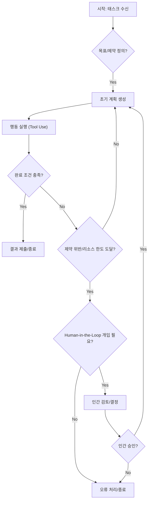

AI 에이전트가 복잡한 태스크를 수행할 때, 무한 루프, 예측 불가능한 동작, 리소스 고갈 등의 문제는 자율성(Autonomy)만 강조할 경우 빈번하게 발생할 수 있습니다. `루프 엔지니어링 (Loop Engineering)`은 이러한 문제를 해결하고 에이전트 워크플로의 안정성과 예측 가능성(Predictability)을 확보하기 위한 핵심 방법론입니다. 에이전트의 자율성을 무작정 높이는 것보다, 작업의 완료 조건(Completion Criteria)과 제약(Constraints)을 명확히 정의하고, 특정 판단에는 인간의 개입(Human-in-the-Loop, HITL)을 통합하는 것이 중요합니다. 이는 2026년 AI 에이전트 시스템 설계의 주요 트렌드 중 하나로, 단순한 태스크 자동화를 넘어 신뢰할 수 있는 AI 시스템을 구축하는 기반이 됩니다.

## 루프 엔지니어링의 핵심 원칙

AI 에이전트 워크플로에 루프 엔지니어링을 적용하는 것은 에이전트가 목표를 향해 나아가는 과정에서 '어떤 상황에서 멈춰야 하는가', '어떤 행동은 허용되지 않는가', '언제 인간의 도움이 필요한가'를 체계적으로 정의하는 것을 의미합니다.

### 1. 명확한 완료 조건 정의 (Clear Completion Criteria)

에이전트가 태스크를 성공적으로 완료했다고 판단하는 기준을 구체적이고 측정 가능하게 설정해야 합니다. 이는 에이전트가 무한정 작업을 반복하거나 불필요한 리소스를 소비하는 것을 방지합니다. 예를 들어, 코드 생성 에이전트의 경우 '모든 테스트 케이스 통과', '주요 성능 지표 충족', '특정 코드 커버리지 달성' 등이 완료 조건이 될 수 있습니다. Claude Code의 `/goal` 기능처럼, 에이전트가 측정 가능한 목표에 도달할 때까지 작업을 반복하도록 지시하는 것은 이 원칙의 좋은 예시입니다.

### 2. 엄격한 제약 및 가드레일 설정 (Strict Constraints & Guardrails)

에이전트의 행동 반경을 제한하여 안전성(Safety)과 예측 가능성을 높입니다. 이는 리소스 제약(예: API 호출 횟수, 비용 한도), 시간 제약(예: 최대 실행 시간), 보안 제약(예: 특정 디렉토리 접근 금지), 도메인별 제약(예: 특정 로직 패턴 금지) 등을 포함할 수 있습니다. 이러한 제약은 에이전트가 의도치 않은 결과를 초래하거나 시스템에 해를 끼치는 것을 방지하는 역할을 합니다.

### 3. Human-in-the-Loop (HITL) 전략 통합

모든 결정을 에이전트에게 맡기는 것이 항상 최선은 아닙니다. 특히 주관적인 판단, 윤리적 문제, 고위험 상황, 복잡한 트레이드오프 결정이 필요한 경우에는 인간의 개입이 필수적입니다. HITL은 에이전트 워크플로 내에 인간 검토 및 승인 단계를 설계하여, 에이전트의 결정이 최종 실행되기 전에 인간이 개입할 수 있도록 합니다. 이는 에이전트의 안정성을 높이고 오류 발생 시 신속한 대응을 가능하게 합니다.

## AI 에이전트 루프 워크플로 예시

다음은 루프 엔지니어링이 적용된 AI 에이전트 워크플로의 개념을 Mermaid 다이어그램으로 나타낸 것입니다.



이 다이어그램은 에이전트가 계획-실행-평가 루프를 반복하며, 완료 조건과 제약을 주기적으로 확인하고, 필요한 경우 인간에게 중재를 요청하는 과정을 보여줍니다.

## 루프 엔지니어링 구현 예제 (Python 유사 코드)

아래는 AI 에이전트의 실행 루프에 완료 조건과 제약을 적용하는 Python 유사 코드입니다. 실제 구현에서는 더 복잡한 로깅, 에러 핸들링, 비동기 처리가 필요합니다.

```python
class Agent:
    def __init__(self, goal, constraints, human_intervention_policy=None):
        self.goal = goal
        self.constraints = constraints
        self.current_state = {}
        self.actions_taken = []
        self.cost_incurred = 0
        self.human_intervention_policy = human_intervention_policy

    def check_completion_criteria(self):
        # 예: 특정 파일 생성, 특정 데이터베이스 상태, 테스트 통과 여부
        # 실제 로직은 self.goal에 따라 동적으로 구성됩니다.
        if self.current_state.get("test_passed", False):
            return True
        if len(self.actions_taken) > self.goal.get("max_steps", 10):
            print("최대 스텝 초과. 목표 미달성.")
            return True # 목표 미달성으로 루프 종료
        return False

    def check_constraints(self, proposed_action):
        # 예: API 호출 비용 초과 방지, 특정 리소스 접근 제어
        if self.cost_incurred + proposed_action.cost > self.constraints.get("max_cost", 100):
            print(f"제약 위반: 예상 비용 초과 ({self.cost_incurred} + {proposed_action.cost})")
            return False
        if "delete_production_db" in proposed_action.name:
            print("제약 위반: 위험한 작업 감지.")
            return False
        return True

    def ask_for_human_intervention(self, reason, context):
        if self.human_intervention_policy and self.human_intervention_policy.should_intervene(reason, context):
            print(f"인간 개입 요청: {reason}. 컨텍스트: {context}")
            user_input = input("계속 진행하시겠습니까? (yes/no): ")
            return user_input.lower() == 'yes'
        return True # 인간 개입 필요 없으면 계속 진행

    def run(self):
        while not self.check_completion_criteria():
            plan = self.generate_plan(self.current_state, self.goal, self.constraints)
            if not plan:
                print("계획 생성 실패. 루프 종료.")
                break

            action = self.select_action(plan)
            if not self.check_constraints(action):
                if not self.ask_for_human_intervention("제약 위반으로 인한 중단", {"action": action.name}):
                    print("인간에 의해 루프 종료.")
                    break
                # 인간이 승인하면 위험한 행동을 다시 시도하거나 다른 계획을 수립
                continue

            # 행동 실행 및 상태 업데이트
            new_state, cost = self.execute_action(action)
            self.current_state.update(new_state)
            self.cost_incurred += cost
            self.actions_taken.append(action)
            print(f"액션 실행: {action.name}, 현재 비용: {self.cost_incurred}")

        print("에이전트 루프 완료.")

    # ... (generate_plan, select_action, execute_action 메소드 생략) ...

# 사용 예시
# agent = Agent(goal={"test_passed": True, "max_steps": 10}, constraints={"max_cost": 50})
# agent.run()
```

이 예제는 `Agent` 클래스가 `check_completion_criteria()`와 `check_constraints()` 메서드를 통해 루프의 종료와 행동의 유효성을 검증하며, `ask_for_human_intervention()`을 통해 인간의 판단을 요청하는 구조를 보여줍니다. 이러한 명시적인 제어 메커니즘은 에이전트의 안정적인 운영에 필수적입니다.

## 트레이드오프

### 1. 예측 가능성 및 안정성 향상 vs. 자율성 및 유연성 저하
*   **언제 좋은가**: 에이전트의 행동이 예측 가능해야 하고, 오류 발생 시 큰 위험이 따르는 프로덕션 환경이나 규제가 엄격한 도메인에서 매우 효과적입니다. 무한 루프, 불필요한 리소스 소모를 방지하여 시스템의 전반적인 안정성을 높입니다.
*   **언제 나쁜가**: 탐색적(Exploratory)이거나 창의성이 요구되는 태스크, 또는 예상치 못한 문제에 대해 에이전트가 완전히 새로운 접근 방식을 자율적으로 찾아내야 하는 상황에서는 과도한 제약이 혁신적인 솔루션 도출을 방해할 수 있습니다.

### 2. 초기 설계 복잡성 증가 vs. 장기적인 유지보수 용이성
*   **언제 좋은가**: 루프 엔지니어링은 초기 단계에서 완료 조건, 제약, HITL 포인트 등을 명확하게 정의하는 데 더 많은 시간과 노력이 필요합니다. 그러나 일단 설계되고 구현되면, 에이전트의 동작을 이해하고 디버깅하며 유지보수하는 데 훨씬 용이합니다. 특히 에이전트의 스케일이 커지거나 다수의 에이전트가 협업하는 시스템에서 진가를 발휘합니다.
*   **언제 나쁜가**: 단기적인 PoC(Proof of Concept)나 일회성 태스크, 혹은 매우 단순하고 제약이 거의 없는 환경에서는 루프 엔지니어링의 초기 오버헤드가 불필요하게 느껴질 수 있습니다.

### 3. 리소스 효율성 및 비용 절감 vs. 인간 개입으로 인한 지연 가능성
*   **언제 좋은가**: 명확한 종료 조건과 제약은 에이전트가 불필요한 연산을 수행하거나 값비싼 API를 무한정 호출하는 것을 방지하여 리소스 사용을 최적화하고 비용을 절감합니다. 오류를 조기에 감지하여 큰 손실을 막을 수 있습니다.
*   **언제 나쁜가**: Human-in-the-Loop 검토 단계는 시스템의 전체 처리량을 저하시킬 수 있으며, 인간의 반응 시간에 따라 워크플로에 병목 현상이 발생할 수 있습니다. 실시간 처리가 필수적인 시스템에서는 HITL의 적용을 신중하게 고려해야 합니다.

## 실전 체크리스트

AI 에이전트 워크플로에 루프 엔지니어링을 적용하기 위한 실전 체크리스트입니다.

- [ ] **측정 가능한 완료 조건 정의**: 에이전트가 목표를 달성했음을 증명하는 최소 3가지 이상의 정량적 또는 정성적 지표를 정의했는가?
- [ ] **명시적 제약 조건 설정**: 에이전트의 행동 범위, 리소스 사용량(비용, 시간), 접근 권한 등에 대한 명확한 상한선 및 금지 규칙을 설정했는가?
- [ ] **Human-in-the-Loop 개입 지점 식별**: 고위험, 주관적 판단, 불확실성이 높은 태스크 단계에서 인간의 검토 및 승인이 필요한 지점을 최소 1개 이상 명시적으로 정의했는가?
- [ ] **루프 탈출 메커니즘 구현**: 에이전트가 완료 조건을 충족하지 못하거나 제약을 위반했을 때, 안전하게 루프를 종료하거나 인간에게 에스컬레이션하는 로직을 구현했는가?
- [ ] **모니터링 및 로깅 시스템 구축**: 에이전트의 루프 실행 횟수, 비용 소모량, 제약 위반 기록, 인간 개입 요청 내역 등을 추적하고 시각화하는 모니터링 시스템을 갖추었는가?
- [ ] **자동화된 테스트 케이스 작성**: 정의된 완료 조건과 제약 조건이 에이전트 워크플로에서 올바르게 동작하는지 검증하는 E2E 테스트 케이스를 작성했는가?
- [ ] **루프 정의 버전 관리**: 에이전트의 목표, 완료 조건, 제약, HITL 정책 등 루프 관련 정의를 코드와 함께 버전 관리하고 변경 이력을 추적하는가?