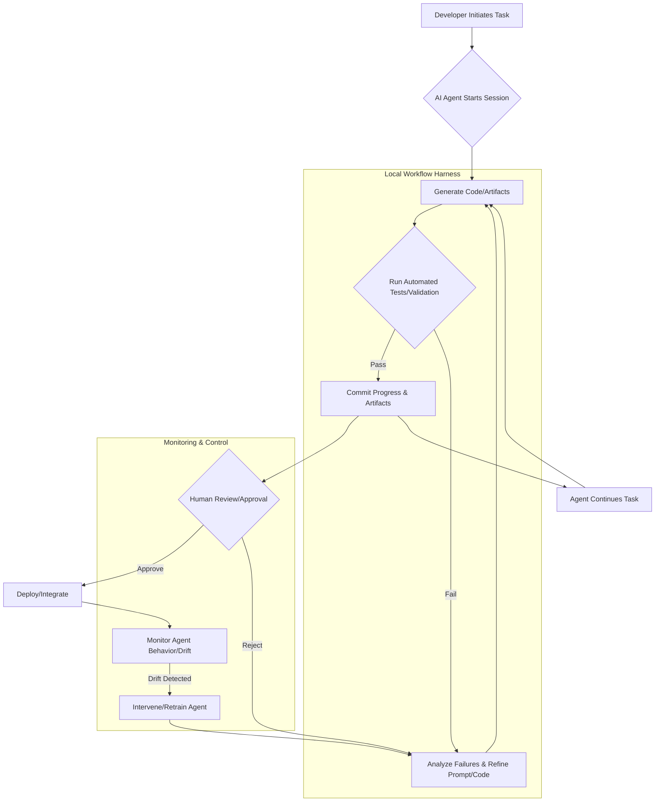

AI 에이전트가 소프트웨어 개발, 특히 코딩 작업에 깊이 관여하면서, 단순히 코드를 생성하는 것을 넘어선 복잡한 문제들이 발생하고 있습니다. AI 코딩 에이전트의 핵심 난제는 생성된 코드 자체의 품질보다 "현재 작업이 어디까지 진행되었는가?", "어떤 부분이 실제로 검증되었는가?", "다음 세션을 어디서부터 이어서 시작해야 하는가?"와 같은 작업 흐름 관리와 연속성 보장입니다. 이러한 문제는 에이전트 기반 개발 워크플로우의 생산성과 신뢰성을 크게 저해할 수 있습니다. 로컬 우선(local-first) 워크플로우 하네스(workflow harness)는 이 문제에 대한 강력한 해법을 제공하며, 에이전트의 모든 활동을 투명하게 추적하고 검증할 수 있는 기반을 마련합니다.

## 작업 흐름 추적 및 검증의 중요성

AI 에이전트의 자율성이 높아질수록, 개발자는 에이전트의 내부 작동 방식을 파악하고 제어하기 어려워집니다. 이는 예측 불가능한 결과, "드리프트(drift)" 현상, 그리고 장기적인 유지보수의 어려움으로 이어질 수 있습니다. 효과적인 추적 및 검증 메커니즘은 다음과 같은 핵심 이점을 제공합니다.

1.  **진행 상황 가시성**: 에이전트가 어떤 태스크를 수행 중이며, 어느 단계에 있는지 명확하게 파악할 수 있습니다.
2.  **신뢰성 확보**: 생성된 코드나 아티팩트가 정확하고 의도된 기능을 수행하는지 체계적으로 검증할 수 있습니다.
3.  **세션 연속성**: 개발자가 언제든지 작업을 중단하고 재개하더라도, 에이전트의 이전 작업 컨텍스트를 완벽하게 복원하여 효율성을 유지할 수 있습니다.
4.  **드리프트 감지 및 대응**: 에이전트의 행동이나 출력물이 기존의 기대치에서 벗어나는 경우를 조기에 감지하고 적절히 개입할 수 있습니다.

## 로컬 우선 워크플로우 하네스 설계 패턴

Devflow Native와 같은 로컬 우선 하네스 접근 방식은 AI 에이전트의 작업 흐름을 개발자의 로컬 환경에 밀착시켜, 보다 세밀한 제어와 즉각적인 피드백 루프를 가능하게 합니다. 이는 다음과 같은 핵심 요소를 포함합니다.

### 1. 작업 진행 상황 스냅샷 및 커밋

에이전트의 주요 작업 단계마다 상태를 스냅샷으로 저장하고, 이를 버전 관리 시스템(Git 등)에 커밋하는 방식은 가장 기본적인 추적 메커니즘입니다. 각 커밋 메시지에는 에이전트가 수행한 작업 내용, 사용된 프롬프트, 주요 결정 사항 등을 명시적으로 포함하여 이력 추적을 용이하게 합니다.

```python
import subprocess
import json
import os

def commit_agent_progress(task_id: str, description: str, artifacts: dict):
    """AI 에이전트의 작업 진행 상황을 Git에 커밋합니다."""
    # 작업 아티팩트 저장 (예: JSON 파일)
    output_dir = f"./agent_artifacts/{task_id}"
    os.makedirs(output_dir, exist_ok=True)
    with open(os.path.join(output_dir, "artifacts.json"), "w") as f:
        json.dump(artifacts, f, indent=2)

    subprocess.run(["git", "add", "."], check=True)
    commit_message = f"feat(agent): {task_id} - {description}"
    if artifacts:
        commit_message += f"\n\nArtifacts: {json.dumps(artifacts, indent=2)}"
    subprocess.run(["git", "commit", "-m", commit_message], check=True)
    print(f"[Agent Commit] Task {task_id} progress committed.")

# 예시 사용
if __name__ == "__main__":
    current_task = "implement-user-auth-service"
    current_artifacts = {
        "generated_files": ["src/auth.py", "tests/test_auth.py"],
        "validation_status": "pending",
        "prompt_version": "v1.2"
    }
    commit_agent_progress(current_task, "Initial auth service implementation", current_artifacts)

    # ... 에이전트 작업 진행 ...

    updated_artifacts = {
        "generated_files": ["src/auth.py", "tests/test_auth.py"],
        "validation_status": "passed_unit_tests",
        "test_report": "tests/unit_report.xml"
    }
    commit_agent_progress(current_task, "Unit tests passed", updated_artifacts)
```

### 2. 자동화된 검증 파이프라인 통합

에이전트가 코드를 생성하거나 변경할 때마다, CI/CD 파이프라인과 유사한 자동화된 검증 과정을 트리거해야 합니다. 이는 단위 테스트, 통합 테스트, 린트(lint) 검사, 정적 분석(static analysis) 등을 포함할 수 있습니다. 검증 결과는 에이전트의 다음 행동을 결정하는 중요한 피드백 루프 역할을 합니다.

### 3. 세션 컨텍스트의 영속성 및 복원

AI 에이전트의 장기 실행 작업에서 세션 연속성은 필수적입니다. 이전 세션의 대화 기록, 작업 스택, 임시 파일, LLM의 토큰 컨텍스트 등을 효과적으로 저장하고 복원하는 메커니즘이 필요합니다. 이를 위해 파일 시스템, 로컬 데이터베이스 또는 버전 관리 시스템을 활용할 수 있습니다. `agentic-long-running-carryover-human-checkpoint-boundary`와 같은 패턴을 통해 명확한 인계점을 정의합니다.

### 4. 드리프트 감지 및 모니터링

에이전트의 출력이나 행동이 시간이 지남에 따라 의도하지 않게 변하는 "드리프트"는 심각한 문제를 야기할 수 있습니다. `drift-detection-methodology`를 적용하여 에이전트의 핵심 지표(예: 코드 변경 패턴, 테스트 통과율, 특정 API 호출 빈도)를 지속적으로 모니터링하고, 통계적 이상 징후를 감지하여 경고하는 시스템이 필요합니다.

## AI 에이전트 워크플로우 다이어그램

아래 Mermaid 다이어그램은 AI 에이전트 개발 워크플로우에 추적 및 검증 메커니즘이 통합된 모습을 보여줍니다.



## 트레이드오프

AI 에이전트 작업 흐름 추적 및 검증 강화를 도입하는 데에는 다음과 같은 트레이드오프가 존재합니다.

*   **초기 설정 복잡성 증가 vs. 장기적 안정성 및 신뢰성 확보**
    *   **언제 좋고**: 미션 크리티컬한 시스템 개발, 대규모 에이전트 팀 운영, 규제 준수(compliance)가 중요한 프로젝트. 오류로 인한 비용이 매우 높을 때 효과적입니다.
    *   **언제 나쁜지**: 빠른 PoC(Proof of Concept) 개발, 탐색적 코딩, 단기적인 스크립트 작성 등 신속한 실험이 중요한 상황에서는 초기 설정 및 유지보수 오버헤드가 부담될 수 있습니다.
*   **성능 오버헤드 증가 vs. 투명성 및 디버깅 용이성**
    *   **언제 좋고**: 에이전트의 비결정성(non-determinism)으로 인해 문제 발생 시 원인 분석이 어려운 경우, 복잡한 다중 에이전트 시스템의 동작을 이해해야 할 때 유용합니다. 감사(audit) 목적에 부합합니다.
    *   **언제 나쁜지**: 실시간 응답 속도가 매우 중요한 서비스, 자원 제약이 심한 엣지(edge) 환경 에이전트의 경우, 과도한 로깅 및 추적은 성능 저하를 야기할 수 있습니다.
*   **개발 속도 저하 vs. 코드 품질 및 유지보수성 향상**
    *   **언제 좋고**: 장기적인 프로젝트, 여러 개발자가 협업하는 환경에서 에이전트가 생성한 코드의 일관성과 품질을 보장해야 할 때 효과적입니다. 기술 부채(technical debt)를 줄이는 데 기여합니다.
    *   **언제 나쁜지**: 시장 출시(time-to-market)가 최우선 목표이며, 초기 단계에서는 완벽한 코드 품질보다 기능 구현이 더 중요한 경우, 엄격한 검증 절차가 병목이 될 수 있습니다.
*   **인간 개입 증가 vs. 완전 자동화된 자율성**
    *   **언제 좋고**: 에이전트의 최종 결정에 대한 인간의 승인(Human-in-the-Loop)이 법적, 윤리적, 또는 비즈니스적으로 필수적인 영역에서 강력한 통제력을 제공합니다. 새로운 스킬 학습 단계에서 유용합니다.
    *   **언제 나쁜지**: 고도로 반복적이고 예측 가능한 작업, 이미 충분히 검증된 환경에서는 인간 개입이 불필요한 지연을 초래하여 에이전트의 자율적 작동의 이점을 상쇄할 수 있습니다.

## 실전 체크리스트

AI 에이전트 작업 흐름 추적 및 검증을 강화하기 위해 프로젝트에 적용할 실전 체크리스트입니다.

- [ ] **워크플로우 상태 스냅샷**: 모든 AI 에이전트 작업 세션 시작 및 종료 시점, 그리고 주요 단계마다 작업 상태 스냅샷과 관련된 메타데이터가 영속적으로 기록되는가?
- [ ] **자동화된 검증 통합**: 에이전트가 생성한 코드나 아티팩트에 대한 자동화된 단위 테스트, 통합 테스트, 린트(lint) 검사가 워크플로우에 필수적으로 포함되어 있으며, 그 결과가 명확하게 보고되는가?
- [ ] **인간 검토 체크포인트**: 주요 의사결정 지점이나 변경 사항에 대해 인간 검토(Human-in-the-Loop)를 위한 명확한 중단점(checkpoint)과 승인 절차가 정의되어 있으며, 이 과정이 워크플로우에 통합되어 있는가?
- [ ] **세션 컨텍스트 복원력**: 이전 세션의 컨텍스트(코드 변경 내역, 대화 로그, 중간 결과, LLM 컨텍스트 등)를 쉽게 로드하여 작업을 연속적으로 이어갈 수 있는 안정적인 메커니즘이 구현되어 있는가?
- [ ] **드리프트 감지 시스템**: 에이전트의 출력이나 행동이 기대치에서 벗어나는 경우(드리프트)를 자동으로 식별하고, 관련 팀에 알림을 주는 모니터링 시스템이 구축되어 있으며, 드리프트 지표가 정의되어 있는가?
- [ ] **감사 로그 및 결정 추적**: 각 작업 단계별로 에이전트의 결정 로직, 사용된 프롬프트, 입력 데이터 소스, 그리고 생성된 출력물을 추적할 수 있는 상세한 감사 로그(audit log)가 생성되고 쉽게 조회 가능한가?
- [ ] **성능 영향 평가**: 워크플로우 추적 및 검증 시스템 도입으로 인한 에이전트의 성능 저하(예: latency 증가, 자원 사용량 증대, 비용 증가)가 허용 가능한 범위 내에 있는지 주기적으로 평가하고 최적화하고 있는가?