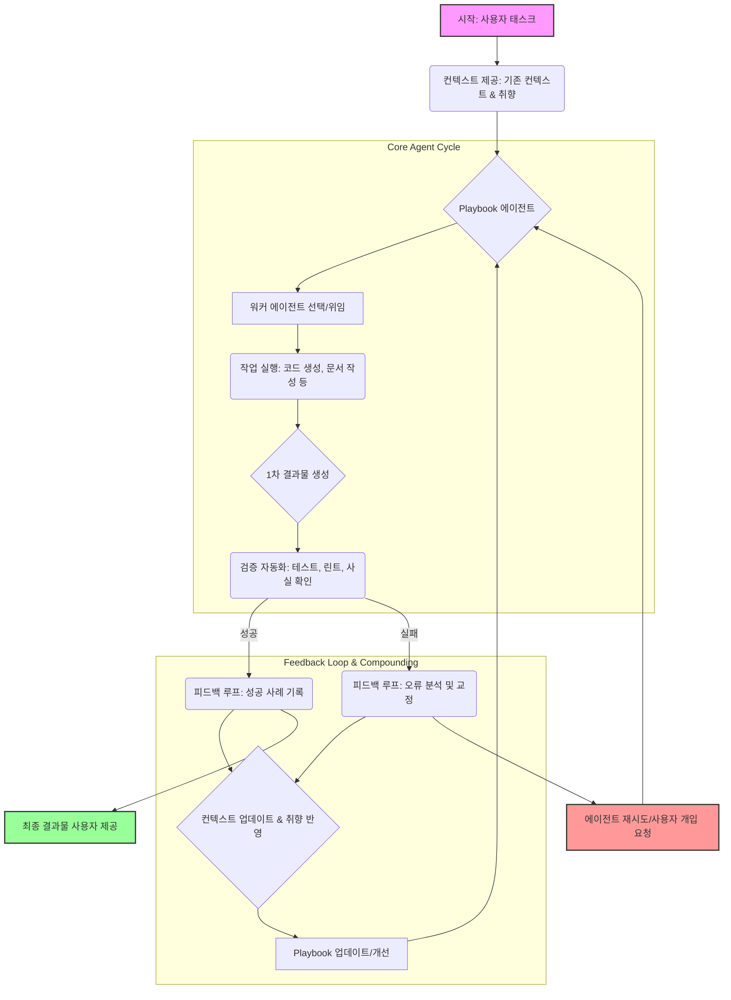

AI와의 협업은 단순한 도구 활용을 넘어, 복리(compounding)처럼 성장하는 지식 시스템 구축으로 진화하고 있습니다. 긱뉴스에서 언급된 'AI와 함께 일하며 복리처럼 쌓아 성장하는 법'의 5가지 원칙은 Playbook 에이전트 워크플로를 최적화하는 데 핵심적인 지침을 제공합니다. 이 원칙들은 에이전트의 효율성, 정확성, 그리고 자율 학습 능력을 극대화하여 복잡한 태스크를 더욱 효과적으로 처리할 수 있도록 설계되었습니다. 특히 Playbook 에이전트의 컨텍스트 관리, 사용자 취향 반영, 결과물 검증, 작업 위임, 그리고 피드백 루프 메커니즘을 이 5원칙에 따라 재구성하면, 에이전트 시스템은 지속적으로 개선되고 확장될 수 있습니다.

### 1. 컨텍스트 제공 (Context Provision)
Playbook 에이전트는 명확하고 풍부한 컨텍스트를 기반으로 작업을 수행합니다. 초기 프롬프트뿐만 아니라, 이전 작업 세션의 모든 산출물(코드, 문서, 분석 결과, 결정 사항)을 다음 세션의 컨텍스트로 누적 관리하는 것이 중요합니다. 이는 `context-engineering/ai-agent-global-context-gc-tree-integration`과 같이 계층적이고 구조화된 방식으로 이루어져야 하며, `context-engineering/ai-agent-context-window-optimization-session-longevity` 기법을 통해 효율적으로 관리되어야 합니다.

```python
class PlaybookAgentContextManager:
    def __init__(self, initial_context: dict):
        self.context_history = [initial_context]
        self.current_context = initial_context

    def update_context(self, new_data: dict, merge_strategy: str = "overwrite"):
        """컨텍스트를 업데이트하고 이력을 유지합니다."""
        if merge_strategy == "overwrite":
            self.current_context.update(new_data)
        elif merge_strategy == "append":
            for key, value in new_data.items():
                if key in self.current_context and isinstance(self.current_context[key], list) and isinstance(value, list):
                    self.current_context[key].extend(value)
                else:
                    self.current_context[key] = value
        self.context_history.append(self.current_context.copy())
        print(f"Context updated. New context keys: {list(self.current_context.keys())}")

    def get_current_context(self) -> dict:
        return self.current_context

    def get_context_for_session(self, session_id: int) -> dict:
        if session_id < len(self.context_history):
            return self.context_history[session_id]
        return {}

# Example usage
ctx_manager = PlaybookAgentContextManager({"project_name": "AgentX", "feature": "user_auth"})
ctx_manager.update_context({"code_snippet": "def auth(): pass"})
print(ctx_manager.get_current_context())
```

### 2. 취향 설정 (Preference Configuration)
사용자의 명시적/암묵적 취향을 에이전트의 설정에 반영해야 합니다. 코드 스타일, 문서 형식, 의사결정 방식, 심지어 특정 라이브러리 선호도까지 포함될 수 있습니다. 이는 단순히 설정 파일을 넘어서, `frontend-ai/ai-personalized-ux-frontend-design-patterns`과 같이 사용자 인터랙션에서 학습되어 동적으로 조정될 수 있어야 합니다. 에이전트가 생성한 결과물에 대한 사용자의 수정 사항이나 피드백은 즉시 취향 데이터로 변환되어 다음 작업에 반영되는 메커니즘이 필요합니다.

### 3. 검증 자동화 (Validation Automation)
에이전트가 생성한 결과물은 사람이 개입하기 전에 자동화된 검증 단계를 거쳐야 합니다. 코드의 경우 정적 분석, 테스트 케이스 실행, 린팅 규칙 준수 여부 등을 `evaluation/claude-code-generation-validation-pipeline-extension`과 같은 파이프라인으로 처리합니다. 문서의 경우 사실 확인, 일관성 검사, 포맷 준수 등을 `evaluation/llm-document-integrity-validation-pipeline-enhancement`를 통해 자동화할 수 있습니다. 이를 통해 불필요한 인간의 검토 시간을 줄이고 에이전트의 신뢰도를 높입니다.

### 4. 위임 확대 (Delegation Expansion)
에이전트에게 더 많은 책임과 권한을 위임하여 자율성을 높입니다. 단순한 코드 생성뿐만 아니라, 테스트 코드 작성, 배포 스크립트 수정, 문서 업데이트, 심지어 경미한 버그 수정까지 확장될 수 있습니다. `agents/multi-agent-task-collaboration-coordination-strategies`와 같이 여러 에이전트 간의 태스크 분할 및 협업을 통해 복잡한 작업을 엔드-투-엔드로 처리하는 능력을 배양합니다. 핵심은 에이전트가 실패하더라도 안전하게 복구할 수 있는 `harness-engineering/fail-loud-partial-adoption-escape-hatch-trap`과 같은 안전망을 구축하는 것입니다.

### 5. 피드백 루프 (Feedback Loop)
AI 협업의 '복리 효과'를 극대화하는 가장 중요한 원칙입니다. 에이전트의 모든 작업 결과, 사용자의 수정, 검증 단계에서 발생한 오류, 그리고 성공/실패 사례는 학습 데이터로 피드백되어 에이전트의 모델이나 설정에 반영되어야 합니다. 특히 워커 에이전트의 `lesson/error dispatch`에서 허브 에이전트의 `cross-update`로 이어지는 자동화된 파이프라인에 이 피드백 루프를 깊게 반영해야 합니다. `harness-engineering/hub-worker-compounding-pattern`과 `harness-engineering/frontend-ai-response-safety-net-validation-adaptation-feedback-loop`와 같은 패턴을 통해 지속적인 개선 사이클을 만듭니다.

아래 Mermaid 다이어그램은 AI 협업 5원칙이 적용된 Playbook 에이전트의 워크플로를 보여줍니다.



## 트레이드오프

AI 협업 5원칙 기반 Playbook 에이전트 워크플로 최적화는 강력한 이점을 제공하지만, 몇 가지 트레이드오프를 고려해야 합니다.

*   **초기 설정 및 학습 비용 vs. 장기적 효율성**:
    *   **언제 좋은가**: 장기적으로 에이전트의 자율성과 정확성을 높여 개발/운영 비용을 절감하고자 할 때. 반복적이고 예측 가능한 태스크가 많을수록 효과적입니다.
    *   **언제 나쁜가**: 프로젝트 초기에 빠른 MVP(Minimum Viable Product)를 달성해야 하거나, 태스크의 종류가 매우 유동적이고 복잡하여 패턴화하기 어려울 때. 초기 컨텍스트 구축, 취향 설정, 검증 시스템 마련에 많은 시간과 리소스가 소요될 수 있습니다.

*   **자동화된 검증의 복잡성 vs. 오류 감소 및 신뢰도 향상**:
    *   **언제 좋은가**: 에이전트의 결과물이 시스템의 안정성이나 비즈니스 로직에 직접적인 영향을 미칠 때, 또는 휴먼 에러 발생 가능성이 높은 반복 작업에 대해.
    *   **언제 나쁜가**: 결과물의 중요도가 낮거나, 검증 로직 자체가 너무 복잡하여 자동화 비용이 수동 검증보다 높을 때. 과도한 검증은 에이전트의 유연성을 저해할 수 있습니다.

*   **위임 확대의 자율성 vs. 제어 상실 및 예측 불가능성**:
    *   **언제 좋은가**: 에이전트가 충분한 가드레일(guardrails)과 안전망 (`agents/ai-agent-safety-constraint-control-design-patterns`)을 갖추고 있고, 특정 범위 내에서 자율적인 의사결정이 허용될 때.
    *   **언제 나쁜가**: 에이전트의 행동이 시스템에 치명적인 영향을 미칠 수 있거나, 결과물의 예측 불가능성이 비즈니스 리스크를 초래할 때. 과도한 위임은 디버깅과 문제 해결을 어렵게 만듭니다.

*   **피드백 루프의 데이터 축적 vs. 프라이버시 및 보안**:
    *   **언제 좋은가**: 에이전트의 성능을 지속적으로 개선하고, '복리 효과'를 통해 학습 능력을 강화하고자 할 때.
    *   **언제 나쁜가**: 피드백 데이터에 민감 정보(PII)나 기업 기밀이 포함되어 있을 때. 데이터 수집, 저장, 처리 과정에서 `infrastructure/sentry-pii-scrubbing-beforesend`와 같은 강력한 보안 및 프라이버시 보호 메커니즘이 필요하며, 이는 추가적인 구현 및 규제 준수 비용을 발생시킵니다.

## 실전 체크리스트

Playbook 에이전트 워크플로에 AI 협업 5원칙을 적용하기 위한 실전 체크리스트입니다.

*   [ ] **컨텍스트 지속성 및 구조화**: 모든 에이전트 세션 간에 이전 작업 산출물과 결정을 체계적으로 누적 및 전달하는 `context-engineering/ai-agent-global-context-gc-tree-integration`과 같은 메커니즘이 구현되었는가?
*   [ ] **사용자 취향 반영 시스템**: 에이전트의 행동 및 출력 형식에 대한 사용자의 명시적 선호(설정)와 암묵적 선호(수정 이력)를 학습하여 동적으로 반영하는 시스템이 설계되었는가?
*   [ ] **자동화된 다단계 검증 파이프라인**: 에이전트의 주요 결과물(코드, 문서, 분석)에 대해 정적 분석, 테스트, 린팅, 사실 확인 등 최소 2가지 이상의 자동화된 검증 단계가 `evaluation/llm-output-validation-quality-metrics-design`과 같이 구성되었는가?
*   [ ] **위임 범위 및 가드레일 정의**: 에이전트에게 위임된 태스크의 범위가 명확하게 정의되었으며, 실패 시 안전하게 복구하거나 사용자 개입을 요청하는 `harness-engineering/ai-agent-safety-constraint-control-design-patterns`과 같은 안전망이 구축되었는가?
*   [ ] **종합적인 피드백 루프 구현**: 워커 에이전트의 `lesson/error dispatch`가 허브 에이전트의 `cross-update`로 이어지는 자동화된 피드백 파이프라인이 구현되었으며, 이를 통해 에이전트의 컨텍스트, 취향, 모델이 지속적으로 개선되는가?
*   [ ] **성능 및 비용 모니터링**: 5원칙 적용 후 에이전트 시스템의 성능(정확도, 처리 속도) 및 운영 비용(`project-ops/claude-code-cost-optimization-strategies`) 변화를 추적하고 최적화하는 대시보드가 마련되었는가?
*   [ ] **데이터 프라이버시 및 보안 감사**: 피드백 루프를 통해 수집되는 모든 데이터에 대해 PII 마스킹(`infrastructure/sentry-pii-scrubbing-beforesend`) 및 접근 제어 정책이 적용되었으며, 정기적인 보안 감사가 수행되는가?