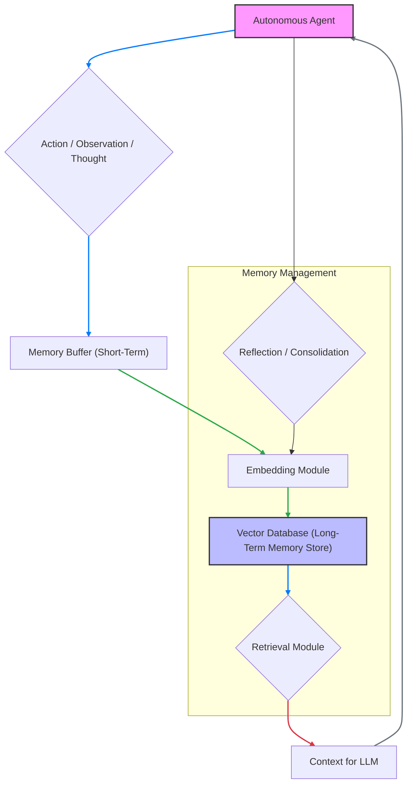

자율 에이전트 (Autonomous Agents) 의 진정한 능력은 단순히 현재 작업을 수행하는 것을 넘어, 과거의 경험을 기억하고 학습하여 미래 행동을 개선하는 장기 기억 (Long-Term Memory) 에 달려 있습니다. 단기적인 컨텍스트 윈도우 (Context Window) 의 제약을 넘어, 에이전트가 지속적으로 지식을 축적하고 적응하며 진화할 수 있는 장기 기억 시스템을 구축하는 것은 2026년 에이전트 개발의 핵심 과제입니다.

## 장기 기억의 중요성

LLM 기반 에이전트 (LLM-based Agents) 는 현재 컨텍스트 윈도우 내에서만 정보를 처리할 수 있습니다. 이는 복잡하고 장기적인 목표를 달성하거나, 새로운 환경에 적응하고, 반복적인 실수를 피하는 데 심각한 제약이 됩니다. 장기 기억은 에이전트에게 다음과 같은 핵심 기능을 제공합니다:

*   **경험 학습 (Experiential Learning)**: 과거의 상호작용, 결정, 결과로부터 교훈을 얻어 전략을 개선합니다.
*   **지식 축적 (Knowledge Accumulation)**: 새로운 정보를 저장하고, 필요할 때 검색하여 활용합니다.
*   **지속적인 적응 (Continuous Adaptation)**: 변화하는 환경에 맞춰 행동을 수정하고, 새로운 패턴을 인식합니다.
*   **맥락 유지 (Context Persistence)**: 여러 세션에 걸쳐 일관된 페르소나 (Persona) 와 목표를 유지합니다.

## 장기 기억 시스템 아키텍처

장기 기억 시스템은 일반적으로 다음과 같은 구성 요소로 설계됩니다:

### 1. 기억 저장소 (Memory Store)

에이전트의 기억은 여러 계층으로 나눌 수 있습니다:

*   **일화 기억 (Episodic Memory)**: 특정 사건, 경험, 상호작용의 시퀀스를 시간 순서대로 저장합니다. 에이전트가 수행한 행동, 관찰된 결과, 의사결정 과정 등이 포함됩니다.
*   **의미 기억 (Semantic Memory)**: 일반적인 지식, 사실, 개념, 관계 등을 구조화된 형태로 저장합니다. 이는 외부 지식 베이스 (Knowledge Base) 나 에이전트의 학습된 내부 모델에서 파생될 수 있습니다.
*   **절차 기억 (Procedural Memory)**: 특정 작업을 수행하는 방법, 스킬, 행동 패턴 등 '방법 (how-to)' 에 대한 지식입니다. 이는 에이전트의 도구 사용 (Tool Use) 패턴이나 워크플로우 (Workflow) 에 해당할 수 있습니다.

기술적으로, 이러한 기억은 **벡터 데이터베이스 (Vector Database)**, 그래프 데이터베이스 (Graph Database), 또는 일반 관계형 데이터베이스 (Relational Database) 에 저장될 수 있습니다. 특히 의미 기억과 일화 기억의 효율적인 검색을 위해 벡터 DB가 널리 사용됩니다.

### 2. 임베딩 모듈 (Embedding Module)

에이전트가 기억할 정보 (텍스트, 이미지, 음성 등) 는 검색 가능한 형태로 변환되어야 합니다. 임베딩 모델 (Embedding Model) 은 정보를 고차원 벡터 공간의 임베딩 (Embedding) 으로 변환하여, 의미론적으로 유사한 정보들이 벡터 공간에서 가깝게 위치하도록 만듭니다. 이를 통해 효율적인 유사성 검색 (Similarity Search) 이 가능해집니다.

### 3. 검색 모듈 (Retrieval Module)

에이전트가 새로운 입력 (Query) 을 받으면, 검색 모듈은 해당 Query를 임베딩으로 변환하고, 이를 기억 저장소에 저장된 기존 기억들과 비교하여 가장 관련성 높은 기억들을 검색합니다. 이 과정에서 RAG (Retrieval-Augmented Generation) 패턴이 핵심적으로 활용됩니다.

### 4. 회상 및 통합 모듈 (Recollection & Consolidation Module)

검색된 기억들은 LLM의 컨텍스트 윈도우에 주입되어 에이전트의 의사결정에 활용됩니다. 에이전트는 새로운 경험을 통해 얻은 정보를 기존 기억에 통합하거나, 중요한 통찰을 요약하여 장기 기억에 저장함으로써 기억을 지속적으로 업데이트하고 정제합니다 (Reflection / Self-Summarization).

## 실제 구현 패턴: RAG 기반 장기 기억

가장 일반적이고 효과적인 장기 기억 구현 패턴은 RAG 아키텍처를 기반으로 합니다. 에이전트의 모든 경험(관찰, 행동, 계획, 결과)을 텍스트로 기록하고, 이를 임베딩하여 벡터 DB에 저장합니다. 에이전트가 특정 의사결정을 내려야 할 때, 현재의 당면 과제를 쿼리로 삼아 벡터 DB에서 가장 유사한 과거 경험이나 지식을 검색합니다.

```python
from langchain_community.vectorstores import Chroma
from langchain_community.embeddings import OpenAIEmbeddings
from langchain.chains import RetrievalQA
from langchain_openai import ChatOpenAI

# 1. 기억 저장소 초기화 (ChromaDB 예시)
# 실제 환경에서는 지속성을 위해 디스크에 저장하거나 클라우드 벡터 DB 사용
vectorstore = Chroma(embedding_function=OpenAIEmbeddings())

# 2. 에이전트의 경험을 장기 기억에 저장
def store_memory(agent_action: str, agent_observation: str, agent_thought: str):
    memory_entry = f"""
    Action: {agent_action}
    Observation: {agent_observation}
    Thought: {agent_thought}
    """
    vectorstore.add_texts([memory_entry])
    print(f"Memory stored: {memory_entry[:50]}...")

# 3. 장기 기억에서 정보 검색 및 활용
def retrieve_and_utilize_memory(query: str, llm_model: ChatOpenAI):
    # RetrievalQA 체인으로 검색 및 생성 통합
    qa_chain = RetrievalQA.from_chain_type(
        llm=llm_model,
        chain_type="stuff",
        retriever=vectorstore.as_retriever()
    )
    response = qa_chain.invoke({"query": query})
    return response["result"]

# 예시 시나리오
llm = ChatOpenAI(model_name="gpt-4o", temperature=0.5)

# 에이전트 경험 저장
store_memory(
    "사용자에게 날씨 정보를 요청함",
    "오늘 서울의 날씨는 맑음, 기온은 25도입니다.",
    "날씨 정보를 통해 사용자 계획을 도울 수 있겠군."
)
store_memory(
    "이메일 초안 작성 실패: 컨텍스트 부족.",
    "이메일 제목과 목적이 모호하여 초안 작성이 어려웠음.",
    "다음부터는 이메일 초안 작성 전에 항상 목적과 핵심 내용을 명확히 확인해야겠다."
)
store_memory(
    "코드 디버깅 성공: 특정 라이브러리 버전 충돌 문제 해결.",
    "npm install --force 를 사용하여 의존성 문제를 해결하고 빌드에 성공함.",
    "새로운 프로젝트에서는 의존성 관리 도구의 버전을 명확히 지정하고 충돌을 예방해야겠어."
)

# 에이전트가 새로운 문제에 직면하고 장기 기억을 활용
new_task_query = "이메일 초안 작성 시 주의할 점은 무엇인가요?"
response = retrieve_and_utilize_memory(new_task_query, llm)
print(f"\nAgent response based on long-term memory: {response}")

new_task_query_2 = "의존성 문제 해결에 대한 경험을 알려줘."
response_2 = retrieve_and_utilize_memory(new_task_query_2, llm)
print(f"\nAgent response based on long-term memory: {response_2}")
```

위 코드는 `Chroma` 벡터 DB와 `OpenAIEmbeddings` 를 사용하여 에이전트의 경험을 저장하고 검색하는 기본적인 RAG 패턴을 보여줍니다. `store_memory` 함수로 에이전트의 행동, 관찰, 생각을 기록하고, `retrieve_and_utilize_memory` 함수로 관련 기억을 검색하여 LLM의 의사결정에 활용합니다.

## 장기 기억 시스템 아키텍처 개요



## 트레이드오프

### 1. 벡터 데이터베이스 (Vector DB) vs. 관계형/그래프 데이터베이스 (Relational/Graph DB)
*   **Vector DB (e.g., Pinecone, Weaviate)**:
    *   **언제 좋고**: 의미론적 유사성 검색이 핵심일 때, 비정형 데이터 (텍스트, 이미지 임베딩) 에 대한 고속 검색 및 확장이 필요할 때. RAG 패턴에 최적화되어 있습니다.
    *   **언제 나쁜지**: 복잡한 구조화된 쿼리 (SQL Join 등), 정밀한 관계형 데이터 관리, 트랜잭션 무결성이 중요할 때 부적합합니다.
*   **관계형/그래프 DB (e.g., PostgreSQL, Neo4j)**:
    *   **언제 좋고**: 구조화된 데이터의 저장 및 관리, 복잡한 관계 추론 (그래프 DB), 데이터 무결성 및 강력한 트랜잭션 보장이 중요할 때. 에이전트의 내부 상태 관리나 특정 규칙 기반 지식 저장에 유용합니다.
    *   **언제 나쁜지**: 대규모 비정형 데이터의 의미론적 유사성 검색에는 비효율적입니다. 별도의 임베딩 및 검색 레이어가 필요합니다.

### 2. 실시간 (Real-time) vs. 배치 (Batch) 기억 통합 (Consolidation)
*   **실시간 통합**: 에이전트의 모든 행동과 관찰 직후 기억을 업데이트하고 통합합니다.
    *   **언제 좋고**: 에이전트의 지식이 항상 최신 상태여야 하는 동적인 환경, 즉각적인 학습과 적응이 중요한 경우에 유리합니다.
    *   **언제 나쁜지**: 계산 비용이 매우 높고, 시스템 부하가 커지며, 불필요한 노이즈 (Noise) 가 장기 기억을 오염시킬 수 있습니다.
*   **배치 통합**: 일정 주기 (예: 하루 한 번) 또는 특정 이벤트 발생 시 (예: 특정 목표 달성 후) 기억을 요약하고 통합합니다.
    *   **언제 좋고**: 비용 효율적이며, 장기 기억을 더 응축되고 노이즈 없는 형태로 유지할 수 있습니다. 장기적인 추세나 중요한 교훈을 추출하는 데 용이합니다.
    *   **언제 나쁜지**: 최신 정보 반영에 지연이 발생하며, 즉각적인 적응 능력이 떨어질 수 있습니다.

### 3. 기억의 세분성 (Memory Granularity)
*   **세밀한 기억 (Fine-grained Memory)**: 모든 원시적인 관찰, 행동, 사고 과정을 그대로 저장합니다.
    *   **언제 좋고**: 미세한 디테일과 정확한 재현이 필요할 때, 사후 분석 및 상세한 디버깅에 유리합니다.
    *   **언제 나쁜지**: 저장 공간 및 검색 비용이 크게 증가하며, LLM의 컨텍스트 윈도우를 빠르게 소모하여 중요한 정보가 희석될 수 있습니다.
*   **요약된 기억 (Summarized Memory)**: 원시 기억을 압축, 요약, 추상화하여 저장합니다.
    *   **언제 좋고**: 효율적인 저장 및 검색, LLM에 더 간결하고 핵심적인 컨텍스트를 제공하여 추론 품질을 높일 수 있습니다.
    *   **언제 나쁜지**: 중요한 미세 정보가 손실될 위험이 있으며, 요약 과정에서 할루시네이션 (Hallucination) 이 발생할 수 있습니다.

### 4. 임베딩 모델 선택 (Embedding Model Choice)
*   **대형/고성능 모델 (e.g., OpenAI Embeddings, Cohere Embed V3)**:
    *   **언제 좋고**: 높은 임베딩 품질로 인해 검색 관련성이 우수하며, 복잡한 의미론적 유사성 파악에 강합니다.
    *   **언제 나쁜지**: API 비용, 레이턴시 (Latency), 온프레미스 배포의 어려움이 따를 수 있습니다.
*   **소형/경량 모델 (e.g., Sentence-BERT 계열 모델, Minit LM)**:
    *   **언제 좋고**: 비용 효율적이며, 로컬 또는 엣지 디바이스 (Edge Device) 에서 빠르게 실행 가능합니다. 특정 도메인에 파인튜닝하여 성능을 최적화할 수 있습니다.
    *   **언제 나쁜지**: 일반적인 의미론적 이해도나 복잡한 쿼리에 대한 검색 관련성이 대형 모델보다 떨어질 수 있습니다.

## 실전 체크리스트

장기 기억을 가진 자율 에이전트를 구축할 때 다음 항목들을 검증하세요:

- [ ] **기억 접근 레이턴시 (Memory Access Latency)**: 에이전트의 의사결정 주기에 맞춰 장기 기억 검색 및 주입 과정이 허용 가능한 시간 내에 완료되는가?
- [ ] **검색 관련성 (Retrieval Relevance)**: 에이전트의 쿼리에 대해 장기 기억 시스템이 항상 유의미하고 정확한 정보를 반환하는가? (평가 지표: NDCG, Recall@K)
- [ ] **기억 저장소 비용 효율성 (Memory Storage Cost Efficiency)**: 저장되는 기억의 양과 업데이트 빈도를 고려할 때, 벡터 DB 및 임베딩 비용이 프로젝트 예산 범위 내에서 최적화되어 있는가?
- [ ] **기억 통합 주기 및 효과 (Consolidation Frequency and Effectiveness)**: 기억 통합 (Reflection/Summarization) 주기가 에이전트의 학습 속도와 지식 오염 방지 사이의 균형을 유지하고, 통합된 기억이 실제 의사결정 품질을 향상시키는가?
- [ ] **확장성 및 로드 관리 (Scalability and Load Management)**: 에이전트의 활동량 증가 및 기억 데이터의 폭증 시에도 장기 기억 시스템이 안정적으로 작동하며, 확장 계획이 수립되어 있는가?
- [ ] **데이터 프라이버시 및 보안 (Data Privacy and Security)**: 에이전트의 장기 기억에 민감 정보가 포함될 경우, 해당 정보의 암호화, 접근 제어, 데이터 삭제 정책 (Data Retention Policy) 이 적절하게 구현되어 있는가?
- [ ] **기억 드리프트 감지 (Memory Drift Detection)**: 장기간에 걸쳐 기억 저장소의 내용이 의도치 않게 오염되거나 편향 (Bias) 되는 현상을 감지하고 수정할 수 있는 메커니즘이 마련되어 있는가?
