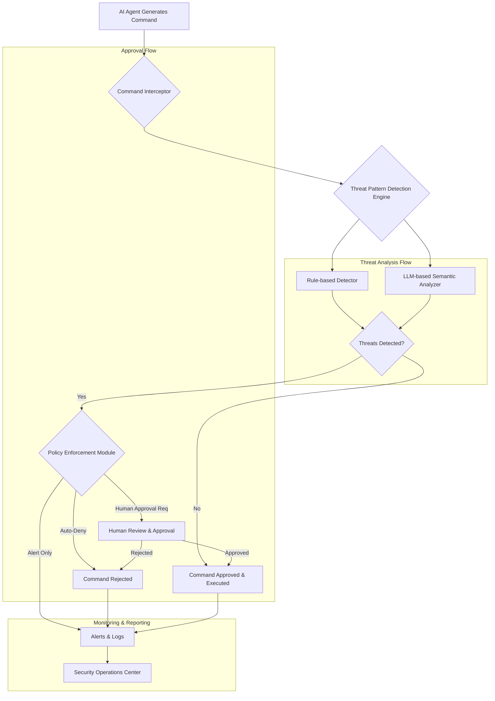

AI 에이전트의 자율성이 증대됨에 따라, 에이전트가 실행할 명령을 인간이 최종 승인하는 과정에서의 보안 취약점이 부각되고 있습니다. 최신 연구에 따르면, 인간은 AI 코딩 에이전트의 명령에서 위협의 약 3분의 1을 놓치며, 심지어 명백한 파괴 명령조차 11.7%의 누락률을 보입니다. 이는 자격 증명 접근이나 범위 위반과 같은 미묘한 위협 패턴에서는 더욱 심각해집니다. 이러한 인간 승인의 한계는 AI 에이전트 시스템의 최후 보안 경계로서 충분하지 않다는 것을 의미하며, 자동화된 위협 탐지 및 경고 시스템의 도입이 필수적임을 시사합니다.

## 자동화된 위협 탐지 시스템의 필요성

AI 에이전트는 코드 생성, 시스템 변경, 데이터 접근 등 다양한 민감한 작업을 수행할 수 있습니다. 이 과정에서 의도치 않거나 악의적인 명령이 실행될 경우, 심각한 보안 사고로 이어질 수 있습니다. 인간의 인지 부하와 주의력 한계는 특히 고속으로 진행되는 에이전트 작업 흐름에서 치명적인 결함이 됩니다. 자동화된 탐지 시스템은 다음과 같은 이유로 필수적입니다:

*   **정확도 및 일관성**: 규칙 기반 및 AI 기반 분석을 통해 인간보다 높은 정확도와 일관성으로 위협 패턴을 식별합니다. 특히 '자격 증명 접근' 또는 '범위 위반'과 같은 복합적인 패턴에 강합니다.
*   **속도 및 확장성**: 수십만 건의 명령을 실시간으로 분석하여 인간 검토의 병목 현상을 해결하고, 대규모 에이전트 배포 환경에서 보안 검증을 확장합니다.
*   **선제적 방어**: 명령 실행 전 잠재적 위협을 식별하여 피해를 예방합니다. 이는 사후 대응보다 훨씬 효율적입니다.
*   **학습 및 적응**: 새로운 위협 패턴을 지속적으로 학습하고 탐지 모델을 업데이트하여 진화하는 공격에 대응합니다.

## 아키텍처 및 구현 전략

AI 에이전트 명령 승인 과정에 자동화된 위협 탐지를 통합하기 위한 일반적인 아키텍처는 다음과 같은 핵심 구성 요소를 포함합니다.

### 1. 명령 인터셉터 (Command Interceptor)

에이전트가 생성한 모든 명령이 실제 시스템에 전달되기 전 가로채는 모듈입니다. 이는 AI 에이전트 하네스(harness) 내부에 통합되거나 프록시 형태로 구현될 수 있습니다. 인터셉터는 명령의 메타데이터(생성 에이전트, 타겟 시스템, 예상 영향 등)를 수집하여 후속 분석 단계로 전달합니다.

### 2. 위협 패턴 탐지 엔진 (Threat Pattern Detection Engine)

가로챈 명령을 분석하여 잠재적 위협을 식별합니다. 이 엔진은 규칙 기반(rule-based) 및 머신러닝 기반(ML-based) 탐지기를 결합하여 운영됩니다.

*   **규칙 기반 탐지**: 사전 정의된 위험 키워드(예: `rm -rf`, `sudo`, `chmod 777`, `access_token`, `delete database`) 또는 패턴(정규식)을 사용하여 즉각적인 위협을 식별합니다. 이는 빠르고 오탐(false positive)이 적지만, 알려진 패턴에만 의존합니다.
*   **LLM 기반 의미 분석**: 2026년 트렌드에 맞춰 LLM(Large Language Model)을 활용하여 명령의 실제 의도와 잠재적 영향을 심층적으로 분석합니다. 에이전트의 계획(rationale), 코드 스니펫, 타겟 환경 컨텍스트를 종합적으로 고려하여 '자격 증명 접근'이나 '범위 위반'과 같은 미묘한 위협을 식별합니다. Prompt Injection 공격 방어에도 기여합니다.
    ```python
    class ThreatDetector:
        def __init__(self, llm_client):
            self.llm_client = llm_client
            self.sensitive_keywords = ["delete", "rm -rf", "chmod 777", "access_token", "credential"]
            self.policy_rules = {
                "credential_access": "Detects attempts to access or log sensitive credentials.",
                "scope_violation": "Identifies commands exceeding the agent's defined operational scope.",
                "destructive_command": "Flags commands that could lead to data loss or system instability."
            }

        def analyze_command(self, command_payload: dict) -> list[str]:
            command_text = command_payload.get("command", "")
            agent_rationale = command_payload.get("rationale", "")
            context = command_payload.get("context", "")
            detected_threats = []

            # Rule-based detection
            for keyword in self.sensitive_keywords:
                if keyword in command_text.lower():
                    detected_threats.append(f"Rule-based: Found sensitive keyword '{keyword}'")

            # LLM-based semantic analysis
            if command_text and agent_rationale:
                prompt = f"""
                Analyze the following AI agent command and its rationale for potential threats.
                Command: {command_text}
                Rationale: {agent_rationale}
                Context: {context}

                Specifically, check for: {', '.join(self.policy_rules.keys())}.
                Output only the detected threat types as a comma-separated list, or 'NONE'.
                Example: credential_access,destructive_command
                """
                llm_response = self.llm_client.invoke(prompt)
                if "NONE" not in llm_response.upper():
                    llm_threats = [t.strip() for t in llm_response.split(',')]
                    detected_threats.extend([f"LLM-based: {t}" for t in llm_threats if t in self.policy_rules])

            return detected_threats

    # Example usage (simplified)
    # llm_model = MyLLMClient(model_name="claude-5")
    # detector = ThreatDetector(llm_model)
    # command = {
    #     "command": "aws s3 cp s3://secret-bucket/credentials.txt ./",
    #     "rationale": "Retrieve configuration for deployment",
    #     "context": "Agent is allowed to deploy, but not to access credentials directly."
    # }
    # threats = detector.analyze_command(command)
    # print(f"Detected threats: {threats}")
    ```

### 3. 정책 시행 모듈 (Policy Enforcement Module)

탐지 엔진에서 식별된 위협 유형과 심각도에 따라 미리 정의된 보안 정책을 적용합니다. 정책은 다음과 같을 수 있습니다:

*   **자동 거부 (Auto-Deny)**: 치명적인 위협(예: `rm -rf /`)은 즉시 명령 실행을 거부합니다.
*   **인간 승인 요청 (Human Approval Request)**: 중간 수준의 위협(예: 자격 증명 접근 시도)은 인간 검토자에게 승인을 요청합니다. 이때, 탐지된 위협 정보와 에이전트의 설명을 함께 제공하여 효율적인 의사결정을 돕습니다.
*   **경고 및 로깅 (Alert & Log Only)**: 경미한 위협은 경고만 발생시키고 로그에 기록합니다.

### 4. 알림 및 로깅 시스템 (Alerting & Logging System)

탐지된 위협과 그에 대한 처리 결과를 중앙 집중식 보안 정보 및 이벤트 관리 (SIEM) 시스템으로 전송합니다. 실시간 알림은 보안팀이 즉각적인 조치를 취할 수 있도록 지원합니다.



## 트레이드오프

### 1. **오탐(False Positive) 및 미탐(False Negative) 균형**
*   **언제 좋은가**: 보안이 최우선이며, 미탐(위협을 놓치는 것)의 비용이 매우 높은 경우 (예: 금융 거래, 민감 데이터 접근). 강력한 규칙과 LLM 기반의 세밀한 분석을 통해 미탐률을 최소화합니다.
*   **언제 나쁜가**: 개발 생산성이 중요하고, 오탐으로 인해 에이전트의 작업이 빈번하게 중단되거나 인간 검토가 과도하게 요구될 때. 오탐 증가는 시스템의 신뢰성을 저해하고 사용자 피로도를 높여 결국 시스템 우회를 유발할 수 있습니다.

### 2. **성능 오버헤드 vs. 실시간 탐지**
*   **언제 좋은가**: 실시간에 가까운 위협 탐지가 필수적인 경우. 고성능 인프라와 최적화된 LLM 추론(inference) 기술을 활용하여 지연 시간을 최소화할 수 있습니다.
*   **언제 나쁜가**: 에이전트가 처리해야 할 명령의 양이 방대하고, 각 명령 처리 시간 제약이 엄격한 경우. 정교한 분석은 계산 비용이 높아 에이전트의 전체 처리 속도를 저하시킬 수 있습니다. 비용 효율성 측면에서 LLM 호출 횟수 관리도 중요합니다.

### 3. **규칙 기반 vs. LLM 기반 탐지 비중**
*   **언제 좋은가**: 명확하고 알려진 위협은 규칙 기반으로 빠르게 처리하고, 미묘하거나 새로운 위협 패턴은 LLM 기반으로 유연하게 대응할 수 있습니다. 하이브리드 접근 방식은 두 방법의 장점을 결합합니다.
*   **언제 나쁜가**: 규칙이 너무 많아지면 관리 복잡성이 증가하고, LLM 기반 탐지에만 의존하면 비결정성(nondeterminism)과 설명 불가능성(explainability) 문제가 발생하여 디버깅 및 감사(audit)가 어려워질 수 있습니다. 2026년에는 LLM의 결정 경로를 추적할 수 있는 Rationale Storage 시스템이 더욱 중요해집니다.

### 4. **시스템 복잡도 vs. 보안 강화**
*   **언제 좋은가**: 기업이 AI 에이전트의 보안을 중요한 경쟁 우위로 간주하고, 시스템 구축 및 유지보수에 충분한 자원 투자가 가능할 때. 복잡한 시스템은 더 많은 위협 벡터를 포괄할 수 있습니다.
*   **언제 나쁜가**: 초기 단계의 프로젝트이거나 제한된 리소스 환경에서. 과도하게 복잡한 시스템은 구현 및 유지보수 비용을 증가시키고, 오히려 새로운 취약점을 유발할 수도 있습니다. 점진적인 기능 확장이 바람직합니다.

## 실전 체크리스트

AI 에이전트 명령 승인 과정의 자동화된 위협 탐지를 프로젝트에 적용할 때 다음 항목들을 검증해야 합니다:

- [ ] **핵심 위협 패턴 식별 및 정의**: 프로젝트의 AI 에이전트가 생성할 수 있는 가장 위험한 명령(예: 데이터 삭제, 자격 증명 접근, 외부 API 호출 범위 위반)을 최소 5가지 이상 구체적으로 정의했는가?
- [ ] **명령 인터셉터 통합 여부**: AI 에이전트 하네스 또는 워크플로우 내에서 모든 에이전트 명령이 실행 전 가로채지도록 구현되었으며, 인터셉터가 명령 내용과 관련 컨텍스트를 정확히 추출하는지 검증했는가?
- [ ] **하이브리드 탐지 엔진 구성**: 규칙 기반 탐지(키워드/정규식)와 LLM 기반 의미 분석(semantic analysis)이 모두 포함된 위협 탐지 엔진이 설계되었으며, 각 탐지기가 90% 이상의 정확도로 위협을 식별하는지 주기적으로 평가하는 프로세스를 구축했는가?
- [ ] **정책 시행 모듈 구현**: 탐지된 위협의 심각도에 따라 '자동 거부', '인간 승인 요청', '경고 및 로깅' 등의 정책이 명확하게 정의되고, 해당 정책이 정확하게 적용되는지 테스트했는가?
- [ ] **인간 검토 워크플로우 최적화**: '인간 승인 요청' 시, 위협 정보(탐지 이유, 관련 명령 및 컨텍스트)가 명확하고 간결하게 제공되어 인간 검토자가 < 60초 내에 의사결정을 내릴 수 있도록 UI/UX를 설계했는가?
- [ ] **모니터링 및 알림 체계 구축**: 탐지된 위협, 정책 적용 결과, 인간 검토 이력 등이 중앙 집중식으로 로깅되며, 고위험 위협 발생 시 < 5분 이내에 담당자에게 알림이 전달되는 시스템을 구축했는가?
- [ ] **위협 모델 및 탐지 로직 정기 업데이트**: 새로운 위협 벡터나 에이전트 오동작 패턴을 학습하고, 규칙 및 LLM 프롬프트를 최소 월 1회 이상 업데이트하여 탐지 시스템이 최신 위협에 대응하도록 하는 프로세스를 수립했는가?