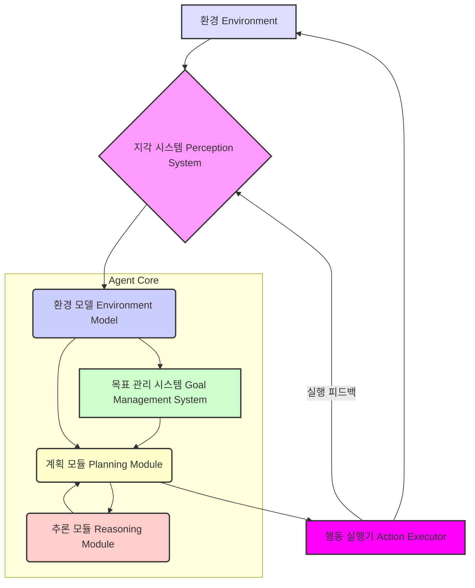

2026년에는 더욱 복잡하고 자율적인 인공지능 에이전트(Autonomous AI Agents)의 개발이 필수적입니다. 이러한 에이전트가 주어진 목표를 효과적으로 달성하기 위해서는 고도화된 행동 계획(Behavioral Planning) 및 추론 시스템(Reasoning Systems)의 구축이 핵심적인 요구사항이 됩니다. 단순히 사전 정의된 규칙을 따르는 것을 넘어, 변화하는 환경에 적응하고, 새로운 문제에 대해 창의적인 해결책을 도출하며, 다단계의 복잡한 태스크를 수행할 수 있는 능력은 에이전트 지능의 본질을 결정합니다.

## 핵심 아키텍처 구성 요소

자율 에이전트의 행동 계획 및 추론 시스템은 일반적으로 다음과 같은 핵심 구성 요소들로 이루어집니다.

### 1. 지각 시스템 (Perception System)

에이전트가 환경으로부터 정보를 수집하고 해석하는 계층입니다. 센서 데이터, 텍스트, 이미지 등 다양한 모달리티(modality)의 데이터를 처리하여 에이전트의 내부 상태(internal state) 및 환경 모델(environment model)을 업데이트합니다. 2026년에는 멀티모달(multimodal) 지각 능력이 더욱 중요해지며, 비정형 데이터로부터 의미 있는 정보를 추출하는 능력이 요구됩니다.

### 2. 환경 모델 (Environment Model)

현재 환경에 대한 에이전트의 이해를 나타내는 지식 표현(Knowledge Representation)입니다. 객체, 관계, 동적 속성 등을 포함하며, 에이전트가 미래 상태를 예측하고 계획을 수립하는 데 기반이 됩니다. 그래프 데이터베이스나 온톨로지(Ontology) 기반의 지식 그래프(Knowledge Graph)가 복잡한 환경 모델을 표현하는 데 주로 활용됩니다.

### 3. 목표 관리 시스템 (Goal Management System)

에이전트의 현재 목표와 하위 목표(sub-goals)를 관리합니다. 목표는 우선순위, 기한, 완료 조건 등을 포함하며, 필요에 따라 새로운 목표를 생성하거나 기존 목표를 수정, 삭제합니다. 이는 `agents/llm-agent-persistent-goal-management-long-term-tasks`와 같은 영속적 목표 관리 전략과 연결됩니다.

### 4. 계획 모듈 (Planning Module)

현재 목표와 환경 모델을 기반으로 일련의 행동(Action Sequence)을 생성합니다. 계층적 태스크 네트워크(Hierarchical Task Network, HTN) 계획, 상태 공간 탐색(State-Space Search), 리액티브 계획(Reactive Planning) 등 다양한 기법이 사용될 수 있습니다. 2026년에는 대규모 언어 모델(LLM)을 활용한 제로샷/퓨샷 계획(Zero-shot/Few-shot Planning) 및 자기 수정(Self-correction) 계획이 중요하게 부상하고 있습니다.

### 5. 추론 모듈 (Reasoning Module)

계획 모듈에서 생성된 계획의 타당성을 검증하고, 예상치 못한 상황 발생 시 문제 해결을 위한 지식을 도출합니다. 논리 추론(Logical Reasoning), 베이즈 추론(Bayesian Reasoning), 인과 추론(Causal Reasoning) 등의 기법을 활용합니다. 이는 `agents/autonomous-agent-reasoning-debugging-optimization`에서 다루는 내용과 밀접합니다.

### 6. 행동 실행기 (Action Executor)

계획 모듈에서 생성된 행동을 실제로 환경에 적용합니다. 실행 중 발생하는 피드백(feedback)을 지각 시스템에 전달하여 환경 모델을 업데이트하고, 계획 실패 시 재계획(Re-planning)을 요청합니다.

## 자율 에이전트 행동 계획 및 추론 아키텍처

다음 Mermaid 다이어그램은 이러한 구성 요소들이 상호 작용하는 일반적인 아키텍처를 보여줍니다.



## 코드 예시: 간략화된 계획-실행 루프

다음은 Python 스타일의 의사코드(pseudocode)로, 에이전트의 기본적인 계획-실행 루프를 보여줍니다. 실제 시스템에서는 각 모듈이 훨씬 복잡한 로직을 가집니다.

```python
class AutonomousAgent:
    def __init__(self, environment_model, goal_manager):
        self.environment_model = environment_model
        self.goal_manager = goal_manager
        self.perception_system = PerceptionSystem()
        self.planning_module = PlanningModule()
        self.reasoning_module = ReasoningModule()
        self.action_executor = ActionExecutor()

    def run(self):
        while True:
            # 1. 지각: 환경으로부터 정보 수집
            observations = self.perception_system.observe_environment()
            self.environment_model.update(observations)

            # 2. 목표 업데이트 및 현재 목표 설정
            current_goal = self.goal_manager.get_current_goal(self.environment_model)
            if not current_goal: # 목표가 없으면 종료 또는 대기
                print("No active goals. Agent idling.")
                break

            # 3. 계획 수립
            plan = self.planning_module.generate_plan(current_goal, self.environment_model)
            if not plan:
                print(f"Could not generate plan for goal: {current_goal.description}")
                self.goal_manager.mark_goal_failed(current_goal)
                continue

            # 4. 추론 및 계획 검증
            if not self.reasoning_module.validate_plan(plan, self.environment_model):
                print("Plan validation failed. Re-planning...")
                continue

            # 5. 행동 실행
            for action in plan:
                execution_result = self.action_executor.execute_action(action)
                if execution_result.status == "FAILED":
                    print(f"Action {action.name} failed. Re-planning...")
                    self.planning_module.notify_failure(action, execution_result)
                    break # 계획 실패 시 루프를 벗어나 재계획
                
                # 환경 모델 업데이트 (옵저버 패턴)
                self.environment_model.update(execution_result.observations)

            else: # 모든 액션이 성공적으로 실행되었을 경우
                self.goal_manager.mark_goal_completed(current_goal)
                print(f"Goal {current_goal.description} completed.")

# 실제 구현에서는 각 모듈이 복잡한 내부 로직을 가짐
# 예: LLM 기반 계획 생성, 지식 그래프 기반 추론 등
```

## 2026년 트렌드 반영

2026년의 자율 에이전트 행동 계획 및 추론 시스템은 다음과 같은 트렌드를 적극적으로 수용하고 있습니다.

*   **LLM 기반 하이브리드 계획 (LLM-driven Hybrid Planning)**: 대규모 언어 모델(LLM)은 고수준의 전략적 계획(strategic planning)과 태스크 분해(task decomposition)에 활용되고, 전통적인 계획 알고리즘은 저수준의 전술적/운영적 계획(tactical/operational planning)을 담당하는 하이브리드 아키텍처가 일반화됩니다. LLM은 복잡한 자연어 목표를 해석하고, 사전 학습된 지식을 활용하여 상황에 맞는 계획 초안을 생성하는 데 탁월한 능력을 발휘합니다. `agents/llm-agent-complex-task-planning-orchestration`와 같은 패턴이 여기에 해당합니다.
*   **설명 가능한 AI (Explainable AI, XAI)를 통한 추론 투명성**: 에이전트의 결정 과정을 인간이 이해할 수 있도록 설명하는 XAI 기법이 추론 시스템에 내재화됩니다. 이는 규제 준수, 디버깅 용이성, 사용자 신뢰 확보에 필수적입니다. 추론 로깅(reasoning logging)과 시각화 도구(visualization tools)가 기본적으로 제공됩니다.
*   **강건한 오류 처리 및 자기 회복 (Robust Error Handling & Self-Recovery)**: 계획 실행 중 발생하는 예상치 못한 오류에 대해 에이전트 스스로 인지하고, 진단하며, 재계획 또는 대체 계획을 통해 회복하는 능력이 고도화됩니다. `agents/ai-agent-robust-tool-error-recovery`나 `agents/llm-autonomous-agent-error-recovery-strategies`와 같은 패턴들이 중요한 역할을 합니다.
*   **지속적 학습 및 적응 (Continuous Learning & Adaptation)**: 에이전트는 경험을 통해 자신의 환경 모델, 계획 전략, 추론 규칙을 지속적으로 업데이트하고 개선합니다. 강화 학습(Reinforcement Learning) 및 메타 학습(Meta-Learning) 기법이 결합되어 에이전트의 적응력을 향상시킵니다.

## 트레이드오프

자율 에이전트의 행동 계획 및 추론 시스템 설계에는 다양한 트레이드오프가 존재하며, 시스템의 목적과 제약 조건에 따라 신중하게 선택해야 합니다.

*   **Deliberative (고심형) vs. Reactive (반응형) 아키텍처**: 
    *   **언제 좋고**: 복잡하고 장기적인 목표 달성, 전역 최적화(global optimization)가 필요한 경우, 자원과 시간 여유가 충분할 때 효과적입니다. 에이전트가 심층적인 상황 분석과 미래 예측을 통해 최적의 경로를 찾을 수 있습니다.
    *   **언제 나쁜지**: 실시간으로 빠른 반응이 필요한 동적이고 예측 불가능한 환경에서는 의사결정 지연(decision latency)이 발생하여 비효율적이거나 위험할 수 있습니다. 계산 비용이 높습니다.

*   **중앙 집중식 계획(Centralized Planning) vs. 분산 계획(Distributed Planning)**: 
    *   **언제 좋고**: 단일 에이전트 또는 소규모 다중 에이전트(multi-agent) 시스템에서 전역적인 일관성과 최적의 조율(coordination)이 중요한 경우 유리합니다. 단일 주체가 모든 정보를 바탕으로 통합된 계획을 수립합니다.
    *   **언제 나쁜지**: 대규모 다중 에이전트 시스템에서는 단일 실패 지점(single point of failure), 통신 오버헤드(communication overhead), 확장성(scalability) 문제에 직면할 수 있습니다. 각 에이전트가 독립적으로 계획을 수립해야 하는 경우 적합하지 않습니다.

*   **심볼릭 추론(Symbolic Reasoning) vs. 연결주의 추론(Connectionist Reasoning)**: 
    *   **언제 좋고**: 규칙 기반(rule-based) 시스템이나 논리적 일관성(logical consistency), 설명 가능성(explainability)이 중요한 도메인에서 강점을 가집니다. 명확한 지식 표현과 추론 과정을 제공합니다.
    *   **언제 나쁜지**: 비정형 데이터(unstructured data) 처리나 패턴 인식(pattern recognition) 능력은 제한적일 수 있습니다. 지식 기반 구축에 많은 노력이 필요하며, 유연성(flexibility)이 떨어질 수 있습니다.

*   **계획 지평선(Planning Horizon) 길이**: 
    *   **언제 좋고**: 장기적인 목표와 전역적인 최적화를 고려할 때 긴 계획 지평선이 유리합니다. 미래의 잠재적인 문제나 기회를 미리 예측하고 대비할 수 있습니다.
    *   **언제 나쁜지**: 환경이 빠르게 변화하는 경우, 긴 계획은 불필요하거나 빠르게 무효화될 수 있습니다. 계산 복잡성(computational complexity)이 증가하고, 불확실성(uncertainty)이 누적되어 계획의 신뢰성이 저하될 수 있습니다.

## 실전 체크리스트

자율 에이전트의 행동 계획 및 추론 시스템을 프로젝트에 적용할 때 다음 항목들을 검증하여 시스템의 견고성과 효율성을 확보하십시오.

- [ ] 에이전트의 최종 목표와 하위 목표들을 계층적으로 명확하게 정의하고, 각 목표에 대한 완료 조건을 정량적으로 명시했는가?
- [ ] 에이전트의 환경 모델이 현재 상태를 정확하게 반영하고, 동적인 환경 변화에 대해 실시간으로 업데이트되는 메커니즘을 갖추고 있는가?
- [ ] 계획 모듈이 생성하는 행동 시퀀스(action sequence)가 주어진 목표를 달성하기 위한 유효한 경로이며, 가능한 자원 제약 조건을 준수하는가?
- [ ] 추론 모듈이 계획의 타당성을 검증하고, 예상치 못한 상황 발생 시 문제의 근본 원인을 진단하며, 적절한 해결책을 제시하는가?
- [ ] 계획 실행 중 오류가 발생했을 때, 에이전트가 이를 감지하고 자동으로 재계획(re-planning)을 시도하거나 대체 계획을 실행하는 복구 메커니즘이 구현되어 있는가?
- [ ] 에이전트의 계획 및 추론 과정에 대한 로깅(logging) 및 시각화(visualization) 도구를 통합하여, 인간이 에이전트의 의사결정 과정을 이해하고 디버깅할 수 있는 투명성을 확보했는가?
- [ ] LLM 기반 추론 모듈을 사용할 경우, 입력 프롬프트(prompt)의 일관성과 출력의 정확성 및 안전성(safety)을 보장하기 위한 가드레일(guardrails)과 유효성 검사(validation) 절차가 마련되어 있는가?