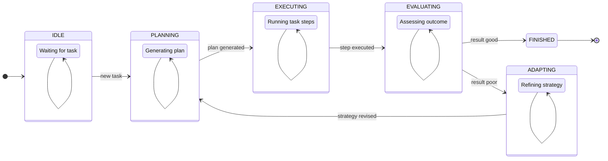

자율 에이전트(Autonomous Agents)는 단순한 질의응답을 넘어 복잡한 환경에서 스스로 목표를 설정하고, 계획을 수립하며, 행동을 실행하는 지능형 시스템입니다. 2026년 현재, 서비스 지능화의 핵심 동력으로 부상하고 있는 자율 에이전트는 고도화된 의사결정 로직 없이는 실제 비즈니스 가치를 창출하기 어렵습니다. 본 문서는 자율 에이전트의 복잡한 의사결정 로직을 효과적으로 설계하고 구현하기 위한 핵심 패턴들을 다룹니다.

## 핵심 의사결정 로직 패턴

### 계층적 계획 (Hierarchical Planning)

계층적 계획은 복잡한 목표를 관리 가능한 작은 하위 목표(sub-goals)로 분해하고, 각 계층에서 적절한 수준의 의사결정을 수행하는 패턴입니다. 최상위 계층의 대규모 언어 모델(LLM)은 전략적이고 추상적인 계획을 수립하고, 하위 계층은 구체적인 작업 실행을 위한 전술적이고 상세한 의사결정을 담당할 수 있습니다. 예를 들어, LLM은 '사용자 요청을 해결하라'는 추상적인 목표를 '정보 검색 -> 응답 초안 작성 -> 검토 및 수정'과 같은 중간 단계로 나눌 수 있으며, 각 단계는 특정 도구(tool)를 호출하거나 다른 전문 에이전트에게 위임될 수 있습니다.

이 패턴은 복잡성을 효과적으로 관리하고, 각 계층의 에이전트가 자신의 전문 영역에 집중할 수 있도록 하여 전체 시스템의 효율성과 견고성을 높입니다.

### 상태 기반 오케스트레이션 (State-Based Orchestration)

자율 에이전트의 의사결정 흐름을 명확히 정의된 상태(states)와 상태 전이(state transitions)로 모델링하는 패턴입니다. 에이전트는 `PLANNING` (계획), `EXECUTING` (실행), `EVALUATING` (평가), `ADAPTING` (적응) 등과 같은 다양한 상태를 가질 수 있으며, 특정 조건이나 의사결정 결과에 따라 한 상태에서 다른 상태로 전환됩니다.

이 접근 방식은 에이전트의 현재 상태를 명확히 파악하고, 예측 가능한 행동 흐름을 제공하여 디버깅 및 시스템 제어를 용이하게 합니다. 각 상태에서 어떤 의사결정 로직이 활성화되고 어떤 도구가 사용될지 명시적으로 관리할 수 있습니다.

### 적응형 학습 루프 (Adaptive Learning Loops)

에이전트가 외부 환경, 사용자 피드백, 또는 자체 실행 결과로부터 학습하여 향후 의사결정 전략을 개선하는 메커니즘입니다. 이는 단순한 조건부 로직을 넘어, 과거 경험을 통해 더 나은 결정을 내릴 수 있도록 합니다. 예를 들어, 실패한 실행 경로를 기록하고, 해당 경로를 피하거나 다른 접근 방식을 시도하도록 의사결정 로직을 업데이트할 수 있습니다. 강화 학습(Reinforcement Learning)이나 자기 성찰(Self-Reflection) 메커니즘이 이 루프의 핵심이 될 수 있습니다.

## 구현 예시: 상태 기반 의사결정 오케스트레이션

아래 Python 코드는 간단한 상태 기반 에이전트의 의사결정 흐름을 보여줍니다. `AgentState` Enum으로 에이전트의 가능한 상태를 정의하고, `DecisionEngine` 클래스에서 상태에 따른 의사결정 로직과 상태 전이 로직을 구현합니다.

```python
import enum

class AgentState(enum.Enum):
    IDLE = "IDLE"
    PLANNING = "PLANNING"
    EXECUTING = "EXECUTING"
    EVALUATING = "EVALUATING"
    ADAPTING = "ADAPTING"
    FINISHED = "FINISHED"

class DecisionEngine:
    def __init__(self, initial_state: AgentState = AgentState.IDLE):
        self.current_state = initial_state
        self.task_context = {}
        print(f"Agent initialized in state: {self.current_state.value}")

    def decide(self, observation: str):
        print(f"Current State: {self.current_state.value}, Observation: {observation}")
        if self.current_state == AgentState.IDLE:
            return self._handle_idle(observation)
        elif self.current_state == AgentState.PLANNING:
            return self._handle_planning(observation)
        elif self.current_state == AgentState.EXECUTING:
            return self._handle_executing(observation)
        elif self.current_state == AgentState.EVALUATING:
            return self._handle_evaluating(observation)
        elif self.current_state == AgentState.ADAPTING:
            return self._handle_adapting(observation)
        elif self.current_state == AgentState.FINISHED:
            print("Task finished.")
            return "TASK_COMPLETED"
        return "NO_ACTION"

    def _handle_idle(self, observation: str):
        if "new task" in observation.lower():
            self.task_context["task_description"] = observation
            self.current_state = AgentState.PLANNING
            return "STARTED_PLANNING"
        return "WAITING_FOR_TASK"

    def _handle_planning(self, observation: str):
        # Simulate LLM-based planning
        if "plan generated" in observation.lower():
            self.task_context["plan"] = "Execute step 1, then step 2"
            self.current_state = AgentState.EXECUTING
            return "PLAN_READY"
        return "PLANNING_IN_PROGRESS"

    def _handle_executing(self, observation: str):
        # Simulate executing a step
        if "step 1 complete" in observation.lower():
            print("Executing step 2...")
            self.current_state = AgentState.EVALUATING
            return "STEP_EXECUTED"
        return "EXECUTION_IN_PROGRESS"

    def _handle_evaluating(self, observation: str):
        # Simulate evaluation result
        if "result good" in observation.lower():
            self.current_state = AgentState.FINISHED
            return "EVALUATION_SUCCESS"
        elif "result poor" in observation.lower():
            self.current_state = AgentState.ADAPTING
            return "EVALUATION_FAILURE_ADAPT"
        return "EVALUATION_PENDING"

    def _handle_adapting(self, observation: str):
        # Simulate adaptation based on failure
        if "strategy revised" in observation.lower():
            self.current_state = AgentState.PLANNING # Re-plan with new strategy
            return "ADAPTATION_COMPLETE"
        return "ADAPTING_STRATEGY"

# --- Example Usage ---
# agent = DecisionEngine()
# agent.decide("New task: Analyze market trends")
# agent.decide("LLM: plan generated for market analysis")
# agent.decide("Tool: step 1 complete")
# agent.decide("Evaluation: result poor")
# agent.decide("LLM: strategy revised to include deeper data sources")
# agent.decide("LLM: plan generated for market analysis") # Re-planning
# agent.decide("Tool: step 1 complete")
# agent.decide("Evaluation: result good")
```

이 다이어그램은 위 `DecisionEngine`의 상태 전이를 시각적으로 표현합니다.



## 트레이드오프

복잡한 의사결정 로직 패턴을 적용할 때는 다음과 같은 트레이드오프를 고려해야 합니다.

*   **복잡성 vs 유연성 (Complexity vs. Flexibility)**:
    *   **장점**: 잘 정의된 패턴은 시스템의 구조적 복잡성을 관리하고 예측 가능성을 높입니다. 특히 대규모 프로젝트에서 일관된 에이전트 행동을 보장할 수 있습니다.
    *   **단점**: 과도하게 경직된 패턴은 예상치 못한 상황이나 빠른 환경 변화에 대한 에이전트의 즉각적인 적응 능력을 저해할 수 있습니다. 유연한 확장을 위한 설계가 중요합니다.
*   **성능 vs 견고성 (Performance vs. Robustness)**:
    *   **장점**: 다단계 의사결정이나 피드백 루프는 에이전트의 오류를 줄이고 장기적인 신뢰성을 높여줍니다. 실패로부터 학습하여 더 견고한 에이전트를 만들 수 있습니다.
    *   **단점**: 각 의사결정 단계마다 추가적인 추론(inference) 시간이나 처리 로직이 필요하므로, 실시간 응답이 중요한 시나리오에서는 latency가 증가할 수 있습니다.
*   **자동화 수준 vs 제어 가능성 (Automation Level vs. Control)**:
    *   **장점**: 고도화된 의사결정 로직은 에이전트의 자율성을 극대화하여 인간의 개입 없이 복잡한 작업을 완료할 수 있게 합니다.
    *   **단점**: 에이전트의 내부 의사결정 과정을 이해하고 제어하기 어려워질 수 있습니다. '블랙박스(black-box)' 문제로 인해 예상치 못한 행동 발생 시 원인 분석이 복잡해집니다.
*   **초기 개발 비용 vs 장기 유지보수 (Initial Development Cost vs. Long-Term Maintenance)**:
    *   **장점**: 잘 구조화된 의사결정 패턴은 장기적으로 코드의 가독성을 높이고, 새로운 기능 추가 및 버그 수정과 같은 유지보수 비용을 절감합니다.
    *   **단점**: 초기 설계 단계에서 복잡한 패턴을 도입하는 데 더 많은 시간과 전문성이 요구됩니다. 적절한 추상화 레벨을 찾는 것이 중요합니다.

## 실전 체크리스트

자율 에이전트의 복잡한 의사결정 로직을 프로젝트에 적용할 때 다음 항목들을 검토해야 합니다.

*   [ ] 에이전트의 핵심 비즈니스 목표가 의사결정 로직의 각 단계와 명확하게 정렬되어 있는지 확인합니다.
*   [ ] 각 의사결정 단계에서 사용되는 정보 소스와 추론 과정이 투명하고 설명 가능한지(explainable) 검증합니다.
*   [ ] 에이전트의 상태 전이(state transition) 로직이 모든 가능한 시나리오를 커버하며, 무한 루프나 교착 상태(deadlock)에 빠지지 않도록 설계되었는지 확인합니다.
*   [ ] 비정상 상황(edge cases) 및 오류 발생 시 에이전트의 의사결정 로직이 어떻게 동작하고 복구되는지 명확히 정의하고 테스트합니다.
*   [ ] 의사결정의 피드백 루프(feedback loop)가 실제로 에이전트의 성능 지표(KPI) 개선에 기여하고 있는지 정기적으로 측정하고 평가합니다.
*   [ ] 멀티 에이전트 시스템에서 의사결정 충돌(conflict resolution)이 발생할 경우, 이를 감지하고 해결하기 위한 명확한 메커니즘이 있는지 확인합니다.
*   [ ] 의사결정 로직 변경 시 전체 시스템에 미치는 영향을 예측하고, 점진적인 배포(progressive rollout) 및 롤백(rollback) 전략을 수립합니다.