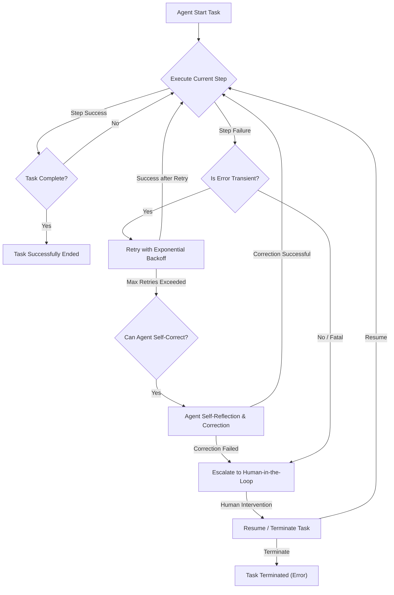

LLM 기반 자율 에이전트는 복잡한 태스크를 수행하며 전례 없는 자동화와 유연성을 제공하지만, 그 본질적인 비결정성과 외부 환경 의존성으로 인해 다양한 오류 상황에 직면할 수 있습니다. 이러한 오류를 효과적으로 처리하고 복구하는 패턴을 설계하는 것은 자율 에이전트 시스템의 안정성과 신뢰성을 확보하고 프로덕션 환경에 성공적으로 적용하기 위한 핵심적인 과제입니다.

### LLM 기반 에이전트의 주요 오류 유형

자율 에이전트에서 발생할 수 있는 오류는 크게 다음과 같은 범주로 나눌 수 있습니다:

*   **API 호출 오류 (API Call Errors):** LLM API, 외부 도구 API 호출 시 발생하는 네트워크 문제, 인증 실패, 속도 제한(rate limit), 잘못된 요청 형식 등의 문제.
*   **도구 실행 오류 (Tool Execution Errors):** 에이전트가 사용하는 외부 도구(Code Interpreter, 검색 엔진, 데이터베이스 등)의 실행 중 발생하는 런타임 에러, 비정상적인 응답, 타임아웃 등.
*   **환각 및 논리 오류 (Hallucination and Logical Errors):** LLM의 비결정성으로 인해 발생하는 잘못된 정보 생성, 비논리적인 추론, 계획 실패, 잘못된 도구 사용 지시 등.
*   **무한 루프 (Infinite Loops):** 에이전트가 특정 상태에 갇혀 진행되지 못하고 동일한 작업을 반복하는 상황.
*   **컨텍스트 오버플로우 (Context Overflow):** 에이전트의 대화나 작업 기록이 LLM의 컨텍스트 윈도우 한계를 초과하여 중요한 정보가 유실되거나 처리에 실패하는 경우.
*   **외부 환경 변경 (External Environment Changes):** 에이전트가 상호작용하는 웹사이트, API 스키마, 데이터 포맷 등이 예고 없이 변경되어 에이전트의 작업 흐름이 중단되는 경우.

### 견고한 에이전트 설계를 위한 오류 처리 및 복구 패턴

자율 에이전트의 안정성을 높이기 위해 다음과 같은 오류 처리 및 복구 패턴을 고려할 수 있습니다.

#### 1. 재시도 및 지수적 백오프 (Retry with Exponential Backoff)

일시적인 네트워크 문제나 API 속도 제한과 같은Transient Error는 일정 시간 대기 후 재시도하는 것이 효과적입니다. 지수적 백오프(Exponential Backoff)는 재시도 간격을 점진적으로 늘려 서버 부하를 줄이고 성공 확률을 높입니다. 이는 LLM API 및 외부 도구 API 호출에 필수적입니다.

```python
import time
import random

def call_llm_api(prompt: str) -> str:
    """Simulates an LLM API call that might fail."""
    if random.random() < 0.3: # 30% chance of failure
        raise ConnectionError("API rate limit exceeded or network error")
    return f"Response to: {prompt}"

def robust_llm_call(prompt: str, max_retries: int = 5) -> str:
    for attempt in range(max_retries):
        try:
            print(f"Attempt {attempt + 1} for prompt: {prompt}")
            return call_llm_api(prompt)
        except ConnectionError as e:
            if attempt == max_retries - 1:
                print(f"Max retries exceeded for {prompt}. Error: {e}")
                raise
            backoff_time = (2 ** attempt) + random.uniform(0, 1)
            print(f"Error: {e}. Retrying in {backoff_time:.2f} seconds...")
            time.sleep(backoff_time)
    return ""

# Example usage:
try:
    result = robust_llm_call("Generate a summary of quantum computing")
    print(f"Final Result: {result}")
except ConnectionError:
    print("Failed to get LLM response after multiple retries.")
```

#### 2. 자가 수정 및 반성 (Self-Correction & Reflection)

에이전트가 자신의 행동이나 출력에 문제가 있음을 인지하고, 이를 분석하여 스스로 수정하는 패턴입니다. LLM에 잘못된 결과(예: 존재하지 않는 함수 호출, 잘못된 형식의 JSON)를 입력으로 주고, 오류 메시지와 함께 수정을 요청하는 프롬프트를 보낼 수 있습니다. 이는 특히 논리적 오류나 환각으로 인한 문제 해결에 유용합니다.

#### 3. 휴먼 인 더 루프 (Human-in-the-Loop) 에스컬레이션

자동화된 복구 메커니즘으로 해결할 수 없는 복잡하거나 안전에 민감한 오류가 발생했을 때, 사람의 개입을 요청하는 패턴입니다. 에이전트의 현재 상태, 발생한 오류, 시도했던 복구 노력 등을 상세히 보고하여 사람이 신속하게 상황을 파악하고 개입할 수 있도록 지원해야 합니다. 이는 궁극적인 안전장치이자 학습 기회입니다.

#### 4. 체크포인팅 및 롤백 (Checkpointing & Rollback)

장기 실행 태스크나 중요한 의사 결정 시점에서 에이전트의 상태(메모리, 변수, 계획 등)를 저장하는 패턴입니다. 오류 발생 시, 가장 최근의 유효한 체크포인트로 상태를 롤백하여 처음부터 다시 시작하는 대신 오류 지점 근처에서 복구를 시도할 수 있습니다. 이는 비용 효율성을 높이고, 에이전트의 생산성을 유지하는 데 기여합니다.

#### 5. 대체/폴백 메커니즘 (Fallback Mechanisms)

주요 도구나 API가 실패할 경우, 미리 정의된 대체 도구나 간소화된 작업 흐름으로 전환하여 최소한의 기능을 제공하는 패턴입니다. 예를 들어, 특정 검색 API가 응답하지 않으면 다른 검색 엔진을 사용하거나, 복잡한 코드 생성 도구가 실패하면 더 간단한 스크립트 생성 로직으로 전환할 수 있습니다. 이는 시스템의 견고성(Robustness)을 높입니다.

#### 6. 모니터링 및 경고 (Monitoring & Alerting)

에이전트의 실행 상태, 오류 발생률, LLM API 사용량, 도구 실행 성공/실패율 등을 지속적으로 모니터링하고, 임계값을 초과하는 이상 징후 발생 시 관리자에게 즉시 경고를 보냅니다. 이는 문제가 심화되기 전에 선제적으로 대응할 수 있도록 돕습니다.

### 오류 처리 및 복구 워크플로우

Mermaid 다이어그램을 통해 일반적인 오류 처리 및 복구 워크플로우를 시각화할 수 있습니다.



## 트레이드오프

각 오류 처리 및 복구 패턴은 고유한 장단점을 가지며, 에이전트의 특성과 요구사항에 따라 적절히 선택하고 조합해야 합니다.

*   **재시도 및 지수적 백오프:**
    *   **언제 좋은가:** 일시적인 네트워크 오류, API 속도 제한 등Transient Failure에 효과적이며 구현이 비교적 간단합니다. 시스템의 Resilience를 즉각적으로 높입니다.
    *   **언제 나쁜가:** 근본적인 논리 오류나 영구적인 외부 서비스 중단과 같은Persistent Failure에는 효과가 없으며, 무한 재시도로 불필요한 비용을 발생시키거나 지연 시간을 증가시킬 수 있습니다.
*   **자가 수정 및 반성:**
    *   **언제 좋은가:** LLM의 추론 능력에 기반하여 논리 오류, 잘못된 도구 사용, 환각 등 복잡한 에이전트 내부 오류를 해결하는 데 탁월합니다. 에이전트의 Autonomy를 극대화합니다.
    *   **언제 나쁜가:** LLM 호출에 따른 비용과 지연 시간이 발생하며, 수정 시도 자체가 실패하거나 새로운 오류를 유발할 위험이 있습니다. 모든 유형의 오류를 해결할 수 있는 만능 해결책은 아닙니다.
*   **휴먼 인 더 루프 에스컬레이션:**
    *   **언제 좋은가:** 안전에 민감하거나 고도의 전문 지식이 요구되는 오류, 자동화된 복구가 불가능한 예측 불가능한 상황에서 최종적인 안전장치(Safety Net)를 제공합니다. 시스템의 신뢰성(Reliability)을 보장합니다.
    *   **언제 나쁜가:** 사람의 개입은 필연적으로 지연 시간을 유발하고, 인건비가 발생하며, 시스템의 완전한 자동화를 방해합니다. 과도한 Human-in-the-Loop는 에이전트의 효율성을 저해합니다.
*   **체크포인팅 및 롤백:**
    *   **언제 좋은가:** 장기 실행 태스크에서 오류 발생 시 전체 작업을 다시 시작하는 것을 방지하여 LLM 호출 비용 및 시간 낭비를 크게 줄입니다. 작업의 진행 상태 보존을 통해 회복 탄력성(Recoverability)을 높입니다.
    *   **언제 나쁜가:** 체크포인트를 저장하고 로드하는 데 필요한 오버헤드(Overhead, 저장 공간 및 I/O)가 발생합니다. 체크포인트의 granularity를 잘못 설정하면 의미 있는 복구를 제공하기 어렵거나, 여전히 많은 리소스 낭비가 발생할 수 있습니다.
*   **대체/폴백 메커니즘:**
    *   **언제 좋은가:** 특정 외부 서비스 의존성을 줄여 시스템의 전체적인 Robustness를 향상시키고, 부분적인 서비스 중단 상황에서도 핵심 기능을 유지할 수 있게 합니다.
    *   **언제 나쁜가:** 대체 솔루션이 항상 최적의 성능이나 품질을 보장하지 못할 수 있습니다. 대체 경로를 유지 관리하는 데 추가적인 개발 노력이 필요하며, 너무 많은 폴백 경로는 시스템 복잡도를 증가시킬 수 있습니다.

## 실전 체크리스트

LLM 기반 자율 에이전트 시스템에 오류 처리 및 복구 패턴을 적용할 때 다음 항목들을 검증하여 시스템의 견고성을 확보하십시오.

*   [ ] 모든 LLM API 및 외부 도구 호출에 재시도 로직과 지수적 백오프(Exponential Backoff)가 적용되어 있는가?
*   [ ] 에이전트가 생성한 출력(예: JSON 파싱 오류, 잘못된 함수 호출)에 대한 유효성 검사(Validation)가 충분히 구현되어 있으며, 실패 시 자가 수정 프롬프트(Self-Correction Prompt)가 트리거되는가?
*   [ ] 해결 불가능한 오류나 반복적인 실패 발생 시, 에이전트의 상태와 오류 맥락을 포함한 상세 보고서가 특정 채널(예: Slack, 이메일, 대시보드)로 에스컬레이션되는 Human-in-the-Loop 프로세스가 정의되어 있는가?
*   [ ] 장기 실행 태스크의 주요 단계마다 에이전트의 작업 진행 상태(Progress)와 핵심 데이터가 체크포인트로 저장되며, 오류 발생 시 해당 체크포인트로 롤백(Rollback)하여 복구할 수 있는가?
*   [ ] 핵심 도구나 서비스의 장애 시, 사전에 정의된 대체 도구(Fallback Tool)나 간소화된 작업 흐름으로 전환하여 에이전트의 기능을 지속할 수 있는가?
*   [ ] 에이전트의 오류 발생률, LLM 토큰 사용량, 도구 실행 성공률 등 핵심 지표가 실시간으로 모니터링되며, 임계치 초과 시 경고(Alert)가 발생하는 시스템이 구축되어 있는가?
*   [ ] 주요 오류 시나리오(예: API Rate Limit, 잘못된 JSON 응답, 무한 루프)에 대한 통합 테스트(Integration Test) 및 회귀 테스트(Regression Test)가 정기적으로 수행되는가?