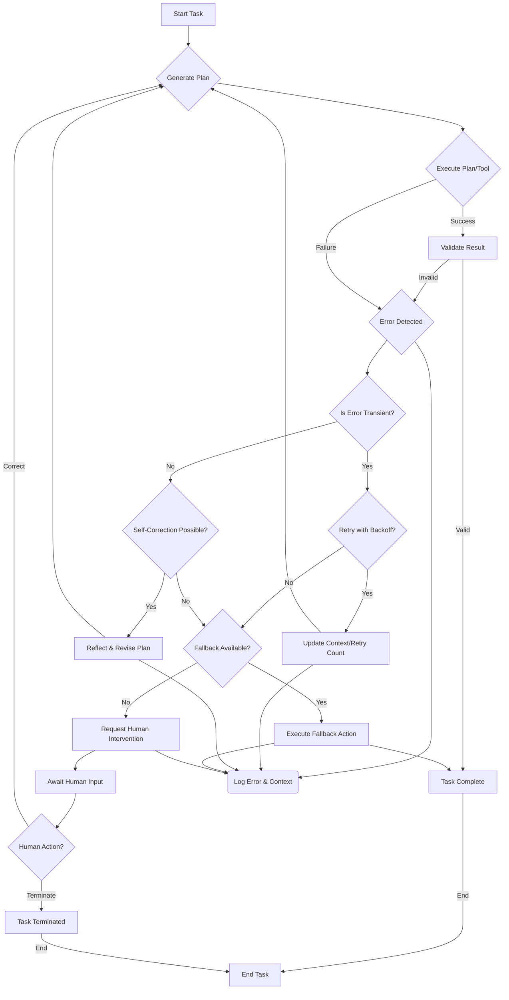

LLM(Large Language Model) 기반 자율 에이전트는 복잡한 태스크를 수행하며 다양한 환경과 상호작용합니다. 이러한 에이전트의 신뢰성을 확보하고 실제 비즈니스에 성공적으로 적용하기 위해서는 견고한 오류 복구 전략(Error Recovery Strategy) 설계가 필수적입니다. 에이전트의 실패는 비효율적인 리소스 사용, 잘못된 결정, 심지어 재정적 손실로 이어질 수 있기 때문에, 에이전트가 스스로 문제를 감지하고 해결하며, 필요한 경우 안전하게 중단하거나 인간에게 개입을 요청하는 메커니즘이 중요합니다.2026년 현재, 에이전트의 신뢰성 향상은 단순한 버그 수정에서 벗어나, 예측 불가능한 LLM의 행동, 외부 시스템의 불안정성, 모호한 사용자 요청 등 다양한 실패 지점(Failure Points)에 대응하는 복합적인 시스템 디자인의 영역으로 확장되고 있습니다.

## 주요 오류 유형과 발생 원인

자율 에이전트의 오류는 여러 단계에서 발생할 수 있습니다. 핵심적인 유형은 다음과 같습니다:

*   **LLM Hallucination (환각)**: LLM이 사실과 다른 정보를 생성하거나 잘못된 논리를 전개하여 계획(Plan)이 실패하는 경우.
*   **Tool Execution Errors (도구 실행 오류)**: 에이전트가 외부 도구(Tool)를 호출했으나, API 응답 오류, 네트워크 문제, 권한 부족 등으로 인해 도구 실행이 실패하는 경우.
*   **Ambiguous/Conflicting Instructions (모호하거나 상충하는 지시)**: 사용자의 요청이 불분명하거나, 내부적으로 생성된 하위 태스크 간에 충돌이 발생하여 에이전트가 올바른 판단을 내리지 못하는 경우.
*   **State Drift (상태 불일치)**: 에이전트의 내부 상태(Internal State)와 실제 환경의 상태가 불일치하여 잘못된 결정을 내리는 경우.
*   **Resource Constraints (자원 제약)**: 처리해야 할 컨텍스트(Context) 크기, 토큰 제한, 시간 제한 등 자원 부족으로 인해 태스크를 완료하지 못하는 경우.

## 오류 복구 전략 디자인 패턴

### 1. Self-Correction & Reflection Loops

에이전트가 자신의 과거 행동, 계획, 결과를 분석하여 잘못된 부분을 식별하고 수정하는 메커니즘입니다. 실패가 발생했을 때, 에이전트는 다음 단계를 수행할 수 있습니다:

1.  **Error Identification**: 오류 메시지, 예외(Exception), 또는 기대했던 결과와 실제 결과 간의 불일치를 감지합니다.
2.  **Root Cause Analysis (RCA)**: LLM이 오류 메시지와 현재 컨텍스트를 분석하여 실패의 원인을 추론합니다.
3.  **Plan Revision**: 원인 분석을 바탕으로 기존 계획을 수정하거나 새로운 계획을 수립합니다.
4.  **Re-execution**: 수정된 계획으로 태스크를 다시 시도합니다.

```python
# Python-like Pseudocode for a Self-Correction Loop
def execute_task(agent_state, max_retries=3):
    for attempt in range(max_retries):
        try:
            plan = agent_state.generate_plan()
            result = agent_state.execute_plan(plan)
            if agent_state.validate_result(result):
                return result
            else:
                raise ValueError("Result validation failed")
        except Exception as e:
            print(f"Attempt {attempt + 1} failed: {e}")
            agent_state.reflect_on_error(e)
            agent_state.update_context_with_error(e)
            if attempt == max_retries - 1:
                agent_state.request_human_intervention(f"Unrecoverable error after {max_retries} attempts")
                raise
    return None
```

### 2. Retry Mechanisms with Exponential Backoff

네트워크 불안정성, 외부 서비스의 일시적인 과부하와 같은 transient errors(일시적 오류)에 효과적입니다. 에이전트는 실패 시 일정 시간 대기 후 재시도하며, 재시도 간격은 점진적으로 늘려 리소스 소모를 줄이고 서비스 부담을 완화합니다.

### 3. Fallback Mechanisms

주요 전략이 실패했을 때 대안적인(Alternative) 경로를 제공합니다. 예를 들어:

*   **Simplified Model**: 복잡한 LLM 호출이 실패하면 더 작고 안정적인 모델이나 규칙 기반 시스템으로 전환하여 최소한의 기능을 제공합니다.
*   **Cached Results**: 실시간 데이터 호출이 실패하면 이전에 캐시된 데이터를 사용합니다.
*   **Default Actions**: 특정 도구 사용이 불가능할 경우, 안전한 기본 동작(Default Action)을 수행합니다.

### 4. Human-in-the-Loop (HITL) Integration

에이전트가 스스로 해결할 수 없는 복잡하거나 치명적인 오류에 직면했을 때, 인간에게 개입을 요청하는 메커니즘입니다. 이는 에이전트의 안전성과 신뢰성을 크게 높입니다. HITL은 다음과 같은 경우에 트리거될 수 있습니다:

*   최대 재시도 횟수 초과.
*   예측 불가능한 심각한 예외 발생.
*   결정의 중요도가 매우 높거나, 실패 시 파급 효과가 큰 경우.
*   에이전트가 스스로 모호성을 해결하지 못하는 경우.

### 5. Proactive Validation and Guardrails

오류가 발생하기 전에 잠재적인 문제를 감지하고 방지하는 전략입니다.

*   **Input/Output Validation**: LLM의 입력 프롬프트와 출력 결과를 구조적, 의미론적으로 검증하여 오류를 조기에 포착합니다.
*   **Safety Constraints**: 에이전트의 행동 범위를 제한하고, 특정 위험한 동작을 사전에 방지하는 규칙(Guardrails)을 설정합니다.
*   **Monitoring & Alerting**: 에이전트의 실행 상태, 리소스 사용량, 오류 발생률 등을 실시간으로 모니터링하고, 이상 징후 발생 시 알림을 발생시킵니다.

## 에이전트 오류 복구 워크플로우



## 트레이드오프

오류 복구 전략을 설계할 때는 다음과 같은 트레이드오프를 고려해야 합니다.

*   **복잡성 vs. 견고성 (Complexity vs. Robustness)**:
    *   **언제 좋은가**: 복잡하고 다층적인 오류 복구 로직은 에이전트의 견고성을 극대화하여 다양한 실패 시나리오에 대응할 수 있습니다. 특히 미션 크리티컬한 시스템에 적합합니다.
    *   **언제 나쁜가**: 복구 로직이 복잡해질수록 시스템 개발 및 유지보수 비용이 증가하며, 디버깅이 어려워질 수 있습니다. 단순한 태스크에는 과도한 오버헤드입니다.
*   **비용 vs. 신뢰성 (Cost vs. Reliability)**:
    *   **언제 좋은가**: 재시도, 상세한 리플렉션, 고도화된 모니터링, 인간 개입은 에이전트의 신뢰성을 크게 높입니다. 오류로 인한 비즈니스 손실이 큰 경우 투자할 가치가 있습니다.
    *   **언제 나쁜가**: LLM 호출 증가는 토큰 사용량 증가로 이어져 운영 비용을 상승시킵니다. 인간 개입은 인력 비용을 발생시키므로, 비용 대비 효과를 고려해야 합니다.
*   **속도 vs. 정확성 (Speed vs. Accuracy)**:
    *   **언제 좋은가**: 오류 복구 프로세스는 에이전트가 정확하고 신뢰할 수 있는 결과를 도출하도록 보장합니다. 최종 결과의 품질이 속도보다 중요한 경우 유리합니다.
    *   **언제 나쁜가**: 오류 감지 및 복구에 소요되는 시간은 에이전트의 전반적인 반응 속도(Latency)를 저하시킬 수 있습니다. 실시간 처리가 요구되는 애플리케이션에는 제한적일 수 있습니다.
*   **자율성 vs. 제어 (Autonomy vs. Control)**:
    *   **언제 좋은가**: Human-in-the-Loop와 같은 전략은 에이전트의 완전한 자율성을 제한하지만, 안전한 제어 메커니즘을 제공하여 치명적인 오류를 방지하고 신뢰를 구축합니다.
    *   **언제 나쁜가**: 인간의 개입이 잦아질수록 에이전트의 '자율성'이라는 핵심 가치가 희석될 수 있으며, 운영 워크플로우에 병목 현상을 초래할 수 있습니다.

## 실전 체크리스트

LLM 기반 자율 에이전트의 오류 복구 전략을 프로젝트에 적용할 때 다음 항목들을 검증해야 합니다.

*   [ ] 모든 외부 API 호출에 대해 타임아웃(Timeout) 및 적절한 재시도(Retry) 전략 (예: Exponential Backoff)이 정의되었으며 구현되었는가?
*   [ ] 에이전트의 주요 의사결정 단계마다 자체 검증(Self-validation) 로직이 구현되어, LLM의 환각(Hallucination) 또는 잘못된 계획을 조기에 감지할 수 있는가?
*   [ ] 예측 불가능하거나 심각한 오류 발생 시 에이전트가 인간 개입(Human-in-the-Loop)을 요청하는 명확한 메커니즘과 알림(Alerting) 시스템이 있는가?
*   [ ] 에이전트 실행 과정에서 발생하는 모든 오류가 구조화된 형식으로 중앙 로깅 시스템에 기록되고 있으며, 이를 기반으로 모니터링 대시보드가 운영되는가?
*   [ ] 에이전트의 오작동으로 인한 잠재적 비용 초과(Cost Overrun)를 방지하기 위한 가드레일(Guardrails)이 (예: 최대 LLM 토큰 사용량 제한) 작동하고 있는가?
*   [ ] 중요한 태스크 실패 시 대체(Fallback) 경로 또는 간소화된 처리 로직이 정의되어, 핵심 기능의 중단을 최소화할 수 있는가?
*   [ ] 주기적인 회귀 테스트(Regression Test) 및 장애 주입 테스트(Fault Injection Test)를 통해 오류 복구 메커니즘의 유효성과 성능을 지속적으로 검증하는가?