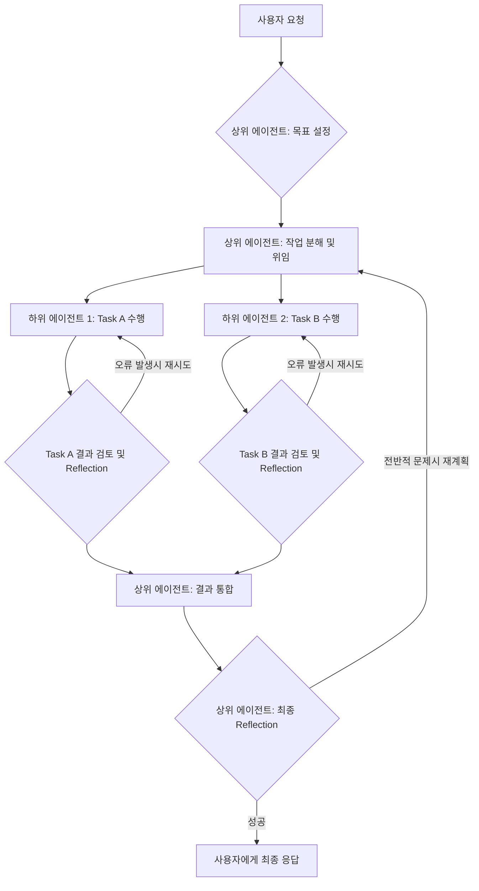

LLM (Large Language Model) 기반 자율 에이전트가 복잡한 작업을 효율적이고 신뢰할 수 있게 수행하려면 검증된 설계 방법론이 필수적입니다. 단순히 프롬프트 체이닝을 넘어, 에이전트의 행동을 구조화하고 관리하는 워크플로우 디자인 패턴은 시스템의 강건성, 확장성, 그리고 예측 가능성을 크게 향상시킵니다. 본 문서는 주요 워크플로우 디자인 패턴과 그 적용 전략을 다룹니다.

## 핵심 워크플로우 디자인 패턴

### 1. Plan and Execute Pattern
이 패턴은 에이전트가 주어진 목표를 달성하기 위해 먼저 전체적인 계획을 수립하고, 그 계획에 따라 각 단계를 순차적으로 실행하는 방식입니다. LLM은 목표를 분석하여 상세한 서브태스크(sub-task) 목록을 생성하고, 각 서브태스크는 도구(tool) 호출 또는 추가적인 LLM 추론을 통해 처리됩니다. 이 과정에서 에이전트는 계획 실행 중 발생하는 불확실성이나 오류에 대응할 수 있어야 합니다.

### 2. Hierarchical Agent Pattern
복잡한 목표는 단일 에이전트가 관리하기 어렵습니다. 계층적 에이전트 패턴은 상위 에이전트(Supervisor Agent)가 큰 목표를 여러 하위 에이전트(Worker Agents)에게 위임하고 조율하는 구조입니다. 각 하위 에이전트는 특정 도메인이나 태스크에 전문화되어 있으며, 자신의 역할을 수행한 후 상위 에이전트에게 결과를 보고합니다. 이는 복잡성을 모듈화하고, 각 에이전트의 책임을 명확히 하여 전체 시스템의 관리 용이성을 높입니다.

### 3. Reflection and Self-Correction Pattern
자율 에이전트의 신뢰성을 확보하는 데 핵심적인 패턴입니다. 에이전트는 자신의 행동과 그 결과를 지속적으로 평가하고, 예상과 다른 결과가 나오거나 오류가 발생했을 때 스스로 계획이나 실행 방식을 수정합니다. 이는 피드백 루프(feedback loop)를 통해 이루어지며, 에이전트가 경험을 통해 학습하고 강건성을 확보하는 데 기여합니다. 2026년에는 이런 Reflection 메커니즘이 더욱 정교해져, 메타인지(meta-cognition) 능력을 강화하는 방향으로 발전할 것으로 예상됩니다.

### 4. Multi-Agent Collaboration Pattern
다수의 독립적인 에이전트가 공동의 목표를 달성하기 위해 협력하는 패턴입니다. 각 에이전트는 특정 역할(예: 기획자, 개발자, 테스터)을 맡아 병렬적으로 또는 순차적으로 작업을 수행하며, 서로 정보를 교환하고 조율합니다. 이는 단일 에이전트의 한계를 넘어선 복합적인 문제 해결 능력을 제공하며, 특히 소프트웨어 개발이나 연구와 같은 복잡한 도메인에서 강력한 시너지를 발휘할 수 있습니다.

다음 Mermaid 다이어그램은 계층적 에이전트와 Reflection 패턴이 결합된 워크플로우의 한 예시를 보여줍니다.



## 코드 예시: Plan and Execute 에이전트

아래는 `Plan and Execute` 패턴을 구현한 간단한 Python 예시입니다. 에이전트는 LLM을 사용하여 계획을 세우고, 정의된 도구(tool)를 사용하여 각 단계를 실행합니다.

```python
from typing import List, Dict, Callable

# Mock LLM API
def call_llm(prompt: str) -> str:
    if "plan" in prompt.lower():
        if "web search" in prompt.lower():
            return "Plan:\n1. Search for 'LLM agent workflow patterns trends 2026'.\n2. Summarize key trends.\n3. Draft a report based on the summary."
        else:
            return "Plan:\n1. Identify core requirements.\n2. Decompose into sub-tasks.\n3. Execute sub-tasks using available tools.\n4. Reflect and refine."
    elif "search" in prompt.lower():
        return "Found: 2026 trends include dynamic planning, multi-agent collaboration, enhanced safety, and self-improving loops."
    elif "summarize" in prompt.lower():
        return "Summary: Future LLM agents will be more adaptive, collaborative, and robust."
    elif "draft report" in prompt.lower():
        return "Drafted report: The future of LLM agents is bright with adaptive, collaborative, and robust systems."
    return "Action completed."

# Mock Tool Definitions
TOOLS: Dict[str, Callable[[str], str]] = {
    "web_search": lambda query: call_llm(f"Perform web search for: {query}"),
    "summarizer": lambda text: call_llm(f"Summarize the following text: {text}"),
    "report_writer": lambda content: call_llm(f"Draft a report with content: {content}")
}

class Agent:
    def __init__(self, name: str, llm_func: Callable[[str], str], tools: Dict[str, Callable[[str], str]]):
        self.name = name
        self.llm = llm_func
        self.tools = tools
        self.context: List[str] = []

    def add_to_context(self, message: str):
        self.context.append(message)

    def plan(self, objective: str) -> List[str]:
        prompt = f"Agent: {self.name}\nObjective: {objective}\nCurrent Context: {self.context[-3:] if self.context else 'None'}\nBased on the objective, create a step-by-step plan using available tools: {list(self.tools.keys())}."
        raw_plan = self.llm(prompt)
        self.add_to_context(f"Generated Plan: {raw_plan}")
        steps = [step.strip() for step in raw_plan.split('\n') if step.strip().startswith(('1.', '2.', '3.'))]
        return steps

    def execute_step(self, step: str) -> str:
        self.add_to_context(f"Executing step: {step}")
        if "search for" in step.lower():
            query = step.split("search for '")[-1].replace("'.", "")
            result = self.tools["web_search"](query)
            self.add_to_context(f"Search Result: {result}")
            return result
        elif "summarize" in step.lower():
            text_to_summarize = self.context[-1] # Assuming previous step result is relevant
            result = self.tools["summarizer"](text_to_summarize)
            self.add_to_context(f"Summary Result: {result}")
            return result
        elif "draft a report" in step.lower():
            content = " ".join(self.context[-2:]) # Combine last two context items
            result = self.tools["report_writer"](content)
            self.add_to_context(f"Report Result: {result}")
            return result
        return f"Unknown step or no tool for: {step}"

    def run(self, objective: str) -> str:
        self.add_to_context(f"Starting agent with objective: {objective}")
        plan_steps = self.plan(objective)
        
        for step in plan_steps:
            print(f"[{self.name}] Step: {step}")
            output = self.execute_step(step)
            print(f"[{self.name}] Output: {output[:50]}...")

        final_result = self.context[-1]
        self.add_to_context(f"Agent completed. Final output: {final_result}")
        return final_result

# Example Usage
if __name__ == "__main__":
    my_agent = Agent("ResearcherAgent", call_llm, TOOLS)
    objective = "Analyze LLM agent workflow trends for 2026 and draft a report."
    final_output = my_agent.run(objective)
    print("\n--- Final Agent Output ---")
    print(final_output)
```

## 2026년 트렌드와 미래 전망

2026년 LLM 기반 자율 에이전트의 워크플로우 디자인은 다음과 같은 방향으로 발전할 것입니다:

*   **동적 적응성 (Dynamic Adaptability)**: 고정된 계획보다 상황에 따라 실시간으로 계획을 수정하고 도구를 선택하는 동적 계획(Dynamic Planning) 및 도구 선택(Dynamic Tool Selection)이 중요해집니다. 이는 예측 불가능한 실제 환경에서의 강건성을 높입니다.
*   **장기 기억 및 지속성 (Long-Term Memory and Persistence)**: 에이전트가 과거의 경험과 지식을 활용하여 더 나은 결정을 내리고, 장기적인 목표를 달성할 수 있도록 장기 기억 시스템과의 통합이 필수적입니다. 이는 컨텍스트 윈도우(context window)의 한계를 극복하고 에이전트의 '지속성'을 제공합니다.
*   **안전성 및 제어 (Safety and Control)**: 자율 에이전트의 자율성이 증대함에 따라 안전성 가이드라인(Guardrails)과 인간 개입 지점(Human-in-the-Loop checkpoints)이 더욱 중요해집니다. 에이전트의 폭주(runaway)나 잘못된 행동을 방지하기 위한 제어 메커니즘이 워크플로우에 내재되어야 합니다.
*   **비용 효율성 (Cost Efficiency)**: LLM 추론 비용은 여전히 중요한 고려사항입니다. 워크플로우 디자인 시 불필요한 LLM 호출을 줄이고, 작업의 복잡도에 따라 적절한 크기의 모델을 동적으로 선택하는 라우팅 전략이 중요해집니다.

## 트레이드오프

LLM 기반 자율 에이전트 워크플로우 디자인 패턴을 선택하고 구현할 때 고려해야 할 주요 트레이드오프는 다음과 같습니다.

*   **복잡성 vs. 유연성**: Plan & Execute나 Hierarchical 패턴은 구조적이고 예측 가능하지만, 예상치 못한 상황에 대한 유연성이 떨어질 수 있습니다. 반면, Reflection이나 Multi-Agent Collaboration 패턴은 유연성이 높지만, 설계 및 디버깅의 복잡도가 증가합니다. 언제 좋고: 예측 가능한 고정된 작업에는 Plan & Execute가 효율적입니다. 언제 나쁜지: 동적으로 변화하는 환경에서는 제약이 됩니다.
*   **속도 vs. 정확성/안전성**: Reflection과 Self-Correction 패턴은 에이전트의 정확성과 안전성을 높이지만, 추가적인 추론 단계로 인해 전체 처리 속도가 느려집니다. 언제 좋고: 미션 크리티컬하거나 오류 비용이 높은 작업에 적합합니다. 언제 나쁜지: 실시간 응답이 중요한 작업에는 제약이 될 수 있습니다.
*   **단일 에이전트 vs. 멀티 에이전트**: 단일 에이전트는 구현이 간단하고 오버헤드가 적지만, 복잡한 문제나 다양한 전문성이 요구되는 작업에는 한계가 있습니다. 멀티 에이전트는 강력한 문제 해결 능력을 제공하지만, 통신, 조율, 충돌 해결 등의 복잡성이 추가됩니다. 언제 좋고: 단순하고 단일 도메인 작업에는 단일 에이전트가 효과적입니다. 언제 나쁜지: 여러 전문 분야가 필요한 대규모 프로젝트에서는 멀티 에이전트 시스템이 필수적입니다.
*   **초기 설계 노력 vs. 장기 유지보수**: 정교한 워크플로우 패턴(예: 계층적, Reflection 포함)은 초기 설계에 많은 시간과 노력이 필요하지만, 장기적으로는 시스템의 안정성과 유지보수 용이성을 높입니다. 단순한 체이닝은 구현이 빠르지만, 문제 발생 시 디버깅이 어렵고 확장이 제한됩니다. 언제 좋고: 장기적으로 운영될 핵심 시스템에는 초기 설계를 탄탄히 하는 것이 중요합니다. 언제 나쁜지: PoC(Proof of Concept)나 단기 실험에는 초기 비용을 줄이는 것이 합리적입니다.

## 실전 체크리스트

LLM 기반 자율 에이전트 워크플로우를 프로젝트에 적용할 때 다음 항목들을 검증하십시오.

- [ ] **작업 분해 전략 (Task Decomposition Strategy) 정의**: 주어진 목표를 에이전트가 이해하고 실행 가능한 최소 단위의 서브태스크로 분해하는 명확한 전략이 수립되었는가?
- [ ] **도구 정의 및 인터페이스 표준화 (Tool Definition and Interface Standardization)**: 에이전트가 사용할 도구(tools)가 명확하게 정의되고, 일관된 호출 인터페이스를 가지는가? (예: JSON Schema 기반)
- [ ] **오류 처리 및 복구 메커니즘 구현 (Error Handling and Recovery Mechanisms Implementation)**: 도구 호출 실패, LLM 응답 오류 등 예외 상황 발생 시 에이전트가 스스로 재시도하거나 대체 계획을 수립하는 복구 로직이 구현되었는가?
- [ ] **에이전트 상태 관리 및 컨텍스트 지속성 (Agent State Management and Context Persistence)**: 에이전트의 현재 상태(계획, 중간 결과 등)가 효율적으로 관리되고, 장기적인 작업을 위해 컨텍스트가 지속적으로 유지되는 메커니즘이 있는가?
- [ ] **관측 가능성(Observability) 통합 (Observability Integration)**: 에이전트의 계획, 실행, 도구 호출, Reflection 과정 등 모든 워크플로우 단계에 대한 로깅, 트레이싱, 모니터링 시스템이 구축되었는가?
- [ ] **인간 개입 지점 (Human-in-the-Loop Checkpoints) 설정**: 민감하거나 중요한 결정 단계에서 인간 운영자의 검토 또는 승인을 요청하는 워크플로우 단계가 명확히 정의되었는가?
- [ ] **비용 모니터링 및 폭주 방지 (Cost Monitoring and Runaway Prevention)**: LLM 토큰 사용량 및 도구 호출 비용을 지속적으로 모니터링하고, 에이전트의 무한 루프나 불필요한 작업으로 인한 비용 폭주를 방지하는 제어 시스템이 있는가?