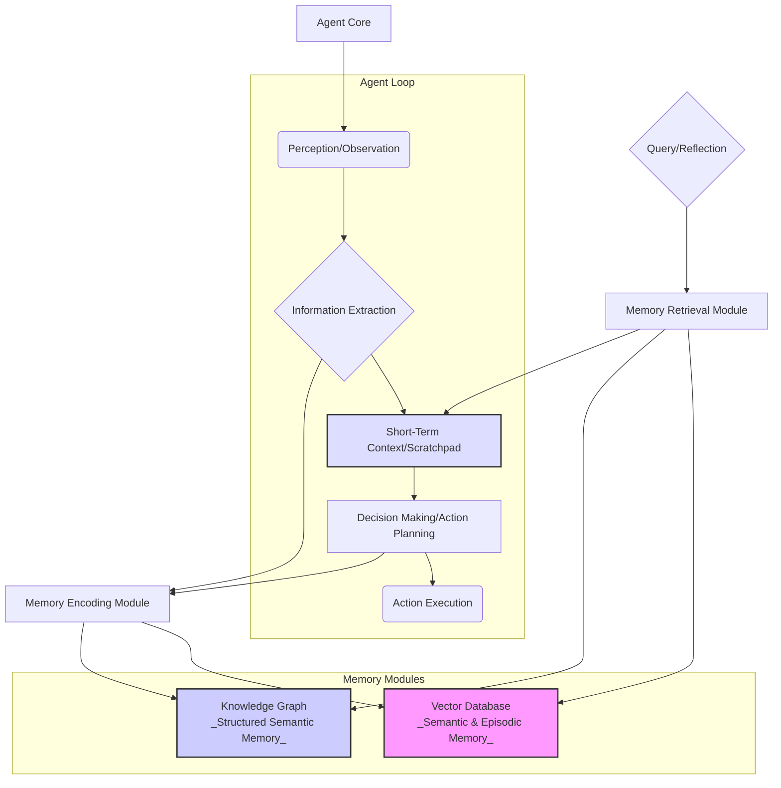

자율 에이전트(Autonomous Agents)가 복잡하고 장기적인 태스크를 성공적으로 수행하려면 과거의 경험과 지식을 활용하는 장기 기억(Long-Term Memory) 시스템이 필수적입니다. 단기 기억에 해당하는 LLM의 컨텍스트 윈도우(Context Window)는 한계가 명확하므로, 에이전트가 지속적으로 학습하고 진화하기 위해서는 외부 저장소를 통한 효율적인 기억 관리 메커니즘이 중요합니다.

## 장기 기억의 필요성 및 유형

에이전트가 복잡한 프로젝트를 진행하거나, 오랜 시간 동안 특정 도메인에 대한 전문성을 구축하려면 단발성 정보 처리로는 한계가 있습니다. 이를 해결하기 위해 인간의 기억 메커니즘을 모방한 다양한 장기 기억 시스템이 고안되고 있습니다. 주요 유형은 다음과 같습니다.

*   **Episodic Memory (일화 기억)**: 특정 이벤트, 경험, 상호작용의 시퀀스를 시간적, 맥락적으로 저장합니다. 에이전트의 과거 행동, 관찰 결과, 결정 과정 등을 기록하여 추론과 반성(Reflection)에 활용됩니다.
*   **Semantic Memory (의미 기억)**: 사실, 개념, 일반 지식 등 추상화된 정보를 저장합니다. 도메인 지식, 작업 절차, 도구 사용법 등을 구조화된 형태로 관리하여 에이전트의 전문성을 높입니다.
*   **Procedural Memory (절차 기억)**: 특정 스킬이나 행동을 수행하는 방법을 저장합니다. 반복적인 태스크 수행을 통해 최적화된 방법론이나 전략을 내재화하는 데 사용될 수 있습니다.

## 장기 기억 구현 아키텍처 패턴

2026년 현재, 자율 에이전트의 장기 기억 구현은 주로 Retrieval-Augmented Generation (RAG) 패턴과 벡터 데이터베이스(Vector Database), 그리고 지식 그래프(Knowledge Graph)의 조합을 통해 이루어집니다.

### 1. 벡터 데이터베이스 기반 RAG

에이전트가 새로운 정보를 접하거나 과거 기억이 필요한 시점에, 해당 정보를 임베딩(Embedding) 벡터로 변환하여 벡터 데이터베이스에 저장합니다. 이후 특정 질문이나 현재 상황에 맞춰 관련성이 높은 기억을 벡터 유사도 검색(Similarity Search)을 통해 검색하고, 이를 LLM의 컨텍스트에 주입하여 추론 능력을 강화합니다.

```python
from langchain_community.vectorstores import Chroma
from langchain_openai import OpenAIEmbeddings
from langchain.schema import Document

# 1. 초기화: 벡터 DB 및 임베딩 모델
embeddings = OpenAIEmbeddings()
vectorstore = Chroma(embedding_function=embeddings)

# 2. 기억 저장 (Episodic/Semantic)
# 에이전트가 수행한 작업 로그, 학습한 문서 등
memory_documents = [
    Document(page_content="사용자는 '프로젝트 A'의 최신 상태를 요청했다.", metadata={"type": "episodic", "timestamp": "2026-07-20T10:00:00"}),
    Document(page_content="'프로젝트 A'는 고성능 이미지 처리 라이브러리 개발 프로젝트이다.", metadata={"type": "semantic", "source": "wiki"})
]
vectorstore.add_documents(memory_documents)

# 3. 기억 검색 및 활용
def retrieve_and_augment(query: str, current_context: str):
    # 쿼리와 현재 컨텍스트를 기반으로 관련 기억 검색
    relevant_memories = vectorstore.similarity_search(query + " " + current_context, k=3)
    
    # 검색된 기억을 컨텍스트로 포맷팅
    memory_text = "\n\nRelevant Memories:\n" + "\n".join([m.page_content for m in relevant_memories])
    
    # LLM 프롬프트에 주입할 최종 컨텍스트 구성
    augmented_context = current_context + memory_text + "\n\n" + query
    return augmented_context

# 사용 예시
current_situation = "현재 '프로젝트 A'에 대한 보고서를 작성 중이다."
user_query = "'프로젝트 A'의 목표와 최근 진행 상황을 요약해줘."

augmented_prompt = retrieve_and_augment(user_query, current_situation)
print(augmented_prompt)
# LLM에 augmented_prompt 전달
```

### 2. 지식 그래프 통합 (Knowledge Graph Integration)

지식 그래프는 엔티티(Entity)와 그 관계(Relation)를 노드(Node)와 엣지(Edge)로 표현하여 지식을 구조화합니다. 에이전트가 새로운 정보를 학습하면, 이를 지식 그래프의 엔티티와 관계로 추출하여 업데이트합니다. 장기 기억 검색 시, 단순 벡터 유사도 검색을 넘어 다중 홉 추론(Multi-hop Reasoning)이나 관계 기반 검색을 통해 더 정밀하고 맥락적인 정보를 얻을 수 있습니다.



### 3. 반성(Reflection) 메커니즘

에이전트가 특정 태스크를 완료하거나 실패했을 때, 자신의 행동과 결과를 장기 기억에 저장된 정보와 비교하여 반성합니다. 이 과정에서 새로운 지식이나 더 나은 전략을 추출하여 의미 기억으로 업데이트하고, 향후 의사 결정에 활용할 수 있습니다. 이는 에이전트의 자율 학습 능력(Self-correction & Adaptive Learning)을 크게 향상시킵니다.

## 트레이드오프

### 1. 벡터 데이터베이스 vs. 지식 그래프
*   **벡터 데이터베이스**: 
    *   **언제 좋은가**: 비정형 텍스트 데이터의 저장 및 유사도 기반 검색에 효율적입니다. 빠른 구현과 유연한 확장이 가능하며, 대규모 데이터셋에 적합합니다. 
    *   **언제 나쁜가**: 복잡한 관계 추론이나 다중 홉 쿼리에는 한계가 있습니다. '왜' 특정 정보가 관련 있는지 설명하기 어렵습니다.
*   **지식 그래프**: 
    *   **언제 좋은가**: 엔티티 간의 복잡한 관계와 논리적 추론이 중요할 때 유리합니다. 높은 해석 가능성(Interpretability)과 정확한 사실 검색이 가능합니다. 
    *   **언제 나쁜가**: 초기 구축 및 유지보수 비용이 높고, 스키마 설계 및 데이터 추출 과정이 복잡합니다. 비정형 데이터의 자동 추출 및 통합이 어렵습니다.

### 2. 장기 기억의 크기 vs. 검색 지연 시간 & 비용
*   **큰 기억 공간**: 
    *   **언제 좋은가**: 에이전트의 지식 기반이 풍부해져 더 넓고 깊은 문제 해결이 가능합니다. 
    *   **언제 나쁜가**: 검색에 필요한 컴퓨팅 자원(GPU, 메모리)과 시간(Latency)이 증가하고, 이에 따른 비용이 상승합니다. 인덱싱 및 관리의 복잡도가 높아집니다.

### 3. 기억 업데이트 빈도 vs. 데이터 정합성 & 비용
*   **잦은 업데이트**: 
    *   **언제 좋은가**: 에이전트의 기억이 항상 최신 상태를 유지하여 실시간 변화에 빠르게 대응할 수 있습니다. 
    *   **언제 나쁜가**: 임베딩 생성 및 벡터 데이터베이스 업데이트에 높은 컴퓨팅 자원과 네트워크 비용이 발생하며, 데이터 일관성(Consistency) 관리가 복잡해집니다.

## 실전 체크리스트

자율 에이전트의 장기 기억 시스템을 프로젝트에 적용할 때 다음 사항을 검토합니다.

- [ ] **기억 유형 정의**: 에이전트의 목표와 태스크에 필요한 일화, 의미, 절차 기억의 구체적인 유형과 저장할 정보의 스키마를 명확히 정의했는가?
- [ ] **데이터 추출 전략**: 에이전트의 관찰 및 행동 로그에서 유의미한 정보를 추출하여 기억으로 인코딩하는 자동화된 파이프라인이 구축되었는가?
- [ ] **벡터 DB/지식 그래프 선택**: 프로젝트의 요구사항(비정형 데이터 처리, 관계 추론)과 자원 제약을 고려하여 적절한 벡터 데이터베이스 또는 지식 그래프 솔루션(예: Chroma, Pinecone, Neo4j)을 선택했는가?
- [ ] **검색 정확도 평가**: RAG 시스템의 검색 성능을 정량적으로 측정할 수 있는 지표(예: Precision, Recall, Context Relevancy)를 설정하고, 주기적으로 평가하여 개선하고 있는가?
- [ ] **반성 메커니즘 구현**: 에이전트가 과거의 성공/실패 경험을 분석하고, 이를 통해 새로운 학습(예: 프롬프트 최적화, 도구 사용 전략 개선)을 장기 기억에 반영하는 반성 루프를 설계했는가?
- [ ] **기억 캐싱 및 압축**: 자주 사용되는 기억이나 중요도가 낮은 기억을 효율적으로 캐싱하거나 압축하여 검색 지연 시간과 비용을 최적화하는 전략을 고려했는가?
- [ ] **보안 및 개인 정보 보호**: 장기 기억 시스템에 저장되는 데이터의 민감도를 고려하여 적절한 접근 제어, 암호화, 데이터 익명화 등의 보안 및 개인 정보 보호 조치를 적용했는가?