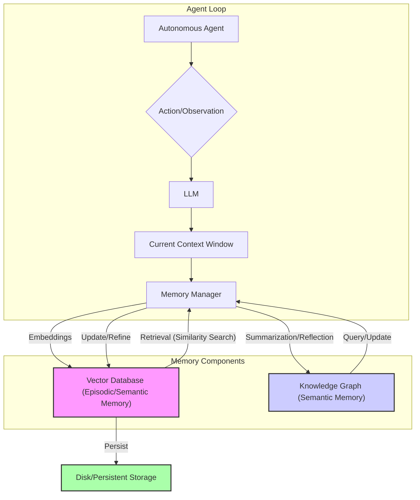

자율 에이전트가 장기간 복잡한 태스크를 수행하려면, 현재 컨텍스트 윈도우 한계를 넘어서는 장기적인 기억 및 학습 능력이 필수적입니다. 이 엔트리는 에이전트의 지속적인 학습과 맥락 유지를 위한 효과적인 장기 메모리 관리 전략을 제시합니다.

### 장기 메모리 유형
자율 에이전트의 장기 메모리는 세 가지 주요 유형으로 나뉩니다.

*   **Episodic Memory (경험 기억)**: 에이전트의 특정 이벤트, 대화, 결정 및 결과를 시퀀스 형태로 저장. 과거 경험 회상을 통해 추론 및 의사 결정 지원.
*   **Semantic Memory (의미 기억)**: 일반적인 사실, 개념, 규칙, 도메인 지식 포함. RAG(Retrieval Augmented Generation) 패턴과 결합하여 LLM의 지식 한계 보완.
*   **Procedural Memory (절차 기억)**: 특정 작업 수행 방법에 대한 지식, 즉 스킬이나 루틴을 저장. 에이전트의 툴 사용 능력과 연관.

### 구현 전략 및 2026년 트렌드
현대 자율 에이전트의 장기 메모리 관리는 RAG 아키텍처, 벡터 임베딩, 구조화된 지식 표현 방식을 적극 활용합니다.

1.  **벡터 데이터베이스 기반 RAG**: 에이전트 상호작용을 임베딩으로 변환하여 벡터 DB에 저장. 쿼리 임베딩으로 관련 기록을 검색, 프롬프트에 주입하여 LLM 맥락 확장.
2.  **계층적 메모리 (Hierarchical Memory)**: 원시 기록 외에 추상화된 요약/핵심 개념을 별도 계층에 저장. 검색 효율성 향상.
3.  **지식 그래프 (Knowledge Graph)**: 에이전트가 학습한 실체와 관계를 그래프 형태로 표현. 복잡한 사실 관계 저장 및 추론에 유리.
4.  **반성 및 재구성 (Reflection & Re-consolidation)**: 주기적으로 과거 경험을 되돌아보고 통찰을 생성하거나 기존 의미 기억 업데이트. 지속적인 학습 가능.

```python
import uuid
from typing import List, Dict, Any
from langchain_community.vectorstores import Chroma
from langchain_openai import OpenAIEmbeddings
from langchain_core.documents import Document

class AgentLongTermMemory:
    def __init__(self, collection_name: str = "agent_memory_2026"):
        self.embeddings = OpenAIEmbeddings()
        self.vector_store = Chroma(
            collection_name=collection_name,
            embedding_function=self.embeddings,
            persist_directory="./chroma_db"
        )
        self.vector_store.persist()

    def add_memory(self, content: str, metadata: Dict[str, Any] = None):
        if metadata is None:
            metadata = {}
        metadata["timestamp"] = uuid.uuid4().hex
        doc = Document(page_content=content, metadata=metadata)
        self.vector_store.add_documents([doc])
        self.vector_store.persist()

    def retrieve_memories(self, query: str, k: int = 5) -> List[Document]:
        retrieved_docs = self.vector_store.similarity_search(query, k=k)
        return retrieved_docs

    def reflect_and_summarize(self, recent_memories: List[Document], llm_agent_func) -> str:
        context = "\n".join([doc.page_content for doc in recent_memories])
        reflection = llm_agent_func(f"Reflect on these events and identify key learnings: {context}")
        return reflection

if __name__ == "__main__":
    memory_manager = AgentLongTermMemory()
    memory_manager.add_memory("상품 추천 요청. 고객 구매 이력 분석 후 3개 추천.", {"task": "product_recommendation"})
    memory_manager.add_memory("시스템 오류, 3번 재시도 후 완료.", {"task": "system_recovery"})
    memory_manager.add_memory("기능 A 피드백 수집. 긍정적이나 UI 개선 요청.", {"task": "feedback_collection"})

    query = "상품 추천시 고객 만족도 향상 방안"
    relevant_memories = memory_manager.retrieve_memories(query)

    def mock_llm_agent(prompt: str) -> str:
        if "Reflect on these events" in prompt:
            return "Reflection: User history analysis is key for recommendations; retries improve resilience."
        return "Generic response."

    reflection = memory_manager.reflect_and_summarize(relevant_memories, mock_llm_agent)
    memory_manager.add_memory(f"Reflective insight: {reflection}", {"type": "reflection"})
```



## 트레이드오프

*   **RAG 기반 벡터 데이터베이스**: 
    *   **언제 좋음**: 긴 대화나 복잡한 프로젝트에서 컨텍스트 윈도우 한계를 우회하여 방대한 정보 관리 시 효과적.
    *   **언제 나쁨**: 단순 태스크에서 벡터 검색 오버헤드 증가. 임베딩 품질 및 검색 정확도에 따른 결과 편차 발생.
*   **계층적 메모리 구조**: 
    *   **언제 좋음**: 대규모/장기간 실행 에이전트 시스템에서 메모리 검색 효율성 크게 향상.
    *   **언제 나쁨**: 메모리 관리 복잡도 증가, 계층 간 데이터 동기화 및 일관성 유지 노력 필요.
*   **지식 그래프 통합**: 
    *   **언제 좋음**: 복잡한 도메인 지식, 객체 간 관계, 추론이 중요한 시나리오에서 에이전트의 이해도와 추론 능력 향상 및 "설명 가능성" 증대.
    *   **언제 나쁨**: 지식 그래프 구축 및 유지보수 초기 노력과 전문 지식 요구. 비정형 텍스트 지식 추출 시 정보 손실 가능성.

## 실전 체크리스트

자율 에이전트의 장기 메모리 관리 전략 적용 시 다음 항목들을 검증합니다.

*   [ ] **메모리 유형 식별**: 태스크 요구사항에 기반하여 필요한 장기 메모리 유형(Episodic, Semantic, Procedural)을 명확히 식별했는가?
*   [ ] **RAG 파이프라인 설계**: 벡터 임베딩 모델, 벡터 데이터베이스, 검색 전략이 에이전트 도메인과 쿼리 패턴에 최적화되어 있는가?
*   [ ] **기억 유효성 및 정합성**: 저장된 기억의 유효성 및 메모리 컴포넌트 간 정보 정합성이 보장되는가?
*   [ ] **검색 정확도 및 재현율**: 실제 시나리오에서 장기 메모리 검색이 관련성 높은 정보를 정확하고 포괄적으로 제공하는지 평가 지표로 검증했는가?
*   [ ] **메모리 업데이트 전략**: 에이전트의 새로운 경험이나 외부 데이터에 따라 장기 메모리를 업데이트하고 재구성할 전략을 수립 및 구현했는가?
*   [ ] **성찰 및 요약 메커니즘**: 에이전트가 주기적으로 기억을 성찰하고 요약하여 새로운 지식을 생성하거나 기존 지식을 개선하는 메커니즘이 포함되어 있는가?
*   [ ] **성능 및 비용 최적화**: 장기 메모리 시스템의 검색 지연 시간, 처리량, 스토리지 비용이 프로젝트 요구사항과 예산 범위 내에 있는지 주기적으로 모니터링하는가?