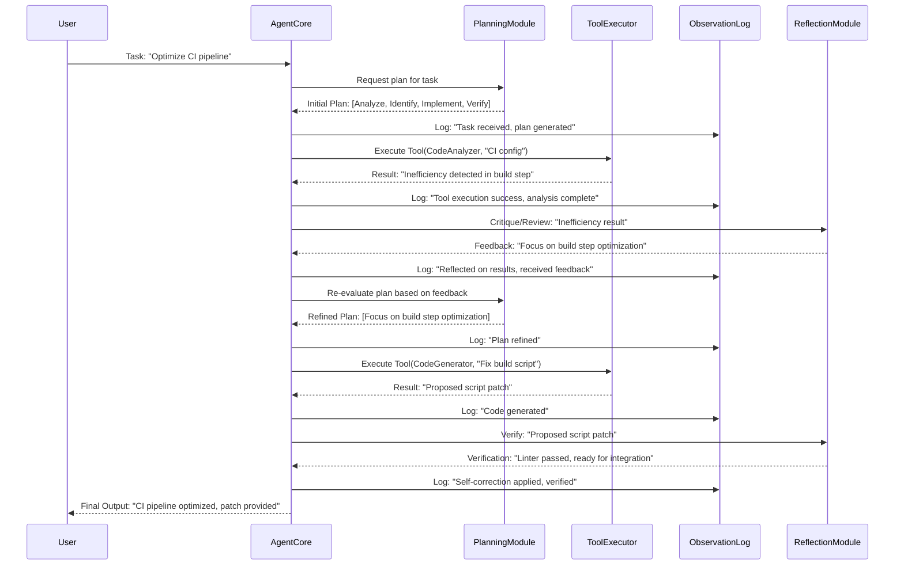

자율 에이전트(Autonomous Agents)는 복잡한 목표를 달성하기 위해 다단계 추론, 도구 사용, 환경 상호작용 및 자율적 결정을 수행합니다. 그러나 이러한 복잡성으로 인해 에이전트의 동작이 불투명(opaque)해지고 비결정론적(non-deterministic)인 특성을 보여 디버깅과 최적화가 매우 어렵습니다. 에이전트의 신뢰성과 성능을 확보하려면 이러한 복잡한 추론 과정을 이해하고 제어하는 실질적인 기법이 필수적입니다. 이 글에서는 자율 에이전트의 추론 과정 디버깅 및 최적화 방법을 깊이 있게 다룹니다.

## 자율 에이전트 추론의 복잡성

자율 에이전트는 계획(Planning), 실행(Execution), 관찰(Observation), 반성(Reflection)의 순환(loop)을 통해 작동합니다. 각 단계에서 LLM은 비선형적인 결정을 내리며, 이는 예상치 못한 결과나 오류로 이어질 수 있습니다. 특히 다음과 같은 특성들이 디버깅을 어렵게 만듭니다.

*   **불투명성 (Opacity)**: LLM의 내부 작동 방식은 블랙박스에 가깝습니다. 특정 결정이 왜 내려졌는지 명확히 파악하기 어렵습니다.
*   **비결정론성 (Non-Determinism)**: 동일한 입력에도 불구하고 LLM은 매번 다른 출력을 생성할 수 있어 재현 가능한(reproducible) 디버깅이 어렵습니다.
*   **창발적 행동 (Emergent Behavior)**: 단순한 규칙들의 조합이 예상치 못한 복잡한 행동으로 이어질 수 있으며, 이는 계획 단계에서 예측하기 어렵습니다.
*   **컨텍스트 의존성 (Context Dependency)**: 에이전트의 행동은 이전 대화, 메모리, 도구 사용 기록 등 광범위한 컨텍스트에 크게 의존합니다.

## 핵심 디버깅 방법론

### 1. 관측 가능성(Observability) 및 트레이싱(Tracing)

에이전트의 내부 상태와 추론 과정을 실시간으로 모니터링하고 기록하는 것은 디버깅의 첫걸음입니다. 모든 단계, LLM 호출, 도구 사용 및 그 결과를 상세하게 기록해야 합니다.

*   **구조화된 로깅 (Structured Logging)**: 에이전트의 각 추론 단계(예: 계획 생성, 도구 호출, 결과 분석, 자기 수정)마다 JSON과 같은 구조화된 형식으로 로그를 기록합니다. 여기에는 프롬프트, LLM 응답, 도구 입력, 도구 출력, 시간 소인(timestamp) 등이 포함되어야 합니다.
*   **실행 트레이싱 (Execution Tracing)**: 에이전트의 전체 실행 경로를 그래프 형태로 시각화하여, 어떤 결정이 어떤 결과를 낳았는지, 특정 에러가 어느 단계에서 발생했는지 파악합니다. 이를 위해 OpenTelemetry와 같은 표준을 활용하거나, LangChain, CrewAI와 같은 프레임워크가 제공하는 추적 기능을 적극 활용합니다.
*   **중간 상태 스냅샷 (Intermediate State Snapshots)**: 주요 결정 지점마다 에이전트의 전체 컨텍스트와 메모리 상태를 저장하여, 문제가 발생했을 때 특정 시점으로 돌아가 재현할 수 있도록 합니다.

다음은 Python에서 LangChain을 활용하여 에이전트의 관측 가능성을 높이는 간단한 코드 예제입니다.

```python
# pip install langchain langchain-openai tavily-python
import os
from langchain_openai import ChatOpenAI
from langchain.agents import AgentExecutor, create_openai_tools_agent
from langchain import hub
from langchain_core.tools import tool

# 환경 변수 설정 (실제 사용 시 보안에 유의)
# os.environ["OPENAI_API_KEY"] = "YOUR_OPENAI_API_KEY"
# os.environ["TAVILY_API_KEY"] = "YOUR_TAVILY_API_KEY"

# 관측 가능성을 위한 커스텀 로거
def log_agent_step(step_name: str, payload: dict):
    print(f"[AGENT STEP: {step_name}] {payload}")

@tool
def search_web(query: str) -> str:
    """Searches the web for the given query."""
    # 실제 웹 검색 API 호출 대신 더미 응답 사용
    log_agent_step("search_web_tool_call", {"query": query})
    if "current weather" in query:
        return "Current weather in Seoul: 25C and sunny."
    return f"Search result for '{query}': Example relevant information."

@tool
def analyze_data(data: str) -> str:
    """Analyzes the provided data to extract insights."""
    log_agent_step("analyze_data_tool_call", {"data_preview": data[:50]})
    if "inefficiency detected" in data:
        return "Key inefficiency: High latency in data fetching."
    return "No specific insights found."

# LLM 및 툴 설정
llm = ChatOpenAI(model="gpt-4o-mini", temperature=0.7)
tools = [search_web, analyze_data]
prompt = hub.pull("hwchase17/openai-tools-agent") # 에이전트 프롬프트 템플릿

# 에이전트 생성
agent = create_openai_tools_agent(llm, tools, prompt)
agent_executor = AgentExecutor(agent=agent, tools=tools, verbose=True, handle_parsing_errors=True)

# 에이전트 실행 및 디버깅 메시지 추가
def run_agent_with_debugging(task: str):
    log_agent_step("task_start", {"task": task})
    try:
        result = agent_executor.invoke({"input": task})
        log_agent_step("task_end", {"result": result["output"]})
        return result["output"]
    except Exception as e:
        log_agent_step("task_error", {"error": str(e)})
        print(f"An error occurred: {e}")
        return "Error during agent execution."

print("--- Running Agent for Weather Query ---")
run_agent_with_debugging("What's the current weather in Seoul?")

print("\n--- Running Agent for Data Analysis ---")
run_agent_with_debugging("Analyze the provided report: Inefficiency detected in data fetching module, leading to slow processing.")

print("\n--- Running Agent for Unknown Task ---")
run_agent_with_debugging("Tell me a joke.")
```

위 코드에서 `log_agent_step` 함수는 에이전트의 주요 동작마다 커스텀 로그를 기록하여 흐름을 추적할 수 있게 합니다. `verbose=True`는 LangChain 자체의 상세 로그를 활성화하여 LLM의 호출과 응답, 중간 단계 등을 확인할 수 있게 해줍니다.

### 2. 설명 가능성(Explainability, XAI) 기법

에이전트가 왜 특정 결정을 내렸는지 이해하는 것은 디버깅에 필수적입니다.

*   **단계별 추론 (Step-by-Step Reasoning)**: Chain-of-Thought (CoT) 또는 Tree-of-Thought (ToT) 프롬프팅 기법을 사용하여 LLM이 생각을 펼치고 중간 결론을 명시적으로 출력하도록 유도합니다. 이를 통해 추론 과정의 오류를 식별할 수 있습니다.
*   **자기 반성 및 비판 (Self-Reflection and Critique)**: 에이전트가 자신의 행동이나 생성된 결과를 스스로 평가하고 개선점을 찾는 프롬프트 패턴을 도입합니다. 이는 특히 복잡하거나 모호한 작업에서 효과적입니다.



### 3. 구조화된 출력 및 검증 (Structured Output & Validation)

LLM이 자유 형식의 텍스트 대신 JSON 스키마(JSON Schema)와 같은 특정 구조에 따라 출력을 생성하도록 강제합니다. 이는 파싱 오류를 줄이고 후속 도구 사용이나 프로세스에 안정적인 입력을 제공합니다.

*   **스키마 기반 출력 (Schema-based Output)**: Pydantic 모델이나 JSON 스키마를 사용하여 에이전트의 응답 형식을 정의하고, LLM에 해당 스키마를 따르도록 지시합니다. 대다수의 최신 LLM은 JSON 모드를 지원합니다.
*   **출력 유효성 검사 (Output Validation)**: 에이전트가 생성한 출력이 정의된 스키마에 부합하는지 자동으로 검증합니다. 실패 시 재시도(retry) 또는 자기 수정 과정을 트리거합니다.

### 4. 시뮬레이션 및 재현 가능성 (Simulation & Reproducibility)

*   **격리된 시뮬레이션 환경**: 실제 프로덕션 환경에 영향을 주지 않고 에이전트의 동작을 테스트하고 디버깅할 수 있는 격리된 시뮬레이션 환경을 구축합니다. 이는 특히 도구 사용과 외부 API 상호작용에 중요합니다.
*   **Seed 값 고정 및 캐싱 (Seed Fixing & Caching)**: LLM의 비결정론성을 완화하기 위해 가능하다면 `seed` 값을 고정하고, 동일한 프롬프트에 대한 LLM 응답을 캐싱하여 재현 가능한 테스트 환경을 조성합니다.

## 에이전트 추론 과정 최적화 전략

### 1. 프롬프트 엔지니어링 (Prompt Engineering)

*   **명확하고 간결한 지시 (Clear and Concise Instructions)**: 모호함을 제거하고, 에이전트의 역할, 목표, 제약 조건을 명확하게 정의합니다.
*   **Few-shot Learning**: 관련성 높은 예시를 제공하여 에이전트가 올바른 추론 패턴을 학습하도록 돕습니다.
*   **Chain-of-Thought (CoT) & Tree-of-Thought (ToT)**: 복잡한 문제 해결을 위해 LLM이 중간 단계를 명시적으로 출력하도록 유도합니다. 이는 에이전트의 추론 깊이를 향상시킵니다.
*   **페르소나 지정 (Persona Assignment)**: 에이전트에 특정 역할(예: '숙련된 소프트웨어 엔지니어')을 부여하여 특정 도메인에 맞는 전문적인 추론을 유도합니다.

### 2. 도구 사용 최적화 (Tool Use Optimization)

*   **강력한 도구 정의 (Robust Tool Definitions)**: 각 도구의 기능, 입력, 출력, 사용 시나리오를 명확하게 정의하고, 에러 처리 로직을 포함합니다.
*   **동적 도구 선택 (Dynamic Tool Selection)**: 에이전트가 현재 컨텍스트와 목표에 가장 적합한 도구를 동적으로 선택할 수 있도록 유도합니다. 불필요한 도구 호출을 줄여 비용과 시간을 절약합니다.
*   **도구 사용 에러 복구 (Tool Error Recovery)**: 도구 호출 실패 시 에이전트가 오류 메시지를 분석하고, 재시도하거나 대체 도구를 사용하거나, 인간의 개입을 요청하는 등의 복구 전략을 설계합니다.

### 3. 메모리 관리 (Memory Management)

*   **컨텍스트 윈도우 최적화 (Context Window Optimization)**: LLM의 컨텍스트 윈도우 제한을 고려하여, 관련성 높은 정보만 효율적으로 관리합니다. 요약, 압축, 임베딩 기반 검색 등의 기법을 활용합니다.
*   **장기 메모리 통합 (Long-term Memory Integration)**: 에이전트가 과거의 경험과 학습 내용을 저장하고 필요할 때 검색하여 추론에 활용하도록 합니다 (예: 벡터 데이터베이스, 지식 그래프).

### 4. 피드백 루프 및 자기 수정 (Feedback Loops & Self-Correction)

*   **인간 개입 루프 (Human-in-the-Loop)**: 에이전트의 중요 결정이나 실패 시 인간이 개입하여 피드백을 제공하고, 에이전트가 이를 학습하여 개선하도록 합니다.
*   **자동화된 비판 및 개선 (Automated Critique and Improvement)**: 에이전트가 특정 작업의 결과나 계획을 자체적으로 평가하고, 미리 정의된 평가 기준에 따라 개선점을 찾아 다음 행동에 반영합니다.

### 5. 다중 에이전트 협업 (Multi-Agent Collaboration)

*   **작업 분해 및 전문화 (Task Decomposition & Specialization)**: 복잡한 작업을 여러 개의 하위 작업으로 분해하고, 각 하위 작업을 처리하는 데 특화된 에이전트들을 협업시킵니다. 이는 각 에이전트의 추론 복잡도를 낮추고 효율성을 높입니다.
*   **조정 메커니즘 (Coordination Mechanisms)**: 다중 에이전트 간의 효율적인 정보 교환, 작업 분배, 갈등 해결을 위한 프로토콜과 메커니즘을 설계합니다.

## 트레이드오프

### 1. 관측 가능성(Observability) vs. 성능 및 비용
*   **언제 좋은가**: 에이전트의 복잡한 추론 과정을 심층적으로 이해하고 디버깅해야 할 때, 초기 개발 단계, 예측 불가능한 버그를 진단할 때 매우 유용합니다. 상세한 로그와 트레이싱은 문제의 근본 원인을 파악하는 데 필수적입니다.
*   **언제 나쁜가**: 프로덕션 환경에서 매우 높은 처리량(throughput)과 낮은 지연 시간(latency)이 요구될 때, 혹은 비용에 민감한 상황에서는 과도한 로깅 및 트레이싱이 성능 저하와 클라우드 비용 증가로 이어질 수 있습니다. 로그 저장 및 분석 인프라 비용도 고려해야 합니다.

### 2. 설명 가능성(Explainability) vs. 추론 속도
*   **언제 좋은가**: 에이전트의 의사결정 과정을 투명하게 공개하고, 윤리적/법적 책임이 중요한 애플리케이션(예: 의료, 금융)에서 에이전트의 결정을 검증해야 할 때 좋습니다. CoT, ToT와 같은 기법은 더 정확하고 신뢰성 있는 결과를 도출하는 데 도움이 됩니다.
*   **언제 나쁜가**: 실시간 응답이 필수적이거나, 빠른 탐색 및 추론이 중요한 상황에서는 LLM이 중간 단계를 길게 설명하는 것이 불필요한 지연을 유발할 수 있습니다. 단순하고 빠르게 결정을 내려야 하는 작업에는 오버헤드가 될 수 있습니다.

### 3. 구조화된 출력(Structured Output) vs. 유연성
*   **언제 좋은가**: 에이전트의 출력이 다른 시스템(데이터베이스, API 등)의 입력으로 사용되어야 하는 경우, 파싱 오류를 최소화하고 안정적인 통합을 보장할 때 매우 효과적입니다. 일관된 데이터 처리가 중요할 때 강점이 있습니다.
*   **언제 나쁜가**: 에이전트가 창의적이거나 자유로운 형식의 텍스트를 생성해야 하는 작업(예: 글쓰기, 아이디어 브레인스토밍)에서는 과도한 구조화가 에이전트의 표현력을 제한하고 자연스러움을 해칠 수 있습니다. 예상치 못한 새로운 유형의 출력이 필요한 상황에는 적합하지 않습니다.

### 4. 강력한 최적화(Aggressive Optimization) vs. 일반화(Generalizability)
*   **언제 좋은가**: 특정 도메인이나 작업에 대해 에이전트의 성능을 극대화하고 싶을 때, 파인튜닝, 복잡한 프롬프트 체인, 정교한 도구 사용 등을 통해 높은 정확도와 효율성을 달성할 수 있습니다.
*   **언제 나쁜가**: 특정 작업에 너무 강하게 최적화된 에이전트는 새로운 작업이나 예상치 못한 상황에서 성능이 저하될 수 있습니다. 과도한 최적화는 에이전트의 일반화 능력과 적응성을 해칠 수 있습니다. 광범위한 문제 해결 능력이 더 중요할 때는 절제된 최적화가 필요합니다.

## 실전 체크리스트

자율 에이전트의 복잡한 추론 과정을 디버깅하고 최적화할 때 다음 체크리스트를 활용하세요.

- [x] **모든 LLM 호출 및 도구 사용에 대한 구조화된 로깅 시스템을 구축했는가?** (프롬프트, 응답, 입력, 출력, 시간 소인 포함)
- [x] **에이전트의 전체 실행 경로를 시각적으로 추적할 수 있는 트레이싱 도구(예: LangSmith, OpenTelemetry)를 통합했는가?**
- [x] **핵심 결정 지점마다 에이전트의 중간 컨텍스트와 메모리 상태를 저장하는 스냅샷 기능을 구현했는가?**
- [x] **에이전트의 주요 출력에 대해 JSON 스키마 기반의 유효성 검사 로직을 적용하고, 실패 시 자동 재시도 또는 자기 수정 메커니즘을 설계했는가?**
- [x] **주요 에이전트 플로우에 대해 재현 가능한 시뮬레이션 환경 및 테스트 케이스를 충분히 확보했는가?**
- [x] **LLM의 비결정론성을 완화하기 위해 `seed` 값 고정, 캐싱 전략 등을 고려했는가?**
- [x] **에이전트의 자가 평가 및 개선을 위한 자기 반성(Self-Reflection) 프롬프트 패턴을 설계하고 적용했는가?**
- [x] **성능 저하 및 비용 증가를 모니터링하기 위한 지표(metrics)를 설정하고 대시보드를 구축했는가?**