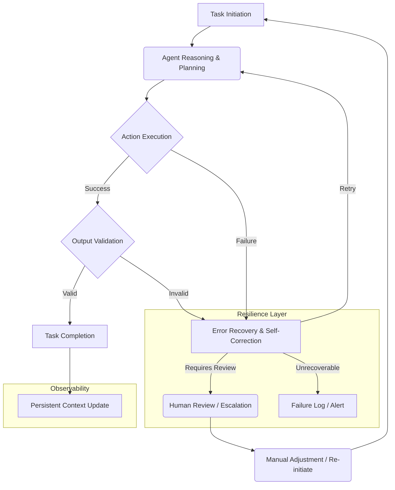

자율 에이전트(Autonomous Agents)는 복잡한 태스크를 스스로 계획하고 실행하며, 외부 환경에 반응하여 적응하는 차세대 시스템의 핵심 요소입니다. 2026년 현재, 에이전트 시스템의 실제 적용 및 확산에 있어 가장 중요한 제약 중 하나는 바로 신뢰성(Reliability)과 안정성(Stability) 확보입니다. 비결정적인(non-deterministic) 행동과 예상치 못한 오류에 대한 강력한 대응책 없이는 프로덕션 환경에서의 성공적인 운영이 불가능합니다.

## 에이전트 신뢰성 및 안정성 확보의 중요성
에이전트 시스템은 예측 불가능한 외부 API 응답, 불완전한 정보, 추론 오류, 도구 사용 실패 등 다양한 문제에 직면할 수 있습니다. 이러한 문제들이 에이전트의 오작동, 무한 루프, 비용 폭증, 잘못된 의사결정으로 이어지지 않도록 시스템 수준의 견고함이 필수적입니다. 특히 장기 실행(long-running) 태스크나 미션 크리티컬한(mission-critical) 영역에서는 에이전트의 안정적인 동작이 곧 서비스의 연속성과 직결됩니다.

## 핵심 확보 패턴

### 1. 관측 가능성(Observability) 및 모니터링
에이전트의 내부 상태, 의사결정 과정, 도구 호출, 외부 상호작용 등을 투명하게 관찰할 수 있도록 시스템을 설계하는 것이 중요합니다. 로그(logs), 메트릭(metrics), 트레이스(traces)는 에이전트의 동작을 이해하고 문제 발생 시 진단하는 데 필수적인 요소입니다.

*   **구조화된 로깅**: 에이전트의 각 단계(계획, 실행, 평가, 수정)에서 중요한 정보를 구조화된 형식(JSON 등)으로 로깅하여 분석을 용이하게 합니다.
*   **커스텀 메트릭**: 도구 호출 성공률, 재시도 횟수, 태스크 완료율, 비용 등 에이전트의 핵심 성능 지표를 모니터링합니다.
*   **분산 트레이싱**: 에이전트의 복잡한 실행 흐름을 엔드-투-엔드(end-to-end)로 추적하여 병목 현상이나 오류 지점을 식별합니다.

### 2. 견고한 도구 사용(Robust Tool Use) 및 오류 복구
에이전트는 외부 도구를 사용하여 실제 세계와 상호작용합니다. 도구 호출은 네트워크 지연, API 오류, 잘못된 파라미터 등으로 실패할 수 있습니다. 이에 대한 체계적인 오류 처리 전략이 필요합니다.

*   **재시도 메커니즘(Retry Mechanisms)**: 일시적인 오류에 대비하여 지수 백오프(exponential backoff)를 포함한 재시도 로직을 구현합니다.
*   **폴백(Fallback) 전략**: 특정 도구가 실패했을 때 대체 도구를 사용하거나, 에이전트가 다른 전략으로 전환하도록 유도합니다.
*   **서킷 브레이커(Circuit Breaker)**: 반복적으로 실패하는 도구 호출을 일시적으로 중단하여 시스템 부하를 줄이고 장애 전파를 방지합니다.
*   **입력/출력 유효성 검사(Input/Output Validation)**: 도구에 전달되는 인자와 도구에서 반환되는 결과에 대한 엄격한 유효성 검사를 수행하여 예상치 못한 동작을 방지합니다.

### 3. 자율적 자기 수정(Self-Correction) 및 적응형 피드백 루프
에이전트가 자신의 오류를 인식하고 스스로 수정할 수 있는 능력을 갖추는 것이 안정성 향상에 중요합니다. 이는 메타인지(metacognition)적 접근 방식을 포함합니다.

*   **계획 재수립(Re-planning)**: 현재 계획이 실패하거나 목표 달성에 비효율적이라고 판단될 경우, 에이전트가 새로운 계획을 수립하도록 합니다.
*   **자체 회고(Self-Reflection)**: 과거 실행 이력과 오류 패턴을 분석하여 향후 의사결정 프로세스를 개선합니다. 이는 장기적인 안정성 향상에 기여합니다.
*   **평가 및 강화 학습**: 에이전트의 행동 결과에 대한 피드백을 통해 보상 또는 페널티를 부여하고, 이를 통해 에이전트의 정책을 점진적으로 개선합니다.

### 4. 휴먼-인더-루프(Human-in-the-Loop, HITL) 패턴
완전한 자율성이 항상 최선은 아닙니다. 특히 높은 비용이 수반되거나 안전에 민감한 태스크에서는 인간의 개입이 필수적입니다. 에이전트 시스템은 인간이 언제, 어떻게 개입할 수 있는지 명확한 인터페이스를 제공해야 합니다.

*   **예외 상황 에스컬레이션**: 에이전트가 스스로 해결할 수 없는 복잡하거나 임계값이 높은 오류 발생 시 인간 운영자에게 알림을 보내고 승인을 요청합니다.
*   **검증 및 조정**: 에이전트의 최종 결정이나 중요 단계에서 인간이 검토하고 필요한 경우 수정할 수 있는 워크플로를 포함합니다.
*   **학습 데이터 주입**: 인간의 피드백을 에이전트의 지식 기반이나 학습 데이터에 통합하여 에이전트의 성능과 안전성을 지속적으로 향상시킵니다.

## 에이전트 실행 흐름의 견고함

다음 Mermaid 다이어그램은 자율 에이전트의 신뢰성 및 안정성을 위한 핵심 패턴들을 통합한 일반적인 실행 흐름을 보여줍니다.



## 코드 예제: 견고한 에이전트 스텝 구현

Python의 `tenacity` 라이브러리와 사용자 정의 유효성 검사를 통해 재시도 가능한 에이전트 스텝을 구현하는 예시입니다.

```python
import logging
import random
from tenacity import retry, wait_fixed, stop_after_attempt, retry_if_exception_type, wait_random

logging.basicConfig(level=logging.INFO, format='%(asctime)s - %(levelname)s - %(message)s')

class AgentExecutionError(Exception):
    """Custom exception for agent execution failures."""
    pass

class ToolExecutionError(AgentExecutionError):
    """Custom exception for tool execution failures."""
    pass

def simulate_tool_call(data: str, fail_rate: float = 0.4) -> str:
    """Simulates an external tool call with a certain failure rate."""
    if random.random() < fail_rate:
        logging.warning(f"Simulated tool call failure for data: {data}")
        raise ToolExecutionError(f"Simulated tool failure for {data}")
    logging.info(f"Simulated tool call successful for data: {data}")
    return f"Processed: {data}"

def validate_output(output: str) -> bool:
    """Simulates output validation."""
    if "error" in output.lower() or not output.startswith("Processed:"):
        logging.warning(f"Output validation failed for: {output}")
        return False
    logging.info(f"Output validation successful for: {output}")
    return True

@retry(
    wait=wait_random(min=1, max=3), # 1~3초 랜덤 대기
    stop=stop_after_attempt(3),    # 최대 3번 재시도
    retry=retry_if_exception_type(ToolExecutionError), # ToolExecutionError 발생 시 재시도
    reraise=True # 최대 재시도 후에도 실패하면 예외 다시 발생
)
def execute_agent_step_with_retry(task_data: str) -> str:
    """Executes a single agent step with built-in retry logic and validation."""
    logging.info(f"Executing agent step for '{task_data}'")
    try:
        raw_output = simulate_tool_call(task_data)
        if not validate_output(raw_output):
            raise AgentExecutionError(f"Validation failed for output: {raw_output}")
        return raw_output
    except ToolExecutionError as e:
        logging.error(f"Tool execution failed for '{task_data}': {e}")
        raise # tenacity가 예외를 catch하고 재시도
    except AgentExecutionError as e:
        logging.error(f"Agent step failed due to validation for '{task_data}': {e}")
        raise

# 사용 예시:
# try:
#     result = execute_agent_step_with_retry("important_data_payload")
#     logging.info(f"Final result: {result}")
# except AgentExecutionError as e:
#     logging.critical(f"Task failed after all retries: {e}")
#     # 여기서 Human-in-the-Loop 개입 로직 추가
```

이 예제는 `simulate_tool_call` 함수를 통해 외부 도구 호출의 실패를 시뮬레이션하고, `tenacity` 데코레이터를 사용하여 자동 재시도 로직을 적용합니다. `validate_output` 함수는 도구의 결과를 검증하며, 유효성 검사 실패 시 `AgentExecutionError`를 발생시켜 에이전트가 이 상황을 처리하도록 유도합니다.

## 트레이드오프

*   **복잡성 증가 vs. 운영 안정성**: 신뢰성 패턴(재시도, 폴백, HITL)을 추가할수록 시스템의 설계 및 구현 복잡성이 증가합니다. 초기 개발 속도는 느려질 수 있으나, 프로덕션 환경에서 예상치 못한 장애로 인한 비용과 다운타임을 현저히 줄여 장기적인 운영 안정성을 확보할 수 있습니다. 미션 크리티컬한 시스템에서 효과적입니다.
*   **오버헤드 vs. 견고성**: 엄격한 모니터링, 상세 로깅, 정교한 유효성 검사는 컴퓨팅 자원 및 스토리지 오버헤드를 발생시킵니다. 비용 효율성이 중요한 초기 단계 POC(Proof of Concept)나 간단한 에이전트에는 과할 수 있지만, 장기적으로 시스템의 불확실성을 제거하고 견고성을 보장하는 데 필수적입니다. 데이터 무결성이 중요한 경우에 특히 유리합니다.
*   **자동화 수준 vs. 인간 개입**: 완전 자동화된 에이전트는 운영 효율성을 극대화하지만, 예측 불가능한 상황에서 심각한 오류를 야기할 수 있습니다. 반면, 인간 개입 지점(HITL)이 많으면 안전성은 높아지나, 응답 시간이 길어지거나 인간 운영자의 피로도가 증가할 수 있습니다. 비즈니스 중요도와 오류 발생 시의 파급 효과를 고려하여 적절한 균형점을 찾아야 합니다. 초기에는 HITL을 적극 활용하고 점진적으로 자동화하는 전략이 좋습니다.
*   **즉각적인 복구 vs. 근본 원인 분석**: 재시도 및 자동 복구 메커니즘은 단기적인 서비스 중단을 방지하지만, 근본적인 문제(예: 외부 API 변경)를 가릴 수 있습니다. 복구 이후에도 상세한 로깅과 모니터링을 통해 문제가 재발하는지 확인하고, 필요 시 근본 원인을 분석하여 시스템을 개선하는 과정이 수반되어야 합니다. 자동 복구에만 의존하기 < 3 않습니다.

## 실전 체크리스트

에이전트 시스템에 신뢰성과 안정성 패턴을 적용할 때 다음 항목들을 검증합니다.

- [ ] 에이전트의 모든 주요 실행 단계(계획, 도구 호출, 결과 평가, 자기 수정)에 대한 구조화된 로깅이 구현되어 있는가?
- [ ] 외부 도구 호출 실패 시 재시도(Retry) 로직이 지수 백오프와 함께 적용되며, 최대 재시도 횟수 초과 시 적절한 폴백(Fallback) 또는 에스컬레이션(Escalation)이 이루어지는가?
- [ ] 에이전트의 출력(Output)에 대한 데이터 스키마(Data Schema) 유효성 검사 및 내용 기반 유효성 검사(Semantic Validation)가 강력하게 적용되는가?
- [ ] 에이전트가 무한 루프에 빠지거나 과도한 리소스를 사용하는 것을 방지하기 위한 타임아웃(Timeout) 및 비용 상한(Cost Cap) 메커니즘이 설정되어 있는가?
- [ ] 에이전트가 스스로 해결할 수 없는 중대한 오류 발생 시, 인간 운영자에게 즉시 알림을 보내고 문제 해결에 필요한 충분한 컨텍스트를 제공하는 휴먼-인더-루프(HITL) 프로세스가 정의되어 있는가?
- [ ] 에이전트의 핵심 성능 지표(KPIs: 성공률, Latency, 비용 등)를 실시간으로 모니터링하고, 이상 징후 발생 시 자동 경보(Alert)가 트리거되는 시스템이 구축되어 있는가?
- [ ] 에이전트의 과거 실행 기록과 실패 패턴을 주기적으로 분석하여, 자기 회고(Self-Reflection)를 통한 시스템 개선이 이루어지고 있는가?