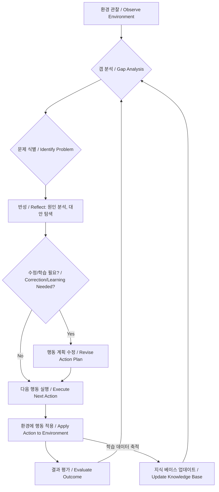

자율 에이전트가 실제 환경에서 신뢰성 높은 성능을 유지하고 지속적으로 적응하며 발전하기 위해서는 자기 수정(Self-Correction) 및 학습 루프(Learning Loop)의 구현이 필수적입니다. 이 아티클에서는 핵심 패턴들을 심층적으로 다루고, 특히 갭 분석(Gap Analysis)이 에이전트의 성능과 적응력을 높이는 데 어떻게 활용되는지 탐구합니다. 2026년 현재, LLM 기반 에이전트의 개발은 단순히 초기 목표 달성을 넘어, 예상치 못한 상황에 유연하게 대처하고 스스로 개선하는 능력에 달려 있습니다.

## 핵심 개념: 자기 수정 및 학습 루프

자율 에이전트의 자기 수정 및 학습 루프는 에이전트가 환경과의 상호작용을 통해 얻은 경험을 바탕으로 자신의 행동 전략, 지식, 내부 모델을 스스로 조정하고 개선해나가는 메커니즘입니다.

1.  **자기 수정 (Self-Correction)**: 에이전트가 자신의 현재 행동이나 계획이 목표에서 벗어나거나 비효율적임을 인지했을 때, 즉시 오류를 수정하고 더 나은 방향으로 전환하는 능력입니다. 단기적인 성능 안정화에 기여합니다.
2.  **학습 루프 (Learning Loop)**: 장기적인 관점에서 에이전트가 과거의 성공과 실패 경험으로부터 교훈을 얻어, 향후 의사결정 및 행동 전략을 지속적으로 최적화하는 과정입니다. 에이전트의 진화 및 적응력 향상에 필수적입니다.

## 갭 분석: 적응의 기반

갭 분석은 에이전트가 **"현재 상태"와 "목표 또는 기대되는 이상적인 상태" 사이의 차이(Gap)를 식별하는 과정**입니다. 이 차이는 에이전트의 성능 저하, 잘못된 예측, 비효율적인 자원 사용 등 다양한 형태로 나타날 수 있으며, 자기 수정과 학습 루프가 발동되는 주요 트리거 역할을 합니다.

*   **성능 갭 (Performance Gap)**: 실제 결과가 예상 KPI에 미치지 못할 때.
*   **지식 갭 (Knowledge Gap)**: 특정 상황 처리에 필요한 정보나 지식이 부족할 때.
*   **행동 갭 (Action Gap)**: 실행 계획이나 도구 사용이 환경에 최적이 아닐 때.

## 자기 수정 및 학습 구현 패턴

### 1. Observe-Reflect-Act (ORA) 패턴
에이전트가 환경을 '관찰(Observe)'하고, 데이터를 기반으로 '반성(Reflect)'하여 현재 상태와 목표의 갭을 분석하며, 이 반성 결과를 바탕으로 '행동(Act)'을 계획하고 실행합니다.



### 2. 메타-프롬프트 기반 자기 수정 (Meta-Prompt-driven Self-Correction)
LLM 기반 에이전트에서 널리 사용됩니다. 초기 작업 프롬프트 외에, 에이전트의 출력이나 행동이 기대와 다를 경우 '재평가' 또는 '재시도'를 지시하는 메타-프롬프트를 사용하여 에이전트 스스로 오류를 찾고 수정하도록 유도합니다.

```python
import os
from openai import OpenAI # Assume using OpenAI-compatible API

client = OpenAI(
    api_key=os.environ.get("OPENAI_API_KEY"),
    base_url="https://api.openai.com/v1", # Replace with actual endpoint if needed
)

def agent_action(prompt_content: str):
    try:
        response = client.chat.completions.create(
            model="gpt-4o", # Or other suitable LLM
            messages=[
                {"role": "system", "content": "You are a helpful assistant."},
                {"role": "user", "content": prompt_content}
            ],
            temperature=0.7,
            max_tokens=500
        )
        return response.choices[0].message.content
    except Exception as e:
        return f"Error during agent action: {e}"

def self_correction_loop(initial_task: str, max_retries: int = 3):
    current_plan = initial_task
    for i in range(max_retries):
        print(f"--- Attempt {i+1} ---")
        print(f"Executing plan: {current_plan}")

        agent_output = agent_action(f"Execute the following plan: {current_plan}")
        print(f"Agent output: {agent_output}")

        feedback_prompt = f"Given the output '{agent_output}', evaluate if the original task '{initial_task}' was successfully completed. If not, suggest a correction to the plan. If there's an error, explain why and how to fix it."
        
        correction_suggestion = agent_action(feedback_prompt)
        print(f"Correction suggestion from meta-agent (or self-reflection): {correction_suggestion}")

        if "successfully completed" in correction_suggestion.lower() and "no correction needed" in correction_suggestion.lower(): # Simplified check
            print("Task successfully completed with self-correction.")
            return agent_output
        else:
            print("Gap identified. Applying correction.")
            current_plan = correction_suggestion

    print("Max retries reached. Task could not be completed with self-correction.")
    return None

# Example Usage
initial_task_description = "Write a short summary about the benefits of renewable energy, focusing on environmental and economic aspects."
result = self_correction_loop(initial_task_description)
print(f"\nFinal Result: {result}")
```

### 3. 강화 학습 기반 학습 루프 (Reinforcement Learning-based Learning Loop)
에이전트가 환경과 상호작용하며 보상(Reward)을 최대화하는 방향으로 정책(Policy)을 학습합니다. 갭 분석은 음의 보상(Penalty), 목표 달성은 양의 보상으로 모델링하여 에이전트가 최적의 행동 시퀀스를 찾아내도록 유도합니다. 2026년에는 Multi-agent Reinforcement Learning (MARL) 기법이 복잡한 협업 환경에서 자율 에이전트의 적응력을 높이는 데 핵심적입니다.

### 4. 지식 그래프 및 온톨로지 업데이트 (Knowledge Graph & Ontology Updates)
에이전트가 새로운 정보나 상호작용 결과를 기존의 지식 그래프에 통합하고 온톨로지를 업데이트하여 지식 갭을 줄여나가는 방식입니다. 이는 에이전트의 '이해력'을 심화시키고, 미래 의사결정의 질을 향상시킵니다.

## 트레이드오프

### 1. 복잡성 vs. 적응성 (Complexity vs. Adaptability)
*   **언제 좋음**: 예측 불가능하고 변화무쌍한 환경에서 높은 수준의 적응성과 견고성(Robustness)을 요구할 때 필수적입니다.
*   **언제 나쁨**: 정적이고 잘 정의된 환경, 또는 에이전트의 역할이 매우 단순하며 예측 가능한 경우 불필요한 복잡성과 오버헤드를 야기합니다.

### 2. 계산 비용 vs. 성능 최적화 (Computational Cost vs. Performance Optimization)
*   **언제 좋음**: 고성능이 critical하며, 미세한 성능 개선이 큰 가치를 창출하는 시나리오에서 학습 루프의 계산 비용은 장기적인 이득으로 상쇄될 수 있습니다.
*   **언제 나쁨**: 실시간 응답이 중요하거나, 자원(GPU, 메모리, API 호출 비용)이 제한적인 환경에서는 지연 시간을 유발하거나 비용을 감당할 수 없을 정도로 증가시킬 수 있습니다.

### 3. 안정성 vs. 탐색 (Stability vs. Exploration)
*   **언제 좋음**: 초기 에이전트가 충분한 경험이 없어 새로운 환경에서 최적의 전략을 탐색해야 할 때 학습 루프의 탐색(Exploration) 기능은 필수적입니다.
*   **언제 나쁨**: 이미 최적화된 전략이 존재하고, 안정적인 운영이 가장 중요한 환경에서는 과도한 탐색이 불필요한 위험을 초래하거나 성능 변동성을 증가시킬 수 있습니다.

### 4. 투명성 vs. 자율성 (Transparency vs. Autonomy)
*   **언제 좋음**: 에이전트가 복잡한 문제 공간에서 스스로 결정을 내리고 개선하는 고도의 자율성이 요구될 때, 독립적인 문제 해결 능력을 극대화합니다.
*   **언제 나쁨**: 에이전트의 결정 과정을 인간이 명확하게 이해하고, 감사(Audit)해야 하는 환경에서는 투명성을 저해하고 디버깅을 어렵게 만들 수 있습니다.

## 실전 체크리스트

프로젝트에 자율 에이전트의 자기 수정 및 학습 루프를 적용할 때 다음 항목들을 검증합니다.

*   [ ] **갭 분석 지표 정의**: 에이전트의 성능, 행동, 지식 갭을 정량적으로 측정할 수 있는 명확한 지표(예: Task Success Rate, Error Rate)를 정의하고 모니터링 시스템에 통합되었는가?
*   [ ] **피드백 루프 메커니즘 설계**: 에이전트의 행동 결과와 환경 반응을 수집하고, 이를 갭 분석 모듈로 전달하는 안정적인 피드백 루프 메커니즘이 설계되고 구현되었는가?
*   [ ] **수정 전략 다양성 확보**: 단순한 재시도를 넘어, 계획 재수립, 프롬프트 수정, 도구 선택 변경, 지식 베이스 업데이트 등 다양한 자기 수정 전략이 준비되어 있는가?
*   [ ] **학습 데이터 관리 및 버전 관리**: 에이전트의 학습 과정에서 생성되거나 활용되는 데이터가 체계적으로 관리되고 버전이 관리되어 롤백 및 재현이 가능한가?
*   [ ] **인간 개입 및 감독 지점**: 자율 에이전트의 통제 불능 또는 예상치 못한 오류를 방지하기 위해, 인간 운영자가 개입하거나 학습 루프를 감독할 수 있는 명확한 지점(Human-in-the-Loop)이 설계되었는가?
*   [ ] **자원 소모량 예측 및 최적화**: 자기 수정 및 학습 루프가 추가적으로 요구하는 계산 자원을 예측하고, 이를 최적화하기 위한 전략(예: 캐싱, 배치 처리)이 수립되었는가?
*   [ ] **환경 변화에 대한 적응 테스트**: 실제 환경 변화를 시뮬레이션하고, 이에 대해 자기 수정 및 학습 루프가 얼마나 효과적으로 적응하는지 검증하는 테스트 시나리오가 마련되어 있는가?