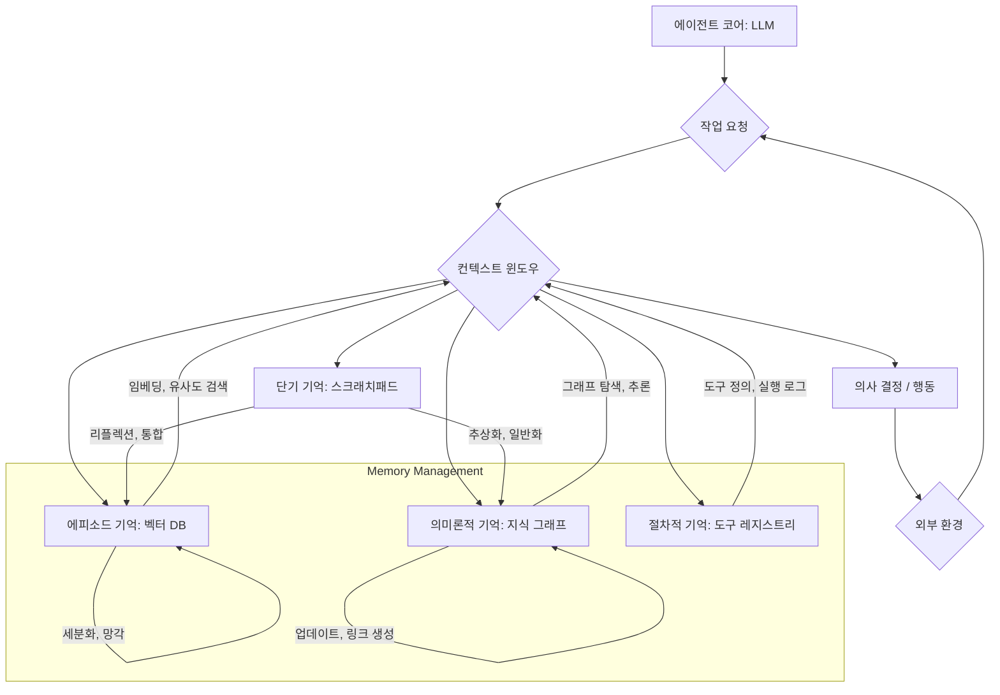

자율 에이전트(Autonomous Agents)의 핵심 역량 중 하나는 지속적인 학습과 복잡한 문제 해결을 위해 장기 기억(Long-Term Memory)을 효과적으로 관리하고 활용하는 능력입니다. 대규모 언어 모델(LLM)의 제한적인 컨텍스트 윈도우(Context Window)는 단기적인 대화나 작업에는 적합하지만, 장기적인 목표를 달성하거나 이전의 경험에서 교훈을 얻어 발전하기 어렵게 만듭니다. 따라서 에이전트가 과거의 상호작용, 학습된 지식, 수행했던 작업들을 효율적으로 저장하고 필요할 때 검색하여 현재의 의사 결정에 활용하는 장기 기억 패턴은 필수적입니다. 이는 에이전트가 더 복잡하고 장기적인 과제를 수행하며, 마치 인간처럼 경험을 통해 성장하는 지능을 모방하는 데 중요합니다.

## 장기 기억의 필요성
LLM 기반 에이전트는 프롬프트에 제공된 컨텍스트 내에서만 '기억'을 유지합니다. 이는 대화가 길어지거나 여러 세션에 걸쳐 작업을 수행할 때 컨텍스트가 소실되어 일관성과 효율성이 떨어지는 문제로 이어집니다. 장기 기억은 이러한 컨텍스트의 한계를 극복하고 에이전트가 더 넓은 범위의 지식과 경험에 접근할 수 있도록 돕습니다. 예를 들어, 소프트웨어 개발 에이전트가 프로젝트 초기부터 수많은 코드 변경, 버그 수정, 아키텍처 결정 이력을 기억하고 있다면, 새로운 기능 개발 시 과거의 실수를 반복하지 않거나 유사한 문제 해결에 걸렸던 시간을 단축할 수 있습니다. 2026년 기준, 에이전트의 복잡성이 증가하고 장기 실행(long-running) 작업의 비중이 커지면서 장기 기억 관리의 중요성은 더욱 부각되고 있습니다.

### 장기 기억의 유형
자율 에이전트의 장기 기억은 크게 몇 가지 유형으로 분류할 수 있습니다.

*   **에피소드 기억 (Episodic Memory)**: 특정 이벤트나 경험의 순차적인 기록입니다. 에이전트가 수행한 작업, 발생한 오류, 받은 피드백 등 시간의 흐름에 따른 구체적인 '사건'들을 저장합니다. 주로 벡터 데이터베이스(Vector Database)와 검색 증강 생성(RAG) 패턴을 통해 구현되며, 유사한 상황 발생 시 관련 에피소드를 검색하여 컨텍스트에 주입하는 방식으로 활용됩니다.
*   **의미론적 기억 (Semantic Memory)**: 일반적인 지식, 개념, 사실 관계를 추상화하여 저장하는 형태입니다. 에피소드 기억이 '언제, 무엇을 했는가'에 초점을 맞춘다면, 의미론적 기억은 '무엇이 무엇인가' 또는 '어떻게 작동하는가'와 같은 일반화된 지식입니다. 지식 그래프(Knowledge Graph) 형태로 구현되어 개념 간의 관계를 명확히 하고, 복잡한 추론에 활용될 수 있습니다.
*   **절차적 기억 (Procedural Memory)**: 특정 작업을 수행하는 방법, 즉 '어떻게 하는가'에 대한 기억입니다. 도구 사용(Tool Use) 패턴, 특정 워크플로우 실행 방식, 문제 해결 전략 등이 이에 해당합니다. 에이전트가 반복적인 작업을 통해 '기술'을 습득하고 효율을 높이는 데 기여합니다.

## 장기 기억 아키텍처 패턴
효과적인 장기 기억 시스템을 구축하기 위해서는 다양한 컴포넌트와 상호작용 패턴이 필요합니다. 아래 다이어그램은 일반적인 자율 에이전트의 장기 기억 흐름을 보여줍니다.



### 리플렉션 및 자기 수정 (Reflection and Self-Correction)
에이전트는 단순히 정보를 저장하고 검색하는 것을 넘어, 저장된 기억을 주기적으로 '리플렉션(Reflection)'하여 새로운 통찰을 얻고 지식을 정제해야 합니다. 에이전트는 자신의 과거 행동, 성공 및 실패 사례를 되돌아보고, 그 과정에서 얻은 교훈을 의미론적 기억에 추상화하여 저장할 수 있습니다. 이를 통해 에이전트는 장기적으로 자기 수정(Self-Correction) 능력을 강화하고, 성능을 지속적으로 향상시킬 수 있습니다. 예를 들어, `agents/autonomous-agent-long-term-memory-reflection-design`과 같은 패턴은 이러한 리플렉션 메커니즘을 강조합니다.

### 계층적 기억 시스템 (Hierarchical Memory Systems)
정보의 중요도, 상세 수준, 휘발성(volatility)에 따라 기억을 계층적으로 관리하는 패턴입니다. 자주 사용되거나 중요한 핵심 지식은 빠르게 접근 가능한 캐시(Cache) 형태의 의미론적 기억에 저장하고, 상세하고 구체적인 과거 상호작용은 에피소드 기억(예: 벡터 DB)에 저장할 수 있습니다. 이는 에이전트의 의사 결정 속도를 최적화하고, 불필요한 정보 검색으로 인한 오버헤드를 줄입니다. `context-engineering/ai-agent-context-layer-data-warehousing`와 같은 접근 방식과도 연결됩니다.

### 멀티모달 기억 (Multimodal Memory)
텍스트 외에도 이미지, 오디오, 비디오 등 다양한 형태의 정보를 기억하고 활용하는 패턴입니다. 예를 들어, 코드를 분석하는 에이전트는 코드 텍스트와 함께 관련 다이어그램 이미지, 문제 설명을 담은 음성 기록까지 기억하여 통합적인 컨텍스트를 구성할 수 있습니다. 이는 특히 멀티모달 LLM이 발전하는 2026년 이후 더욱 중요해질 것입니다.

### 파이썬 예제: 간단한 에이전트 메모리 클래스
다음 파이썬 예제는 간단한 `Memory` 클래스를 보여줍니다. 이는 벡터 데이터베이스와 지식 그래프의 기본적인 아이디어를 결합하여 에이전트의 장기 기억을 관리하는 개념적인 구현입니다. 실제 시스템에서는 벡터 임베딩 모델, 정교한 검색 알고리즘, 그래프 데이터베이스가 통합됩니다.

```python
import uuid
from collections import deque

class AgentMemory:
    def __init__(self, max_episodic_memory=100):
        self.episodic_memory = deque(maxlen=max_episodic_memory) # 에피소드 기억 (시간 순서)
        self.semantic_memory = {} # 의미론적 기억 (키-값 또는 지식 그래프)
        self.knowledge_graph = {}
        print("AgentMemory initialized.")

    def add_episodic_event(self, event_description: str, metadata: dict = None):
        event_id = str(uuid.uuid4())
        event = {
            "id": event_id,
            "description": event_description,
            "timestamp": "2026-07-20T10:00:00Z", # 실제 구현에서는 datetime 사용
            "metadata": metadata if metadata else {}
        }
        self.episodic_memory.append(event)
        print(f"Episodic event added: {event_description[:30]}...")
        return event_id

    def retrieve_episodic_memory(self, query: str, top_k: int = 3) -> list:
        # 실제 구현에서는 쿼리 임베딩 후 벡터 검색 수행
        # 여기서는 간단한 키워드 매칭 예시
        results = []
        for event in reversed(self.episodic_memory):
            if query.lower() in event["description"].lower():
                results.append(event)
            if len(results) >= top_k:
                break
        print(f"Retrieved {len(results)} episodic memories for query '{query}'.")
        return results

    def update_semantic_memory(self, concept: str, definition: str):
        self.semantic_memory[concept] = definition
        print(f"Semantic memory updated for '{concept}'.")

    def retrieve_semantic_memory(self, concept: str) -> str:
        return self.semantic_memory.get(concept, "No information found.")

    def add_to_knowledge_graph(self, subject: str, predicate: str, obj: str):
        if subject not in self.knowledge_graph:
            self.knowledge_graph[subject] = []
        self.knowledge_graph[subject].append({"predicate": predicate, "object": obj})
        print(f"Added '{subject} {predicate} {obj}' to knowledge graph.")

    def query_knowledge_graph(self, subject: str) -> list:
        return self.knowledge_graph.get(subject, [])

# 사용 예시
memory = AgentMemory()

# 에피소드 기억 추가
memory.add_episodic_event("사용자에게 A 기능 구현 방법을 설명함", {"task": "feature_explanation"})
memory.add_episodic_event("코드 리뷰 중 B 모듈에서 성능 병목 현상 발견", {"bug": "performance_bottleneck"})
memory.add_episodic_event("C 클래스의 API 문서화 작업을 완료함", {"task": "documentation"})

# 의미론적 기억 업데이트 및 검색
memory.update_semantic_memory("RAG_Pattern", "외부 지식 소스를 활용한 LLM 응답 정확도 향상 기법.")
print(f"RAG_Pattern: {memory.retrieve_semantic_memory('RAG_Pattern')}")

# 지식 그래프 활용
memory.add_to_knowledge_graph("B 모듈", "원인", "과도한 DB 쿼리")
memory.add_to_knowledge_graph("B 모듈", "해결책", "캐싱 레이어 추가")
print(f"B 모듈 관련 지식 그래프: {memory.query_knowledge_graph('B 모듈')}")

# 에피소드 기억 검색
retrieved_events = memory.retrieve_episodic_memory("성능", top_k = 1)
for event in retrieved_events:
    print(f"검색된 에피소드: {event['description']}")
```

## 트레이드오프

### 1. 복잡성 vs. 성능
*   **언제 좋음**: 에이전트가 처리해야 하는 정보량이 많고, 장기적인 일관성 및 학습이 중요한 복잡한 시스템에서 에이전트의 지능적 행동을 크게 향상시킬 수 있습니다. 정교한 기억 관리 덕분에 에이전트의 '지능'이 시간이 지남에 따라 축적됩니다.
*   **언제 나쁨**: 단순 반복 작업이나 단일 세션 내에서 해결되는 단기적인 과제에는 과도한 아키텍처 오버헤드를 발생시킵니다. 기억 시스템의 설계, 유지보수, 검색 최적화에 많은 노력이 필요하며, 초기 개발 비용이 높아집니다.

### 2. 검색 정확도 vs. 비용/속도
*   **언제 좋음**: 고도로 정확한 정보 검색이 필수적인 상황 (예: 법률 문서 분석, 의료 진단 보조)에서는 정교한 임베딩, 다단계 RAG, 지식 그래프 추론 등이 최적의 결과를 제공합니다. 에이전트의 '기억'이 정확할수록 의사 결정의 품질이 높아집니다.
*   **언제 나쁨**: 실시간 응답이 중요하거나 예산 제약이 있는 경우, 복잡한 검색 및 추론 과정은 지연 시간(latency)을 증가시키고 컴퓨팅 비용을 상승시킵니다. 검색 시스템의 인덱싱 및 업데이트 비용도 무시할 수 없습니다.

### 3. 기억의 휘발성 vs. 영구성
*   **언제 좋음**: 에이전트의 '경험'이 지속적으로 쌓이고 발전해야 하는 경우, Datalog와 같은 영구적인 기억 저장소는 에이전트의 상태와 학습 내용을 장기간 보존하는 데 유리합니다. 이는 에이전트의 재시작 후에도 이전 상태를 복원하고 학습을 이어갈 수 있게 합니다.
*   **언제 나쁨**: 개인 정보 보호(Privacy)가 중요하거나 보안이 민감한 애플리케이션에서는 모든 정보를 영구적으로 저장하는 것이 부담될 수 있습니다. 불필요한 정보까지 저장되면 데이터 관리 부담이 커지고, '잊는' 메커니즘이 복잡해집니다. `agents/ai-agent-persistent-memory-automated-context-management`와 같은 패턴이 이러한 고민을 담고 있습니다.

## 실전 체크리스트

장기 기억을 활용하는 자율 에이전트 패턴을 프로젝트에 적용할 때 다음 항목들을 검증해야 합니다.

- [ ] **기억 유형 정의**: 에이전트가 어떤 종류의 정보(에피소드, 의미론적, 절차적)를 기억해야 하는지 명확히 정의했는가?
- [ ] **저장소 선택**: 정의된 기억 유형에 맞춰 벡터 데이터베이스, 지식 그래프, RDBMS, NoSQL 등 적절한 저장소를 선택하고 통합 계획을 수립했는가?
- [ ] **검색 전략 최적화**: LLM 프롬프트에 주입할 정보를 효율적으로 검색하기 위한 임베딩 모델, 검색 알고리즘(예: HNSW), RAG 파이프라인을 최적화했는가?
- [ ] **기억 업데이트 메커니즘**: 에이전트의 새로운 경험과 학습이 장기 기억에 효과적으로 반영(쓰기/업데이트)되는 자동화된 메커니즘을 구현했는가?
- [ ] **리플렉션 주기 및 전략**: 에이전트가 스스로 과거 기억을 되돌아보고 지식을 정제, 추상화, 일반화하는 리플렉션(Reflection) 주기와 전략을 설계했는가?
- [ ] **기억 망각/정리 정책**: 불필요하거나 오래된 기억을 삭제하거나 압축하여 기억 시스템의 효율성을 유지하고 데이터 프라이버시를 준수하는 정책을 수립했는가?
- [ ] **비용 및 성능 모니터링**: 장기 기억 시스템의 운영 비용(저장, 컴퓨팅)과 성능(검색 Latency, 처리량)을 지속적으로 모니터링하고 최적화 계획을 가지고 있는가?
- [ ] **안전 및 보안**: 저장되는 민감 정보에 대한 접근 제어, 암호화, 데이터 무결성 보장 등 보안 대책을 마련했는가?