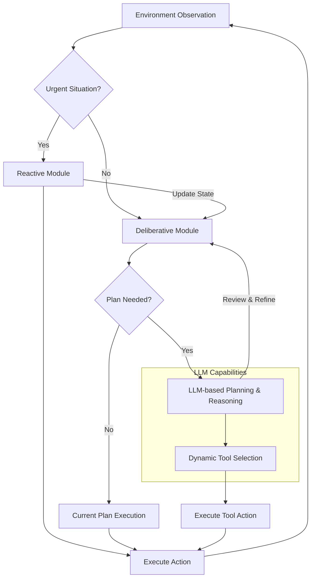

복잡하고 동적인 환경에서 자율형 AI 에이전트가 효과적으로 작동하기 위한 의사결정 로직 구현은 실무적 난이도가 높으며, 개발 표준화의 필요성이 증대되고 있습니다. 전통적인 규칙 기반 시스템의 한계를 넘어서, 현대의 자율형 에이전트는 불확실성을 관리하고, 장기적인 목표를 달성하며, 변화하는 상황에 적응하는 정교한 의사결정 능력을 요구합니다. 이 글에서는 이러한 요구사항을 충족시키기 위한 다양한 의사결정 로직 구현 패턴과 2026년 최신 트렌드를 다룹니다.

## 자율형 에이전트 의사결정의 중요성

자율형 에이전트의 핵심은 주어진 목표를 향해 스스로 판단하고 행동하는 능력에 있습니다. 이는 단순한 자동화를 넘어, 예측 불가능한 상황에서 유연하게 대응하고, 최적의 결과를 도출하기 위한 전략적 사고를 포함합니다. 효과적인 의사결정 로직 없이는 에이전트는 예상치 못한 문제에 직면하거나, 비효율적인 경로를 선택하거나, 심지어 시스템 전체에 위험을 초래할 수 있습니다.

### 주요 의사결정 로직 구현 패턴

1.  **Reactive Agents (반응형 에이전트)**
    가장 기본적인 형태로, 현재 환경 상태에 직접적으로 반응하는 규칙(rule)을 기반으로 의사결정을 수행합니다. 내부 상태나 장기적인 계획 없이 'If-Then' 규칙에 따라 즉각적인 행동을 취합니다.
    *장점*: 구현이 간단하고 반응 속도가 빠릅니다.
    *단점*: 복잡한 문제 해결이나 장기적인 목표 달성에는 부적합하며, 환경 변화에 대한 유연성이 낮습니다.

2.  **Deliberative Agents (심사숙고형 에이전트)**
    내부 모델을 통해 환경을 추론하고, 목표를 설정하며, 계획(plan)을 수립한 후 실행합니다. BDI (Belief-Desire-Intention) 아키텍처가 대표적이며, 에이전트의 '믿음(Belief)', '욕구(Desire)', '의도(Intention)'를 기반으로 의사결정을 내립니다.
    *장점*: 복잡한 문제 해결과 장기적인 목표 달성에 강하며, 행동에 대한 설명 가능성(explainability)이 높습니다.
    *단점*: 계산 비용이 높고, 실시간 반응성이 떨어질 수 있으며, 환경 모델 구축에 많은 노력이 필요합니다.

3.  **Hybrid Agents (하이브리드 에이전트)**
    반응형과 심사숙고형의 장점을 결합한 형태입니다. 저수준의 빠른 반응은 반응형 모듈이 담당하고, 고수준의 복잡한 계획 및 추론은 심사숙고형 모듈이 담당합니다. 2026년 현재, LLM (Large Language Model)을 고수준 추론 모듈로 활용하여 의사결정 복잡성을 관리하는 방식이 주류를 이룹니다.
    *장점*: 반응성과 계획 수립 능력을 동시에 갖추어 다양한 환경에 유연하게 대응할 수 있습니다.
    *단점*: 아키텍처 설계 및 통합이 복잡하며, 모듈 간의 효과적인 조정이 어렵습니다.

### LLM 기반 의사결정 패턴

최근 LLM의 발전은 자율형 에이전트의 의사결정 로직에 혁신을 가져왔습니다. LLM은 자연어 이해와 생성 능력을 바탕으로 복잡한 문제의 맥락을 파악하고, 다단계 계획을 수립하며, 동적으로 도구를 선택하고 사용하는 능력을 제공합니다.

*   **Chain-of-Thought (CoT) Reasoning**: LLM이 문제 해결 과정을 단계적으로 설명하도록 유도하여, 의사결정의 투명성과 정확성을 높입니다.
*   **Tool Use / Function Calling**: LLM이 외부 도구(API, 코드 실행기 등)를 호출하여 정보를 검색하거나 특정 작업을 수행하도록 지시함으로써, 에이전트의 행동 반경을 확장하고 의사결정의 실용성을 강화합니다.
*   **Self-Correction / Reflection**: LLM이 자신의 이전 의사결정이나 행동 결과를 평가하고, 오류를 수정하여 다음 의사결정에 반영하는 메커니즘을 통해 지속적인 개선을 이룹니다.

다음 Mermaid 다이어그램은 Hybrid Agent의 의사결정 흐름을 시각화합니다.



### 코드 예제: Hybrid Agent의 의사결정 로직 (Python)

아래 코드는 LLM을 활용한 Hybrid Agent의 간소화된 의사결정 흐름을 보여줍니다. `ReactiveAgent`는 즉각적인 위협에 반응하고, `DeliberativeAgent`는 LLM을 통해 장기적인 계획을 수립하며 `decide` 메서드에서 통합됩니다.

```python
import openai # 예시: 실제 사용 시 Anthropic 또는 다른 LLM API로 대체 가능

class EnvironmentalState:
    def __init__(self, danger_level: float, current_goal: str, available_tools: list):
        self.danger_level = danger_level
        self.current_goal = current_goal
        self.available_tools = available_tools

class ReactiveModule:
    def decide(self, state: EnvironmentalState) -> str:
        if state.danger_level > 0.8:
            return "RUN_AWAY"
        if state.danger_level > 0.5:
            return "TAKE_COVER"
        return "OBSERVE"

class DeliberativeModule:
    def __init__(self, llm_client):
        self.llm_client = llm_client
        self.current_plan = []

    def generate_plan(self, state: EnvironmentalState) -> list:
        prompt = f"""
        Given the current goal: {state.current_goal}
        And available tools: {', '.join(state.available_tools)}
        Generate a step-by-step plan to achieve the goal.
        """
        response = self.llm_client.chat.completions.create(
            model="gpt-4o", # 또는 claude-3-opus-20240229 등
            messages=[{"role": "user", "content": prompt}]
        )
        # 실제 구현에서는 LLM 응답을 파싱하여 구조화된 계획으로 변환
        self.current_plan = response.choices[0].message.content.split('\n')
        return self.current_plan

    def execute_plan_step(self) -> str:
        if self.current_plan:
            return self.current_plan.pop(0) # 계획의 첫 단계를 실행하고 제거
        return "NO_PLAN_STEP_TO_EXECUTE"

class HybridAgent:
    def __init__(self, llm_client):
        self.reactive_module = ReactiveModule()
        self.deliberative_module = DeliberativeModule(llm_client)

    def decide(self, state: EnvironmentalState) -> str:
        # 1. 반응형 의사결정 우선
        reactive_action = self.reactive_module.decide(state)
        if reactive_action != "OBSERVE":
            print(f"Reactive action: {reactive_action}")
            return reactive_action

        # 2. 심사숙고형 의사결정 (계획 수립 및 실행)
        if not self.deliberative_module.current_plan:
            print("Generating new plan...")
            self.deliberative_module.generate_plan(state)

        deliberative_action = self.deliberative_module.execute_plan_step()
        print(f"Deliberative action: {deliberative_action}")
        return deliberative_action

# 예시 사용법
# llm_client = openai.OpenAI() # 실제 LLM 클라이언트 초기화
# agent = HybridAgent(llm_client)
# current_state = EnvironmentalState(danger_level=0.3, current_goal="Explore new area", available_tools=["map_tool", "scanner_tool"])
# action = agent.decide(current_state)
# print(f"Agent decided: {action}")
```

## 트레이드오프

자율형 AI 에이전트의 의사결정 로직을 구현할 때 고려해야 할 주요 트레이드오프는 다음과 같습니다.

*   **반응성 vs. 계획성**: 반응형 에이전트는 빠른 응답이 필요한 실시간 환경에 유리하지만, 장기적인 목표 달성이나 복잡한 문제 해결에는 비효율적입니다. 반대로 계획성 에이전트는 복잡한 상황에 대한 깊은 추론이 가능하지만, 환경 변화에 대한 즉각적인 반응이 어려울 수 있습니다. 하이브리드 접근법은 이 둘의 균형을 맞추지만, 설계 복잡도가 증가합니다. (언제 좋고/언제 나쁜지: 빠른 안전 조치가 최우선일 때 반응형이 좋고, 전략적 최적화가 중요할 때 계획성이 좋음)
*   **설명 가능성(Explainability) vs. 성능**: 규칙 기반 시스템은 의사결정 과정을 명확하게 설명할 수 있어 디버깅 및 감사에 용이합니다. 그러나 LLM이나 강화 학습 기반 시스템은 뛰어난 성능을 보이지만, 의사결정 과정이 '블랙박스'에 가까워 설명하기 어렵습니다. (언제 좋고/언제 나쁜지: 규제 준수나 안전에 민감한 시스템에는 설명 가능성이 좋고, 복잡한 패턴 인식과 최적화가 필요할 때 성능 위주가 좋음)
*   **복잡성 관리 vs. 확장성**: 단일 LLM 에이전트가 모든 의사결정을 담당하게 하면 초기 구현은 간단할 수 있으나, 복잡한 문제나 멀티 에이전트 환경에서는 확장성 및 효율성 문제가 발생합니다. 계층적 또는 멀티 에이전트 시스템으로 분리하면 복잡성 관리가 용이하지만, 아키텍처 설계와 통신 오버헤드가 증가합니다. (언제 좋고/언제 나쁜지: 단일, 잘 정의된 작업에는 단순한 구조가 좋고, 대규모 분산 시스템에는 모듈화된 복잡한 구조가 좋음)
*   **안전성 및 제약 조건 제어 vs. 자율성**: 에이전트에게 높은 자율성을 부여할수록 새로운 솔루션을 찾을 가능성이 높아지지만, 예상치 못한 위험한 행동을 할 가능성도 커집니다. 엄격한 안전 제약 조건(safety constraint)을 두면 제어는 쉽지만, 에이전트의 잠재력을 제한할 수 있습니다. (언제 좋고/언제 나쁜지: 임무 실패 비용이 높은 경우 제약 조건 제어가 좋고, 탐색 및 혁신이 중요한 경우 자율성이 좋음)

## 실전 체크리스트

자율형 AI 에이전트의 의사결정 로직을 프로젝트에 적용할 때 다음 항목들을 검증하세요.

*   [ ] **환경 동적성 평가**: 에이전트가 작동할 환경의 변화 속도와 예측 불가능성을 평가하고, 이에 맞는 반응형, 심사숙고형, 또는 하이브리드 아키텍처를 선택했는가?
*   [ ] **목표 및 제약 조건 명확화**: 에이전트의 주요 목표(goal)와 반드시 준수해야 할 안전, 윤리적 제약 조건(constraint)이 명확하게 정의되어 있으며, 의사결정 로직에 반영되었는가?
*   [ ] **LLM 역할 및 통합 전략**: LLM을 고수준 계획, 도구 선택, 혹은 자기 수정(self-correction) 등 어떤 역할로 활용할 것인지 명확히 하고, LLM의 한계(환각, 비용, 지연 시간)를 고려한 견고한 통합 전략을 수립했는가?
*   [ ] **피드백 루프 설계**: 에이전트의 행동 결과가 의사결정 로직에 반영되어 지속적으로 개선될 수 있는 피드백 루프(feedback loop) 메커니즘이 설계되었는가? (예: Reflection, 강화 학습)
*   [ ] **도구 활용 및 확장성**: 에이전트가 외부 도구(external tools)를 효과적으로 검색하고, 선택하고, 사용할 수 있는 메커니즘이 구현되어 있으며, 향후 새로운 도구 추가에 대한 확장성을 고려했는가?
*   [ ] **예외 처리 및 복구**: 의사결정 과정에서 발생할 수 있는 오류(LLM API 실패, 도구 실행 실패 등)에 대한 견고한 예외 처리(error handling) 및 복구(recovery) 로직이 구현되어 있는가?
*   [ ] **테스트 및 평가 지표**: 의사결정 로직의 성능과 안전성을 측정하기 위한 구체적인 테스트 시나리오와 평가 지표(metrics)가 정의되어 있으며, 주기적인 검증 프로세스가 마련되었는가?