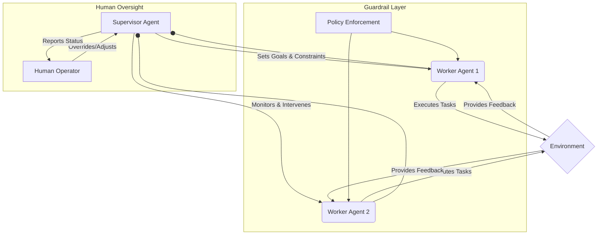

자율 AI 에이전트의 능력과 적용 범위가 확대됨에 따라, 시스템의 안전성과 제어 가능성을 확보하는 것이 핵심적인 과제가 되었습니다. 에이전트의 자율성이 증대할수록 예상치 못한 행동, 즉 의도하지 않은 부작용이나 오작동의 위험이 증가합니다. 이는 신뢰성을 저해하고 잠재적으로 해로운 결과를 초래할 수 있으므로, 에이전트가 지정된 목표를 안전하게 달성하도록 제어 메커니즘을 설계하는 것이 필수적입니다.

## 핵심 안전성 및 제어 개념

자율 AI 에이전트의 안전성을 확보하기 위한 핵심 개념은 다음과 같습니다:

*   **Guardrails (가드레일)**: 에이전트의 행동 범위를 제약하고, 특정 행동이나 의사결정을 금지하거나 강제하는 규칙 및 정책 집합입니다. 이는 주로 윤리적, 법적, 또는 운영적 제약을 반영합니다. 가드레일은 사전에 정의된 규칙 기반 시스템으로 구현되거나, 학습된 제약 조건을 통해 동적으로 적용될 수 있습니다.
*   **Monitoring & Anomaly Detection (모니터링 및 이상 탐지)**: 에이전트의 행동, 성능, 그리고 환경 상호작용을 실시간으로 감시하고, 정상 범주에서 벗어나는 이상 징후를 탐지하는 시스템입니다. 이를 통해 잠재적인 문제를 조기에 식별하고 개입할 수 있습니다.
*   **Human-in-the-Loop (인간 개입)**: 에이전트가 특정 상황에서 의사결정을 내리기 전 또는 문제가 발생했을 때 인간의 검토, 승인 또는 개입을 요청하는 메커니즘입니다. 에이전트의 자율성 수준과 위험도에 따라 개입 지점을 설계합니다.
*   **Explainability (설명 가능성)**: 에이전트가 특정 결정을 내리거나 행동을 수행한 이유를 인간이 이해할 수 있도록 제공하는 능력입니다. 이는 문제 진단, 신뢰 구축, 그리고 개선에 중요합니다.
*   **Alignment (정렬)**: 에이전트의 목표와 행동이 설계자의 의도 및 광범위한 인간 가치와 일치하도록 보장하는 과정입니다. Reinforcement Learning with Human Feedback (RLHF)나 Constitutional AI 같은 방법론이 이 분야에서 중요하게 다루어집니다.

## 제어 메커니즘 설계 패턴

### 1. 계층적 제어 아키텍처 (Hierarchical Control Architecture)

상위 Supervisor Agent가 전체적인 목표와 제약 조건을 설정하고, 하위 Worker Agent들이 세부 작업을 수행하는 구조입니다. Supervisor는 Worker의 행동을 모니터링하고, 필요시 개입하거나 목표를 재조정합니다.



### 2. 동적 제약 조건 적용 (Dynamic Constraint Enforcement)

에이전트의 작동 환경이나 현재 상황에 따라 가드레일이나 제약 조건을 동적으로 변경하는 패턴입니다. 예를 들어, 민감한 작업 수행 시에는 엄격한 제약을 적용하고, 일반적인 작업 시에는 유연성을 부여합니다. 2026년 트렌드에서는 환경 변화에 실시간으로 반응하여 제약 조건을 업데이트하는 Adaptive Guardrails 기술이 중요해지고 있습니다.

### 3. 중복성 및 안전장치 (Redundancy & Failsafes)

단일 실패 지점(Single Point of Failure)을 방지하기 위해 여러 계층의 안전 메커니즘을 두거나, 예상치 못한 상황 발생 시 시스템을 안전한 상태로 전환하는 비상 정지(Emergency Stop) 기능을 포함합니다. 예를 들어, LLM 출력에 대한 후처리 검증 레이어를 두거나, 특정 임계값을 초과하는 이상 행동 감지 시 자동으로 작업을 중단하는 것입니다.

### 4. 행동 감사 및 로깅 (Behavioral Auditing & Logging)

에이전트의 모든 의사결정과 행동, 그리고 그에 따른 결과를 불변(immutable) 로그로 기록합니다. 이는 사후 분석, 문제 진단, 그리고 시스템 개선을 위한 중요한 데이터를 제공합니다. 특히, 규제 준수가 필요한 분야에서는 이러한 감사 기록이 필수적입니다.

```python
import logging
import datetime

# Configure logging
logging.basicConfig(level=logging.INFO, format='%(asctime)s - %(levelname)s - %(message)s')

class AutonomousAgent:
    def __init__(self, name):
        self.name = name
        self.action_history = []

    def decide_action(self, current_state):
        # Simulate complex decision logic
        action = "perform_task_X" # Placeholder for actual decision

        # Apply guardrails
        if "critical_operation" in action and not self._check_safety_protocol():
            action = "request_human_review"
            logging.warning(f"[{self.name}] Safety protocol not met for '{action}'. Requesting human review.")
        elif "unauthorized_access" in action:
            action = "deny_access"
            logging.error(f"[{self.name}] Attempted unauthorized access. Action denied.")

        self._log_action(action, current_state)
        return action

    def _check_safety_protocol(self):
        # Simulate safety check (e.g., specific permissions, time window)
        return datetime.datetime.now().hour > 9 and datetime.datetime.now().hour < 17

    def _log_action(self, action, state):
        entry = {
            "timestamp": datetime.datetime.now().isoformat(),
            "agent": self.name,
            "state": state,
            "action": action
        }
        self.action_history.append(entry)
        logging.info(f"[{self.name}] Action: '{action}' from State: '{state}'")

    def get_audit_trail(self):
        return self.action_history

# Example usage
agent = AutonomousAgent("TaskExecutor-001")
print(agent.decide_action("initial_state"))
print(agent.decide_action("state_before_critical_operation"))
print(agent.decide_action("state_with_unauthorized_attempt"))

# Audit trail can be retrieved for review
# print(agent.get_audit_trail())
```

## 트레이드오프

### 1. 엄격한 가드레일 vs. 유연한 자율성

*   **언제 좋음**: 고위험 환경(예: 금융 거래, 의료 진단)에서 에이전트의 행동을 엄격하게 제한하여 치명적인 오류를 방지해야 할 때 효과적입니다. 예측 불가능한 행동으로 인한 손실을 최소화합니다.
*   **언제 나쁨**: 창의성, 탐색, 또는 빠르게 변화하는 환경에서의 적응 능력을 저해할 수 있습니다. 에이전트의 잠재력을 완전히 발휘하지 못하게 하여 혁신이나 효율성 감소로 이어질 수 있습니다.

### 2. 인간 개입의 빈도

*   **언제 좋음**: 안전이 최우선이고, 에이전트의 결정이 중대한 영향을 미칠 수 있는 경우 (예: 중요한 시스템 변경 승인) 인간의 최종 검토를 통해 안정성과 신뢰성을 높입니다.
*   **언제 나쁨**: 개입 빈도가 너무 높으면 시스템의 지연을 유발하고, 인간 운영자의 피로도를 증가시키며, 에이전트의 자율적 이점을 상쇄하여 운영 비용을 증가시킬 수 있습니다.

### 3. 제어 메커니즘의 복잡성 vs. 성능 오버헤드

*   **언제 좋음**: 매우 복잡하고 상호 연결된 시스템에서 다층적인 제어 메커니즘은 예상치 못한 상호작용과 오류를 방지하는 데 필수적입니다. 포괄적인 안전성을 제공합니다.
*   **언제 나쁨**: 추가적인 제어 로직, 모니터링, 그리고 로깅은 에이전트의 처리 속도를 저하시키고, 컴퓨팅 자원 요구량을 증가시켜 성능 병목 현상이나 높은 운영 비용을 초래할 수 있습니다.

### 4. 설명 가능성 수준 vs. 모델 복잡성

*   **언제 좋음**: 규제 준수(예: GDPR, 의료 규제), 문제 진단, 사용자 신뢰 구축이 중요한 경우, 에이전트의 의사결정 과정을 명확히 설명할 수 있는 능력이 필수적입니다.
*   **언제 나쁨**: 설명 가능성을 높이기 위해 단순화된 모델을 사용하거나 추가적인 해석 레이어를 도입하면, 복잡한 문제 해결 능력이나 최적화된 성능이 저하될 수 있습니다. 본질적으로 복잡한 LLM 기반 에이전트의 경우 완벽한 설명 가능성 확보가 어렵습니다.

## 실전 체크리스트

자율 AI 에이전트의 안전성 및 제어 메커니즘을 설계할 때 다음 사항들을 확인합니다.

*   [ ] **행동 정의 및 경계 설정**: 에이전트의 허용 가능한 행동과 명백히 금지된 행동이 명확히 정의되어 있으며, 이 경계를 벗어나는 시나리오에 대한 가드레일이 구현되었는가?
*   [ ] **실시간 모니터링 구현**: 에이전트의 핵심 지표, 상태, 그리고 외부 환경과의 상호작용을 실시간으로 모니터링하고 이상 징후를 즉시 감지할 수 있는 시스템이 구축되었는가?
*   [ ] **인간 개입 프로토콜 수립**: 중요하거나 위험도가 높은 결정 시 인간의 검토 및 승인을 요구하는 명확한 트리거 포인트와 개입 절차가 정의되어 있으며, 긴급 상황 시 즉각적인 비상 정지(kill switch) 메커니즘이 존재하는가?
*   [ ] **불변 감사 로그 시스템**: 에이전트의 모든 의사결정, 행동, 그리고 중요한 시스템 변경 사항이 위변조 불가능한 형태로 기록되고 접근 가능한 감사 추적(audit trail)이 유지되는가?
*   [ ] **adversarial (적대적) 테스트 계획**: 에이전트의 안전 메커니즘이 의도적인 공격이나 예상치 못한 입력에 대해 얼마나 견고한지 평가하기 위한 적대적 테스트 시나리오가 준비되었는가?
*   [ ] **설명 가능한 의사결정 경로**: 에이전트가 내린 주요 결정에 대해 인간이 이해할 수 있는 수준의 설명(예: 근거, 고려 사항)을 제공하는 메커니즘이 설계되어 있으며, 이를 통해 신뢰를 구축하고 문제 진단이 가능한가?
*   [ ] **회복 및 복구 전략**: 시스템 오류, 예외 상황 또는 안전 메커니즘 오작동 시 에이전트가 안전한 상태로 자동 복구되거나, 수동 복구를 위한 명확한 절차가 마련되어 있는가?