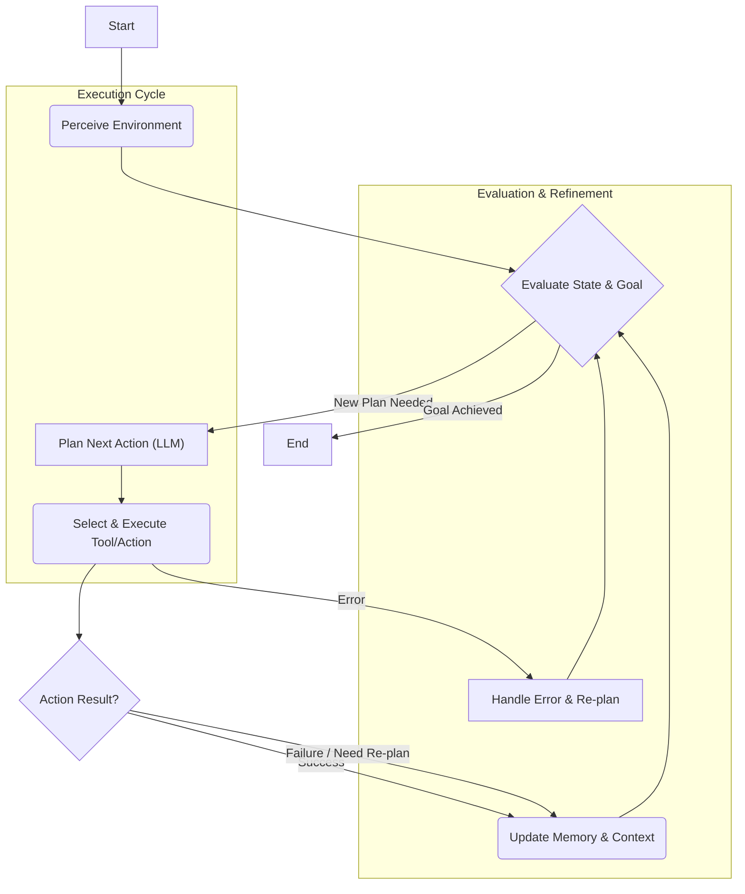

자율 AI 에이전트(Autonomous AI Agents)는 복잡한 목표를 달성하기 위해 스스로 작업을 계획하고 실행하는 능력을 갖춘 시스템입니다. 이러한 에이전트의 안정성과 효율성은 핵심적으로 견고한 작업 계획(Task Planning) 및 실행(Execution) 패턴 설계에 달려 있습니다. 2026년 현재, 단순히 LLM(Large Language Model)을 호출하는 것을 넘어, 불확실한 환경 속에서 장기적인 목표를 달성하기 위한 전략적인 접근 방식이 요구됩니다.

## 핵심 개념 및 중요성

자율 에이전트의 작업 계획 및 실행은 단일 요청-응답 주기가 아닌, 목표 달성까지 이어지는 복합적인 순환 과정입니다. 이 과정에는 환경 인식(Perception), 목표 설정(Goal Setting), 계획 수립(Planning), 행동 실행(Action Execution), 그리고 결과 평가 및 자기 수정(Evaluation & Self-Correction)이 포함됩니다. 이 모든 단계가 유기적으로 연동되어야 에이전트의 자율성과 신뢰성을 확보할 수 있습니다. 특히, 동적으로 변화하는 현실 세계에 배포되는 에이전트는 예상치 못한 상황에 유연하게 대처할 수 있는 실행 패턴이 필수적입니다.

### 작업 계획의 유형

*   **기호 기반 계획(Symbolic Planning)**: 전통적인 AI 계획 방식으로, 환경 상태와 행동을 기호로 표현하고 미리 정의된 규칙에 따라 최적의 행동 시퀀스를 탐색합니다. 예측 가능성이 높지만, 복잡한 실세계 문제에는 모델링 어려움이 있습니다.
*   **LLM 기반 계획(LLM-based Planning)**: 대규모 언어 모델의 추론 능력을 활용하여 자연어 형태의 목표를 이해하고, 이를 달성하기 위한 단계별 계획을 생성합니다. 유연하고 범용적이지만, 환각(Hallucination)이나 비효율적인 계획을 생성할 위험이 있습니다.
*   **계층적 계획(Hierarchical Planning)**: 복잡한 작업을 더 작고 관리하기 쉬운 하위 작업으로 분해하고, 각 계층에서 계획을 수립합니다. 장기 목표 달성에 효과적이며, 문제 공간을 효율적으로 탐색할 수 있습니다.

## 주요 작업 계획 및 실행 패턴

### 1. Plan-then-Execute (PTE)

가장 기본적인 패턴으로, 에이전트가 전체 작업을 위한 상세한 계획을 먼저 수립한 후, 그 계획에 따라 순차적으로 행동을 실행합니다.

**동작 방식:**
1.  **목표 분석(Goal Analysis)**: 주어진 최종 목표를 파악합니다.
2.  **전체 계획 수립(Global Plan Generation)**: 목표 달성을 위한 일련의 단계와 필요한 도구 사용을 포함하는 상세 계획을 생성합니다. (예: `LLM.plan(goal)`)
3.  **계획 실행(Plan Execution)**: 수립된 계획의 각 단계를 순서대로 실행합니다.
4.  **결과 평가(Result Evaluation)**: 각 단계 또는 전체 계획 실행 후 결과를 평가하고, 필요한 경우 피드백을 통해 계획을 수정하거나 재시도합니다.

**장점**:
*   전체 프로세스에 대한 명확한 개요를 제공합니다.
*   자원 할당 및 종속성 관리가 용이합니다.

**단점**:
*   환경 변화에 대한 유연성이 낮습니다.
*   장기적이고 불확실한 환경에서는 비현실적인 계획이 될 수 있습니다.

### 2. Sense-Plan-Act (SPA)

PTE의 한계를 극복하기 위한 반복적인(Iterative) 패턴으로, 에이전트가 현재 환경을 감지하고, 해당 정보에 기반하여 즉각적인 다음 행동을 계획하고 실행하는 주기를 반복합니다.

**동작 방식:**
1.  **감지(Sense)**: 현재 환경 상태, 관찰 결과, 메모리 등을 종합하여 정보를 수집합니다.
2.  **계획(Plan)**: 현재 감지된 정보와 최종 목표를 바탕으로 다음 단계의 단기적인 행동을 결정합니다.
3.  **행동(Act)**: 결정된 행동을 실행합니다.
4.  **반복(Repeat)**: 행동의 결과를 감지하고 다음 주기를 시작합니다.

**장점**:
*   동적인 환경 변화에 대한 높은 적응성을 가집니다.
*   실행 중 발생한 예상치 못한 상황에 즉각적으로 대처할 수 있습니다.

**단점**:
*   전역 최적화(Global Optimization)가 어려울 수 있습니다.
*   단기적인 계획에만 집중하여 비효율적인 경로를 따를 위험이 있습니다.

### 3. 계층적 작업 네트워크(Hierarchical Task Network, HTN) 계획

복잡한 목표를 작은 하위 목표(Sub-goals)로 분해하고, 이를 다시 더 작은 작업으로 나누는 계층적 구조를 활용합니다. 각 계층의 목표를 달성하기 위한 방법을 정의하고, 이 방법들을 조합하여 최종 계획을 생성합니다.

**동작 방식:**
1.  **초기 목표(Top-level Goal)**: 최상위 목표를 정의합니다.
2.  **하위 목표 분해(Decomposition)**: Top-level 목표를 "메서드(methods)"를 사용하여 더 작은 하위 목표나 기본 작업(Primitive Tasks)으로 분해합니다.
3.  **기본 작업 실행(Primitive Task Execution)**: 더 이상 분해할 수 없는 기본 작업에 도달하면 이를 실행합니다.
4.  **반복(Recursion)**: 모든 하위 목표가 기본 작업으로 분해되고 실행될 때까지 이 과정을 반복합니다.

**장점**:
*   복잡한 문제의 구조화된 해결이 가능합니다.
*   도메인 지식을 계획 과정에 효과적으로 통합할 수 있습니다.

**단점**:
*   메서드와 기본 작업 정의에 높은 수작업(Manual Effort)이 필요합니다.
*   예상치 못한 상황에 대한 유연성이 떨어질 수 있습니다.

## 코드 예제: 간단한 SPA 에이전트 구현 (Python)

다음은 LLM을 사용하여 간단한 Sense-Plan-Act 주기를 구현하는 예시입니다. 이 에이전트는 특정 파일을 찾아 내용을 요약하는 목표를 가집니다.

```python
import os
from collections import deque
from typing import List, Dict, Any

# Mock LLM and Tool functions for demonstration
class MockLLM:
    def chat(self, messages: List[Dict[str, str]]) -> str:
        # Simulate LLM response based on user query
        last_message = messages[-1]["content"]
        if "plan" in last_message.lower() or "next action" in last_message.lower():
            if "find and summarize" in last_message.lower() and "file.txt" in last_message.lower():
                return "ACTION: search_file(\"file.txt\")"
            elif "read_file" in last_message.lower():
                return "ACTION: read_file(\"/tmp/data/file.txt\")"
            elif "summarize_content" in last_message.lower():
                return "GOAL_ACHIEVED: File summarized."
            return "ACTION: thought(\"I need more information to plan.\")"
        elif "summarize" in last_message.lower():
            return "Here is a summary: This is a simulated summary of the file content."
        return "DEFAULT_RESPONSE"

class Tools:
    def search_file(self, filename: str) -> str:
        print(f"TOOL: Searching for {filename}...")
        if filename == "file.txt":
            return "SUCCESS: file.txt found. Path: /tmp/data/file.txt"
        return "FAILURE: File not found."

    def read_file(self, path: str) -> str:
        print(f"TOOL: Reading file from {path}...")
        if path == "/tmp/data/file.txt":
            return "SUCCESS: This is the content of file.txt. It contains important information about autonomous agents."
        return "FAILURE: Could not read file."

    def summarize_content(self, content: str) -> str:
        print("TOOL: Summarizing content...")
        # In a real scenario, this would involve another LLM call or advanced NLP
        return f"SUMMARY: {content[:50]}..."

# Initialize LLM and tools
llm = MockLLM()
tools = Tools()

class Agent:
    def __init__(self, name: str, goal: str):
        self.name = name
        self.goal = goal
        self.memory = deque(maxlen=5) # Short-term memory
        self.context = []

    def _add_to_context(self, role: str, content: str):
        self.context.append({"role": role, "content": content})
        if len(self.context) > 10: # Keep context window manageable
            self.context.pop(0) # Simple FIFO

    def run(self):
        print(f"Agent {self.name} starting with goal: {self.goal}")
        self._add_to_context("system", f"You are an AI agent named {self.name}. Your goal is: {self.goal}. You can use tools: search_file(filename), read_file(path), summarize_content(content).")
        self._add_to_context("user", "What is the next action to achieve my goal?")

        while True:
            # Sense: Review current context and memory
            current_prompt = self.context + [{"role": "user", "content": "Based on the goal and current context, what is the next logical step or tool to use? Respond with ACTION:tool_name(args) or GOAL_ACHIEVED:message or ERROR:message."}]
            
            # Plan: LLM decides the next action
            response = llm.chat(current_prompt)
            print(f"LLM Response: {response}")
            self._add_to_context("assistant", response)

            if response.startswith("ACTION:"):
                action_str = response[len("ACTION:"):]
                tool_name_end = action_str.find('(')
                if tool_name_end == -1: # Handle cases like ACTION: thought(...)
                    action_name = action_str.split('(')[0]
                    args = ""
                else:
                    action_name = action_str[:tool_name_end]
                    args_str = action_str[tool_name_end+1:-1]
                    args = args_str.strip('"') # Simple arg parsing for this example

                print(f"Executing: {action_name}({args})")

                # Act: Execute the tool
                tool_output = None
                if hasattr(tools, action_name):
                    try:
                        # Simple argument handling, improve for production
                        if action_name == "summarize_content":
                             # For summarize_content, args is the actual content
                            tool_output = getattr(tools, action_name)(args)
                        elif args:
                            tool_output = getattr(tools, action_name)(args)
                        else:
                            tool_output = getattr(tools, action_name)()
                        
                        print(f"Tool output: {tool_output}")
                        self._add_to_context("system", f"Tool {action_name} output: {tool_output}")
                    except Exception as e:
                        tool_output = f"ERROR: Tool execution failed: {e}"
                        self._add_to_context("system", tool_output)
                else:
                    tool_output = f"ERROR: Unknown action {action_name}"
                    self._add_to_context("system", tool_output)

                if "GOAL_ACHIEVED" in tool_output or "FAILURE" in tool_output:
                     # Simulate LLM reacting to tool output for next plan
                    self._add_to_context("user", f"Tool output was: {tool_output}. What should I do next?")
                    # This will loop back, allowing LLM to react or declare goal achieved/failed
                
                # If LLM explicitly declared GOAL_ACHIEVED or ERROR, break
                if response.startswith("GOAL_ACHIEVED:") or response.startswith("ERROR:"):
                    print(response)
                    break

            elif response.startswith("GOAL_ACHIEVED:"):
                print(response)
                break
            elif response.startswith("ERROR:"):
                print(response)
                break
            else:
                print("Unexpected LLM response. Exiting.")
                break

# Example usage:
# agent = Agent("FileFinder", "Find the file 'file.txt' and summarize its content.")
# agent.run()
```

## 자율 에이전트 워크플로우 (Mermaid Diagram)

자율 에이전트의 일반적인 작업 계획 및 실행 워크플로우는 다음 Mermaid 다이어그램으로 시각화할 수 있습니다. 이는 Sense-Plan-Act 패턴을 기반으로 한 순환적인 흐름을 보여줍니다.



## 트레이드오프

자율 에이전트의 작업 계획 및 실행 패턴 선택에는 여러 가지 고려 사항이 따릅니다. 각 패턴은 특정 시나리오에 더 적합한 장단점을 가집니다.

*   **PTE (Plan-then-Execute) 패턴**:
    *   **장점**: 초기 계획 단계에서 전체적인 시퀀스를 예측하고 자원을 효율적으로 배분할 수 있어, 변화가 적고 예측 가능한 환경에서 대규모 작업을 수행할 때 유리합니다. 예를 들어, 잘 정의된 빌드 파이프라인이나 스크립트 실행에 적합합니다.
    *   **단점**: 계획 수립에 시간이 오래 걸릴 수 있으며, 실행 중 예상치 못한 환경 변화에 취약합니다. 예측 불가능성이 높은 실시간 상호작용이나 동적인 문제 해결에는 적합하지 않습니다.

*   **SPA (Sense-Plan-Act) 패턴**:
    *   **장점**: 동적인 환경 변화에 빠르게 적응하고 즉각적인 피드백을 반영하여 행동을 수정할 수 있습니다. 탐색적인 작업이나 불확실한 실시간 환경(예: 로봇 내비게이션, 사용자 상호작용 에이전트)에 매우 효과적입니다.
    *   **단점**: 단기적인 최적화에 집중하기 때문에, 전체적인 목표 달성 경로가 비효율적이거나 장기적인 관점에서 최적이 아닐 수 있습니다. 큰 그림을 놓치거나 무한 루프에 빠질 위험이 있습니다.

*   **HTN (Hierarchical Task Network) 계획**:
    *   **장점**: 복잡한 문제를 계층적으로 분해하여 관리 가능한 단위로 나누므로, 복잡도가 높은 도메인 특정 문제(예: 소프트웨어 개발, 복잡한 프로젝트 관리) 해결에 강력합니다. 도메인 지식을 효과적으로 통합하여 더 현실적인 계획을 생성할 수 있습니다.
    *   **단점**: 사전에 도메인 지식과 작업 분해 규칙(메서드)을 정의하는 데 상당한 노력과 전문 지식이 필요합니다. 새로운 도메인이나 예측 불가능한 상황에는 재정의가 필요하여 유연성이 떨어집니다.

## 실전 체크리스트

자율 AI 에이전트의 작업 계획 및 실행 패턴을 실제 프로젝트에 적용할 때 다음 체크리스트를 활용하여 견고성을 확보할 수 있습니다.

- [ ] **환경의 동적 특성 평가**: 에이전트가 작동할 환경이 얼마나 동적인지, 예측 불가능한 요소가 많은지 파악했는가? (낮음: PTE, 높음: SPA/HTN 고려)
- [ ] **목표의 복잡성 및 기간 측정**: 에이전트의 최종 목표가 얼마나 복잡하고 달성까지 긴 시간이 필요한가? (단순/단기: PTE/SPA, 복잡/장기: HTN 고려)
- [ ] **실패 처리 및 자기 수정 메커니즘 설계**: 계획 또는 실행 실패 시 에이전트가 어떻게 오류를 감지하고, 수정하며, 학습하여 다음 계획에 반영할 것인지 명확한 전략이 있는가?
- [ ] **컨텍스트 관리 및 메모리 전략**: 각 계획 단계에서 필요한 정보가 효율적으로 제공되고, 장기 기억(Long-term Memory) 및 단기 컨텍스트(Short-term Context)가 적절히 관리되고 있는가? (예: `context-engineering/ai-agent-context-window-optimization-session-longevity`)
- [ ] **도구 사용의 견고성**: 에이전트가 사용하는 외부 도구(Tools)가 오류에 강하고, 예상치 못한 입출력에 대해 안전하게 작동하는가? (예: `agents/llm-agent-tool-use-design-patterns`)
- [ ] **실행 모니터링 및 로깅 시스템**: 에이전트의 계획 수립 과정과 실행 단계를 투명하게 추적하고 디버깅할 수 있는 모니터링 및 로깅 시스템이 구축되어 있는가? (예: `project-ops/playbook-ai-integrated-logging-system`)
- [ ] **트레이드오프 분석 및 최적화**: 선택한 계획/실행 패턴의 장단점을 명확히 인지하고, 성능, 비용, 안정성 측면에서 최적화 방안을 주기적으로 검토하고 있는가?