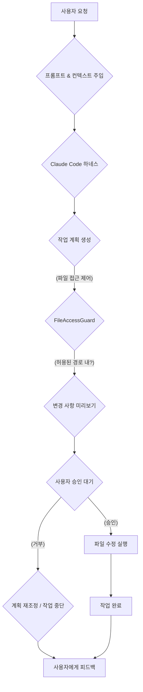

기술 블로그 커뮤니티에서 코딩 에이전트의 사용자 경험에 대한 심층적인 논의는 Claude Code와 같은 하네스의 발전 방향을 제시한다. 특히 '명령 이해도'와 '불필요한 파일 수정 방지'는 사용자들이 에이전트를 신뢰하고 효율적으로 활용하는 데 있어 핵심적인 요구사항이다. 본 문서는 이러한 피드백을 분석하고 Claude Code 하네스에 적용할 수 있는 구체적인 개선 전략을 제시한다.

## 코드 에이전트 사용자 경험의 핵심 과제
코딩 에이전트의 활용이 증가하면서, 사용자들이 겪는 주된 문제점들은 몇 가지 패턴으로 수렴된다. 이러한 패턴을 이해하는 것은 하네스 개선의 출발점이다.

### 명령 이해도 (Instruction Following)
사용자가 제시한 요구사항을 정확히 해석하고 의도된 방향으로 작업을 수행하는 능력은 코딩 에이전트의 가장 기본적인 역할이다. 복잡하거나 모호한 지시를 받았을 때 에이전트가 이를 잘못 해석하여 불필요한 작업을 수행하거나, 핵심 요구사항을 놓치는 경우가 발생한다. 이는 특히 비전문가 사용자에게 더 큰 스트레스로 작용한다.

### 불필요한 파일 수정 방지 (Preventing Unintended File Modifications)
코드 에이전트가 주어진 작업을 수행하는 과정에서, 사용자가 명시적으로 지시하지 않은 파일을 수정하거나 새로운 파일을 생성하는 행위는 사용자 경험을 저해하는 주요 요인이다. 이는 코드베이스의 안정성을 해치고, 사용자가 에이전트의 변경 사항을 일일이 검토해야 하는 추가적인 부담을 안긴다. 개발자들은 에이전트가 예측 가능하고 통제 가능한 범위 내에서만 동작하기를 기대한다.

### 컨텍스트 관리 및 지속성 (Context Management and Persistence)
장기적인 프로젝트나 여러 단계로 이루어진 작업에서 에이전트가 이전 대화의 맥락이나 코드베이스의 전반적인 구조를 망각하는 경향은 비효율성을 초래한다. 각 상호작용이 독립적인 '단발성' 작업처럼 느껴지지 않도록, 에이전트의 컨텍스트 관리 능력은 필수적이다.

## Claude Code 하네스 개선 전략
위에서 언급된 사용자 피드백을 바탕으로 Claude Code 하네스를 개선하기 위한 구체적인 전략들은 다음과 같다.

### 1. 명확한 지시를 위한 프롬프트 정제 및 가이드라인
사용자의 의도를 에이전트가 명확히 파악하도록 돕는 프롬프트 엔지니어링 기법을 하네스 레벨에서 강화해야 한다. 특정 작업 유형에 맞는 구조화된 프롬프트 템플릿을 제공하고, 사용자에게 불필요한 파일을 지정하거나 특정 디렉토리 외에는 접근하지 않도록 명시적인 지시를 내릴 수 있는 UI/CLI 옵션을 제공한다.

```python
# 예: Claude Code 하네스에서의 파일 접근 제어 및 작업 지시
from claude_harness.agent_api import AgentAPI
from claude_harness.context import AgentContext
from claude_harness.guardrails import FileAccessGuard

def perform_code_refactoring(api: AgentAPI, context: AgentContext, target_file: str, instructions: str):
    """
    주어진 파일에 대해 코드 리팩토링을 수행하며, 특정 디렉토리 외 접근을 제한합니다.
    """
    with FileAccessGuard(allowed_paths=["./src", "./tests"]) as guard:
        try:
            # 에이전트에게 명령을 전달하기 전 컨텍스트를 주입
            context.add_instruction(f"리팩토링할 파일: {target_file}")
            context.add_instruction(f"작업 지시: {instructions}")
            context.add_instruction("주어진 target_file 외 다른 파일을 수정하거나 생성하지 마세요.")
            
            # AgentAPI를 통해 Claude Code에 작업 요청
            response = api.execute_task(
                task_type="code_refactoring",
                prompt=instructions,
                files=[target_file],
                context=context
            )
            
            if response.status == "success":
                print(f"리팩토링 성공: {response.output}")
            else:
                print(f"리팩토링 실패: {response.error_message}")
            
            # guard가 실제로 제한을 수행했는지 확인 (선택 사항)
            print(f"파일 접근 시도 기록: {guard.access_log}")
            
        except Exception as e:
            print(f"에이전트 작업 중 오류 발생: {e}")

# 사용 예시
# api_instance = AgentAPI(...)
# context_instance = AgentContext(...)
# perform_code_refactoring(api_instance, context_instance, "src/my_module.py", "불필요한 의존성을 제거하고 함수를 더 작게 분리하세요.")
```
이 Python 코드 예제는 `FileAccessGuard`를 활용하여 에이전트가 허용된 경로 내에서만 파일 작업을 수행하도록 제한하는 개념을 보여준다. `AgentContext`를 통해 명시적인 지시와 함께 `target_file` 외 다른 파일 수정 금지 명령을 전달한다.

### 2. 강력한 파일 접근 제어 및 변경 승인 워크플로우
에이전트가 파일을 수정하기 전에 사용자에게 변경 사항을 미리 보여주고 승인을 요청하는 `Approval Flow`를 도입한다. Git Diff 형식으로 변경 사항을 시각적으로 제시하고, 사용자가 승인한 후에만 실제 파일에 반영되도록 함으로써, 불필요한 변경을 방지하고 예측 가능성을 높인다.

### 3. 실시간 피드백 루프 및 자가 수정 메커니즘
에이전트의 작업 과정에서 실시간으로 사용자 피드백을 받을 수 있는 인터페이스를 제공한다. 예를 들어, 에이전트가 특정 작업을 계획했을 때, 그 계획을 사용자에게 미리 제시하고 수정할 기회를 주는 방식이다. 또한, 잘못된 지시를 파악하거나 예상치 못한 파일 변경 시도를 감지했을 때, 에이전트 스스로 작업을 중단하고 사용자에게 질문하도록 하는 자가 수정 로직을 강화한다.


이 Mermaid 다이어그램은 Claude Code 하네스 내에서 사용자 요청이 어떻게 처리되고, `FileAccessGuard`를 포함한 변경 승인 워크플로우를 거쳐 최종 파일 수정으로 이어지는지를 시각적으로 보여준다.

### 4. 지속적인 컨텍스트 전달 및 장기 메모리 통합
이전 세션의 작업 이력, 코드베이스의 특정 부분에 대한 학습 결과 등을 에이전트의 장기 메모리에 통합하여 지속적인 컨텍스트를 제공한다. 이는 에이전트가 반복적인 설명을 요구하지 않고도 프로젝트 전반에 대한 이해를 유지할 수 있도록 돕는다.

## 트레이드오프

*   **정확한 명령 이해도 및 파일 수정 제어 강화**:
    *   **언제 좋은가**: 에이전트의 예측 불가능성을 줄이고, 코드베이스의 무결성을 유지하며, 사용자의 통제권을 강화할 때. 특히 프로덕션 코드에 대한 변경 시나 중요한 리팩토링 작업 시 필수적이다.
    *   **언제 나쁜가**: 빠른 프로토타이핑이나 실험적인 코드 생성처럼 에이전트의 자율성에 더 큰 자유를 부여하여 창의적인 탐색을 유도해야 할 때, 과도한 제어는 속도를 저해하고 에이전트의 잠재력을 제한할 수 있다.

*   **실시간 피드백 루프 및 승인 워크플로우 도입**:
    *   **언제 좋은가**: 에이전트의 실수를 즉시 교정하고, 사용자가 작업 흐름에 대한 신뢰를 얻으며, 복잡하고 위험도가 높은 작업의 안정성을 보장할 때.
    *   **언제 나쁜가**: 간단하고 반복적인 작업에서 매번 승인 단계를 거치는 것은 작업 속도를 현저히 떨어뜨리고 사용자의 피로도를 높일 수 있다. 완전 자동화가 목표인 시나리오에서는 오히려 방해가 된다.

*   **지속적인 컨텍스트 전달 및 장기 메모리 통합**:
    *   **언제 좋은가**: 장기 프로젝트에서 에이전트가 일관된 이해를 바탕으로 작업을 수행하고, 반복적인 설명이 필요 없을 때. 복잡한 코드베이스의 구조를 유지하며 작업할 때 매우 효율적이다.
    *   **언제 나쁜가**: 컨텍스트 관리에 필요한 리소스(토큰, 메모리)가 증가하여 비용 효율성이 저하될 수 있으며, 오래된 컨텍스트가 오히려 잘못된 가정으로 이어질 수 있는 경우. 짧고 독립적인 단발성 작업에는 과도한 오버헤드일 수 있다.

## 실전 체크리스트

*   [ ] **명령 이해도 측정**: 새로운 프롬프트 템플릿 적용 후, 에이전트가 사용자의 의도를 90% 이상 정확히 파악하는지 정량적 지표로 측정했는가? (예: 작업 성공률, 불필요한 수정률)
*   [ ] **파일 접근 제어 가드레일 활성화**: 모든 파일 수정 요청에 대해 `FileAccessGuard` 또는 유사한 메커니즘이 기본적으로 활성화되어 있으며, 허용된 경로 외 접근 시도 시 에러가 발생하는지 확인했는가?
*   [ ] **변경 승인 워크플로우 구현**: 에이전트가 코드 변경을 제안할 때, Git Diff 형식으로 사용자에게 제시하고 명시적인 승인 없이는 파일이 수정되지 않도록 구현했는가?
*   [ ] **컨텍스트 지속성 검증**: 5회 이상의 다단계 작업에서 에이전트가 이전 단계의 컨텍스트를 유지하며 일관된 응답을 제공하는지 시나리오 테스트를 통해 확인했는가?
*   [ ] **자가 수정 로직 테스트**: 에이전트가 잘못된 지시를 받았을 때, 이를 인지하고 사용자에게 추가 정보를 요청하거나 작업을 중단하는 자가 수정 로직이 정상 작동하는지 검증했는가?
*   [ ] **사용자 피드백 인터페이스 통합**: 에이전트 작업 중 사용자 피드백을 실시간으로 수집하고, 이를 에이전트의 다음 행동에 반영할 수 있는 UI/CLI 메커니즘을 제공하는가?
*   [ ] **성능 및 비용 영향 분석**: 개선된 제어 및 컨텍스트 관리 메커니즘이 에이전트의 응답 시간(Latency) 및 토큰 사용량(Cost)에 미치는 영향을 분석하고 허용 가능한 범위 내에 있는지 확인했는가?