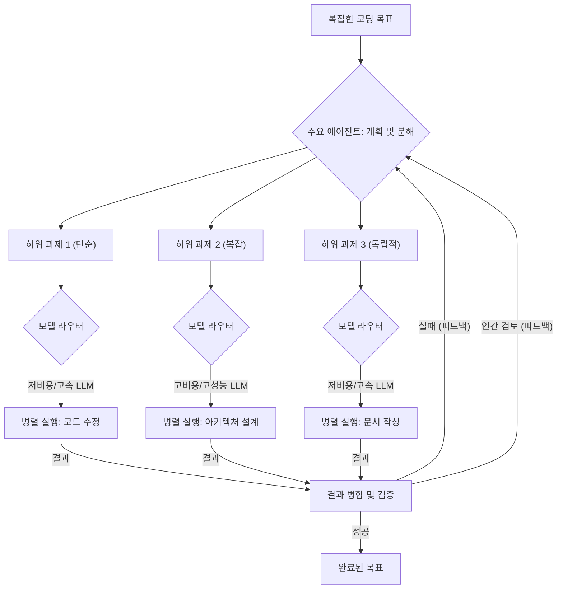

코딩 에이전트는 발전했지만, 복잡한 코딩 목표를 처리할 때 작업 관리, 위임, 그리고 모델 선택에서 병목 현상을 겪습니다. `playbook` 내 `Claude Code harness`와 같은 시스템에서, 단일 LLM에 의존하는 방식은 느린 실행, 높은 토큰 비용, 그리고 비효율적인 리소스 활용으로 이어집니다. 본 문서는 이러한 병목 현상을 해결하기 위한 전략, 특히 하위 과제 분할과 모델별 위임의 효율성에 중점을 둡니다.

## 에이전트 병목 현상의 핵심 원인

*   **모놀리식 태스크 처리**: 단일 LLM이 큰 문제를 한 번에 해결하려 시도하여 컨텍스트 과부하 및 추론 오류가 발생합니다.
*   **비효율적인 모델 위임**: 강력하고 비싼 LLM이 사소한 하위 과제에까지 사용되어 비용이 비대해집니다.
*   **순차적 실행 제약**: 독립적인 하위 과제들이 병렬 처리되지 않아 전체 작업 시간이 길어집니다.
*   **과도한 컨텍스트 주입**: 불필요한 코드베이스 컨텍스트가 LLM에 반복적으로 주입되어 토큰 사용량이 증가합니다.

## 전략적 병목 현상 해결 방안

### 계층적 태스크 분해 및 하위 과제 위임 (Hierarchical Task Decomposition & Subtask Delegation)
복잡한 코딩 목표를 체계적으로 분해하고, 초기 계획 단계에서는 비용 효율적인 LLM(예: Claude Sonnet)을 활용하여 워크플로를 스케치합니다. `playbook`의 에이전트 하네스는 이 분해 과정을 구조화된 `plan` 객체로 관리하여 명확한 지침을 제공해야 합니다.

### 동적 모델 라우팅 및 최적화된 LLM 선택 (Dynamic Model Routing & Optimized LLM Selection)
각 하위 과제의 특성(복잡도, 컨텍스트 크기, 비용, 속도)에 따라 가장 적합한 LLM을 동적으로 선택합니다. 고비용/고성능 모델은 복잡한 로직 및 아키텍처 설계에, 저비용/고속 모델은 간단한 코드 생성이나 문서화에 위임합니다. `Claude Code harness` 내 LLM 라우터는 이러한 기준에 따라 모델을 지능적으로 선택해야 합니다.

### 병렬 실행 메커니즘 및 결과 병합 (Parallel Execution Mechanisms & Result Merging)
독립적인 하위 과제는 동시에 실행되어 전체 작업 시간을 단축합니다. `Claude Code harness`는 각 병렬 작업에 격리된 실행 환경(예: `git worktree`)을 제공하고, 완료된 결과를 안전하게 병합하는 전략(예: 자동 코드 병합)을 포함해야 합니다.

### 컨텍스트 효율성 최적화 (Context Efficiency Optimization)
LLM에 전달되는 컨텍스트는 현재 하위 과제에 가장 관련성이 높은 정보로 엄격하게 제한되어야 합니다. RAG(Retrieval Augmented Generation)나 지식 그래프를 활용하여 토큰 사용량을 줄이고, LLM이 핵심 문제에 집중하도록 돕습니다.

### 지속적인 피드백 루프 및 자기 개선 (Continuous Feedback Loops & Self-Improvement)
자동화된 검증 및 피드백 시스템을 통해 에이전트의 실행 결과를 평가하고, 이를 바탕으로 미래의 태스크 분해 및 모델 위임 전략을 개선합니다. 이를 통해 `Claude Code harness`는 자율 학습 시스템으로 발전할 수 있습니다.


이 다이어그램은 메인 에이전트가 복잡한 코딩 목표를 분해하고, 각 하위 과제를 동적 모델 라우터를 통해 적절한 LLM에 위임하며, 병렬로 실행한 후 결과를 통합하고 검증하는 과정을 보여줍니다. 실패 시에는 피드백 루프를 통해 초기 계획 단계로 돌아가 개선된 전략을 재시도합니다.

## 예시: Claude Code Harness 내 하위 과제 처리 흐름 (Python-like Pseudocode)

```python
class ClaudeCodeHarness:
    def __init__(self, models_config):
        self.models = models_config
        self.task_manager = TaskManager()
        self.executor = ParallelExecutor()

    def resolve_coding_goal(self, goal: str, codebase_context: dict) -> str:
        plan_llm = self.models["sonnet"] # 경량 모델로 초기 계획
        initial_plan = plan_llm.generate_plan(goal, codebase_context)
        subtasks = self.task_manager.decompose(initial_plan)

        for subtask_id, subtask_details in subtasks.items():
            model_for_subtask = self._select_llm_for_subtask(subtask_details)
            relevant_context = self._get_relevant_context(subtask_details, codebase_context)
            self.executor.add_task(subtask_id, model_for_subtask.execute(subtask_details, relevant_context))

        completed_results = self.executor.run_all()
        final_code = self.task_manager.aggregate_results(goal, completed_results)
        return final_code

    def _select_llm_for_subtask(self, subtask_details: dict):
        if "complex_logic" in subtask_details["type"] or subtask_details["context_size"] > 100000:
            return self.models["opus"] # 고성능 모델
        else:
            return self.models["sonnet"] # 기본값 (저비용/고속)

    def _get_relevant_context(self, subtask_details: dict, global_context: dict) -> dict:
        # RAG, Knowledge Graph 등을 활용하여 필요한 컨텍스트만 필터링
        return {"relevant_files": ["file_a.py", "file_b.py"], "dependencies": ["dep_x", "dep_y"]}

class TaskManager:
    def decompose(self, plan):
        return {"subtask_1": {"type": "syntax_fix"}, "subtask_2": {"type": "implement_feature"}}

    def aggregate_results(self, goal, results):
        return "merged_final_code"

class ParallelExecutor:
    def __init__(self):
        self.tasks = {}

    def add_task(self, task_id, callable_task):
        self.tasks[task_id] = callable_task

    def run_all(self):
        # 비동기적으로 모든 태스크 실행
        return {"subtask_1": "result_code_1", "subtask_2": "result_code_2"}
```
이 의사 코드는 `Claude Code harness`가 복잡한 코딩 목표를 어떻게 처리하는지에 대한 개요를 제공합니다. 목표를 분해하고, 각 하위 과제에 적합한 LLM을 선택하며, 병렬로 실행한 다음 결과를 병합하는 과정을 포함합니다.

## 트레이드오프

*   **복잡성 vs. 효율성 (Complexity vs. Efficiency)**
    *   **언제 좋은가**: 대규모 코드베이스와 복잡한 요구사항에서 개발 시간을 단축하고 LLM 비용을 최적화할 때 매우 효과적입니다.
    *   **언제 나쁜가**: 소규모, 단발성 작업이나 초기 프로토타이핑에서는 설정 및 관리 오버헤드가 더 커서 비효율적일 수 있습니다.

*   **비용 절감 vs. 개발 및 운영 오버헤드 (Cost Savings vs. Development & Operations Overhead)**
    *   **언제 좋은가**: LLM API 호출 비용이 중요한 프로덕션 환경에서, 최적의 모델 선택으로 운영 비용을 크게 절감할 수 있습니다.
    *   **언제 나쁜가**: 다양한 LLM API 통합, 동적 라우팅 로직 개발, 병렬 실행 환경 구축 및 모니터링에 상당한 엔지니어링 리소스가 필요합니다.

*   **자율성 vs. 제어 및 예측 가능성 (Autonomy vs. Control & Predictability)**
    *   **언제 좋은가**: 에이전트의 자율성이 높아질수록 인간 개입 없이 더 많은 작업을 처리하여 개발 속도와 확장성을 확보합니다.
    *   **언제 나쁜가**: 자율적인 태스크 분해 및 모델 위임은 에이전트 행동을 예측하기 어렵게 만들 수 있으며, 예기치 않은 결과 발생 시 디버깅이 어려워질 수 있습니다.

## 실전 체크리스트

이 전략을 `playbook`의 `Claude Code harness`에 적용할 때 다음 항목을 검증해야 합니다.

- [ ] **태스크 분해 가이드라인 명확화**: 메인 에이전트가 복잡한 코딩 목표를 최소 5개 이상의 구체적인 하위 과제로 일관되게 분해하는지 확인합니다. 초기 계획 LLM의 프롬프트가 명확한 분해 기준을 포함하는지 점검합니다.
- [ ] **동적 모델 라우팅 규칙 정의 및 테스트**: 각 하위 과제 유형에 대해 어떤 LLM(예: Opus, Sonnet, Flash)이 사용되어야 하는지 명확한 라우팅 정책을 수립하고, 다양한 시나리오에서 올바르게 적용되는지 테스트합니다.
- [ ] **병렬 실행 하네스 안정성 검증**: 동시에 실행되는 하위 과제가 서로 간섭하지 않고, 예상된 시간 내에 완료되며, 실패 시 적절히 재시도 또는 폴백 메커니즘이 동작하는지 테스트합니다. `git worktree` 기반 격리 환경을 확인합니다.
- [ ] **컨텍스트 필터링 효율성 측정**: LLM에 전달되는 컨텍스트의 평균 토큰 수가 이전 대비 최소 20% 이상 감소했는지, 그러면서도 작업 성공률에 부정적인 영향이 없는지 지표를 통해 확인합니다.
- [ ] **하위 과제 결과 자동 병합 정확도 확보**: 병렬 완료된 하위 과제의 코드 변경 사항이 충돌 없이 메인 브랜치로 자동 병합되고, 병합 후 통합 테스트가 성공하는지 검증합니다.
- [ ] **비용 및 성능 지표 모니터링**: 에이전트 실행당 총 토큰 사용량, LLM API 비용, 전체 작업 완료 시간(TTM)이 최적화 전략 적용 후 유의미하게 개선되었는지 지속적으로 모니터링합니다.
- [ ] **자기 개선 피드백 루프 구현**: 실패한 하위 과제로부터 학습하여 다음 유사 태스크 처리 시 분해 및 위임 전략을 자동으로 조정하는 메커니즘(예: Rationale Storage)이 구현되어 있는지 확인합니다.