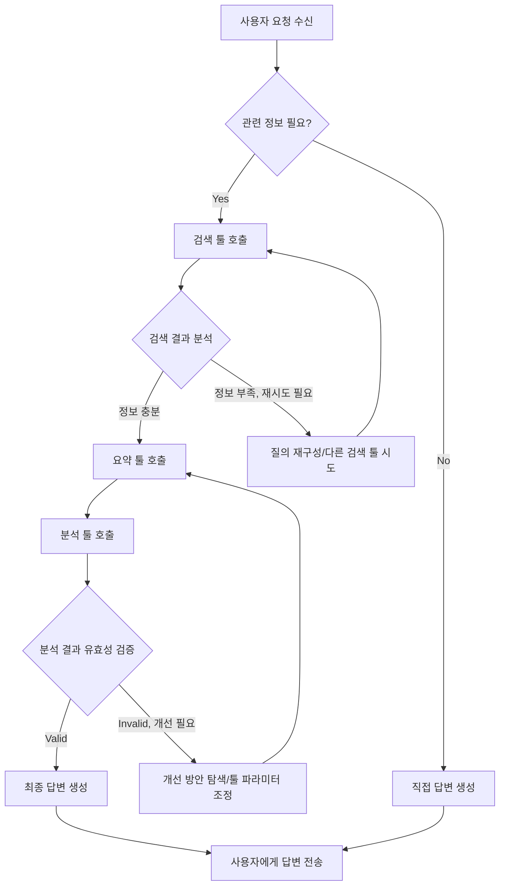

AI 에이전트가 단순한 질의응답을 넘어 실제 세계의 복잡한 문제를 해결하기 위해서는 외부 툴과의 유기적인 연동이 필수적입니다. 특히 여러 툴을 순차적, 병렬적, 혹은 조건부로 연결하여 목표를 달성하는 '툴 체이닝 (Tool Chaining)'은 에이전트의 실용성과 성능을 결정짓는 핵심 요소입니다. 이 엔트리에서는 AI 에이전트의 복잡한 툴 체이닝을 설계하는 고급 디자인 패턴을 다룹니다.

## 툴 체이닝의 중요성 및 도전 과제

AI 에이전트가 진정한 자율성을 갖기 위해서는 특정 도메인 지식이나 실시간 데이터 접근, 외부 시스템 제어 등 LLM (Large Language Model) 자체의 한계를 보완할 수 있는 툴이 필요합니다. 이러한 툴들을 효과적으로 조합하여 복잡한 태스크를 수행하는 것이 툴 체이닝의 목적입니다. 그러나 이 과정은 다음과 같은 도전 과제를 안고 있습니다:

*   **복잡성 증가**: 툴의 수가 늘어나고, 각 툴의 입출력 종속성이 복잡해질수록 전체 워크플로우의 설계 및 관리가 어려워집니다.
*   **에러 핸들링**: 중간 단계에서 발생하는 에러를 어떻게 감지하고 복구할 것인지에 대한 견고한 전략이 필요합니다.
*   **효율성**: 불필요한 툴 호출을 최소화하고, 병렬 처리를 통해 Latency를 줄이는 최적화가 중요합니다.
*   **동적 결정**: 고정된 체인이 아닌, 실행 시점에 따라 최적의 툴과 순서를 동적으로 결정하는 능력이 요구됩니다.

## 고급 툴 체이닝 디자인 패턴

### 1. 동적 툴 선택 및 스케줄링 (Dynamic Tool Selection & Scheduling)

에이전트가 현재 상황, 목표, 사용 가능한 툴의 기능 및 이전 실행 결과를 바탕으로 다음에 어떤 툴을 사용할지, 어떤 순서로 실행할지를 동적으로 결정하는 패턴입니다. 이는 ReAct (Reasoning and Acting) 패턴의 확장으로 볼 수 있으며, 단순히 하나의 툴을 선택하는 것을 넘어 전체적인 실행 계획을 수립하고, 중간에 계획을 수정하는 Self-Correction 메커니즘을 포함합니다. 2026년 트렌드에서는 이 부분이 더욱 정교해져, 툴 사용의 성공 확률과 예상 비용까지 고려하는 인텔리전트 스케줄링이 강조됩니다.

### 2. 조건부 분기 체이닝 (Conditional Branching Chaining)

특정 툴의 실행 결과나 에이전트의 내부 상태에 따라 다음 툴 체인의 경로가 달라지는 패턴입니다. `if-else` 로직과 유사하며, 다양한 시나리오에 유연하게 대응할 수 있도록 에이전트의 의사결정 능력을 향상시킵니다.

### 3. 병렬 실행 및 결과 병합 (Parallel Execution & Result Merging)

서로 독립적인 툴 호출들을 병렬적으로 실행하여 전체 Latency를 줄이고, 이들의 결과를 통합하여 다음 단계로 전달하는 패턴입니다. 예를 들어, 사용자 질의를 분석하며 동시에 여러 데이터 소스에서 정보를 검색하는 경우에 유용합니다.

### 4. 피드백 루프 및 재시도 (Feedback Loop & Retry Mechanisms)

툴 실행 후 그 결과를 평가하여, 만족스럽지 못할 경우 다른 툴을 시도하거나, 이전 단계로 돌아가 재시도하는 패턴입니다. 이는 에이전트의 Robustness와 Self-Correction 능력을 크게 향상시킵니다. 단순한 재시도를 넘어, 실패 원인을 분석하고 툴 호출 파라미터를 조정하거나 다른 툴을 선택하는 형태로 발전합니다.

### 5. 계층적 오케스트레이션 (Hierarchical Orchestration)

복잡한 태스크를 더 작은 서브태스크로 분해하고, 각 서브태스크를 처리하는 데 특화된 하위 에이전트나 툴 체인 관리자를 두는 패턴입니다. 상위 에이전트는 전체 목표를 조율하고, 하위 에이전트는 특정 도메인 내에서 효율적인 툴 체이닝을 담당합니다. 이는 대규모 시스템에서 관리 용이성과 모듈성을 높이는 데 기여합니다.

## 코드 예제: 파이썬 기반의 간단한 툴 체이닝 오케스트레이터

다음은 동적 툴 선택과 조건부 분기를 개념적으로 구현한 Python 예제입니다. 실제 프로덕션 환경에서는 `langchain`, `LlamaIndex` 등 프레임워크를 활용하지만, 여기서는 핵심 로직에 집중합니다.

```python
from typing import Dict, Any, Callable

class Tool:
    def __init__(self, name: str, description: str, func: Callable):
        self.name = name
        self.description = description
        self.func = func

    def execute(self, **kwargs) -> Any:
        print(f"Executing tool: {self.name} with args: {kwargs}")
        return self.func(**kwargs)

class AgentOrchestrator:
    def __init__(self, tools: Dict[str, Tool]):
        self.tools = tools

    def search_web(self, query: str) -> str:
        # Simulate web search API call
        return f"Search results for '{query}': AI agent trends in 2026..."

    def summarize_text(self, text: str, length: str = "short") -> str:
        # Simulate text summarization API call
        return f"A {length} summary of: {text[:50]}..."

    def analyze_data(self, data: str) -> str:
        # Simulate data analysis tool
        return f"Analysis of '{data[:50]}...': Key insights extracted."

    def run_workflow(self, initial_query: str) -> str:
        context = {"query": initial_query, "results": []}
        print(f"Initial Query: {initial_query}")

        # Step 1: Dynamic Tool Selection - Decide if web search is needed
        if "trends" in initial_query.lower() or "latest" in initial_query.lower():
            selected_tool = self.tools["web_search"]
            web_results = selected_tool.execute(query=initial_query)
            context["results"].append(web_results)
            print(f"Web Search Result: {web_results[:70]}...")

            # Step 2: Conditional Branching - If web results are significant, summarize
            if len(web_results) > 100:
                summary_tool = self.tools["summarizer"]
                short_summary = summary_tool.execute(text=web_results, length="short")
                context["results"].append(short_summary)
                print(f"Summary: {short_summary}")
                
                # Step 3: Iterate - Analyze the summary for deeper insights (conceptual feedback loop)
                analysis_tool = self.tools["data_analyzer"]
                final_analysis = analysis_tool.execute(data=short_summary)
                context["results"].append(final_analysis)
                print(f"Final Analysis: {final_analysis}")
            else:
                context["results"].append("Not enough web content for detailed summary and analysis.")
                print("Skipping detailed summary and analysis due to limited web content.")
        else:
            context["results"].append(f"Direct response to: {initial_query}")
            print(f"Direct Response: Direct response to {initial_query}")

        return "Workflow Completed. Final Context: " + str(context["results"])

# Instantiate tools
web_search_tool = Tool("web_search", "Searches the web for information.", AgentOrchestrator(None).search_web)
summarizer_tool = Tool("summarizer", "Summarizes given text.", AgentOrchestrator(None).summarize_text)
data_analyzer_tool = Tool("data_analyzer", "Analyzes text data for insights.", AgentOrchestrator(None).analyze_data)

# Create orchestrator with available tools
orchestrator = AgentOrchestrator({
    "web_search": web_search_tool,
    "summarizer": summarizer_tool,
    "data_analyzer": data_analyzer_tool
})

# Run a workflow
orchestrator.run_workflow("What are the latest AI agent trends in 2026?")
orchestrator.run_workflow("Tell me about Python programming.")
```

## 툴 체이닝 흐름 (Mermaid Diagram)

다음 Mermaid 다이어그램은 조건부 분기 및 피드백 루프를 포함하는 복잡한 툴 체이닝의 한 예시를 보여줍니다.



## 트레이드오프

툴 체이닝 디자인 패턴을 적용할 때는 다음과 같은 트레이드오프를 고려해야 합니다.

*   **복잡성 vs. 유연성**: 동적 툴 선택, 조건부 분기와 같은 고급 패턴은 에이전트의 유연성을 극대화하지만, 설계 및 디버깅의 복잡성을 크게 증가시킵니다. 간단한, 예측 가능한 워크플로우에는 오버헤드가 클 수 있습니다.
    *   **언제 좋고**: 다양한 시나리오와 예상치 못한 상황에 대처해야 하는 범용 에이전트 개발 시. 유연한 문제 해결 능력이 필수적인 경우.
    *   **언제 나쁜지**: 특정 목적에 최적화된 단순 반복 태스크 에이전트, 높은 성능과 낮은 지연 시간이 요구되는 상황. 설계 및 유지보수 비용이 큰 제약이 될 때.
*   **성능 vs. 견고성**: 피드백 루프와 재시도 메커니즘은 에이전트의 견고성과 신뢰성을 높이지만, 실패 시 추가적인 툴 호출과 처리가 발생하여 전체 실행 시간이 길어질 수 있습니다.
    *   **언제 좋고**: 미션 크리티컬한 태스크, 에러 발생 시 치명적인 결과를 초래할 수 있는 경우, 높은 신뢰성과 자율적인 문제 해결 능력이 중요한 경우.
    *   **언제 나쁜지**: 실시간 응답이 필수적이거나, 툴 호출 비용이 매우 높은 경우. 단순한 실패는 사용자에게 보고하고 종료하는 것이 더 효율적인 경우.
*   **정적 체인 vs. 동적 체인**: 정적 체인은 예측 가능하고 구현이 단순하지만, 새로운 툴 추가나 환경 변화에 대한 대응력이 떨어집니다. 동적 체인은 높은 적응력을 제공하지만, 런타임 결정 로직의 복잡성으로 인해 예측 불가능성이 증가할 수 있습니다.
    *   **언제 좋고**: 변화무쌍한 환경에서 에이전트가 새로운 상황에 스스로 적응하며 문제를 해결해야 할 때. 장기적인 관점에서 유지보수 및 확장성이 중요한 경우.
    *   **언제 나쁜지**: 엄격한 제어와 예측 가능한 동작이 요구되는 규제 준수 환경, 짧은 개발 기간 내에 안정적인 시스템 구축이 필요한 경우.

## 실전 체크리스트

복잡한 툴 체이닝 디자인 패턴을 프로젝트에 적용할 때 다음 항목들을 검증합니다.

*   [ ] **툴 메타데이터 정의**: 각 툴의 기능, 입출력 스키마, 사용 예시를 명확하게 정의하고 자동화된 검증 메커니즘을 갖추었는가?
*   [ ] **에러 핸들링 전략**: 각 툴 호출의 실패 시 재시도, 폴백 (Fallback), 에러 전파 (Error Propagation) 등 명확한 에러 핸들링 전략이 구현되어 있으며 테스트되었는가?
*   [ ] **동적 결정 로직 감사**: 에이전트가 툴을 동적으로 선택하고 체인을 구성하는 로직이 의도대로 동작하는지, 불필요하거나 비효율적인 경로로 빠지지 않는지 정기적으로 감사하고 최적화하는가?
*   [ ] **관측 가능성 (Observability)**: 툴 호출 순서, 각 툴의 입출력, 실행 시간, 성공/실패 여부 등 툴 체이닝의 전체 과정을 시각화하고 모니터링할 수 있는 대시보드와 로깅 시스템이 구축되어 있는가?
*   [ ] **보안 및 권한 관리**: 에이전트가 외부 툴에 접근할 때 최소 권한 원칙 (Principle of Least Privilege)에 따라 안전하게 인증 및 권한이 부여되는가? 툴 사용 시 데이터 유출 위험은 없는가?
*   [ ] **비용 최적화**: 툴 호출 비용을 모니터링하고, 불필요한 호출을 줄이거나 더 저렴한 대안을 선택할 수 있는 비용 최적화 로직이 포함되어 있는가?
*   [ ] **성능 벤치마킹**: 다양한 툴 체이닝 시나리오에 대해 Latency, Throughput, 성공률 등의 성능 지표를 정기적으로 측정하고, 병목 현상을 식별하며 개선하는 프로세스가 있는가?