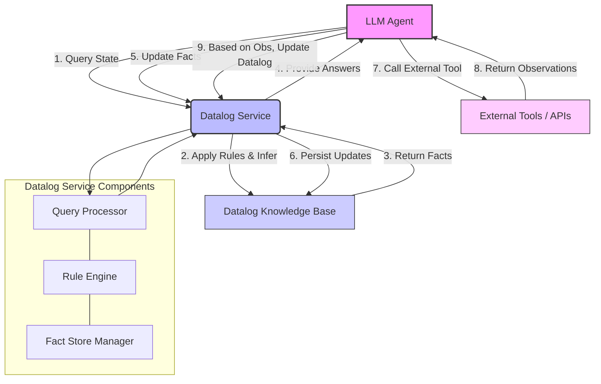

LLM 에이전트의 활용이 심화되면서, 장기적인 상호작용과 복잡한 문제 해결 과정에서 발생하는 `메모리(memory)` 문제는 중요한 도전 과제로 부상했습니다. 특히, 과거의 대화나 추론 결과에 대한 의존성 때문에 에이전트가 이미 폐기된 가설을 다시 제안하거나, 잘못된 전제에서 도출된 결론을 지속적으로 고수하는 문제가 자주 관찰됩니다. 이는 단순히 `검색 증강 생성(RAG, Retrieval Augmented Generation)` 시스템으로 과거 대화를 다시 불러오는 방식으로는 해결하기 어렵습니다. RAG는 특정 문서나 지식을 검색하여 컨텍스트에 추가하는 데 효과적이지만, `현재 무엇이 참(true)인지`에 대한 에이전트의 일관된 `상태(state)`를 관리하고 논리적으로 추론하는 데는 한계가 있습니다. 이러한 문제들을 해결하기 위해 `Datalog` 기반의 `영구 메모리 서비스(Persistent Memory Service)`는 강력한 대안을 제시합니다.

## Datalog의 핵심 개념 및 에이전트 메모리로의 적용

Datalog는 `논리 프로그래밍(Logic Programming)` 패러다임에 기반한 선언적(declarative) 쿼리 언어로, 주로 관계형 데이터베이스(relational databases)나 지식 그래프(knowledge graphs)에서 복잡한 `추론(reasoning)`을 수행하는 데 사용됩니다. Datalog는 `사실(facts)`과 `규칙(rules)`의 집합으로 지식을 표현하며, 이들을 기반으로 새로운 사실을 `추론(infer)`합니다. 이는 LLM 에이전트의 `장기 기억(long-term memory)` 시스템에 `결정론적(deterministic)`이고 `일관적인(consistent)` 상태 관리를 제공하는 데 매우 적합합니다.

**사실 (Facts):** 에이전트가 직접 관찰하거나 학습한 기본 정보입니다. 예를 들어, 보안 취약점 분석 에이전트의 경우 다음과 같은 사실을 가질 수 있습니다.

```datalog
is_vulnerable("CVE-2023-1234", "application_A").
software_version("application_A", "1.0.0").
has_patch("CVE-2023-1234", "1.0.1").
```

**규칙 (Rules):** 알려진 사실을 바탕으로 새로운 사실을 추론하는 논리적 명제입니다. 예를 들어, 패치되지 않은 취약점을 식별하는 규칙은 다음과 같습니다.

```datalog
unpatched_vulnerability(CVE, App) :-
  is_vulnerable(CVE, App),
  software_version(App, CurrentVersion),
  NOT has_patch(CVE, CurrentVersion).
```

이러한 Datalog 시스템은 LLM 에이전트가 `과거 대화의 내용` 대신 `현재 참인 지식`을 기반으로 의사결정을 내리도록 돕습니다. 에이전트가 특정 작업을 수행할 때, Datalog 메모리에 저장된 사실과 규칙을 쿼리하여 현재 상황에 대한 정확하고 일관된 이해를 얻을 수 있습니다. 이는 LLM의 `환각(hallucination)`을 줄이고, `자기 수정(self-correction)` 능력을 강화하며, 반복적인 오류를 방지하는 데 핵심적인 역할을 합니다. 긱뉴스 기사에서 언급된 Lemmalog 개념과 같이, Datalog는 에이전트의 현재 `상태(state)`를 엄격하게 관리하고 `전제(premises)`의 유효성을 지속적으로 검증하는 데 효과적입니다.

## 시스템 아키텍처 및 구현 고려사항

Datalog 기반 영구 메모리 서비스를 LLM 에이전트에 통합하기 위한 일반적인 아키텍처는 다음과 같습니다. LLM 에이전트는 특정 작업 수행 중 Datalog 서비스에 쿼리를 보내거나, 새로운 사실을 업데이트하여 메모리 상태를 변경합니다. 이 서비스는 에이전트의 `핵심 논리(core logic)`와 `외부 도구(external tools)` 사용을 위한 `지식 기반(knowledge base)` 역할을 합니다.



**구현 시 고려사항:**

*   **LLM-Datalog 인터페이스:** LLM이 자연어 프롬프트를 통해 Datalog 쿼리를 생성하고, 쿼리 결과를 해석하여 에이전트의 다음 행동을 결정하는 방식이 필요합니다. 이는 `프롬프트 엔지니어링(Prompt Engineering)`을 통해 Datalog 스키마(스키마는 사실, 규칙의 이름과 인자 정의)를 LLM에게 효과적으로 노출하여 LLM이 올바른 쿼리를 구성하도록 유도해야 합니다. 예를 들어, `클로드 코드 하네스(Claude Code Harness)` 환경에서 에이전트가 코드 베이스 분석을 위해 Datalog 메모리를 사용하는 경우, `function_exists(FunctionName)`와 같은 쿼리를 생성하도록 가이드할 수 있습니다.
*   **상태 업데이트 전략:** 에이전트의 새로운 관찰이나 행동 결과는 Datalog 메모리의 사실을 업데이트하는 데 사용됩니다. 이때, 단순히 새로운 사실을 추가하는 것을 넘어, 기존 사실을 `철회(retract)`하거나 `수정(modify)`하는 메커니즘이 중요합니다. 예를 들어, `취약점 해결(has_patch)`이라는 새로운 사실이 추가되면, `패치되지 않은 취약점(unpatched_vulnerability)` 규칙에 의해 자동으로 해당 취약점은 더 이상 `unpatched` 상태가 아니라고 추론되어야 합니다.
*   **성능 최적화:** 복잡한 Datalog 규칙과 대규모 사실 집합에 대한 쿼리 성능은 에이전트의 응답 속도에 직접적인 영향을 미칩니다. `인덱싱(indexing)`, `쿼리 최적화(query optimization)`, `증분 추론(incremental reasoning)` 기법을 고려해야 합니다.

## Datalog 기반 메모리 예시

다음은 Python과 `pyDatalog` 라이브러리를 사용한 간단한 Datalog 기반 에이전트 메모리 예시입니다. 이 예시는 에이전트가 특정 코드 모듈에 `버그(bug)`가 있을 가능성을 추론하고, 그 상태를 관리하는 방법을 보여줍니다.

```python
from pyDatalog import Datalog

# Datalog 초기화
Datalog(clear_all=True)

# 사실(Facts) 정의
# bug_reported(module_name, issue_id)
+ Datalog.bug_reported("auth_module", "ISSUE-101")
+ Datalog.bug_reported("data_parser", "ISSUE-102")

# recent_commit(module_name, commit_hash)
+ Datalog.recent_commit("auth_module", "abc1234")
+ Datalog.recent_commit("data_parser", "def5678")
+ Datalog.recent_commit("network_lib", "ghi9012")

# developer_assigned(module_name, developer_name)
+ Datalog.developer_assigned("auth_module", "Alice")
+ Datalog.developer_assigned("data_parser", "Bob")

# 규칙(Rules) 정의
# high_priority_bug(Module) :- bug_reported(Module, Issue), recent_commit(Module, _)
# 최근 커밋이 있는 모듈에서 버그가 보고되면 높은 우선순위로 간주합니다.
Datalog.high_priority_bug(Module) <= (
    Datalog.bug_reported(Module, Issue) &
    Datalog.recent_commit(Module, Commit)
)

# needs_investigation(Module, Dev) :- high_priority_bug(Module), developer_assigned(Module, Dev)
# 높은 우선순위 버그가 있는 모듈에 개발자가 할당되어 있으면 조사가 필요하다고 추론합니다.
Datalog.needs_investigation(Module, Dev) <= (
    Datalog.high_priority_bug(Module) &
    Datalog.developer_assigned(Module, Dev)
)

# 쿼리(Query) 실행
print("Reported bugs:")
print(Datalog.bug_reported(Module, Issue).data)

print("\nHigh priority bugs:")
print(Datalog.high_priority_bug(Module).data)

print("\nModules needing investigation and assigned developer:")
print(Datalog.needs_investigation(Module, Dev).data)

# 에이전트가 새로운 정보(사실)를 추가합니다.
print("\n--- Agent updates memory ---")
+ Datalog.bug_reported("network_lib", "ISSUE-103")

print("\nHigh priority bugs after update:")
print(Datalog.high_priority_bug(Module).data)

print("\nModules needing investigation after update:")
print(Datalog.needs_investigation(Module, Dev).data)
```

이 예시에서 에이전트는 새로운 버그 보고서를 Datalog 메모리에 추가함으로써 `high_priority_bug` 및 `needs_investigation`과 같은 규칙에 따라 자동으로 새로운 추론을 수행할 수 있습니다. 이는 에이전트가 매번 전체 컨텍스트를 재처리할 필요 없이, `현재의 사실`을 기반으로 `지속적으로 업데이트되는 지식(continuously updated knowledge)`을 활용하도록 돕습니다.

## 트레이드오프

Datalog 기반 영구 메모리 시스템은 LLM 에이전트의 한계를 보완하지만, 도입에는 신중한 고려가 필요합니다.

*   **일관성과 신뢰성 (Consistency & Reliability)**
    *   **언제 좋은가**: LLM의 비결정론적 특성으로 인한 반복적인 오류(예: 폐기된 가설 재제안, 잘못된 전제 고수)를 해결해야 할 때 매우 유리합니다. 보안 취약점 분석, 복잡한 시스템 진단, 장기적인 코드 리팩토링 등 `정확성`과 `일관된 상태`가 필수적인 도메인에서 에이전트의 의사결정 신뢰도를 크게 높입니다.
    *   **언제 나쁜가**: 단순한 정보 검색이나 창의적인 텍스트 생성 등 `엄격한 논리적 일관성`보다 `다양한 정보의 취합`이 중요한 태스크에서는 초기 Datalog 모델링의 복잡성 대비 이점이 적을 수 있습니다.

*   **설명 가능성 (Explainability)**
    *   **언제 좋은가**: 에이전트가 특정 판단을 내린 `근거(rationale)`를 명확히 추적해야 할 때 유리합니다. Datalog의 추론 과정은 명시적인 사실과 규칙의 적용으로 이루어지므로, 에이전트의 의사결정을 `감사(audit)`하거나 `디버깅(debugging)`하기 용이합니다. 이는 규제 준수가 요구되는 환경이나 `책임감 있는 AI(Responsible AI)` 개발에 필수적입니다.
    *   **언제 나쁜가**: 빠르게 변화하는 `비정형 데이터(unstructured data)`에서 신속한 의미론적 검색 결과가 필요한 경우, Datalog의 논리적 추론 과정은 상대적으로 느릴 수 있으며, 검색 결과의 `순위(ranking)`나 `유사도(similarity)` 기반의 설명에는 적합하지 않습니다.

*   **강력한 상태 관리 (Robust State Management)**
    *   **언제 좋은가**: 에이전트의 현재 `전제(premises)`나 `상태(state)`가 정확하게 관리되어야 할 때 강력한 이점을 제공합니다. 특히, `과거 대화의 맥락(conversational context)`에서 발생할 수 있는 오류 전이(error propagation)를 방지하고 `현재 참인 지식`에 집중하여 에이전트의 `장기 기억(long-term memory)`을 효율적으로 유지합니다.
    *   **언제 나쁜가**: 초기 시스템 설계 시 Datalog `스키마(schema)`와 `규칙(rules)`을 정의하는 데 상당한 시간과 전문 지식이 필요합니다. 따라서 `빠른 프로토타이핑(rapid prototyping)`이나 `데이터 스키마가 불명확한` 초기 단계의 프로젝트에는 진입 장벽이 될 수 있습니다.

## 실전 체크리스트

LLM 에이전트용 Datalog 기반 영구 메모리 서비스를 프로젝트에 적용할 때 다음 항목들을 검토해야 합니다.

*   [ ] **Datalog 스키마 정의의 명확성**: 에이전트의 핵심 작업 및 목표에 필요한 `사실(facts)`과 `규칙(rules)`이 명확하고 `정확하게 모델링`되었는지 검토합니다.
*   [ ] **추론 성능 벤치마킹**: Datalog 엔진이 대량의 사실과 복잡한 규칙에 대해 에이전트의 `Latency 요구사항`을 충족하는 `추론 속도`를 제공하는지 벤치마킹하고 최적화합니다.
*   [ ] **LLM-Datalog 인터페이스 설계**: LLM이 Datalog 쿼리를 올바르게 생성하고, `쿼리 결과(query results)`를 효과적으로 해석하여 에이전트의 `다음 행동(next action)`을 결정하도록 `프롬프트 엔지니어링`이 충분히 설계되었는지 확인합니다.
*   [ ] **메모리 업데이트 전략**: 에이전트의 `새로운 관찰(observations)`이나 `행동 결과(action outcomes)`가 Datalog 메모리의 사실을 어떻게 `추가(add)`, `철회(retract)`, `수정(modify)`할지 명확한 전략이 수립되었는지 검증합니다.
*   [ ] **디버깅 및 설명 가능성 도구**: Datalog 메모리의 `상태 변화` 및 `추론 과정`을 추적하고, 필요한 경우 `롤백(rollback)`할 수 있는 `관리 도구` 또는 `시각화(visualization)` 기능이 제공되는지 확인합니다.
*   [ ] **확장성 고려**: `데이터량` 및 `규칙의 복잡성` 증가에 따른 Datalog 기반 메모리 시스템의 `확장성(scalability)` 계획 (분산 Datalog 엔진, 데이터 파티셔닝 등)이 수립되었는지 평가합니다.
*   [ ] **RAG 시스템과의 상호보완성**: Datalog 메모리가 `구조화된 지식`과 `논리적 추론`에 강한 반면, `비정형 문서` 검색에 특화된 `RAG 시스템`과 어떻게 상호보완적으로 작동하여 에이전트의 `종합적인 지식 활용도`를 높일 것인지 명확히 정의합니다.